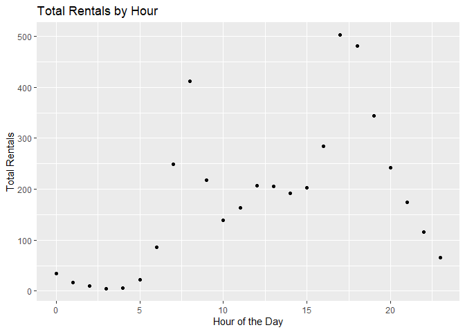
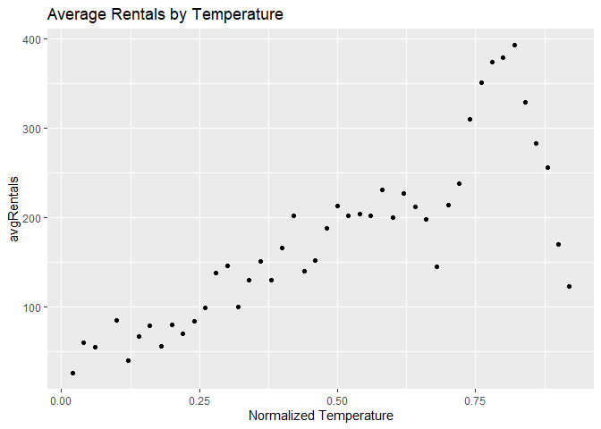
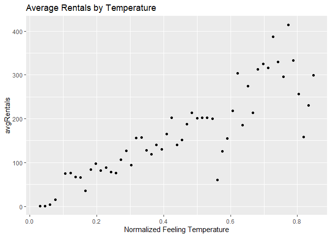
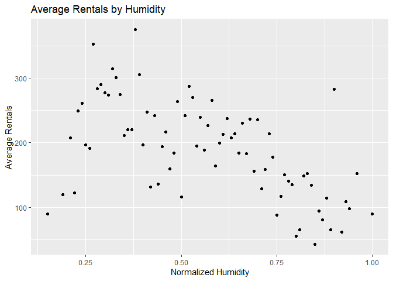
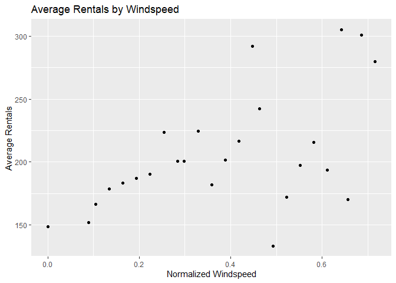
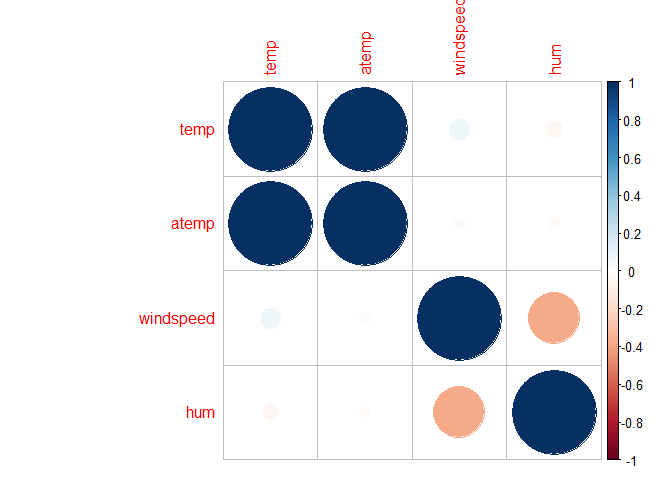

Joshua Burrows Project 2
================
16 October 2020

  - [Render Code](#render-code)
  - [Introduction](#introduction)
  - [Read in Data](#read-in-data)
  - [Data](#data)
      - [EDA](#eda)
          - [Predictor Summaries and
            Plots](#predictor-summaries-and-plots)
          - [Correlation between
            Predictors](#correlation-between-predictors)
  - [Train Models](#train-models)
      - [Tree](#tree)
      - [Boosted Tree](#boosted-tree)
  - [Test Models](#test-models)
      - [Tree](#tree-1)
  - [Best Model](#best-model)

# Render Code

The following code runs in a separate R script to render a different
document for each day of the week.

# Introduction

The day is Monday.

# Read in Data

``` r
bikes <- read_csv(file = "../Bike-Sharing-Dataset/hour.csv")

bikes$weekday <- as.factor(bikes$weekday)
levels(bikes$weekday) <- c("Sunday", "Monday", "Tuesday", "Wednesday", "Thursday", "Friday", "Saturday") 

bikes$season <- as.factor(bikes$season)
levels(bikes$season) <- c("winter", "spring", "summer", "fall")

bikes$yr <- as.factor(bikes$yr)
levels(bikes$yr) <- c("2011", "2012")

bikes$mnth <- as.factor(bikes$mnth)
levels(bikes$mnth) <- c("jan", "feb", "mar", "apr", "may", "jun", "jul", "aug", "sep", "oct", "nov", "dec")

bikes$weathersit <- as.factor(bikes$weathersit)
levels(bikes$weathersit) <- c("very good", "good", "bad", "very bad")

bikes$holiday <- as.factor(bikes$holiday)
levels(bikes$holiday) <- c("no", "yes")

bikes %>% head()
```

    ## # A tibble: 6 x 17
    ##   instant dteday     season yr    mnth     hr holiday weekday workingday
    ##     <dbl> <date>     <fct>  <fct> <fct> <dbl> <fct>   <fct>        <dbl>
    ## 1       1 2011-01-01 winter 2011  jan       0 no      Saturd~          0
    ## 2       2 2011-01-01 winter 2011  jan       1 no      Saturd~          0
    ## 3       3 2011-01-01 winter 2011  jan       2 no      Saturd~          0
    ## 4       4 2011-01-01 winter 2011  jan       3 no      Saturd~          0
    ## 5       5 2011-01-01 winter 2011  jan       4 no      Saturd~          0
    ## 6       6 2011-01-01 winter 2011  jan       5 no      Saturd~          0
    ## # ... with 8 more variables: weathersit <fct>, temp <dbl>, atemp <dbl>,
    ## #   hum <dbl>, windspeed <dbl>, casual <dbl>, registered <dbl>, cnt <dbl>

# Data

``` r
dayData <- bikes %>% filter(weekday == params$day)
dayData %>% head()
```

    ## # A tibble: 6 x 17
    ##   instant dteday     season yr    mnth     hr holiday weekday workingday
    ##     <dbl> <date>     <fct>  <fct> <fct> <dbl> <fct>   <fct>        <dbl>
    ## 1      48 2011-01-03 winter 2011  jan       0 no      Monday           1
    ## 2      49 2011-01-03 winter 2011  jan       1 no      Monday           1
    ## 3      50 2011-01-03 winter 2011  jan       4 no      Monday           1
    ## 4      51 2011-01-03 winter 2011  jan       5 no      Monday           1
    ## 5      52 2011-01-03 winter 2011  jan       6 no      Monday           1
    ## 6      53 2011-01-03 winter 2011  jan       7 no      Monday           1
    ## # ... with 8 more variables: weathersit <fct>, temp <dbl>, atemp <dbl>,
    ## #   hum <dbl>, windspeed <dbl>, casual <dbl>, registered <dbl>, cnt <dbl>

``` r
set.seed(123)
dayIndex <- createDataPartition(dayData$cnt, p = .7, list = FALSE)
```

## EDA

### Predictor Summaries and Plots

Summary statistics of rental count by season

``` r
seasonSum <- dayData %>% group_by(season) %>% summarize(min = min(cnt), Q1 = quantile(cnt, probs = c(.25), names = FALSE), median = median(cnt), mean = mean(cnt), Q3 = quantile(cnt, probs = c(.75), names = FALSE), max = max(cnt))

seasonSum %>% kable()
```

| season | min |    Q1 | median |     mean |     Q3 | max |
| :----- | --: | ----: | -----: | -------: | -----: | --: |
| winter |   1 | 19.75 |   71.5 | 104.2010 | 147.25 | 801 |
| spring |   1 | 46.00 |  157.5 | 191.3898 | 274.00 | 834 |
| summer |   1 | 56.50 |  189.0 | 234.8427 | 341.00 | 968 |
| fall   |   2 | 47.75 |  166.0 | 203.6167 | 302.00 | 922 |

Total rentals each year

``` r
yearSum <- dayData %>% group_by(yr) %>% summarize(totalRentals = sum(cnt))
yearSum %>% kable()
```

| yr   | totalRentals |
| :--- | -----------: |
| 2011 |       180221 |
| 2012 |       275282 |

Summary statistics of rental count by dayDatath. It is probably not
worth including *dayDatath* and *season* in the model, so I eliminated
*season*.

``` r
dayDatathSum <- dayData %>% group_by(mnth) %>% summarize(min = min(cnt), Q1 = quantile(cnt, probs = c(.25), names = FALSE), median = median(cnt), mean = mean(cnt), Q3 = quantile(cnt, probs = c(.75), names = FALSE), max = max(cnt))

dayDatathSum %>% kable()
```

| mnth | min |    Q1 | median |      mean |     Q3 | max |
| :--- | --: | ----: | -----: | --------: | -----: | --: |
| jan  |   1 | 17.75 |   61.0 |  81.64407 | 116.25 | 493 |
| feb  |   1 | 25.00 |   80.0 | 110.82447 | 154.25 | 529 |
| mar  |   1 | 30.75 |   99.5 | 150.87766 | 223.00 | 801 |
| apr  |   1 | 46.50 |  157.0 | 189.91589 | 279.50 | 729 |
| may  |   2 | 59.00 |  170.5 | 188.01389 | 270.50 | 769 |
| jun  |   1 | 45.25 |  182.5 | 228.26042 | 316.00 | 834 |
| jul  |   2 | 61.75 |  201.5 | 241.31481 | 367.00 | 872 |
| aug  |   1 | 59.75 |  192.5 | 229.93056 | 293.00 | 893 |
| sep  |   2 | 54.50 |  187.0 | 236.10995 | 342.50 | 968 |
| oct  |   2 | 51.00 |  174.0 | 213.47465 | 322.00 | 922 |
| nov  |   2 | 47.00 |  152.0 | 195.11518 | 277.50 | 663 |
| dec  |   1 | 23.25 |  113.0 | 147.09813 | 213.25 | 731 |

Scatter plot of total rentals by hour of the day

``` r
avgRentals <- dayData %>% group_by(hr) %>% summarize(meanRentals = mean(cnt))

ggplot(avgRentals, aes(x = hr, y = meanRentals)) + geom_point() + labs(title = "Total Rentals by Hour", x = "Hour of the Day", y = "Total Rentals") 
```

<!-- -->

Average rentals by holiday

``` r
dayData %>% group_by(holiday) %>% summarize(meanRentals = mean(cnt)) %>% kable()
```

| holiday | meanRentals |
| :------ | ----------: |
| no      |    186.5683 |
| yes     |    166.9608 |

Average rentals by working day. Working days are neither weekends nor
holidays. I decided to eliminate this variable from the model because
some of the days under consideration are weekends.

``` r
dayData %>% group_by(workingday) %>% summarize(meanRentals = mean(cnt)) %>% kable()
```

| workingday | meanRentals |
| ---------: | ----------: |
|          0 |    166.9608 |
|          1 |    186.5683 |

Average rentals by weather condition

``` r
dayData %>% group_by(weathersit) %>% summarize(meanRentals = mean(cnt)) %>% kable()
```

| weathersit | meanRentals |
| :--------- | ----------: |
| very good  |    191.8439 |
| good       |    181.6570 |
| bad        |    117.4059 |
| very bad   |    164.0000 |

Scatter plot of average rentals and temperature

``` r
tempAvg <- dayData %>% group_by(temp) %>% summarize(avgRentals = mean(cnt))

ggplot(tempAvg, aes(x = temp, y = avgRentals)) + geom_point() + labs(title = "Average Rentals by Temperature", x = "Normalized Temperature", "Average Rentals")
```

<!-- -->

Scatter plot of average rentals and feeling temperature. It does not
make much sense to keep *temp* and *atemp*, so I eliminated *atemp* from
the model.

``` r
atempAvg <- dayData %>% group_by(atemp) %>% summarize(avgRentals = mean(cnt))

ggplot(atempAvg, aes(x = atemp, y = avgRentals)) + geom_point() + labs(title = "Average Rentals by Temperature", x = "Normalized Feeling Temperature", "Average Rentals")
```

<!-- -->

Scatter plot of average rentals by humidity

``` r
humAvg <- dayData %>% group_by(hum) %>% summarize(avgRentals = mean(cnt))

ggplot(humAvg, aes(x = hum, y = avgRentals)) + geom_point() + labs(title = "Average Rentals by Humidity", x = "Normalized Humidity", y = "Average Rentals") 
```

<!-- -->

Average rentals by windspeed

``` r
windAvg <- dayData %>% group_by(windspeed) %>% summarize(avgRentals = mean(cnt))

ggplot(windAvg, aes(x = windspeed, y = avgRentals)) + geom_point() + labs(title = "Average Rentals by Windspeed", x = "Normalized Windspeed", y = "Average Rentals")
```

<!-- -->

### Correlation between Predictors

Correlation plot of quantitative predictors.

It does not make much sense to keep *temp* and *atemp*, so I eliminated
*atemp* from the model.

``` r
corr <- dayData %>% select(temp, atemp, windspeed, hum) %>% cor()

corrplot(corr)
```

<!-- -->

# Train Models

## Tree

``` r
set.seed(123)
trialTrainIndex <- sample(1:nrow(dayData), size = 100)
trialTrain <- dayData[trialTrainIndex,]
trialTrain
```

    ## # A tibble: 100 x 17
    ##    instant dteday     season yr    mnth     hr holiday weekday workingday
    ##      <dbl> <date>     <fct>  <fct> <fct> <dbl> <fct>   <fct>        <dbl>
    ##  1   17363 2012-12-31 winter 2012  dec       7 no      Monday           1
    ##  2   15559 2012-10-15 fall   2012  oct      11 no      Monday           1
    ##  3    3658 2011-06-06 spring 2011  jun       7 no      Monday           1
    ##  4    1321 2011-02-28 winter 2011  feb       7 no      Monday           1
    ##  5   12870 2012-06-25 summer 2012  jun      10 no      Monday           1
    ##  6    8002 2011-12-05 fall   2011  dec       1 no      Monday           1
    ##  7    8687 2012-01-02 winter 2012  jan      18 yes     Monday           0
    ##  8    8846 2012-01-09 winter 2012  jan       9 no      Monday           1
    ##  9    7178 2011-10-31 fall   2011  oct      16 no      Monday           1
    ## 10    4661 2011-07-18 summer 2011  jul       2 no      Monday           1
    ## # ... with 90 more rows, and 8 more variables: weathersit <fct>, temp <dbl>,
    ## #   atemp <dbl>, hum <dbl>, windspeed <dbl>, casual <dbl>, registered <dbl>,
    ## #   cnt <dbl>

``` r
trialTestIndex <- sample(1:nrow(dayData), size = 50)
trialTest <- dayData[trialTestIndex,]
trialTest
```

    ## # A tibble: 50 x 17
    ##    instant dteday     season yr    mnth     hr holiday weekday workingday
    ##      <dbl> <date>     <fct>  <fct> <fct> <dbl> <fct>   <fct>        <dbl>
    ##  1   17374 2012-12-31 winter 2012  dec      18 no      Monday           1
    ##  2    7169 2011-10-31 fall   2011  oct       7 no      Monday           1
    ##  3    2162 2011-04-04 spring 2011  apr      22 no      Monday           1
    ##  4   13704 2012-07-30 summer 2012  jul       4 no      Monday           1
    ##  5    8840 2012-01-09 winter 2012  jan       3 no      Monday           1
    ##  6   12528 2012-06-11 spring 2012  jun       4 no      Monday           1
    ##  7    9515 2012-02-06 winter 2012  feb       9 no      Monday           1
    ##  8    6838 2011-10-17 fall   2011  oct      11 no      Monday           1
    ##  9   14555 2012-09-03 summer 2012  sep      15 yes     Monday           0
    ## 10    6839 2011-10-17 fall   2011  oct      12 no      Monday           1
    ## # ... with 40 more rows, and 8 more variables: weathersit <fct>, temp <dbl>,
    ## #   atemp <dbl>, hum <dbl>, windspeed <dbl>, casual <dbl>, registered <dbl>,
    ## #   cnt <dbl>

``` r
set.seed(123)
tree <- train(cnt ~ yr + mnth + hr + holiday + weathersit + temp + hum + windspeed, 
              data = trialTrain, 
              method = "rpart", 
              trControl = trainControl(method = "LOOCV"))
tree
```

    ## CART 
    ## 
    ## 100 samples
    ##   8 predictor
    ## 
    ## No pre-processing
    ## Resampling: Leave-One-Out Cross-Validation 
    ## Summary of sample sizes: 99, 99, 99, 99, 99, 99, ... 
    ## Resampling results across tuning parameters:
    ## 
    ##   cp          RMSE      Rsquared     MAE     
    ##   0.07908229  142.2613  0.235919385  104.2811
    ##   0.10839160  146.4038  0.185669424  109.3982
    ##   0.28998292  167.1675  0.003493089  144.2392
    ## 
    ## RMSE was used to select the optimal model using the smallest value.
    ## The final value used for the model was cp = 0.07908229.

## Boosted Tree

``` r
set.seed(123)
boostTree <- train(cnt ~ yr + mnth + hr + holiday + weathersit + temp + hum + windspeed, 
                   data = trialTrain, 
                   method = "gbm", 
                   trControl = trainControl(method = "LOOCV"), 
                   verbose = FALSE)
boostTree
```

    ## Stochastic Gradient Boosting 
    ## 
    ## 100 samples
    ##   8 predictor
    ## 
    ## No pre-processing
    ## Resampling: Leave-One-Out Cross-Validation 
    ## Summary of sample sizes: 99, 99, 99, 99, 99, 99, ... 
    ## Resampling results across tuning parameters:
    ## 
    ##   n.trees  interaction.depth  RMSE      Rsquared   MAE     
    ##    50      1                  120.9520  0.4496851  86.01738
    ##    50      2                  110.2069  0.5325504  78.13963
    ##    50      3                  109.4435  0.5322357  77.13352
    ##   100      1                  110.8706  0.5290556  77.19478
    ##   100      2                  106.1875  0.5565711  78.29467
    ##   100      3                  103.2770  0.5813874  74.28523
    ##   150      1                  107.0039  0.5534814  76.71721
    ##   150      2                  104.7608  0.5675023  77.38039
    ##   150      3                  102.3688  0.5868665  75.84206
    ## 
    ## Tuning parameter 'shrinkage' was held constant at a value of 0.1
    ## 
    ## Tuning parameter 'n.minobsinnode' was held constant at a value of 10
    ## RMSE was used to select the optimal model using the smallest value.
    ## The final values used for the model were n.trees = 150, interaction.depth =
    ##  3, shrinkage = 0.1 and n.minobsinnode = 10.

# Test Models

## Tree

``` r
treePreds <- predict(tree, trialTrain)
treeRMSE <- postResample(treePreds, trialTrain$cnt)[1]

boostPreds <- predict(boostTree, trialTrain)
boostRMSE <- postResample(boostPreds, trialTrain$cnt)[1]

modelPerformance <- data.frame(model = c("Non-Ensemble Tree", "Boosted Tree"), RMSE = c(treeRMSE, boostRMSE))

best <- modelPerformance %>% filter(RMSE == min(RMSE))

if(best$model == "Non-Ensemble Tree"){
  final <- tree
} else if(best$model == "Boosted Tree"){
  final <- boostTree
} else{
  stop("Error")
}

final
```

    ## Stochastic Gradient Boosting 
    ## 
    ## 100 samples
    ##   8 predictor
    ## 
    ## No pre-processing
    ## Resampling: Leave-One-Out Cross-Validation 
    ## Summary of sample sizes: 99, 99, 99, 99, 99, 99, ... 
    ## Resampling results across tuning parameters:
    ## 
    ##   n.trees  interaction.depth  RMSE      Rsquared   MAE     
    ##    50      1                  120.9520  0.4496851  86.01738
    ##    50      2                  110.2069  0.5325504  78.13963
    ##    50      3                  109.4435  0.5322357  77.13352
    ##   100      1                  110.8706  0.5290556  77.19478
    ##   100      2                  106.1875  0.5565711  78.29467
    ##   100      3                  103.2770  0.5813874  74.28523
    ##   150      1                  107.0039  0.5534814  76.71721
    ##   150      2                  104.7608  0.5675023  77.38039
    ##   150      3                  102.3688  0.5868665  75.84206
    ## 
    ## Tuning parameter 'shrinkage' was held constant at a value of 0.1
    ## 
    ## Tuning parameter 'n.minobsinnode' was held constant at a value of 10
    ## RMSE was used to select the optimal model using the smallest value.
    ## The final values used for the model were n.trees = 150, interaction.depth =
    ##  3, shrinkage = 0.1 and n.minobsinnode = 10.

# Best Model
