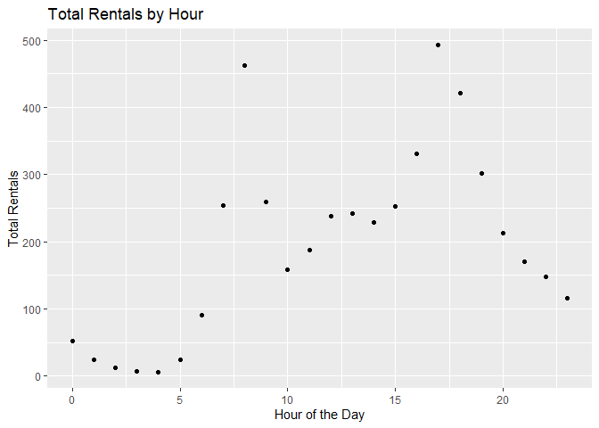
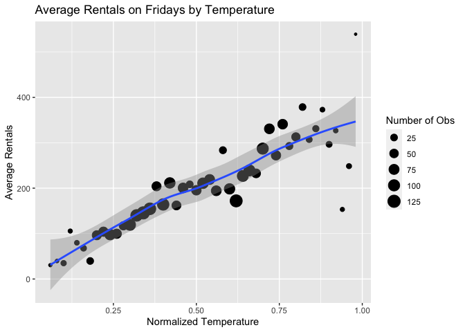
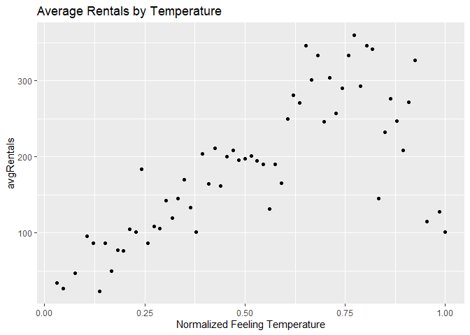
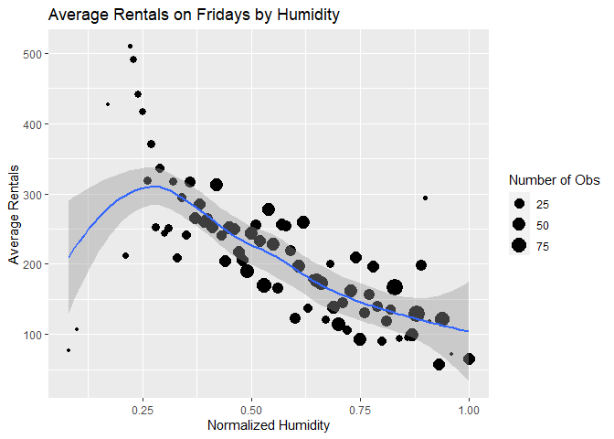
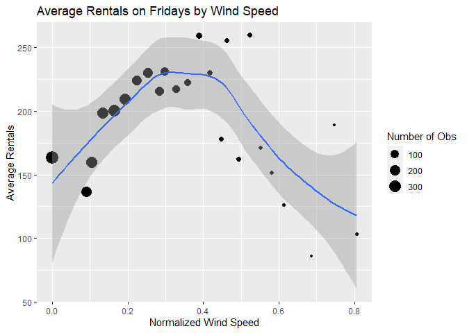
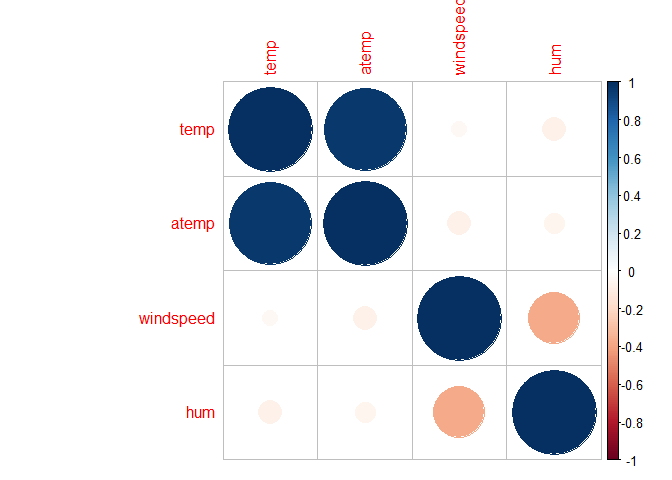

Joshua Burrows Project 2
================
16 October 2020

  - [Render Code](#render-code)
  - [Introduction](#introduction)
  - [Read in Data](#read-in-data)
  - [Data](#data)
      - [EDA](#eda)
          - [Predictor Summaries and
            Plots](#predictor-summaries-and-plots)
          - [Correlation between
            Predictors](#correlation-between-predictors)
  - [Train Models](#train-models)
      - [Tree](#tree)
      - [Boosted Tree](#boosted-tree)
  - [Test Models](#test-models)
      - [Tree](#tree-1)
  - [Best Model](#best-model)

# Render Code

The following code runs in a separate R script to render a different
document for each day of the week.

# Introduction

The day is Friday.

# Read in Data

``` r
bikes <- read_csv(file = "../Bike-Sharing-Dataset/hour.csv")

bikes$weekday <- as.factor(bikes$weekday)
levels(bikes$weekday) <- c("Sunday", "Monday", "Tuesday", "Wednesday", "Thursday", "Friday", "Saturday") 

bikes$season <- as.factor(bikes$season)
levels(bikes$season) <- c("winter", "spring", "summer", "fall")

bikes$yr <- as.factor(bikes$yr)
levels(bikes$yr) <- c("2011", "2012")

bikes$mnth <- as.factor(bikes$mnth)
levels(bikes$mnth) <- c("jan", "feb", "mar", "apr", "may", "jun", "jul", "aug", "sep", "oct", "nov", "dec")

bikes$weathersit <- as.factor(bikes$weathersit)
levels(bikes$weathersit) <- c("very good", "good", "bad", "very bad")

bikes$holiday <- as.factor(bikes$holiday)
levels(bikes$holiday) <- c("no", "yes")

bikes %>% head()
```

    ## # A tibble: 6 x 17
    ##   instant dteday     season yr    mnth 
    ##     <dbl> <date>     <fct>  <fct> <fct>
    ## 1       1 2011-01-01 winter 2011  jan  
    ## 2       2 2011-01-01 winter 2011  jan  
    ## 3       3 2011-01-01 winter 2011  jan  
    ## 4       4 2011-01-01 winter 2011  jan  
    ## 5       5 2011-01-01 winter 2011  jan  
    ## 6       6 2011-01-01 winter 2011  jan  
    ## # ... with 12 more variables:
    ## #   hr <dbl>, holiday <fct>,
    ## #   weekday <fct>, workingday <dbl>,
    ## #   weathersit <fct>, temp <dbl>,
    ## #   atemp <dbl>, hum <dbl>,
    ## #   windspeed <dbl>, casual <dbl>,
    ## #   registered <dbl>, cnt <dbl>

# Data

``` r
dayData <- bikes %>% filter(weekday == params$day)
dayData %>% head()
```

    ## # A tibble: 6 x 17
    ##   instant dteday     season yr    mnth 
    ##     <dbl> <date>     <fct>  <fct> <fct>
    ## 1     139 2011-01-07 winter 2011  jan  
    ## 2     140 2011-01-07 winter 2011  jan  
    ## 3     141 2011-01-07 winter 2011  jan  
    ## 4     142 2011-01-07 winter 2011  jan  
    ## 5     143 2011-01-07 winter 2011  jan  
    ## 6     144 2011-01-07 winter 2011  jan  
    ## # ... with 12 more variables:
    ## #   hr <dbl>, holiday <fct>,
    ## #   weekday <fct>, workingday <dbl>,
    ## #   weathersit <fct>, temp <dbl>,
    ## #   atemp <dbl>, hum <dbl>,
    ## #   windspeed <dbl>, casual <dbl>,
    ## #   registered <dbl>, cnt <dbl>

``` r
set.seed(123)
dayIndex <- createDataPartition(dayData$cnt, p = .7, list = FALSE)
```

## EDA

### Predictor Summaries and Plots

Summary statistics of rental count by season

``` r
seasonSum <- dayData %>% group_by(season) %>% summarize(min = min(cnt), Q1 = quantile(cnt, probs = c(.25), names = FALSE), median = median(cnt), mean = mean(cnt), Q3 = quantile(cnt, probs = c(.75), names = FALSE), max = max(cnt))

seasonSum %>% kable()
```

| season | min |   Q1 | median |     mean |    Q3 | max |
| :----- | --: | ---: | -----: | -------: | ----: | --: |
| winter |   1 | 31.0 |   95.0 | 120.7545 | 180.5 | 566 |
| spring |   1 | 50.0 |  190.0 | 217.6154 | 330.0 | 957 |
| summer |   2 | 86.5 |  220.5 | 239.6096 | 353.0 | 894 |
| fall   |   1 | 51.5 |  178.0 | 204.1117 | 299.0 | 900 |

Total rentals each year

``` r
yearSum <- dayData %>% group_by(yr) %>% summarize(totalRentals = sum(cnt))
yearSum %>% kable()
```

| yr   | totalRentals |
| :--- | -----------: |
| 2011 |       182006 |
| 2012 |       305784 |

Summary statistics of rental count by dayDatath. It is probably not
worth including *dayDatath* and *season* in the model, so I eliminated
*season*.

``` r
dayDatathSum <- dayData %>% group_by(mnth) %>% summarize(min = min(cnt), Q1 = quantile(cnt, probs = c(.25), names = FALSE), median = median(cnt), mean = mean(cnt), Q3 = quantile(cnt, probs = c(.75), names = FALSE), max = max(cnt))

dayDatathSum %>% kable()
```

| mnth | min |    Q1 | median |     mean |     Q3 | max |
| :--- | --: | ----: | -----: | -------: | -----: | --: |
| jan  |   1 | 27.00 |   72.0 | 103.5556 | 154.00 | 476 |
| feb  |   1 | 37.25 |   97.0 | 124.8138 | 183.50 | 520 |
| mar  |   1 | 43.25 |  120.0 | 165.1028 | 228.00 | 957 |
| apr  |   1 | 35.00 |  121.0 | 182.7917 | 287.50 | 819 |
| may  |   1 | 81.75 |  224.5 | 239.6250 | 348.50 | 812 |
| jun  |   4 | 76.00 |  217.5 | 234.0139 | 341.50 | 823 |
| jul  |   6 | 96.75 |  212.0 | 225.2454 | 319.00 | 835 |
| aug  |   3 | 84.25 |  226.0 | 248.2685 | 368.50 | 812 |
| sep  |   2 | 51.25 |  213.5 | 239.4583 | 360.25 | 894 |
| oct  |   4 | 70.25 |  204.5 | 234.3021 | 371.25 | 900 |
| nov  |   1 | 49.00 |  167.0 | 188.4861 | 272.00 | 729 |
| dec  |   1 | 39.50 |  147.0 | 155.9352 | 222.50 | 636 |

Scatter plot of total rentals by hour of the day

``` r
avgRentals <- dayData %>% group_by(hr) %>% summarize(meanRentals = mean(cnt))

ggplot(avgRentals, aes(x = hr, y = meanRentals)) + geom_point() + labs(title = "Total Rentals by Hour", x = "Hour of the Day", y = "Total Rentals") 
```

<!-- -->

Average rentals by holiday

``` r
dayData %>% group_by(holiday) %>% summarize(meanRentals = mean(cnt)) %>% kable()
```

| holiday | meanRentals |
| :------ | ----------: |
| no      |    197.3333 |
| yes     |    135.2917 |

Average rentals by working day. Working days are neither weekends nor
holidays. I decided to eliminate this variable from the model because
some of the days under consideration are weekends.

``` r
dayData %>% group_by(workingday) %>% summarize(meanRentals = mean(cnt)) %>% kable()
```

| workingday | meanRentals |
| ---------: | ----------: |
|          0 |    135.2917 |
|          1 |    197.3333 |

Average rentals by weather condition

``` r
dayData %>% group_by(weathersit) %>% summarize(meanRentals = mean(cnt)) %>% kable()
```

| weathersit | meanRentals |
| :--------- | ----------: |
| very good  |    202.6267 |
| good       |    201.7739 |
| bad        |    117.4863 |

Scatter plot of average rentals and temperature

``` r
tempAvg <- dayData %>% group_by(temp) %>% summarize(avgRentals = mean(cnt))

ggplot(tempAvg, aes(x = temp, y = avgRentals)) + geom_point() + labs(title = "Average Rentals by Temperature", x = "Normalized Temperature", "Average Rentals")
```

<!-- -->

Scatter plot of average rentals and feeling temperature. It does not
make much sense to keep *temp* and *atemp*, so I eliminated *atemp* from
the model.

``` r
atempAvg <- dayData %>% group_by(atemp) %>% summarize(avgRentals = mean(cnt))

ggplot(atempAvg, aes(x = atemp, y = avgRentals)) + geom_point() + labs(title = "Average Rentals by Temperature", x = "Normalized Feeling Temperature", "Average Rentals")
```

<!-- -->

Scatter plot of average rentals by humidity

``` r
humAvg <- dayData %>% group_by(hum) %>% summarize(avgRentals = mean(cnt))

ggplot(humAvg, aes(x = hum, y = avgRentals)) + geom_point() + labs(title = "Average Rentals by Humidity", x = "Normalized Humidity", y = "Average Rentals") 
```

<!-- -->

Average rentals by windspeed

``` r
windAvg <- dayData %>% group_by(windspeed) %>% summarize(avgRentals = mean(cnt))

ggplot(windAvg, aes(x = windspeed, y = avgRentals)) + geom_point() + labs(title = "Average Rentals by Windspeed", x = "Normalized Windspeed", y = "Average Rentals")
```

<!-- -->

### Correlation between Predictors

Correlation plot of quantitative predictors.

It does not make much sense to keep *temp* and *atemp*, so I eliminated
*atemp* from the model.

``` r
corr <- dayData %>% select(temp, atemp, windspeed, hum) %>% cor()

corrplot(corr)
```

<!-- -->

# Train Models

## Tree

``` r
set.seed(123)
trialTrainIndex <- sample(1:nrow(dayData), size = 100)
trialTrain <- dayData[trialTrainIndex,]
trialTrain
```

    ## # A tibble: 100 x 17
    ##    instant dteday     season yr   
    ##      <dbl> <date>     <fct>  <fct>
    ##  1   17141 2012-12-21 winter 2012 
    ##  2   15647 2012-10-19 fall   2012 
    ##  3    3753 2011-06-10 spring 2011 
    ##  4    1419 2011-03-04 winter 2011 
    ##  5   12958 2012-06-29 summer 2012 
    ##  6    7951 2011-12-02 fall   2011 
    ##  7    8778 2012-01-06 winter 2012 
    ##  8    8936 2012-01-13 winter 2012 
    ##  9    7272 2011-11-04 fall   2011 
    ## 10    4756 2011-07-22 summer 2011 
    ## # ... with 90 more rows, and 13 more
    ## #   variables: mnth <fct>, hr <dbl>,
    ## #   holiday <fct>, weekday <fct>,
    ## #   workingday <dbl>,
    ## #   weathersit <fct>, temp <dbl>,
    ## #   atemp <dbl>, hum <dbl>,
    ## #   windspeed <dbl>, casual <dbl>,
    ## #   registered <dbl>, cnt <dbl>

``` r
trialTestIndex <- sample(1:nrow(dayData), size = 50)
trialTest <- dayData[trialTestIndex,]
trialTest
```

    ## # A tibble: 50 x 17
    ##    instant dteday     season yr   
    ##      <dbl> <date>     <fct>  <fct>
    ##  1   17294 2012-12-28 winter 2012 
    ##  2    7263 2011-11-04 fall   2011 
    ##  3    2258 2011-04-08 spring 2011 
    ##  4   13648 2012-07-27 summer 2012 
    ##  5    8787 2012-01-06 winter 2012 
    ##  6   12472 2012-06-08 spring 2012 
    ##  7    9605 2012-02-10 winter 2012 
    ##  8    6931 2011-10-21 fall   2011 
    ##  9   14643 2012-09-07 summer 2012 
    ## 10    6932 2011-10-21 fall   2011 
    ## # ... with 40 more rows, and 13 more
    ## #   variables: mnth <fct>, hr <dbl>,
    ## #   holiday <fct>, weekday <fct>,
    ## #   workingday <dbl>,
    ## #   weathersit <fct>, temp <dbl>,
    ## #   atemp <dbl>, hum <dbl>,
    ## #   windspeed <dbl>, casual <dbl>,
    ## #   registered <dbl>, cnt <dbl>

``` r
set.seed(123)
tree <- train(cnt ~ yr + mnth + hr + holiday + weathersit + temp + hum + windspeed, 
              data = trialTrain, 
              method = "rpart", 
              trControl = trainControl(method = "LOOCV"))
tree
```

    ## CART 
    ## 
    ## 100 samples
    ##   8 predictor
    ## 
    ## No pre-processing
    ## Resampling: Leave-One-Out Cross-Validation 
    ## Summary of sample sizes: 99, 99, 99, 99, 99, 99, ... 
    ## Resampling results across tuning parameters:
    ## 
    ##   cp          RMSE      Rsquared    
    ##   0.05025317  133.4311  3.651278e-01
    ##   0.13001550  148.4702  2.321336e-01
    ##   0.37580592  172.3507  1.340607e-05
    ##   MAE      
    ##    92.79753
    ##   110.13168
    ##   151.68705
    ## 
    ## RMSE was used to select the
    ##  optimal model using the
    ##  smallest value.
    ## The final value used for the model
    ##  was cp = 0.05025317.

## Boosted Tree

``` r
set.seed(123)
boostTree <- train(cnt ~ yr + mnth + hr + holiday + weathersit + temp + hum + windspeed, 
                   data = trialTrain, 
                   method = "gbm", 
                   trControl = trainControl(method = "LOOCV"), 
                   verbose = FALSE)
boostTree
```

    ## Stochastic Gradient Boosting 
    ## 
    ## 100 samples
    ##   8 predictor
    ## 
    ## No pre-processing
    ## Resampling: Leave-One-Out Cross-Validation 
    ## Summary of sample sizes: 99, 99, 99, 99, 99, 99, ... 
    ## Resampling results across tuning parameters:
    ## 
    ##   n.trees  interaction.depth
    ##    50      1                
    ##    50      2                
    ##    50      3                
    ##   100      1                
    ##   100      2                
    ##   100      3                
    ##   150      1                
    ##   150      2                
    ##   150      3                
    ##   RMSE       Rsquared   MAE     
    ##   121.42028  0.4676770  86.00150
    ##   107.19387  0.5854284  69.39815
    ##   103.93042  0.6103958  66.42171
    ##   118.08235  0.4907530  82.43269
    ##    99.38078  0.6421721  64.05445
    ##    97.15211  0.6566731  63.51762
    ##   114.44999  0.5210626  78.76234
    ##    96.49161  0.6599418  63.24206
    ##    94.99217  0.6704286  63.83941
    ## 
    ## Tuning parameter 'shrinkage' was
    ##  'n.minobsinnode' was held constant
    ##  at a value of 10
    ## RMSE was used to select the
    ##  optimal model using the
    ##  smallest value.
    ## The final values used for the
    ##  shrinkage = 0.1 and n.minobsinnode
    ##  = 10.

# Test Models

## Tree

``` r
treePreds <- predict(tree, trialTrain)
treeRMSE <- postResample(treePreds, trialTrain$cnt)[1]

boostPreds <- predict(boostTree, trialTrain)
boostRMSE <- postResample(boostPreds, trialTrain$cnt)[1]

modelPerformance <- data.frame(model = c("Non-Ensemble Tree", "Boosted Tree"), RMSE = c(treeRMSE, boostRMSE))

best <- modelPerformance %>% filter(RMSE == min(RMSE))

if(best$model == "Non-Ensemble Tree"){
  final <- tree
} else if(best$model == "Boosted Tree"){
  final <- boostTree
} else{
  stop("Error")
}

final
```

    ## Stochastic Gradient Boosting 
    ## 
    ## 100 samples
    ##   8 predictor
    ## 
    ## No pre-processing
    ## Resampling: Leave-One-Out Cross-Validation 
    ## Summary of sample sizes: 99, 99, 99, 99, 99, 99, ... 
    ## Resampling results across tuning parameters:
    ## 
    ##   n.trees  interaction.depth
    ##    50      1                
    ##    50      2                
    ##    50      3                
    ##   100      1                
    ##   100      2                
    ##   100      3                
    ##   150      1                
    ##   150      2                
    ##   150      3                
    ##   RMSE       Rsquared   MAE     
    ##   121.42028  0.4676770  86.00150
    ##   107.19387  0.5854284  69.39815
    ##   103.93042  0.6103958  66.42171
    ##   118.08235  0.4907530  82.43269
    ##    99.38078  0.6421721  64.05445
    ##    97.15211  0.6566731  63.51762
    ##   114.44999  0.5210626  78.76234
    ##    96.49161  0.6599418  63.24206
    ##    94.99217  0.6704286  63.83941
    ## 
    ## Tuning parameter 'shrinkage' was
    ##  'n.minobsinnode' was held constant
    ##  at a value of 10
    ## RMSE was used to select the
    ##  optimal model using the
    ##  smallest value.
    ## The final values used for the
    ##  shrinkage = 0.1 and n.minobsinnode
    ##  = 10.

# Best Model
