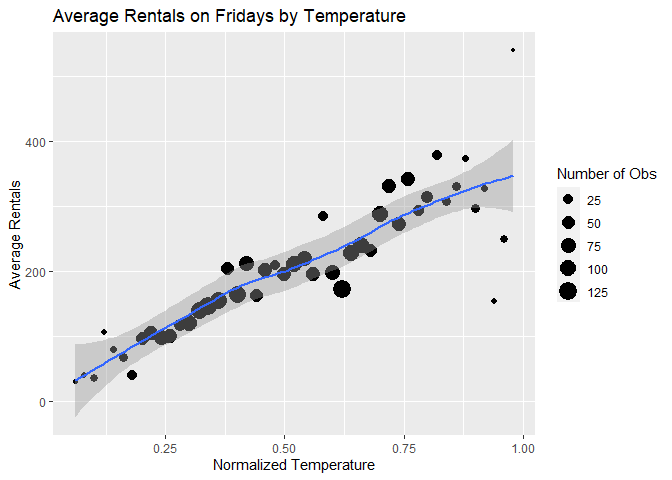
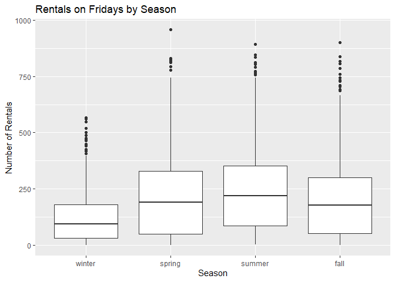
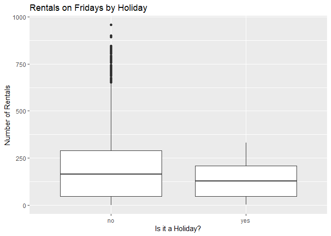
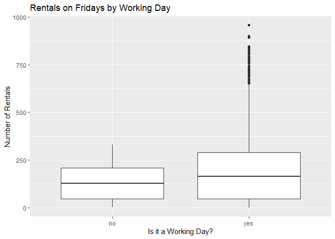

Joshua Burrows Project 2
================
16 October 2020

  - [Bike Rentals on Fridays:
    Introduction](#bike-rentals-on-fridays-introduction)
  - [Read in Data](#read-in-data)
      - [Get Bikes Data](#get-bikes-data)
      - [Factors](#factors)
      - [Filter by Day](#filter-by-day)
  - [Exploratory Data Analysis](#exploratory-data-analysis)
      - [Quantitative Predictors](#quantitative-predictors)
          - [Correlations](#correlations)
          - [Hour](#hour)
          - [Temperature](#temperature)
          - [Felt Temperature](#felt-temperature)
          - [Humidity](#humidity)
          - [Wind Speed](#wind-speed)
      - [Categorical Predictors](#categorical-predictors)
          - [Helper Function](#helper-function)
          - [Season](#season)
          - [Year](#year)
          - [Month](#month)
          - [Holiday](#holiday)
          - [Working Day](#working-day)
          - [Weather Condition](#weather-condition)
  - [Train Models](#train-models)
      - [Split Data](#split-data)
      - [Non-Ensemble Tree](#non-ensemble-tree)
          - [Training](#training)
              - [Tree Models](#tree-models)
              - [Tuning Parameter](#tuning-parameter)
              - [Formula](#formula)
              - [Create the Model](#create-the-model)
          - [Model Information](#model-information)
      - [Boosted Tree](#boosted-tree)
          - [Training](#training-1)
              - [Boosted Tree Models](#boosted-tree-models)
              - [Tuning Paremeters](#tuning-paremeters)
              - [Create the Model](#create-the-model-1)
          - [Model Information](#model-information-1)
      - [Multiple Linear Regression](#multiple-linear-regression)
          - [Training](#training-2)
              - [Create the Model](#create-the-model-2)
  - [Test Models](#test-models)
  - [Best Model](#best-model)

# Bike Rentals on Fridays: Introduction

This document walks though the process of creating a model to predict
hourly bike rentals on Fridays. I compared two models - a *non-ensemble
tree* and a *boosted tree* - and picked the one that does better.

The data comes from the Capital bike sharing system, and it is available
[here](https://archive.ics.uci.edu/ml/datasets/Bike+Sharing+Dataset).
This data includes an hourly count of bike rentals for 2011 and 2012 as
well as information about the weather and the time of year.

My models use the following predictor variables:

  - *yr*: year (2011 or 2012)  
  - *mnth*: month  
  - *hr*: hour of the day  
  - *holiday*: whether the day is a holiday  
  - *weathersit*: weather condition
      - pleasant: clear, few clouds, partly cloudy  
      - less pleasant: mist, mist + cloudy, mist + broken clouds, mist +
        few clouds  
      - even less pleasant: light snow, light rain + scattered clouds,
        light rain + thunderstorm + scattered clouds  
      - downright unpleasant: snow + fog, heavy rain + ice pallets +
        thunderstorm + mist  
  - *temp*: normalized temperature in celsius  
  - *hum*: normalized humidity  
  - *windspeed*: normalized wind speed

You can return to the homepage for this project by clicking
[here](https://jkburrows.github.io/ST558-Project-2/). The github repo
for this project is
[here](https://github.com/JKBurrows/ST558-Project-2).

# Read in Data

## Get Bikes Data

Read in data.

``` r
bikes <- read_csv(file = "hour.csv")

bikes %>% head() %>% kable()
```

| instant | dteday     | season | yr | mnth | hr | holiday | weekday | workingday | weathersit | temp |  atemp |  hum | windspeed | casual | registered | cnt |
| ------: | :--------- | -----: | -: | ---: | -: | ------: | ------: | ---------: | ---------: | ---: | -----: | ---: | --------: | -----: | ---------: | --: |
|       1 | 2011-01-01 |      1 |  0 |    1 |  0 |       0 |       6 |          0 |          1 | 0.24 | 0.2879 | 0.81 |    0.0000 |      3 |         13 |  16 |
|       2 | 2011-01-01 |      1 |  0 |    1 |  1 |       0 |       6 |          0 |          1 | 0.22 | 0.2727 | 0.80 |    0.0000 |      8 |         32 |  40 |
|       3 | 2011-01-01 |      1 |  0 |    1 |  2 |       0 |       6 |          0 |          1 | 0.22 | 0.2727 | 0.80 |    0.0000 |      5 |         27 |  32 |
|       4 | 2011-01-01 |      1 |  0 |    1 |  3 |       0 |       6 |          0 |          1 | 0.24 | 0.2879 | 0.75 |    0.0000 |      3 |         10 |  13 |
|       5 | 2011-01-01 |      1 |  0 |    1 |  4 |       0 |       6 |          0 |          1 | 0.24 | 0.2879 | 0.75 |    0.0000 |      0 |          1 |   1 |
|       6 | 2011-01-01 |      1 |  0 |    1 |  5 |       0 |       6 |          0 |          2 | 0.24 | 0.2576 | 0.75 |    0.0896 |      0 |          1 |   1 |

## Factors

Convert categorical variables to factors.

``` r
bikes$weekday <- as.factor(bikes$weekday)
levels(bikes$weekday) <- c("Sunday", "Monday", "Tuesday", "Wednesday", "Thursday", "Friday", "Saturday") 

bikes$season <- as.factor(bikes$season)
levels(bikes$season) <- c("winter", "spring", "summer", "fall")

bikes$yr <- as.factor(bikes$yr)
levels(bikes$yr) <- c("2011", "2012")

bikes$mnth <- as.factor(bikes$mnth)
levels(bikes$mnth) <- c("jan", "feb", "mar", "apr", "may", "jun", "jul", "aug", "sep", "oct", "nov", "dec")

bikes$weathersit <- as.factor(bikes$weathersit)
levels(bikes$weathersit) <- c("pleasant", "less pleasant", "even less pleasant", "downright unpleasant")

bikes$holiday <- as.factor(bikes$holiday)
levels(bikes$holiday) <- c("no", "yes")

bikes$workingday <- as.factor(bikes$workingday)
levels(bikes$workingday) <- c("no", "yes")

bikes %>% head() %>% kable()
```

| instant | dteday     | season | yr   | mnth | hr | holiday | weekday  | workingday | weathersit    | temp |  atemp |  hum | windspeed | casual | registered | cnt |
| ------: | :--------- | :----- | :--- | :--- | -: | :------ | :------- | :--------- | :------------ | ---: | -----: | ---: | --------: | -----: | ---------: | --: |
|       1 | 2011-01-01 | winter | 2011 | jan  |  0 | no      | Saturday | no         | pleasant      | 0.24 | 0.2879 | 0.81 |    0.0000 |      3 |         13 |  16 |
|       2 | 2011-01-01 | winter | 2011 | jan  |  1 | no      | Saturday | no         | pleasant      | 0.22 | 0.2727 | 0.80 |    0.0000 |      8 |         32 |  40 |
|       3 | 2011-01-01 | winter | 2011 | jan  |  2 | no      | Saturday | no         | pleasant      | 0.22 | 0.2727 | 0.80 |    0.0000 |      5 |         27 |  32 |
|       4 | 2011-01-01 | winter | 2011 | jan  |  3 | no      | Saturday | no         | pleasant      | 0.24 | 0.2879 | 0.75 |    0.0000 |      3 |         10 |  13 |
|       5 | 2011-01-01 | winter | 2011 | jan  |  4 | no      | Saturday | no         | pleasant      | 0.24 | 0.2879 | 0.75 |    0.0000 |      0 |          1 |   1 |
|       6 | 2011-01-01 | winter | 2011 | jan  |  5 | no      | Saturday | no         | less pleasant | 0.24 | 0.2576 | 0.75 |    0.0896 |      0 |          1 |   1 |

## Filter by Day

Grab the data for Friday.

``` r
dayData <- bikes %>% filter(weekday == params$day)

dayData %>% head() %>% kable()
```

| instant | dteday     | season | yr   | mnth | hr | holiday | weekday | workingday | weathersit         | temp |  atemp |  hum | windspeed | casual | registered | cnt |
| ------: | :--------- | :----- | :--- | :--- | -: | :------ | :------ | :--------- | :----------------- | ---: | -----: | ---: | --------: | -----: | ---------: | --: |
|     139 | 2011-01-07 | winter | 2011 | jan  |  0 | no      | Friday  | yes        | less pleasant      | 0.20 | 0.1970 | 0.64 |    0.1940 |      4 |         13 |  17 |
|     140 | 2011-01-07 | winter | 2011 | jan  |  1 | no      | Friday  | yes        | less pleasant      | 0.20 | 0.1970 | 0.69 |    0.2239 |      2 |          5 |   7 |
|     141 | 2011-01-07 | winter | 2011 | jan  |  2 | no      | Friday  | yes        | less pleasant      | 0.20 | 0.1970 | 0.69 |    0.2239 |      0 |          1 |   1 |
|     142 | 2011-01-07 | winter | 2011 | jan  |  4 | no      | Friday  | yes        | less pleasant      | 0.20 | 0.2121 | 0.69 |    0.1343 |      0 |          1 |   1 |
|     143 | 2011-01-07 | winter | 2011 | jan  |  5 | no      | Friday  | yes        | even less pleasant | 0.22 | 0.2727 | 0.55 |    0.0000 |      0 |          5 |   5 |
|     144 | 2011-01-07 | winter | 2011 | jan  |  6 | no      | Friday  | yes        | less pleasant      | 0.20 | 0.2576 | 0.69 |    0.0000 |      8 |         26 |  34 |

# Exploratory Data Analysis

I started with a little bit of exploratory data analysis. The goal is to
look at the relationships between the predictors and number of bike
rentals.

## Quantitative Predictors

### Correlations

Visualize the strength of the relationships between the quantitative
predictors.

Unsurprisingly, *atemp* and *temp* are strongly correlated. *atemp*
represents the heat index, which is typically calculated using
temperature and humidity. So it makes sense to either eliminate *atemp*
from the model or keep *atemp* but eliminate *temp* and *hum*. I decided
to eliminate *atemp*.

``` r
corr <- dayData %>% 
  select(temp, atemp, windspeed, hum) %>% 
  cor()

corrplot(corr)
```

<!-- -->

### Hour

Create a scatter plot to investigate the relationship between time of
day and rentals on Fridays. Fit a line through the points to get a basic
idea of how number or rentals changes with the time of day.

``` r
avgRentals <- dayData %>% 
  group_by(hr) %>% 
  summarize(meanRentals = mean(cnt))

corrHour <- cor(avgRentals$hr, avgRentals$meanRentals)

ggplot(avgRentals, aes(x = hr, y = meanRentals)) +
  geom_point() + 
  labs(title = paste0("Total Rentals on ", paste0(params$day, "s"), " by Hour"), 
       x = "Hour of the Day", 
       y = "Total Rentals") + 
  geom_smooth()
```

<!-- -->

The correlation between hour and average rentals is 0.5187263.

Be careful, correlation measures straight line relationships, so if the
plot above shows a curved relationship, correlation may not be a useful
measure.

### Temperature

Create a scatter plot to investigate the relationship between
temperature and average rentals on Fridays. Fit a line through the
points to get a basic idea of average rentals changes with temperature.

The size of the dots represents the number of observations at each
temperature.

``` r
tempAvg <- dayData %>% 
  group_by(temp) %>% 
  summarize(avgRentals = mean(cnt), n = n())

corrTemp <- cor(tempAvg$temp, tempAvg$avgRentals)

ggplot(tempAvg, aes(x = temp, y = avgRentals)) + 
  geom_point(aes(size = n)) + 
  geom_smooth() + 
  labs(title = paste0("Average Rentals on ", paste0(params$day, "s"), " by Temperature"), 
       x = "Normalized Temperature", 
       y = "Average Rentals") + 
  scale_size_continuous(name = "Number of Obs")
```

<!-- -->

The correlation between temperature and average rentals is 0.8819147.

Be careful, correlation measures straight line relationships, so if the
plot above shows a curved relationship, correlation may not be a useful
measure.

### Felt Temperature

Create a scatter plot to investigate the relationship between felt
temperature and average rentals on Fridays. Fit a line through the
points to get a basic idea of how average rentals changes with felt
temperature.

The size of the dots represents the number of observations at each felt
temperature.

As already noted, it does not make much sense to keep *atemp* if *temp*
and *hum* will be in the model, so I eliminated *atemp* from the model.

``` r
atempAvg <- dayData %>% 
  group_by(atemp) %>% 
  summarize(avgRentals = mean(cnt), n = n())

corrATemp <- cor(atempAvg$atemp, atempAvg$avgRentals)

ggplot(atempAvg, aes(x = atemp, y = avgRentals)) +
  geom_point(aes(size = n)) + 
  geom_smooth() + 
  labs(title = paste0("Average Rentals on ", paste0(params$day, "s"), " by Felt Temperature"), 
       x = "Normalized Feeling Temperature", 
       y = "Average Rentals") + 
  scale_size_continuous(name = "Number of Obs")
```

<!-- -->

The correlation between felt temperature and average rentals is
0.7144727.

Be careful, correlation measures straight line relationships, so if the
plot above shows a curved relationship, correlation may not be a useful
measure.

### Humidity

Create a scatter plot to investigate the relationship between humidity
and average rentals on Fridays. Fit a line through the points to get a
basic idea of how average rentals changes with humidity.

The size of the dots represents the number of observations at each
humidity level.

``` r
humAvg <- dayData %>% 
  group_by(hum) %>% 
  summarize(avgRentals = mean(cnt), n = n())

corrHum <- cor(humAvg$hum, humAvg$avgRentals)

ggplot(humAvg, aes(x = hum, y = avgRentals)) + 
  geom_point(aes(size = n)) + 
  geom_smooth() + 
  labs(title = paste0("Average Rentals on ", paste0(params$day, "s"), " by Humidity"), 
       x = "Normalized Humidity", 
       y = "Average Rentals") + 
  scale_size_continuous(name = "Number of Obs")
```

<!-- -->

The correlation between humidity and average rentals is -0.6813181.

Be careful, correlation measures straight line relationships, so if the
plot above shows a curved relationship, correlation may not be a useful
measure.

### Wind Speed

Create a scatter plot to investigate the relationship between wind speed
and average rentals on Fridays. Fit a line through the points to get a
basic idea of how average rentals changes with wind speed.

The size of the dots represents the number of observations at each wind
speed.

``` r
windAvg <- dayData %>% 
  group_by(windspeed) %>% 
  summarize(avgRentals = mean(cnt), n = n())

corrWind <- cor(windAvg$windspeed, windAvg$avgRentals)

ggplot(windAvg, aes(x = windspeed, y = avgRentals)) + 
  geom_point(aes(size = n)) + 
  geom_smooth() + 
  labs(title = paste0("Average Rentals on ", paste0(params$day, "s"), " by Wind Speed"), 
       x = "Normalized Wind Speed", 
       y = "Average Rentals") + 
  scale_size_continuous(name = "Number of Obs")
```

<!-- -->

The correlation between wind speed and average rentals is -0.3084951.

Be careful, correlation measures straight line relationships, so if the
plot above shows a curved relationship, correlation may not be a useful
measure.

## Categorical Predictors

### Helper Function

Create a helper function to display basic numeric summaries for a given
grouping variable.

``` r
getSum <- function(varName, colName){ 
  
  sum <- dayData %>% 
    group_by(dayData[[varName]]) %>% 
    summarize(min = min(cnt), 
              Q1 = quantile(cnt, probs = c(.25), names = FALSE), 
              median = median(cnt), 
              mean = mean(cnt), 
              Q3 = quantile(cnt, probs = c(.75), names = FALSE), 
              max = max(cnt), 
              obs = n())
  
  output <- sum %>% 
    kable(col.names = c(colName, 
                        "Minimum", 
                        "1st Quartile", 
                        "Median", 
                        "Mean", 
                        "3rd Quartile", 
                        "Maximum", 
                        "Number of Observations"))
  
  return(output)
  
} 
```

### Season

Explore how bike rentals on Fridays change with the seasons using a
basic numeric summary and a boxplot. The numeric summary gives you an
idea of center and spread. So does the boxplot, but it is better for
identifying outliers.

It does not make much sense to keep both *season* and *mnth* in the
model, so I decided to eliminate *season*.

``` r
getSum(varName = "season", colName = "Season")
```

| Season | Minimum | 1st Quartile | Median |     Mean | 3rd Quartile | Maximum | Number of Observations |
| :----- | ------: | -----------: | -----: | -------: | -----------: | ------: | ---------------------: |
| winter |       1 |         31.0 |   95.0 | 120.7545 |        180.5 |     566 |                    615 |
| spring |       1 |         50.0 |  190.0 | 217.6154 |        330.0 |     957 |                    624 |
| summer |       2 |         86.5 |  220.5 | 239.6096 |        353.0 |     894 |                    648 |
| fall   |       1 |         51.5 |  178.0 | 204.1117 |        299.0 |     900 |                    600 |

``` r
ggplot(dayData, aes(x = season, y = cnt)) + 
  geom_boxplot() + 
  labs(title = paste0("Rentals on ", paste0(params$day, "s"), " by Season"), 
       x = "Season", 
       y = "Number of Rentals") 
```

<!-- -->

### Year

Looking at total rentals each year gives us some idea of the long term
trend in bike rentals on Fridays. It would be helpful to have data from
more years, though.

``` r
yearSum <- dayData %>% 
  group_by(yr) %>% 
  summarize(totalRentals = sum(cnt))

yearSum %>% kable(col.names = c("Year", "Total Rentals"))
```

| Year | Total Rentals |
| :--- | ------------: |
| 2011 |        182006 |
| 2012 |        305784 |

### Month

Explore how bike rentals on Fridays change depending on the month using
a basic numeric summary and a boxplot. The numeric summary gives you an
idea of center and spread. So does the boxplot, but it is better for
identifying outliers.

As already noted, it is probably not worth including *mnth* and *season*
in the model, so *season* has been eliminated.

``` r
getSum(varName = "mnth", colName = "Month")
```

| Month | Minimum | 1st Quartile | Median |     Mean | 3rd Quartile | Maximum | Number of Observations |
| :---- | ------: | -----------: | -----: | -------: | -----------: | ------: | ---------------------: |
| jan   |       1 |        27.00 |   72.0 | 103.5556 |       154.00 |     476 |                    189 |
| feb   |       1 |        37.25 |   97.0 | 124.8138 |       183.50 |     520 |                    188 |
| mar   |       1 |        43.25 |  120.0 | 165.1028 |       228.00 |     957 |                    214 |
| apr   |       1 |        35.00 |  121.0 | 182.7917 |       287.50 |     819 |                    216 |
| may   |       1 |        81.75 |  224.5 | 239.6250 |       348.50 |     812 |                    192 |
| jun   |       4 |        76.00 |  217.5 | 234.0139 |       341.50 |     823 |                    216 |
| jul   |       6 |        96.75 |  212.0 | 225.2454 |       319.00 |     835 |                    216 |
| aug   |       3 |        84.25 |  226.0 | 248.2685 |       368.50 |     812 |                    216 |
| sep   |       2 |        51.25 |  213.5 | 239.4583 |       360.25 |     894 |                    216 |
| oct   |       4 |        70.25 |  204.5 | 234.3021 |       371.25 |     900 |                    192 |
| nov   |       1 |        49.00 |  167.0 | 188.4861 |       272.00 |     729 |                    216 |
| dec   |       1 |        39.50 |  147.0 | 155.9352 |       222.50 |     636 |                    216 |

``` r
ggplot(dayData, aes(x = mnth, y = cnt)) + 
  geom_boxplot() + 
  labs(title = paste0("Rentals on ", paste0(params$day, "s"), " by Month"), 
       x = "Month", 
       y = "Number of Rentals")
```

<!-- -->

### Holiday

Explore how bike rentals change depending on whether the Friday in
question is a holiday using a basic numeric summary and a boxplot. The
numeric summary gives you an idea of center and spread. So does the
boxplot, but it is better for identifying outliers.

Note: There are no holidays on Saturday or Sunday because the holiday
data has been extracted from the [Washington D.C. HR department’s
holiday schedule](https://dchr.dc.gov/page/holiday-schedules), which
only lists holidays that fall during the work week. Accordingly, I have
left the *holiday* variable out of the models for Saturday and Sunday.

``` r
getSum(varName = "holiday", colName = "Holiday")
```

| Holiday | Minimum | 1st Quartile | Median |     Mean | 3rd Quartile | Maximum | Number of Observations |
| :------ | ------: | -----------: | -----: | -------: | -----------: | ------: | ---------------------: |
| no      |       1 |        48.00 |    165 | 197.3333 |       289.50 |     957 |                   2439 |
| yes     |       3 |        46.75 |    129 | 135.2917 |       208.25 |     331 |                     48 |

``` r
ggplot(dayData, aes(x = holiday, y = cnt)) + 
  geom_boxplot() + 
  labs(title = paste0("Rentals on ", paste0(params$day, "s"), " by Holiday"), 
       x = "Is it a Holiday?", 
       y = "Number of Rentals")
```

<!-- -->

### Working Day

Explore how bike rentals change depending on whether the day in question
is a working day using a basic numeric summary and a boxplot. The
numeric summary gives you an idea of center and spread. So does the
boxplot, but it is better for identifying outliers.

Working days are neither weekends nor holidays. I decided not to keep
this variable in the model because it wouldn’t make much sense in the
reports for Saturday and Sunday.

``` r
getSum(varName = "workingday", colName = "Working Day")
```

| Working Day | Minimum | 1st Quartile | Median |     Mean | 3rd Quartile | Maximum | Number of Observations |
| :---------- | ------: | -----------: | -----: | -------: | -----------: | ------: | ---------------------: |
| no          |       3 |        46.75 |    129 | 135.2917 |       208.25 |     331 |                     48 |
| yes         |       1 |        48.00 |    165 | 197.3333 |       289.50 |     957 |                   2439 |

``` r
ggplot(dayData, aes(x = workingday, y = cnt)) +
  geom_boxplot() + 
  labs(title = paste0("Rentals on ", paste0(params$day, "s"), " by Working Day"), 
       x = "Is it a Working Day?", 
       y = "Number of Rentals")
```

<!-- -->

### Weather Condition

Explore how bike rentals on Fridays change depending on the weather
using a basic numeric summary and a boxplot. The numeric summary gives
you an idea of center and spread. So does the boxplot, but it is better
for identifying outliers.

``` r
getSum(varName = "weathersit", colName = "Weather Condition")
```

| Weather Condition  | Minimum | 1st Quartile | Median |     Mean | 3rd Quartile | Maximum | Number of Observations |
| :----------------- | ------: | -----------: | -----: | -------: | -----------: | ------: | ---------------------: |
| pleasant           |       1 |         51.0 |    173 | 202.6267 |          299 |     900 |                   1645 |
| less pleasant      |       1 |         55.0 |    169 | 201.7739 |          289 |     957 |                    659 |
| even less pleasant |       1 |         24.5 |     75 | 117.4863 |          169 |     565 |                    183 |

``` r
ggplot(dayData, aes(x = weathersit, y = cnt)) +
  geom_boxplot() + 
  labs(title = paste0("Rentals on ", paste0(params$day, "s"), " by Weather Condition"), 
       x = "What is the Weather Like?", 
       y = "Number of Rentals")
```

<!-- -->

# Train Models

After exploring the data, I created two models, a non-ensemble tree and
a boosted tree.

## Split Data

Split the data into a training set and a test set. The training set is
used to build the models, and the test set is used to evaluate them.

``` r
set.seed(123)
trainIndex <- createDataPartition(dayData$cnt, p = .7, list = FALSE)

train <- dayData[trainIndex,]
test <- dayData[-trainIndex,]
```

## Non-Ensemble Tree

### Training

Fit a non-ensemble tree model.

#### Tree Models

Tree models split each predictor space into regions and make a different
prediction for each region. For example, suppose we are interested in
predicting life expectancy based on exercise habits. We might split the
predictor space into **exercises less than one hour a week** and
**exercises at least one hour a week** and then predict that people in
the second group live longer.

How do we decide whether to split at one hour, one and a half hours, two
hours, etc? This decision is made using a method called “Recursive
Binary Splitting”, which we don’t have to worry about too much because
the *caret* package does it for us.

Ensemble tree models fit lots of trees and then average their results.
Here I have created a basic non-ensemble tree to model bicycle rentals.

#### Tuning Parameter

This model has one “tuning parameter” called *cp*. *cp* stands for
“Complexity Parameter”, and it controls the number of “nodes” that the
tree has.

The life expectancy example above has two terminal nodes: **less than
one hour** and **at least one hour**. We could complicate the example by
adding additional nodes. For instance, we could divide the group **less
than one hour** into two subgroups: **less than half an hour** and
**greater than half an hour but less than one hour**. And we could
divide **at least one hour a week** into **less than two hours but at
least one hour** and **greater than two hours**.

Sometimes increasing the number of nodes makes your model better, but
sometimes it makes it worse. There are lots of different methods for
picking the best number of nodes. For the bicycle rental model, I used a
method called “Leave One Out Cross Validation”.

*LOOCV* works by removing an observation from the data set, using the
rest of the data to create a model, and then seeing how well that model
does at predicting the observation that was left out. This process is
repeated for every observation, and the results are combined.

If we want to compare two different values of *cp*, we will go through
the *LOOCV* process twice and compare the results. In this way, we can
test different values of *cp* to see which one performs best.

I used the *caret* package to test 10 different values of *cp*.

#### Formula

The formula that is used to build the models is below. As previously
mentioned, *holiday* will be dropped from the models for Saturday and
Sunday, but kept in the models for weekdays.

``` r
if(params$day == "Saturday" | params$day == "Sunday"){
  form <- formula(cnt ~ yr + mnth + hr + temp + hum + windspeed, showEnv = FALSE)
} else if(params$day %in% c("Monday", "Tuesday", "Wednesday", "Thursday", "Friday")){
  form <- formula(cnt ~ yr + mnth + hr + holiday + temp + hum + windspeed, showEnv = FALSE)
} else{
  stop("error")
}

form
```

    ## cnt ~ yr + mnth + hr + holiday + temp + hum + windspeed
    ## <environment: 0x000002aaeacf1d80>

#### Create the Model

Train the non-ensemble tree model using the above formula.

``` r
set.seed(123)
tree <- train(form, 
              data = train, 
              method = "rpart", 
              trControl = trainControl(method = "LOOCV"), 
              tuneLength = 10)
```

### Model Information

My final non-ensemble tree model uses a *cp* of 0.0156425. Its root mean
square error on the training set is 95.0592194.

More information about this model is below.

``` r
tree
```

    ## CART 
    ## 
    ## 1743 samples
    ##    7 predictor
    ## 
    ## No pre-processing
    ## Resampling: Leave-One-Out Cross-Validation 
    ## Summary of sample sizes: 1742, 1742, 1742, 1742, 1742, 1742, ... 
    ## Resampling results across tuning parameters:
    ## 
    ##   cp          RMSE       Rsquared   
    ##   0.01564246   95.05922  0.702882297
    ##   0.01661593   98.72008  0.679748528
    ##   0.01815982  103.06098  0.650916824
    ##   0.02123799  104.54216  0.640399179
    ##   0.03247458  111.47567  0.591718135
    ##   0.03617792  119.18386  0.534433080
    ##   0.04271377  122.97583  0.505424370
    ##   0.06589890  138.82043  0.379198103
    ##   0.10435868  150.81043  0.272072191
    ##   0.36839805  178.19237  0.004903006
    ##   MAE      
    ##    65.64684
    ##    69.78632
    ##    72.72014
    ##    72.94650
    ##    77.53644
    ##    82.95337
    ##    85.45364
    ##   100.75223
    ##   112.74620
    ##   156.02945
    ## 
    ## RMSE was used to select the
    ##  optimal model using the
    ##  smallest value.
    ## The final value used for the model
    ##  was cp = 0.01564246.

``` r
rpart.plot(tree$finalModel)
```

<!-- -->

## Boosted Tree

### Training

#### Boosted Tree Models

Boosted trees are another type of tree model. “Boosting” works by
fitting a series of trees, each of which is a modified version of the
previous tree. The idea is to hone in on the best model.

#### Tuning Paremeters

Four tuning parameters are involved:  
\- *n.trees*: number of boosting iterations  
\- *interaction.depth*: maximum tree depth  
\- *shrinkage*: how strongly each subsequent tree is influenced by the
previous tree  
\- *n.minobsinnode*: minimum terminal node size

Values for the tuning parameters are found using Cross Validation. Cross
Validation works by splitting the data into groups called “folds”. One
fold is left out, the rest are used to create a model, and then that
model is tested on the fold that was left out. This process is repeated
for each fold, and the results are combined. It should be clear that
*LOOCV* is just *CV* with the number of folds equal to the number of
observations.

I used the *caret* package to test 81 different combinations of tuning
parameters.

#### Create the Model

Train the boosted tree model using the same formula as above.

``` r
tuneGr <- expand.grid(n.trees = seq(from = 50, to = 150, by = 50), 
                     interaction.depth = 1:3, 
                     shrinkage = seq(from = .05, to = .15, by = .05), 
                     n.minobsinnode = 9:11)

set.seed(123)
boostTree <- train(form, 
                   data = train, 
                   method = "gbm", 
                   trControl = trainControl(method = "cv", number = 10),
                   tuneGrid = tuneGr, 
                   verbose = FALSE)
```

### Model Information

My final boosted tree model uses the following tuning parameters:

  - *n.trees*: 150  
  - *interaction.depth*: 3  
  - *shrinkage*: 0.15  
  - *n.minobsinnode*: 9

Its root mean square error on the training set is 55.0896261.

More information about this model is below.

``` r
boostTree
```

    ## Stochastic Gradient Boosting 
    ## 
    ## 1743 samples
    ##    7 predictor
    ## 
    ## No pre-processing
    ## Resampling: Cross-Validated (10 fold) 
    ## Summary of sample sizes: 1568, 1568, 1569, 1569, 1570, 1569, ... 
    ## Resampling results across tuning parameters:
    ## 
    ##   shrinkage  interaction.depth
    ##   0.05       1                
    ##   0.05       1                
    ##   0.05       1                
    ##   0.05       1                
    ##   0.05       1                
    ##   0.05       1                
    ##   0.05       1                
    ##   0.05       1                
    ##   0.05       1                
    ##   0.05       2                
    ##   0.05       2                
    ##   0.05       2                
    ##   0.05       2                
    ##   0.05       2                
    ##   0.05       2                
    ##   0.05       2                
    ##   0.05       2                
    ##   0.05       2                
    ##   0.05       3                
    ##   0.05       3                
    ##   0.05       3                
    ##   0.05       3                
    ##   0.05       3                
    ##   0.05       3                
    ##   0.05       3                
    ##   0.05       3                
    ##   0.05       3                
    ##   0.10       1                
    ##   0.10       1                
    ##   0.10       1                
    ##   0.10       1                
    ##   0.10       1                
    ##   0.10       1                
    ##   0.10       1                
    ##   0.10       1                
    ##   0.10       1                
    ##   0.10       2                
    ##   0.10       2                
    ##   0.10       2                
    ##   0.10       2                
    ##   0.10       2                
    ##   0.10       2                
    ##   0.10       2                
    ##   0.10       2                
    ##   0.10       2                
    ##   0.10       3                
    ##   0.10       3                
    ##   0.10       3                
    ##   0.10       3                
    ##   0.10       3                
    ##   0.10       3                
    ##   0.10       3                
    ##   0.10       3                
    ##   0.10       3                
    ##   0.15       1                
    ##   0.15       1                
    ##   0.15       1                
    ##   0.15       1                
    ##   0.15       1                
    ##   0.15       1                
    ##   0.15       1                
    ##   0.15       1                
    ##   0.15       1                
    ##   0.15       2                
    ##   0.15       2                
    ##   0.15       2                
    ##   0.15       2                
    ##   0.15       2                
    ##   0.15       2                
    ##   0.15       2                
    ##   0.15       2                
    ##   0.15       2                
    ##   0.15       3                
    ##   0.15       3                
    ##   0.15       3                
    ##   0.15       3                
    ##   0.15       3                
    ##   0.15       3                
    ##   0.15       3                
    ##   0.15       3                
    ##   0.15       3                
    ##   n.minobsinnode  n.trees  RMSE     
    ##    9               50      126.41233
    ##    9              100      113.37955
    ##    9              150      106.52760
    ##   10               50      126.27204
    ##   10              100      113.51643
    ##   10              150      106.66534
    ##   11               50      126.46772
    ##   11              100      113.58770
    ##   11              150      106.67651
    ##    9               50      105.43879
    ##    9              100       87.74366
    ##    9              150       77.20426
    ##   10               50      105.84919
    ##   10              100       88.96118
    ##   10              150       77.39206
    ##   11               50      105.67359
    ##   11              100       88.55487
    ##   11              150       76.77130
    ##    9               50       93.00391
    ##    9              100       74.98862
    ##    9              150       66.45539
    ##   10               50       93.03129
    ##   10              100       75.33628
    ##   10              150       66.62647
    ##   11               50       92.96177
    ##   11              100       75.41916
    ##   11              150       66.81661
    ##    9               50      113.23067
    ##    9              100      102.59245
    ##    9              150       96.52350
    ##   10               50      113.22773
    ##   10              100      102.22784
    ##   10              150       96.47464
    ##   11               50      112.98495
    ##   11              100      102.37695
    ##   11              150       96.66165
    ##    9               50       88.57718
    ##    9              100       71.39918
    ##    9              150       65.56255
    ##   10               50       88.27037
    ##   10              100       70.87869
    ##   10              150       65.39340
    ##   11               50       87.66452
    ##   11              100       71.29053
    ##   11              150       65.25344
    ##    9               50       75.42359
    ##    9              100       61.97908
    ##    9              150       56.94332
    ##   10               50       74.60568
    ##   10              100       61.68121
    ##   10              150       57.25464
    ##   11               50       75.26937
    ##   11              100       62.02340
    ##   11              150       57.53442
    ##    9               50      106.56677
    ##    9              100       96.63911
    ##    9              150       90.43979
    ##   10               50      106.09407
    ##   10              100       96.24417
    ##   10              150       89.97864
    ##   11               50      106.39947
    ##   11              100       96.60517
    ##   11              150       90.44133
    ##    9               50       76.51384
    ##    9              100       65.21050
    ##    9              150       61.64895
    ##   10               50       76.87323
    ##   10              100       66.08552
    ##   10              150       61.93886
    ##   11               50       76.17731
    ##   11              100       65.72276
    ##   11              150       62.45372
    ##    9               50       66.09327
    ##    9              100       57.30276
    ##    9              150       55.08963
    ##   10               50       66.85967
    ##   10              100       57.81756
    ##   10              150       55.21252
    ##   11               50       66.73745
    ##   11              100       57.63365
    ##   11              150       55.41288
    ##   Rsquared   MAE     
    ##   0.5429542  90.05884
    ##   0.6196788  78.68422
    ##   0.6541687  74.01896
    ##   0.5467996  90.01920
    ##   0.6192207  78.53764
    ##   0.6542671  74.09348
    ##   0.5443671  90.04522
    ##   0.6192212  78.88004
    ##   0.6530890  74.14811
    ##   0.6869697  72.32237
    ##   0.7701308  58.01642
    ##   0.8204506  51.81601
    ##   0.6823853  72.40259
    ##   0.7628052  58.68701
    ##   0.8200525  52.07314
    ##   0.6843520  72.77728
    ##   0.7649744  58.79733
    ##   0.8226296  51.80197
    ##   0.7625239  64.52365
    ##   0.8334731  50.84266
    ##   0.8656117  44.94543
    ##   0.7606298  64.58441
    ##   0.8315506  50.95832
    ##   0.8641981  45.04269
    ##   0.7622433  64.67252
    ##   0.8327836  50.95382
    ##   0.8646937  45.16240
    ##   0.6186856  78.52685
    ##   0.6755465  71.54832
    ##   0.7131318  67.61512
    ##   0.6220874  78.51038
    ##   0.6782604  71.36289
    ##   0.7129257  67.82837
    ##   0.6229737  78.51410
    ##   0.6767261  71.32052
    ##   0.7119643  67.75003
    ##   0.7633538  58.51348
    ##   0.8434340  48.87566
    ##   0.8641082  44.84759
    ##   0.7662638  58.41334
    ##   0.8450397  48.33537
    ##   0.8643846  44.45717
    ##   0.7692262  58.03080
    ##   0.8445852  48.44905
    ##   0.8655812  44.47235
    ##   0.8311428  51.15279
    ##   0.8797194  41.89617
    ##   0.8959702  37.95011
    ##   0.8341483  50.29385
    ##   0.8806927  41.37610
    ##   0.8949253  37.88794
    ##   0.8313911  51.01097
    ##   0.8792936  41.80693
    ##   0.8930751  38.24457
    ##   0.6515103  74.15017
    ##   0.7110710  67.87451
    ##   0.7455857  64.08346
    ##   0.6563073  73.75696
    ##   0.7142416  67.56638
    ##   0.7487568  63.97643
    ##   0.6544451  74.01399
    ##   0.7108895  67.73341
    ##   0.7461328  63.98106
    ##   0.8217296  52.20260
    ##   0.8653353  45.01051
    ##   0.8772785  42.27939
    ##   0.8215933  52.04081
    ##   0.8613006  45.36001
    ##   0.8761151  42.15548
    ##   0.8236596  51.97186
    ##   0.8632142  45.09994
    ##   0.8739136  42.32106
    ##   0.8657715  44.57447
    ##   0.8938612  38.12326
    ##   0.9011737  36.16898
    ##   0.8625456  45.27663
    ##   0.8922883  38.46570
    ##   0.9007246  36.24662
    ##   0.8624366  44.99384
    ##   0.8927574  38.18438
    ##   0.9001043  36.46356
    ## 
    ## RMSE was used to select the
    ##  optimal model using the
    ##  smallest value.
    ## The final values used for the
    ##  shrinkage = 0.15 and n.minobsinnode
    ##  = 9.

## Multiple Linear Regression

### Training

#### Create the Model

``` r
mlr <- lm(form, data = train)
```

# Test Models

I tested the models on the test set and selected the model that
performed best.

Performance was measured using Root Mean Square Error, which is a
measure of how close the model gets to correctly predicting the test
data. The RMSE for each model is displayed below.

``` r
treePreds <- predict(tree, test)
treeRMSE <- postResample(treePreds, test$cnt)[1]

boostPreds <- predict(boostTree, test)
boostRMSE <- postResample(boostPreds, test$cnt)[1]

mlrPreds <- predict(mlr, test)
mlrRMSE <- postResample(mlrPreds, test$cnt)[1]

modelPerformance <- data.frame(model = c("Non-Ensemble Tree", "Boosted Tree", "MLR"), 
                               trainRMSE = c(min(tree$results$RMSE), min(boostTree$results$RMSE),
                                             summary(mlr)$sigma), 
                               testRMSE = c(treeRMSE, boostRMSE, mlrRMSE))

modelPerformance %>% kable(col.names = c("Model", "Train RMSE", "Test RMSE"))
```

| Model             | Train RMSE | Test RMSE |
| :---------------- | ---------: | --------: |
| Non-Ensemble Tree |   95.05922 | 104.75293 |
| Boosted Tree      |   55.08963 |  60.28836 |
| MLR               |  133.99857 | 136.22652 |

# Best Model

``` r
best <- modelPerformance %>% filter(testRMSE == min(testRMSE))
worst <- modelPerformance %>% filter(testRMSE == max(testRMSE))
```

The boosted tree performs best as judged by RMSE on the test set.

The boosted tree model is saved to the `final` object below.

``` r
if(best$model == "Non-Ensemble Tree"){
  final <- tree
  final
} else if(best$model == "Boosted Tree"){
  final <- boostTree
  final$finalModel
} else if(best$model == "MLR"){
  final <- mlr
  final
} else{
  stop("Error")
}
```

    ## A gradient boosted model with gaussian loss function.
    ## 150 iterations were performed.
    ## There were 17 predictors of which 16 had non-zero influence.
