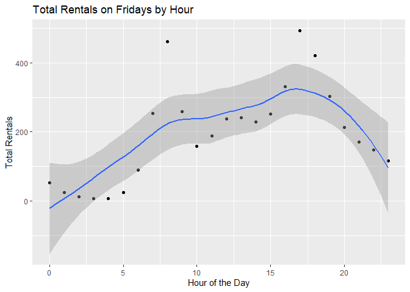
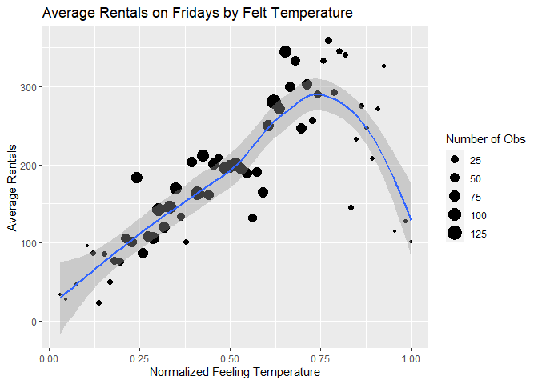

Joshua Burrows Project 2
================
16 October 2020

  - [Friday: Introduction](#friday-introduction)
  - [Read in Data](#read-in-data)
      - [Get Bikes Data](#get-bikes-data)
      - [Factors](#factors)
      - [Split by Day](#split-by-day)
  - [Exploratory Data Analysis](#exploratory-data-analysis)
      - [Correlations](#correlations)
      - [Summaries and Plots](#summaries-and-plots)
          - [Helper Function](#helper-function)
          - [Season](#season)
          - [Year](#year)
          - [Month](#month)
          - [Hour](#hour)
          - [Holiday](#holiday)
          - [Working Day](#working-day)
          - [Weather Condition](#weather-condition)
          - [Temperature](#temperature)
          - [Felt Temperature](#felt-temperature)
          - [Humidity](#humidity)
          - [Windspeed](#windspeed)
  - [Train Models](#train-models)
      - [Split Data](#split-data)
      - [Non-Ensemble Tree](#non-ensemble-tree)
          - [Training](#training)
          - [Model Information](#model-information)
      - [Boosted Tree](#boosted-tree)
          - [Train](#train)
          - [Model Information](#model-information-1)
  - [Test Models](#test-models)
  - [Best Model](#best-model)

# Friday: Introduction

This document walks though the process of creating a model to predict
the number of bikes that will be rented on fridays.

I compared two models - a *non-ensemble tree* and a *boosted tree* - and
picked the one that does better. These models use the following
predictor variables:

  - yr: year (2011 or 2012)  
  - mnth: month  
  - hr: hour of the day  
  - holiday: whether the day is a holiday  
  - weathersit: weather condition
      - pleasant: clear, few clouds, partly cloudy  
      - less pleasant: mist, mist + cloudy, mist + broken clouds, mist +
        few clouds  
      - even less pleasant: light snow, light Rain + scattered clouds,
        light rain + thunderstorm + scattered clouds  
      - downright unpleasant: snow + fog, heavy rain + ice pallets +
        thunderstorm + mist  
  - temp: normalized temperature in celsius  
  - hum: normalized humidity  
  - windspeed: normalized windspeed

You can return to the homepage for this project by clicking
[here](README.md).

# Read in Data

## Get Bikes Data

Read in data that has been downloaded from [the UCI Machine Learning
Library](https://archive.ics.uci.edu/ml/datasets/Bike+Sharing+Dataset).

``` r
bikes <- read_csv(file = "../Bike-Sharing-Dataset/hour.csv")

bikes %>% head() %>% kable()
```

| instant | dteday     | season | yr | mnth | hr | holiday | weekday | workingday | weathersit | temp |  atemp |  hum | windspeed | casual | registered | cnt |
| ------: | :--------- | -----: | -: | ---: | -: | ------: | ------: | ---------: | ---------: | ---: | -----: | ---: | --------: | -----: | ---------: | --: |
|       1 | 2011-01-01 |      1 |  0 |    1 |  0 |       0 |       6 |          0 |          1 | 0.24 | 0.2879 | 0.81 |    0.0000 |      3 |         13 |  16 |
|       2 | 2011-01-01 |      1 |  0 |    1 |  1 |       0 |       6 |          0 |          1 | 0.22 | 0.2727 | 0.80 |    0.0000 |      8 |         32 |  40 |
|       3 | 2011-01-01 |      1 |  0 |    1 |  2 |       0 |       6 |          0 |          1 | 0.22 | 0.2727 | 0.80 |    0.0000 |      5 |         27 |  32 |
|       4 | 2011-01-01 |      1 |  0 |    1 |  3 |       0 |       6 |          0 |          1 | 0.24 | 0.2879 | 0.75 |    0.0000 |      3 |         10 |  13 |
|       5 | 2011-01-01 |      1 |  0 |    1 |  4 |       0 |       6 |          0 |          1 | 0.24 | 0.2879 | 0.75 |    0.0000 |      0 |          1 |   1 |
|       6 | 2011-01-01 |      1 |  0 |    1 |  5 |       0 |       6 |          0 |          2 | 0.24 | 0.2576 | 0.75 |    0.0896 |      0 |          1 |   1 |

## Factors

Convert categorical variables to factors.

``` r
bikes$weekday <- as.factor(bikes$weekday)
levels(bikes$weekday) <- c("Sunday", "Monday", "Tuesday", "Wednesday", "Thursday", "Friday", "Saturday") 

bikes$season <- as.factor(bikes$season)
levels(bikes$season) <- c("winter", "spring", "summer", "fall")

bikes$yr <- as.factor(bikes$yr)
levels(bikes$yr) <- c("2011", "2012")

bikes$mnth <- as.factor(bikes$mnth)
levels(bikes$mnth) <- c("jan", "feb", "mar", "apr", "may", "jun", "jul", "aug", "sep", "oct", "nov", "dec")

bikes$weathersit <- as.factor(bikes$weathersit)
levels(bikes$weathersit) <- c("pleasant", "less pleasant", "even less pleasant", "downright unpleasant")

bikes$holiday <- as.factor(bikes$holiday)
levels(bikes$holiday) <- c("no", "yes")

bikes$workingday <- as.factor(bikes$workingday)
levels(bikes$workingday) <- c("no", "yes")

bikes %>% head() %>% kable()
```

| instant | dteday     | season | yr   | mnth | hr | holiday | weekday  | workingday | weathersit    | temp |  atemp |  hum | windspeed | casual | registered | cnt |
| ------: | :--------- | :----- | :--- | :--- | -: | :------ | :------- | :--------- | :------------ | ---: | -----: | ---: | --------: | -----: | ---------: | --: |
|       1 | 2011-01-01 | winter | 2011 | jan  |  0 | no      | Saturday | no         | pleasant      | 0.24 | 0.2879 | 0.81 |    0.0000 |      3 |         13 |  16 |
|       2 | 2011-01-01 | winter | 2011 | jan  |  1 | no      | Saturday | no         | pleasant      | 0.22 | 0.2727 | 0.80 |    0.0000 |      8 |         32 |  40 |
|       3 | 2011-01-01 | winter | 2011 | jan  |  2 | no      | Saturday | no         | pleasant      | 0.22 | 0.2727 | 0.80 |    0.0000 |      5 |         27 |  32 |
|       4 | 2011-01-01 | winter | 2011 | jan  |  3 | no      | Saturday | no         | pleasant      | 0.24 | 0.2879 | 0.75 |    0.0000 |      3 |         10 |  13 |
|       5 | 2011-01-01 | winter | 2011 | jan  |  4 | no      | Saturday | no         | pleasant      | 0.24 | 0.2879 | 0.75 |    0.0000 |      0 |          1 |   1 |
|       6 | 2011-01-01 | winter | 2011 | jan  |  5 | no      | Saturday | no         | less pleasant | 0.24 | 0.2576 | 0.75 |    0.0896 |      0 |          1 |   1 |

## Split by Day

Grab the data for friday.

``` r
dayData <- bikes %>% filter(weekday == params$day)

dayData %>% head() %>% kable()
```

| instant | dteday     | season | yr   | mnth | hr | holiday | weekday | workingday | weathersit         | temp |  atemp |  hum | windspeed | casual | registered | cnt |
| ------: | :--------- | :----- | :--- | :--- | -: | :------ | :------ | :--------- | :----------------- | ---: | -----: | ---: | --------: | -----: | ---------: | --: |
|     139 | 2011-01-07 | winter | 2011 | jan  |  0 | no      | Friday  | yes        | less pleasant      | 0.20 | 0.1970 | 0.64 |    0.1940 |      4 |         13 |  17 |
|     140 | 2011-01-07 | winter | 2011 | jan  |  1 | no      | Friday  | yes        | less pleasant      | 0.20 | 0.1970 | 0.69 |    0.2239 |      2 |          5 |   7 |
|     141 | 2011-01-07 | winter | 2011 | jan  |  2 | no      | Friday  | yes        | less pleasant      | 0.20 | 0.1970 | 0.69 |    0.2239 |      0 |          1 |   1 |
|     142 | 2011-01-07 | winter | 2011 | jan  |  4 | no      | Friday  | yes        | less pleasant      | 0.20 | 0.2121 | 0.69 |    0.1343 |      0 |          1 |   1 |
|     143 | 2011-01-07 | winter | 2011 | jan  |  5 | no      | Friday  | yes        | even less pleasant | 0.22 | 0.2727 | 0.55 |    0.0000 |      0 |          5 |   5 |
|     144 | 2011-01-07 | winter | 2011 | jan  |  6 | no      | Friday  | yes        | less pleasant      | 0.20 | 0.2576 | 0.69 |    0.0000 |      8 |         26 |  34 |

# Exploratory Data Analysis

I started with a little bit of exploratory data analysis. The goal is to
look at the relationships between the predictors and number of bike
rentals.

## Correlations

Create a correlation plot for the quantitative predictors.

*atemp* represents the heat index, which is typically calculated using
temperature and humidity. So it makes sense to either eliminate *atemp*
from the model or keep *atemp* but eliminate *temp* and *hum*. I decided
to eliminate *atemp*.

``` r
corr <- dayData %>% select(temp, atemp, windspeed, hum) %>% cor()

corrplot(corr)
```

<!-- -->

## Summaries and Plots

Explore the relationship between the predictors and number of bikes
rented by creating some basic summaries and plots.

### Helper Function

Create a helper function to display basic numeric summaries for a given
grouping variable.

``` r
getSum <- function(varName, colName){ 
  
  sum <- dayData %>% group_by(dayData[[varName]]) %>% summarize(min = min(cnt), Q1 = quantile(cnt, probs = c(.25), names = FALSE), median = median(cnt), mean = mean(cnt), Q3 = quantile(cnt, probs = c(.75), names = FALSE), max = max(cnt), obs = n())
  
  output <- sum %>% kable(col.names = c(colName, "Minimum", "1st Quartile", "Median", "Mean", "3rd Quartile", "Maximum", "Number of Observations"))
  
  return(output)
  
} 
```

### Season

Explore how bike rentals on fridays change with the seasons using a
basic numeric summary and a boxplot.

It does not make much sense to keep both *season* and *mnth* in the
model, so I decided to eliminate *season*.

``` r
getSum(varName = "season", colName = "Season")
```

| Season | Minimum | 1st Quartile | Median |     Mean | 3rd Quartile | Maximum | Number of Observations |
| :----- | ------: | -----------: | -----: | -------: | -----------: | ------: | ---------------------: |
| winter |       1 |         31.0 |   95.0 | 120.7545 |        180.5 |     566 |                    615 |
| spring |       1 |         50.0 |  190.0 | 217.6154 |        330.0 |     957 |                    624 |
| summer |       2 |         86.5 |  220.5 | 239.6096 |        353.0 |     894 |                    648 |
| fall   |       1 |         51.5 |  178.0 | 204.1117 |        299.0 |     900 |                    600 |

``` r
ggplot(dayData, aes(x = season, y = cnt)) + geom_boxplot() + labs(title = "Rentals by Season", x = "Season", y = "Number of Rentals") 
```

<!-- -->

### Year

Looking at total rentals each year gives us some idea of the long term
trend in bike rentals on fridays. It would be helpful to have data from
more years.

``` r
yearSum <- dayData %>% group_by(yr) %>% summarize(totalRentals = sum(cnt))

yearSum %>% kable(col.names = c("Year", "Total Rentals"))
```

| Year | Total Rentals |
| :--- | ------------: |
| 2011 |        182006 |
| 2012 |        305784 |

### Month

Explore how bike rentals on fridays change depending on the month.

As already noted, it is probably not worth including *mnth* and *season*
in the model, so *season* has been eliminated.

``` r
getSum(varName = "mnth", colName = "Month")
```

| Month | Minimum | 1st Quartile | Median |     Mean | 3rd Quartile | Maximum | Number of Observations |
| :---- | ------: | -----------: | -----: | -------: | -----------: | ------: | ---------------------: |
| jan   |       1 |        27.00 |   72.0 | 103.5556 |       154.00 |     476 |                    189 |
| feb   |       1 |        37.25 |   97.0 | 124.8138 |       183.50 |     520 |                    188 |
| mar   |       1 |        43.25 |  120.0 | 165.1028 |       228.00 |     957 |                    214 |
| apr   |       1 |        35.00 |  121.0 | 182.7917 |       287.50 |     819 |                    216 |
| may   |       1 |        81.75 |  224.5 | 239.6250 |       348.50 |     812 |                    192 |
| jun   |       4 |        76.00 |  217.5 | 234.0139 |       341.50 |     823 |                    216 |
| jul   |       6 |        96.75 |  212.0 | 225.2454 |       319.00 |     835 |                    216 |
| aug   |       3 |        84.25 |  226.0 | 248.2685 |       368.50 |     812 |                    216 |
| sep   |       2 |        51.25 |  213.5 | 239.4583 |       360.25 |     894 |                    216 |
| oct   |       4 |        70.25 |  204.5 | 234.3021 |       371.25 |     900 |                    192 |
| nov   |       1 |        49.00 |  167.0 | 188.4861 |       272.00 |     729 |                    216 |
| dec   |       1 |        39.50 |  147.0 | 155.9352 |       222.50 |     636 |                    216 |

``` r
ggplot(dayData, aes(x = mnth, y = cnt)) + geom_boxplot() + labs(title = "Retals by Month", x = "Month", y = "Number of Rentals")
```

<!-- -->

### Hour

Create a scatter plot to look at the relationship between time of day
and rentals on fridays.

``` r
avgRentals <- dayData %>% group_by(hr) %>% summarize(meanRentals = mean(cnt))

ggplot(avgRentals, aes(x = hr, y = meanRentals)) + geom_point() + labs(title = "Total Rentals by Hour", x = "Hour of the Day", y = "Total Rentals") + geom_smooth()
```

<!-- -->

### Holiday

Explore change in bike rentals depending on whether the friday in
question is a holiday.

``` r
getSum(varName = "holiday", colName = "Holiday")
```

| Holiday | Minimum | 1st Quartile | Median |     Mean | 3rd Quartile | Maximum | Number of Observations |
| :------ | ------: | -----------: | -----: | -------: | -----------: | ------: | ---------------------: |
| no      |       1 |        48.00 |    165 | 197.3333 |       289.50 |     957 |                   2439 |
| yes     |       3 |        46.75 |    129 | 135.2917 |       208.25 |     331 |                     48 |

``` r
ggplot(dayData, aes(x = holiday, y = cnt)) + geom_boxplot() + labs(title = "Rentals by Holiday", x = "Is it a Holiday?", y = "Number of Rentals")
```

<!-- -->

### Working Day

Average rentals by working day.

Working days are neither weekends nor holidays. I decided not to keep
this variable in the model because it wouldn’t make much sense in the
reports for Saturday and Sunday.

``` r
getSum(varName = "workingday", colName = "Working Day")
```

| Working Day | Minimum | 1st Quartile | Median |     Mean | 3rd Quartile | Maximum | Number of Observations |
| :---------- | ------: | -----------: | -----: | -------: | -----------: | ------: | ---------------------: |
| no          |       3 |        46.75 |    129 | 135.2917 |       208.25 |     331 |                     48 |
| yes         |       1 |        48.00 |    165 | 197.3333 |       289.50 |     957 |                   2439 |

``` r
ggplot(dayData, aes(x = workingday, y = cnt)) + geom_boxplot() + labs(title = "Rentals by Working Day", x = "Is it a Working Day?", y = "Number of Rentals")
```

<!-- -->

### Weather Condition

Explore how bike rentals on fridays change depending on the weather.

``` r
getSum(varName = "weathersit", colName = "Weather Condition")
```

| Weather Condition  | Minimum | 1st Quartile | Median |     Mean | 3rd Quartile | Maximum | Number of Observations |
| :----------------- | ------: | -----------: | -----: | -------: | -----------: | ------: | ---------------------: |
| pleasant           |       1 |         51.0 |    173 | 202.6267 |          299 |     900 |                   1645 |
| less pleasant      |       1 |         55.0 |    169 | 201.7739 |          289 |     957 |                    659 |
| even less pleasant |       1 |         24.5 |     75 | 117.4863 |          169 |     565 |                    183 |

``` r
ggplot(dayData, aes(x = weathersit, y = cnt)) + geom_boxplot() + labs(title = "Rentals by Weather Condition", x = "What is the Weather Like?", y = "Number of Rentals")
```

<!-- -->

### Temperature

Create a scatter plot to look at the relationship between temperature
and number of rentals on fridays.

``` r
tempAvg <- dayData %>% group_by(temp) %>% summarize(avgRentals = mean(cnt))

ggplot(tempAvg, aes(x = temp, y = avgRentals)) + geom_point() + labs(title = "Average Rentals by Temperature", x = "Normalized Temperature", y = "Average Rentals") + geom_smooth()
```

<!-- -->

### Felt Temperature

Create a scatter plot to look at the relationship between felt
temperature and number of rentals on fridays.

As already noted, it does not make much sense to keep *atemp* if *temp*
and *hum* will be in the model, so I eliminated *atemp* from the model.

``` r
atempAvg <- dayData %>% group_by(atemp) %>% summarize(avgRentals = mean(cnt))

ggplot(atempAvg, aes(x = atemp, y = avgRentals)) + geom_point() + labs(title = "Average Rentals by Temperature", x = "Normalized Feeling Temperature", y = "Average Rentals") + geom_smooth()
```

<!-- -->

### Humidity

Create a scatter plot to look at the relationship between humidity and
number of rentals on fridays.

``` r
humAvg <- dayData %>% group_by(hum) %>% summarize(avgRentals = mean(cnt))

ggplot(humAvg, aes(x = hum, y = avgRentals)) + geom_point() + labs(title = "Average Rentals by Humidity", x = "Normalized Humidity", y = "Average Rentals") + geom_smooth()
```

<!-- -->

### Windspeed

Create a scatter plot to look at the relationship between windspeed and
number of rentals on fridays.

``` r
windAvg <- dayData %>% group_by(windspeed) %>% summarize(avgRentals = mean(cnt))

ggplot(windAvg, aes(x = windspeed, y = avgRentals)) + geom_point() + labs(title = "Average Rentals by Windspeed", x = "Normalized Windspeed", y = "Average Rentals") + geom_smooth()
```

<!-- -->

# Train Models

After exploring the data, I created two models, a non-ensemble tree and
a boosted tree.

## Split Data

Split the data into a training set and a test set. The training set is
used to build the models, and the test set is used to evaluate them.

``` r
set.seed(123)
trainIndex <- createDataPartition(dayData$cnt, p = .75, list = FALSE)

train <- dayData[trainIndex,]
test <- dayData[-trainIndex,]
```

## Non-Ensemble Tree

### Training

Fit a non-ensemble tree model.

#### Tree Models

Tree models split each predictor space into regions and make a different
prediction for each region. For example, suppose we are interested in
predicting life expectancy based on exercise habits. We might split the
predictor space into **exercises less than one hour a week** and
**exercises at least one hour a week** and then predict that people in
the second group live longer.

How do we decide whether to split at one hour, one and a half hours, two
hours, etc? This decision is made using a method called “Recursive
Binary Splitting”, which we don’t have to worry about too much because
the *caret* package does it for us.

Ensemble tree models fit lots of trees and then average their results.
Here I have created a basic non-ensemble tree to model bicycle rentals.

#### Tuning Parameter

This model has one “tuning parameter” called *cp*. *cp* stands for
“Complexity Parameter”, and it controls the number of “nodes” that the
tree has.

The life expectancy example above has two terminal nodes: **less than
one hour** and **at least one hour**. We could complicate the example by
adding additional nodes. For instance, we could divide the group **less
than one hour** into two subgroups: **less than a half hour** and
**greater than half an hour but less than one hour**. And we could
divide **at least one hour a week** into **less than two hours** and
**greater than two hours**.

Sometimes increasing the number of nodes makes your model better, but
sometimes it makes it worse. There are lots of different methods for
picking the best number of nodes. For the bicycle rental model, I used a
method called “Leave One Out Cross Validation”.

*LOOCV* works by removing an observation from the data set, using the
rest of the data to create a model, and then seeing how well that model
does at predicting the observation that was left out. This process is
repeated for every observation, and the results are combined.

If we want to compare two different values of *cp*, we will go through
the *LOOCV* process twice and compare the results. In this way, we can
test different values of *cp* to see which one performs best.

I used the *caret* package to test 10 different values of *cp*.

#### Create the Model

``` r
set.seed(123)
tree <- train(cnt ~ yr + mnth + hr + holiday + weathersit + temp + hum + windspeed, 
              data = train, 
              method = "rpart", 
              trControl = trainControl(method = "LOOCV"), 
              tuneLength = 10)
```

### Model Information

My final non-ensemble tree model uses a *cp* of 0.0117508. Its root mean
square error on the training set is 93.7071954.

More information about this model is below.

``` r
tree
```

    ## CART 
    ## 
    ## 1867 samples
    ##    8 predictor
    ## 
    ## No pre-processing
    ## Resampling: Leave-One-Out Cross-Validation 
    ## Summary of sample sizes: 1866, 1866, 1866, 1866, 1866, 1866, ... 
    ## Resampling results across tuning parameters:
    ## 
    ##   cp          RMSE      Rsquared   
    ##   0.01175085   93.7072  0.712098679
    ##   0.01790886  100.2813  0.670473042
    ##   0.02047230  103.6740  0.647897838
    ##   0.02214798  107.3240  0.623305402
    ##   0.03548410  113.4761  0.578904225
    ##   0.03869197  117.9513  0.545350984
    ##   0.05007110  127.5613  0.472629118
    ##   0.05973749  131.8607  0.434023616
    ##   0.10225743  152.2609  0.261491060
    ##   0.36853272  178.2816  0.005741748
    ##   MAE      
    ##    65.26785
    ##    71.83857
    ##    72.95862
    ##    74.91894
    ##    82.48113
    ##    82.92586
    ##    90.34170
    ##    92.95132
    ##   113.42251
    ##   155.76468
    ## 
    ## RMSE was used to select the
    ##  optimal model using the
    ##  smallest value.
    ## The final value used for the model
    ##  was cp = 0.01175085.

``` r
plot(tree$finalModel)
text(tree$finalModel)
```

<!-- -->

## Boosted Tree

### Train

#### Boosted Tree Models

Boosted trees are another type of tree model. “Boosting” works by
fitting a series of trees, each of which is a modified version of the
previous tree. The idea is to hone in on the best model.

#### Tuning Paremeters

Four tuning parameters are involved:  
\- *n.trees*: number of boosting iterations  
\- *interaction.depth*: maximum tree depth  
\- *shrinkage*: how strongly each subsequent tree is influenced by the
previous tree  
\- *n.minobsinnode*: minimum terminal node size

Values for the tuning parameters are found using Cross Validation. Cross
Validation works by splitting the data into groups called “folds”. One
fold is left out, the rest are used to create a model, and then that
model is tested on the fold that was left out. This process is repeated
for each fold, and the results are combined. It should be clear that
*LOOCV* is just *CV* with the number of folds equal to the number of
observations.

I used the *caret* package to test 81 different combinations of tuning
parameters.

#### Create the Model

``` r
tuneGr <- expand.grid(n.trees = seq(from = 50, to = 150, by = 50), 
                     interaction.depth = 1:3, 
                     shrinkage = seq(from = .05, to = .15, by = .05), 
                     n.minobsinnode = 9:11)

set.seed(123)
boostTree <- train(cnt ~ yr + mnth + hr + holiday + weathersit + temp + hum + windspeed, 
                   data = train, 
                   method = "gbm", 
                   trControl = trainControl(method = "cv", number = 10),
                   tuneGrid = tuneGr, 
                   verbose = FALSE)
```

### Model Information

My final boosted tree model uses the following tuning parameters:

  - *n.trees*: 150  
  - *interaction.depth*: 3  
  - *shrinkage*: 0.15  
  - *n.minobsinnode*: 10

Its root mean square error on the training set is 53.2563011.

More information about this model is below.

``` r
boostTree
```

    ## Stochastic Gradient Boosting 
    ## 
    ## 1867 samples
    ##    8 predictor
    ## 
    ## No pre-processing
    ## Resampling: Cross-Validated (10 fold) 
    ## Summary of sample sizes: 1680, 1679, 1681, 1681, 1681, 1681, ... 
    ## Resampling results across tuning parameters:
    ## 
    ##   shrinkage  interaction.depth
    ##   0.05       1                
    ##   0.05       1                
    ##   0.05       1                
    ##   0.05       1                
    ##   0.05       1                
    ##   0.05       1                
    ##   0.05       1                
    ##   0.05       1                
    ##   0.05       1                
    ##   0.05       2                
    ##   0.05       2                
    ##   0.05       2                
    ##   0.05       2                
    ##   0.05       2                
    ##   0.05       2                
    ##   0.05       2                
    ##   0.05       2                
    ##   0.05       2                
    ##   0.05       3                
    ##   0.05       3                
    ##   0.05       3                
    ##   0.05       3                
    ##   0.05       3                
    ##   0.05       3                
    ##   0.05       3                
    ##   0.05       3                
    ##   0.05       3                
    ##   0.10       1                
    ##   0.10       1                
    ##   0.10       1                
    ##   0.10       1                
    ##   0.10       1                
    ##   0.10       1                
    ##   0.10       1                
    ##   0.10       1                
    ##   0.10       1                
    ##   0.10       2                
    ##   0.10       2                
    ##   0.10       2                
    ##   0.10       2                
    ##   0.10       2                
    ##   0.10       2                
    ##   0.10       2                
    ##   0.10       2                
    ##   0.10       2                
    ##   0.10       3                
    ##   0.10       3                
    ##   0.10       3                
    ##   0.10       3                
    ##   0.10       3                
    ##   0.10       3                
    ##   0.10       3                
    ##   0.10       3                
    ##   0.10       3                
    ##   0.15       1                
    ##   0.15       1                
    ##   0.15       1                
    ##   0.15       1                
    ##   0.15       1                
    ##   0.15       1                
    ##   0.15       1                
    ##   0.15       1                
    ##   0.15       1                
    ##   0.15       2                
    ##   0.15       2                
    ##   0.15       2                
    ##   0.15       2                
    ##   0.15       2                
    ##   0.15       2                
    ##   0.15       2                
    ##   0.15       2                
    ##   0.15       2                
    ##   0.15       3                
    ##   0.15       3                
    ##   0.15       3                
    ##   0.15       3                
    ##   0.15       3                
    ##   0.15       3                
    ##   0.15       3                
    ##   0.15       3                
    ##   0.15       3                
    ##   n.minobsinnode  n.trees  RMSE     
    ##    9               50      126.93376
    ##    9              100      113.87403
    ##    9              150      106.71613
    ##   10               50      126.95292
    ##   10              100      113.74598
    ##   10              150      106.53126
    ##   11               50      126.88093
    ##   11              100      113.71668
    ##   11              150      106.40973
    ##    9               50      105.63595
    ##    9              100       88.23305
    ##    9              150       76.70949
    ##   10               50      105.69935
    ##   10              100       88.14405
    ##   10              150       76.73431
    ##   11               50      105.74624
    ##   11              100       88.55496
    ##   11              150       76.31242
    ##    9               50       93.10281
    ##    9              100       74.01334
    ##    9              150       64.04107
    ##   10               50       93.28535
    ##   10              100       74.06759
    ##   10              150       64.55331
    ##   11               50       93.14086
    ##   11              100       73.78700
    ##   11              150       64.39953
    ##    9               50      113.46586
    ##    9              100      101.39455
    ##    9              150       95.43383
    ##   10               50      113.44983
    ##   10              100      101.62779
    ##   10              150       95.58262
    ##   11               50      113.55072
    ##   11              100      101.71853
    ##   11              150       95.65142
    ##    9               50       88.30927
    ##    9              100       70.23101
    ##    9              150       64.48021
    ##   10               50       88.02148
    ##   10              100       70.42140
    ##   10              150       64.60501
    ##   11               50       87.90968
    ##   11              100       70.21723
    ##   11              150       64.26120
    ##    9               50       73.43195
    ##    9              100       60.03417
    ##    9              150       55.83090
    ##   10               50       73.79591
    ##   10              100       59.89749
    ##   10              150       56.12619
    ##   11               50       74.04553
    ##   11              100       59.94441
    ##   11              150       55.55987
    ##    9               50      106.12287
    ##    9              100       95.29316
    ##    9              150       89.32648
    ##   10               50      106.03917
    ##   10              100       95.37725
    ##   10              150       89.38037
    ##   11               50      106.27587
    ##   11              100       95.41883
    ##   11              150       89.42262
    ##    9               50       76.14288
    ##    9              100       64.70658
    ##    9              150       61.47263
    ##   10               50       76.39447
    ##   10              100       64.53329
    ##   10              150       61.14085
    ##   11               50       75.88717
    ##   11              100       64.84594
    ##   11              150       61.65687
    ##    9               50       64.18420
    ##    9              100       55.74267
    ##    9              150       53.76619
    ##   10               50       64.65333
    ##   10              100       55.74377
    ##   10              150       53.25630
    ##   11               50       64.42788
    ##   11              100       56.02262
    ##   11              150       53.72872
    ##   Rsquared   MAE     
    ##   0.5403646  89.47635
    ##   0.6193138  78.00962
    ##   0.6560038  73.39421
    ##   0.5406689  89.62872
    ##   0.6202587  77.96677
    ##   0.6568862  73.25030
    ##   0.5423063  89.63538
    ##   0.6204037  77.81948
    ##   0.6576943  73.13258
    ##   0.6859908  71.84272
    ##   0.7650502  58.19812
    ##   0.8221881  51.75924
    ##   0.6863991  71.79357
    ##   0.7669978  58.13390
    ##   0.8223408  51.76668
    ##   0.6846214  71.72236
    ##   0.7637466  58.22762
    ##   0.8243462  51.37846
    ##   0.7607533  63.83261
    ##   0.8379375  49.99297
    ##   0.8751100  43.75047
    ##   0.7596615  64.08684
    ##   0.8374029  50.08539
    ##   0.8719310  43.99273
    ##   0.7617883  64.09903
    ##   0.8384624  49.88664
    ##   0.8734406  43.90442
    ##   0.6222181  77.88619
    ##   0.6837845  70.13499
    ##   0.7186007  66.62560
    ##   0.6227733  77.70012
    ##   0.6828481  70.26471
    ##   0.7170441  66.72791
    ##   0.6205024  77.95864
    ##   0.6814212  70.33435
    ##   0.7164141  66.81288
    ##   0.7656153  58.66122
    ##   0.8475512  48.51754
    ##   0.8677766  44.57464
    ##   0.7664479  58.31620
    ##   0.8471690  48.68943
    ##   0.8669133  44.64121
    ##   0.7676249  58.00116
    ##   0.8484940  48.50209
    ##   0.8686649  44.69359
    ##   0.8386521  49.90020
    ##   0.8858469  40.76210
    ##   0.8980204  37.55692
    ##   0.8371174  50.03545
    ##   0.8862468  40.90279
    ##   0.8975062  37.91991
    ##   0.8349578  49.80567
    ##   0.8864135  40.89216
    ##   0.8996781  37.53479
    ##   0.6572349  73.10511
    ##   0.7177969  66.73065
    ##   0.7498848  63.07216
    ##   0.6578102  73.10756
    ##   0.7179527  66.47565
    ##   0.7516561  62.95533
    ##   0.6565027  73.18854
    ##   0.7171452  66.79337
    ##   0.7498769  63.20785
    ##   0.8236715  51.61535
    ##   0.8663481  44.80726
    ##   0.8769766  42.32718
    ##   0.8233932  52.02726
    ##   0.8671005  44.98085
    ##   0.8779685  42.44272
    ##   0.8248309  51.71656
    ##   0.8659442  44.77146
    ##   0.8763491  42.41358
    ##   0.8728548  43.97947
    ##   0.8990481  38.01857
    ##   0.9050371  36.26283
    ##   0.8700839  44.29065
    ##   0.8986240  37.80272
    ##   0.9063719  35.83644
    ##   0.8711088  44.11790
    ##   0.8976886  37.78714
    ##   0.9049659  35.73599
    ## 
    ## RMSE was used to select the
    ##  optimal model using the
    ##  smallest value.
    ## The final values used for the
    ##  shrinkage = 0.15 and n.minobsinnode
    ##  = 10.

# Test Models

Test the models on the test set. Select the model that performs better.

Performance is measured using Root Mean Square Error, which is a measure
of how close the model gets to correctly predicting the test data. The
RMSE for each model is displayed below.

``` r
treePreds <- predict(tree, test)
treeRMSE <- postResample(treePreds, test$cnt)[1]

boostPreds <- predict(boostTree, test)
boostRMSE <- postResample(boostPreds, test$cnt)[1]

modelPerformance <- data.frame(model = c("Non-Ensemble Tree", "Boosted Tree"), RMSE = c(treeRMSE, boostRMSE))

modelPerformance %>% kable(col.names = c("Model", "Test RMSE"))
```

| Model             | Test RMSE |
| :---------------- | --------: |
| Non-Ensemble Tree |  98.28858 |
| Boosted Tree      |  56.55209 |

# Best Model

``` r
best <- modelPerformance %>% filter(RMSE == min(RMSE))
worst <- modelPerformance %>% filter(RMSE == max(RMSE))
```

The boosted tree performs better than the non-ensemble tree.

The boosted tree model is saved to the `final` object below.

``` r
if(best$model == "Non-Ensemble Tree"){
  final <- tree
} else if(best$model == "Boosted Tree"){
  final <- boostTree
} else{
  stop("Error")
}

final$finalModel
```

    ## A gradient boosted model with gaussian loss function.
    ## 150 iterations were performed.
    ## There were 20 predictors of which 17 had non-zero influence.
