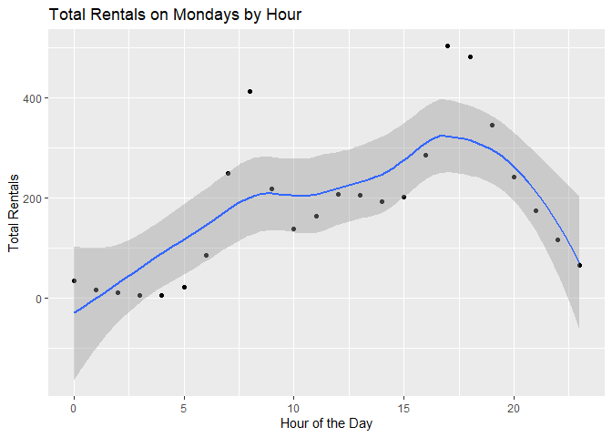
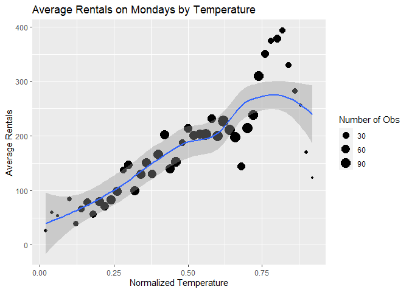
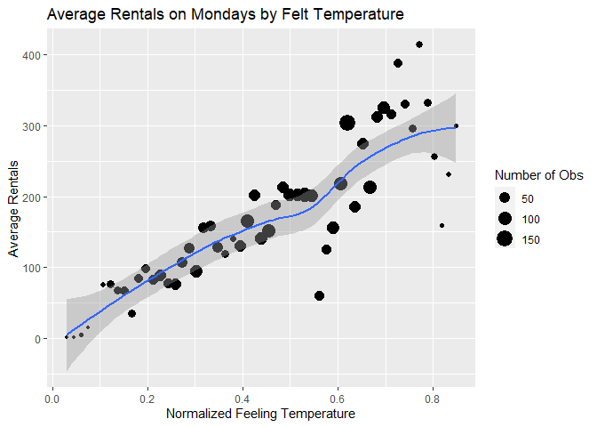
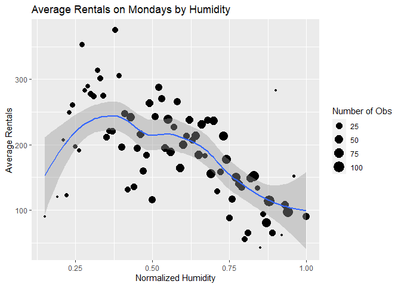
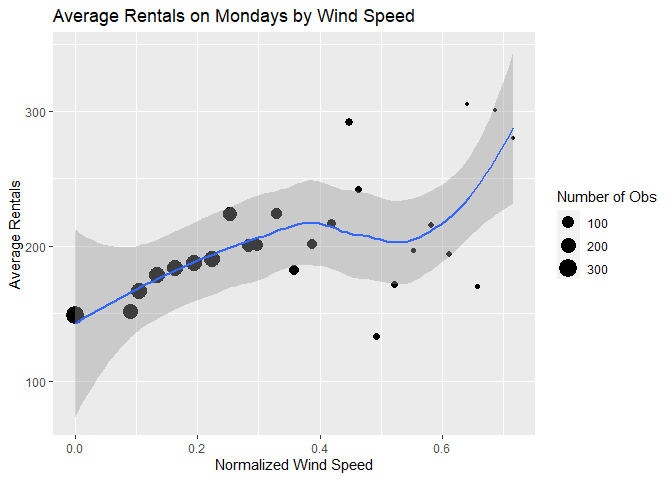

Joshua Burrows Project 2
================
16 October 2020

  - [Monday: Introduction](#monday-introduction)
  - [Read in Data](#read-in-data)
      - [Get Bikes Data](#get-bikes-data)
      - [Factors](#factors)
      - [Split by Day](#split-by-day)
  - [Exploratory Data Analysis](#exploratory-data-analysis)
      - [Correlations](#correlations)
      - [Summaries and Plots](#summaries-and-plots)
          - [Helper Function](#helper-function)
          - [Season](#season)
          - [Year](#year)
          - [Month](#month)
          - [Hour](#hour)
          - [Holiday](#holiday)
          - [Working Day](#working-day)
          - [Weather Condition](#weather-condition)
          - [Temperature](#temperature)
          - [Felt Temperature](#felt-temperature)
          - [Humidity](#humidity)
          - [Windspeed](#windspeed)
  - [Train Models](#train-models)
      - [Split Data](#split-data)
      - [Non-Ensemble Tree](#non-ensemble-tree)
          - [Training](#training)
          - [Model Information](#model-information)
      - [Boosted Tree](#boosted-tree)
          - [Train](#train)
          - [Model Information](#model-information-1)
  - [Test Models](#test-models)
  - [Best Model](#best-model)

# Monday: Introduction

This document walks though the process of creating a model to predict
the number of bikes that will be rented on mondays.

I compared two models - a *non-ensemble tree* and a *boosted tree* - and
picked the one that does better. These models use the following
predictor variables:

  - yr: year (2011 or 2012)  
  - mnth: month  
  - hr: hour of the day  
  - holiday: whether the day is a holiday  
  - weathersit: weather condition
      - pleasant: clear, few clouds, partly cloudy  
      - less pleasant: mist, mist + cloudy, mist + broken clouds, mist +
        few clouds  
      - even less pleasant: light snow, light Rain + scattered clouds,
        light rain + thunderstorm + scattered clouds  
      - downright unpleasant: snow + fog, heavy rain + ice pallets +
        thunderstorm + mist  
  - temp: normalized temperature in celsius  
  - hum: normalized humidity  
  - windspeed: normalized windspeed

You can return to the homepage for this project by clicking
[here](README.md).

# Read in Data

## Get Bikes Data

Read in data that has been downloaded from [the UCI Machine Learning
Library](https://archive.ics.uci.edu/ml/datasets/Bike+Sharing+Dataset).

``` r
bikes <- read_csv(file = "../Bike-Sharing-Dataset/hour.csv")

bikes %>% head() %>% kable()
```

| instant | dteday     | season | yr | mnth | hr | holiday | weekday | workingday | weathersit | temp |  atemp |  hum | windspeed | casual | registered | cnt |
| ------: | :--------- | -----: | -: | ---: | -: | ------: | ------: | ---------: | ---------: | ---: | -----: | ---: | --------: | -----: | ---------: | --: |
|       1 | 2011-01-01 |      1 |  0 |    1 |  0 |       0 |       6 |          0 |          1 | 0.24 | 0.2879 | 0.81 |    0.0000 |      3 |         13 |  16 |
|       2 | 2011-01-01 |      1 |  0 |    1 |  1 |       0 |       6 |          0 |          1 | 0.22 | 0.2727 | 0.80 |    0.0000 |      8 |         32 |  40 |
|       3 | 2011-01-01 |      1 |  0 |    1 |  2 |       0 |       6 |          0 |          1 | 0.22 | 0.2727 | 0.80 |    0.0000 |      5 |         27 |  32 |
|       4 | 2011-01-01 |      1 |  0 |    1 |  3 |       0 |       6 |          0 |          1 | 0.24 | 0.2879 | 0.75 |    0.0000 |      3 |         10 |  13 |
|       5 | 2011-01-01 |      1 |  0 |    1 |  4 |       0 |       6 |          0 |          1 | 0.24 | 0.2879 | 0.75 |    0.0000 |      0 |          1 |   1 |
|       6 | 2011-01-01 |      1 |  0 |    1 |  5 |       0 |       6 |          0 |          2 | 0.24 | 0.2576 | 0.75 |    0.0896 |      0 |          1 |   1 |

## Factors

Convert categorical variables to factors.

``` r
bikes$weekday <- as.factor(bikes$weekday)
levels(bikes$weekday) <- c("Sunday", "Monday", "Tuesday", "Wednesday", "Thursday", "Friday", "Saturday") 

bikes$season <- as.factor(bikes$season)
levels(bikes$season) <- c("winter", "spring", "summer", "fall")

bikes$yr <- as.factor(bikes$yr)
levels(bikes$yr) <- c("2011", "2012")

bikes$mnth <- as.factor(bikes$mnth)
levels(bikes$mnth) <- c("jan", "feb", "mar", "apr", "may", "jun", "jul", "aug", "sep", "oct", "nov", "dec")

bikes$weathersit <- as.factor(bikes$weathersit)
levels(bikes$weathersit) <- c("pleasant", "less pleasant", "even less pleasant", "downright unpleasant")

bikes$holiday <- as.factor(bikes$holiday)
levels(bikes$holiday) <- c("no", "yes")

bikes$workingday <- as.factor(bikes$workingday)
levels(bikes$workingday) <- c("no", "yes")

bikes %>% head() %>% kable()
```

| instant | dteday     | season | yr   | mnth | hr | holiday | weekday  | workingday | weathersit    | temp |  atemp |  hum | windspeed | casual | registered | cnt |
| ------: | :--------- | :----- | :--- | :--- | -: | :------ | :------- | :--------- | :------------ | ---: | -----: | ---: | --------: | -----: | ---------: | --: |
|       1 | 2011-01-01 | winter | 2011 | jan  |  0 | no      | Saturday | no         | pleasant      | 0.24 | 0.2879 | 0.81 |    0.0000 |      3 |         13 |  16 |
|       2 | 2011-01-01 | winter | 2011 | jan  |  1 | no      | Saturday | no         | pleasant      | 0.22 | 0.2727 | 0.80 |    0.0000 |      8 |         32 |  40 |
|       3 | 2011-01-01 | winter | 2011 | jan  |  2 | no      | Saturday | no         | pleasant      | 0.22 | 0.2727 | 0.80 |    0.0000 |      5 |         27 |  32 |
|       4 | 2011-01-01 | winter | 2011 | jan  |  3 | no      | Saturday | no         | pleasant      | 0.24 | 0.2879 | 0.75 |    0.0000 |      3 |         10 |  13 |
|       5 | 2011-01-01 | winter | 2011 | jan  |  4 | no      | Saturday | no         | pleasant      | 0.24 | 0.2879 | 0.75 |    0.0000 |      0 |          1 |   1 |
|       6 | 2011-01-01 | winter | 2011 | jan  |  5 | no      | Saturday | no         | less pleasant | 0.24 | 0.2576 | 0.75 |    0.0896 |      0 |          1 |   1 |

## Split by Day

Grab the data for monday.

``` r
dayData <- bikes %>% filter(weekday == params$day)

dayData %>% head() %>% kable()
```

| instant | dteday     | season | yr   | mnth | hr | holiday | weekday | workingday | weathersit | temp |  atemp |  hum | windspeed | casual | registered | cnt |
| ------: | :--------- | :----- | :--- | :--- | -: | :------ | :------ | :--------- | :--------- | ---: | -----: | ---: | --------: | -----: | ---------: | --: |
|      48 | 2011-01-03 | winter | 2011 | jan  |  0 | no      | Monday  | yes        | pleasant   | 0.22 | 0.1970 | 0.44 |    0.3582 |      0 |          5 |   5 |
|      49 | 2011-01-03 | winter | 2011 | jan  |  1 | no      | Monday  | yes        | pleasant   | 0.20 | 0.1667 | 0.44 |    0.4179 |      0 |          2 |   2 |
|      50 | 2011-01-03 | winter | 2011 | jan  |  4 | no      | Monday  | yes        | pleasant   | 0.16 | 0.1364 | 0.47 |    0.3881 |      0 |          1 |   1 |
|      51 | 2011-01-03 | winter | 2011 | jan  |  5 | no      | Monday  | yes        | pleasant   | 0.16 | 0.1364 | 0.47 |    0.2836 |      0 |          3 |   3 |
|      52 | 2011-01-03 | winter | 2011 | jan  |  6 | no      | Monday  | yes        | pleasant   | 0.14 | 0.1061 | 0.50 |    0.3881 |      0 |         30 |  30 |
|      53 | 2011-01-03 | winter | 2011 | jan  |  7 | no      | Monday  | yes        | pleasant   | 0.14 | 0.1364 | 0.50 |    0.1940 |      1 |         63 |  64 |

# Exploratory Data Analysis

I started with a little bit of exploratory data analysis. The goal is to
look at the relationships between the predictors and number of bike
rentals.

## Correlations

Create a correlation plot for the quantitative predictors.

*atemp* represents the heat index, which is typically calculated using
temperature and humidity. So it makes sense to either eliminate *atemp*
from the model or keep *atemp* but eliminate *temp* and *hum*. I decided
to eliminate *atemp*.

``` r
corr <- dayData %>% select(temp, atemp, windspeed, hum) %>% cor()

corrplot(corr)
```

<!-- -->

## Summaries and Plots

Explore the relationship between the predictors and number of bikes
rented by creating some basic summaries and plots.

### Helper Function

Create a helper function to display basic numeric summaries for a given
grouping variable.

``` r
getSum <- function(varName, colName){ 
  
  sum <- dayData %>% group_by(dayData[[varName]]) %>% summarize(min = min(cnt), Q1 = quantile(cnt, probs = c(.25), names = FALSE), median = median(cnt), mean = mean(cnt), Q3 = quantile(cnt, probs = c(.75), names = FALSE), max = max(cnt), obs = n())
  
  output <- sum %>% kable(col.names = c(colName, "Minimum", "1st Quartile", "Median", "Mean", "3rd Quartile", "Maximum", "Number of Observations"))
  
  return(output)
  
} 
```

### Season

Explore how bike rentals on mondays change with the seasons using a
basic numeric summary and a boxplot.

It does not make much sense to keep both *season* and *mnth* in the
model, so I decided to eliminate *season*.

``` r
getSum(varName = "season", colName = "Season")
```

| Season | Minimum | 1st Quartile | Median |     Mean | 3rd Quartile | Maximum | Number of Observations |
| :----- | ------: | -----------: | -----: | -------: | -----------: | ------: | ---------------------: |
| winter |       1 |        19.75 |   71.5 | 104.2010 |       147.25 |     801 |                    612 |
| spring |       1 |        46.00 |  157.5 | 191.3898 |       274.00 |     834 |                    644 |
| summer |       1 |        56.50 |  189.0 | 234.8427 |       341.00 |     968 |                    623 |
| fall   |       2 |        47.75 |  166.0 | 203.6167 |       302.00 |     922 |                    600 |

``` r
ggplot(dayData, aes(x = season, y = cnt)) + geom_boxplot() + labs(title = "Rentals by Season", x = "Season", y = "Number of Rentals") 
```

<!-- -->

### Year

Looking at total rentals each year gives us some idea of the long term
trend in bike rentals on mondays. It would be helpful to have data from
more years.

``` r
yearSum <- dayData %>% group_by(yr) %>% summarize(totalRentals = sum(cnt))

yearSum %>% kable(col.names = c("Year", "Total Rentals"))
```

| Year | Total Rentals |
| :--- | ------------: |
| 2011 |        180221 |
| 2012 |        275282 |

### Month

Explore how bike rentals on mondays change depending on the month.

As already noted, it is probably not worth including *mnth* and *season*
in the model, so *season* has been eliminated.

``` r
getSum(varName = "mnth", colName = "Month")
```

| Month | Minimum | 1st Quartile | Median |      Mean | 3rd Quartile | Maximum | Number of Observations |
| :---- | ------: | -----------: | -----: | --------: | -----------: | ------: | ---------------------: |
| jan   |       1 |        17.75 |   61.0 |  81.64407 |       116.25 |     493 |                    236 |
| feb   |       1 |        25.00 |   80.0 | 110.82447 |       154.25 |     529 |                    188 |
| mar   |       1 |        30.75 |   99.5 | 150.87766 |       223.00 |     801 |                    188 |
| apr   |       1 |        46.50 |  157.0 | 189.91589 |       279.50 |     729 |                    214 |
| may   |       2 |        59.00 |  170.5 | 188.01389 |       270.50 |     769 |                    216 |
| jun   |       1 |        45.25 |  182.5 | 228.26042 |       316.00 |     834 |                    192 |
| jul   |       2 |        61.75 |  201.5 | 241.31481 |       367.00 |     872 |                    216 |
| aug   |       1 |        59.75 |  192.5 | 229.93056 |       293.00 |     893 |                    216 |
| sep   |       2 |        54.50 |  187.0 | 236.10995 |       342.50 |     968 |                    191 |
| oct   |       2 |        51.00 |  174.0 | 213.47465 |       322.00 |     922 |                    217 |
| nov   |       2 |        47.00 |  152.0 | 195.11518 |       277.50 |     663 |                    191 |
| dec   |       1 |        23.25 |  113.0 | 147.09813 |       213.25 |     731 |                    214 |

``` r
ggplot(dayData, aes(x = mnth, y = cnt)) + geom_boxplot() + labs(title = "Retals by Month", x = "Month", y = "Number of Rentals")
```

<!-- -->

### Hour

Create a scatter plot to look at the relationship between time of day
and rentals on mondays.

``` r
avgRentals <- dayData %>% group_by(hr) %>% summarize(meanRentals = mean(cnt))

ggplot(avgRentals, aes(x = hr, y = meanRentals)) + geom_point() + labs(title = "Total Rentals by Hour", x = "Hour of the Day", y = "Total Rentals") + geom_smooth()
```

<!-- -->

### Holiday

Explore change in bike rentals depending on whether the monday in
question is a holiday.

``` r
getSum(varName = "holiday", colName = "Holiday")
```

| Holiday | Minimum | 1st Quartile | Median |     Mean | 3rd Quartile | Maximum | Number of Observations |
| :------ | ------: | -----------: | -----: | -------: | -----------: | ------: | ---------------------: |
| no      |       1 |           37 |  142.5 | 186.5683 |       266.75 |     968 |                   2122 |
| yes     |       1 |           31 |  100.0 | 166.9608 |       281.00 |     712 |                    357 |

``` r
ggplot(dayData, aes(x = holiday, y = cnt)) + geom_boxplot() + labs(title = "Rentals by Holiday", x = "Is it a Holiday?", y = "Number of Rentals")
```

<!-- -->

### Working Day

Average rentals by working day.

Working days are neither weekends nor holidays. I decided not to keep
this variable in the model because it wouldn’t make much sense in the
reports for Saturday and Sunday.

``` r
getSum(varName = "workingday", colName = "Working Day")
```

| Working Day | Minimum | 1st Quartile | Median |     Mean | 3rd Quartile | Maximum | Number of Observations |
| :---------- | ------: | -----------: | -----: | -------: | -----------: | ------: | ---------------------: |
| no          |       1 |           31 |  100.0 | 166.9608 |       281.00 |     712 |                    357 |
| yes         |       1 |           37 |  142.5 | 186.5683 |       266.75 |     968 |                   2122 |

``` r
ggplot(dayData, aes(x = workingday, y = cnt)) + geom_boxplot() + labs(title = "Rentals by Working Day", x = "Is it a Working Day?", y = "Number of Rentals")
```

<!-- -->

### Weather Condition

Explore how bike rentals on mondays change depending on the weather.

``` r
getSum(varName = "weathersit", colName = "Weather Condition")
```

| Weather Condition    | Minimum | 1st Quartile | Median |     Mean | 3rd Quartile | Maximum | Number of Observations |
| :------------------- | ------: | -----------: | -----: | -------: | -----------: | ------: | ---------------------: |
| pleasant             |       1 |           32 |    145 | 191.8439 |       281.75 |     968 |                   1582 |
| less pleasant        |       1 |           57 |    139 | 181.6570 |       254.50 |     842 |                    726 |
| even less pleasant   |       1 |           20 |     70 | 117.4059 |       171.75 |     856 |                    170 |
| downright unpleasant |     164 |          164 |    164 | 164.0000 |       164.00 |     164 |                      1 |

``` r
ggplot(dayData, aes(x = weathersit, y = cnt)) + geom_boxplot() + labs(title = "Rentals by Weather Condition", x = "What is the Weather Like?", y = "Number of Rentals")
```

<!-- -->

### Temperature

Create a scatter plot to look at the relationship between temperature
and number of rentals on mondays.

``` r
tempAvg <- dayData %>% group_by(temp) %>% summarize(avgRentals = mean(cnt))

ggplot(tempAvg, aes(x = temp, y = avgRentals)) + geom_point() + labs(title = "Average Rentals by Temperature", x = "Normalized Temperature", y = "Average Rentals") + geom_smooth()
```

<!-- -->

### Felt Temperature

Create a scatter plot to look at the relationship between felt
temperature and number of rentals on mondays.

As already noted, it does not make much sense to keep *atemp* if *temp*
and *hum* will be in the model, so I eliminated *atemp* from the model.

``` r
atempAvg <- dayData %>% group_by(atemp) %>% summarize(avgRentals = mean(cnt))

ggplot(atempAvg, aes(x = atemp, y = avgRentals)) + geom_point() + labs(title = "Average Rentals by Temperature", x = "Normalized Feeling Temperature", y = "Average Rentals") + geom_smooth()
```

<!-- -->

### Humidity

Create a scatter plot to look at the relationship between humidity and
number of rentals on mondays.

``` r
humAvg <- dayData %>% group_by(hum) %>% summarize(avgRentals = mean(cnt))

ggplot(humAvg, aes(x = hum, y = avgRentals)) + geom_point() + labs(title = "Average Rentals by Humidity", x = "Normalized Humidity", y = "Average Rentals") + geom_smooth()
```

<!-- -->

### Windspeed

Create a scatter plot to look at the relationship between windspeed and
number of rentals on mondays.

``` r
windAvg <- dayData %>% group_by(windspeed) %>% summarize(avgRentals = mean(cnt))

ggplot(windAvg, aes(x = windspeed, y = avgRentals)) + geom_point() + labs(title = "Average Rentals by Windspeed", x = "Normalized Windspeed", y = "Average Rentals") + geom_smooth()
```

<!-- -->

# Train Models

After exploring the data, I created two models, a non-ensemble tree and
a boosted tree.

## Split Data

Split the data into a training set and a test set. The training set is
used to build the models, and the test set is used to evaluate them.

``` r
set.seed(123)
trainIndex <- createDataPartition(dayData$cnt, p = .75, list = FALSE)

train <- dayData[trainIndex,]
test <- dayData[-trainIndex,]
```

## Non-Ensemble Tree

### Training

Fit a non-ensemble tree model.

#### Tree Models

Tree models split each predictor space into regions and make a different
prediction for each region. For example, suppose we are interested in
predicting life expectancy based on exercise habits. We might split the
predictor space into **exercises less than one hour a week** and
**exercises at least one hour a week** and then predict that people in
the second group live longer.

How do we decide whether to split at one hour, one and a half hours, two
hours, etc? This decision is made using a method called “Recursive
Binary Splitting”, which we don’t have to worry about too much because
the *caret* package does it for us.

Ensemble tree models fit lots of trees and then average their results.
Here I have created a basic non-ensemble tree to model bicycle rentals.

#### Tuning Parameter

This model has one “tuning parameter” called *cp*. *cp* stands for
“Complexity Parameter”, and it controls the number of “nodes” that the
tree has.

The life expectancy example above has two terminal nodes: **less than
one hour** and **at least one hour**. We could complicate the example by
adding additional nodes. For instance, we could divide the group **less
than one hour** into two subgroups: **less than a half hour** and
**greater than half an hour but less than one hour**. And we could
divide **at least one hour a week** into **less than two hours** and
**greater than two hours**.

Sometimes increasing the number of nodes makes your model better, but
sometimes it makes it worse. There are lots of different methods for
picking the best number of nodes. For the bicycle rental model, I used a
method called “Leave One Out Cross Validation”.

*LOOCV* works by removing an observation from the data set, using the
rest of the data to create a model, and then seeing how well that model
does at predicting the observation that was left out. This process is
repeated for every observation, and the results are combined.

If we want to compare two different values of *cp*, we will go through
the *LOOCV* process twice and compare the results. In this way, we can
test different values of *cp* to see which one performs best.

I used the *caret* package to test 10 different values of *cp*.

#### Create the Model

``` r
set.seed(123)
tree <- train(cnt ~ yr + mnth + hr + holiday + weathersit + temp + hum + windspeed, 
              data = train, 
              method = "rpart", 
              trControl = trainControl(method = "LOOCV"), 
              tuneLength = 10)
```

### Model Information

My final non-ensemble tree model uses a *cp* of 0.010024. Its root mean
square error on the training set is 91.680588.

More information about this model is below.

``` r
tree
```

    ## CART 
    ## 
    ## 1861 samples
    ##    8 predictor
    ## 
    ## No pre-processing
    ## Resampling: Leave-One-Out Cross-Validation 
    ## Summary of sample sizes: 1860, 1860, 1860, 1860, 1860, 1860, ... 
    ## Resampling results across tuning parameters:
    ## 
    ##   cp          RMSE       Rsquared   
    ##   0.01002396   91.68059  0.736808968
    ##   0.01170396   94.43217  0.720882032
    ##   0.01450317   98.07957  0.699266415
    ##   0.01624757  101.62708  0.677458370
    ##   0.01904042  103.23845  0.666603834
    ##   0.02545625  106.80785  0.643069651
    ##   0.04009360  115.01349  0.587573648
    ##   0.04386094  120.88178  0.543627619
    ##   0.09181217  158.25327  0.240514642
    ##   0.30998206  183.31033  0.001518581
    ##   MAE      
    ##    64.05176
    ##    65.68724
    ##    67.41869
    ##    69.45327
    ##    73.75840
    ##    73.82818
    ##    78.58254
    ##    84.21021
    ##   114.85357
    ##   158.63178
    ## 
    ## RMSE was used to select the
    ##  optimal model using the
    ##  smallest value.
    ## The final value used for the model
    ##  was cp = 0.01002396.

``` r
plot(tree$finalModel)
text(tree$finalModel)
```

<!-- -->

## Boosted Tree

### Train

#### Boosted Tree Models

Boosted trees are another type of tree model. “Boosting” works by
fitting a series of trees, each of which is a modified version of the
previous tree. The idea is to hone in on the best model.

#### Tuning Paremeters

Four tuning parameters are involved:  
\- *n.trees*: number of boosting iterations  
\- *interaction.depth*: maximum tree depth  
\- *shrinkage*: how strongly each subsequent tree is influenced by the
previous tree  
\- *n.minobsinnode*: minimum terminal node size

Values for the tuning parameters are found using Cross Validation. Cross
Validation works by splitting the data into groups called “folds”. One
fold is left out, the rest are used to create a model, and then that
model is tested on the fold that was left out. This process is repeated
for each fold, and the results are combined. It should be clear that
*LOOCV* is just *CV* with the number of folds equal to the number of
observations.

I used the *caret* package to test 81 different combinations of tuning
parameters.

#### Create the Model

``` r
tuneGr <- expand.grid(n.trees = seq(from = 50, to = 150, by = 50), 
                     interaction.depth = 1:3, 
                     shrinkage = seq(from = .05, to = .15, by = .05), 
                     n.minobsinnode = 9:11)

set.seed(123)
boostTree <- train(cnt ~ yr + mnth + hr + holiday + weathersit + temp + hum + windspeed, 
                   data = train, 
                   method = "gbm", 
                   trControl = trainControl(method = "cv", number = 10),
                   tuneGrid = tuneGr, 
                   verbose = FALSE)
```

### Model Information

My final boosted tree model uses the following tuning parameters:

  - *n.trees*: 150  
  - *interaction.depth*: 3  
  - *shrinkage*: 0.15  
  - *n.minobsinnode*: 9

Its root mean square error on the training set is 57.0440941.

More information about this model is below.

``` r
boostTree
```

    ## Stochastic Gradient Boosting 
    ## 
    ## 1861 samples
    ##    8 predictor
    ## 
    ## No pre-processing
    ## Resampling: Cross-Validated (10 fold) 
    ## Summary of sample sizes: 1673, 1676, 1676, 1676, 1675, 1674, ... 
    ## Resampling results across tuning parameters:
    ## 
    ##   shrinkage  interaction.depth
    ##   0.05       1                
    ##   0.05       1                
    ##   0.05       1                
    ##   0.05       1                
    ##   0.05       1                
    ##   0.05       1                
    ##   0.05       1                
    ##   0.05       1                
    ##   0.05       1                
    ##   0.05       2                
    ##   0.05       2                
    ##   0.05       2                
    ##   0.05       2                
    ##   0.05       2                
    ##   0.05       2                
    ##   0.05       2                
    ##   0.05       2                
    ##   0.05       2                
    ##   0.05       3                
    ##   0.05       3                
    ##   0.05       3                
    ##   0.05       3                
    ##   0.05       3                
    ##   0.05       3                
    ##   0.05       3                
    ##   0.05       3                
    ##   0.05       3                
    ##   0.10       1                
    ##   0.10       1                
    ##   0.10       1                
    ##   0.10       1                
    ##   0.10       1                
    ##   0.10       1                
    ##   0.10       1                
    ##   0.10       1                
    ##   0.10       1                
    ##   0.10       2                
    ##   0.10       2                
    ##   0.10       2                
    ##   0.10       2                
    ##   0.10       2                
    ##   0.10       2                
    ##   0.10       2                
    ##   0.10       2                
    ##   0.10       2                
    ##   0.10       3                
    ##   0.10       3                
    ##   0.10       3                
    ##   0.10       3                
    ##   0.10       3                
    ##   0.10       3                
    ##   0.10       3                
    ##   0.10       3                
    ##   0.10       3                
    ##   0.15       1                
    ##   0.15       1                
    ##   0.15       1                
    ##   0.15       1                
    ##   0.15       1                
    ##   0.15       1                
    ##   0.15       1                
    ##   0.15       1                
    ##   0.15       1                
    ##   0.15       2                
    ##   0.15       2                
    ##   0.15       2                
    ##   0.15       2                
    ##   0.15       2                
    ##   0.15       2                
    ##   0.15       2                
    ##   0.15       2                
    ##   0.15       2                
    ##   0.15       3                
    ##   0.15       3                
    ##   0.15       3                
    ##   0.15       3                
    ##   0.15       3                
    ##   0.15       3                
    ##   0.15       3                
    ##   0.15       3                
    ##   0.15       3                
    ##   n.minobsinnode  n.trees  RMSE     
    ##    9               50      137.55003
    ##    9              100      123.22858
    ##    9              150      115.09069
    ##   10               50      137.39169
    ##   10              100      123.18282
    ##   10              150      115.16567
    ##   11               50      137.58709
    ##   11              100      123.29458
    ##   11              150      115.11843
    ##    9               50      114.09371
    ##    9              100       95.77047
    ##    9              150       84.70631
    ##   10               50      114.17622
    ##   10              100       95.53792
    ##   10              150       84.77462
    ##   11               50      113.48263
    ##   11              100       95.72042
    ##   11              150       84.85769
    ##    9               50       98.90390
    ##    9              100       79.83885
    ##    9              150       70.87663
    ##   10               50       98.83380
    ##   10              100       79.77644
    ##   10              150       70.91961
    ##   11               50       99.55160
    ##   11              100       79.64698
    ##   11              150       70.89404
    ##    9               50      122.87910
    ##    9              100      109.85256
    ##    9              150      103.24703
    ##   10               50      122.71781
    ##   10              100      109.77019
    ##   10              150      103.09582
    ##   11               50      122.91049
    ##   11              100      109.93885
    ##   11              150      103.11486
    ##    9               50       95.24820
    ##    9              100       80.03764
    ##    9              150       75.84642
    ##   10               50       95.48420
    ##   10              100       79.84924
    ##   10              150       75.32490
    ##   11               50       95.06943
    ##   11              100       80.33930
    ##   11              150       75.60892
    ##    9               50       79.63701
    ##    9              100       66.43670
    ##    9              150       61.63306
    ##   10               50       79.66298
    ##   10              100       66.96900
    ##   10              150       61.93083
    ##   11               50       79.31985
    ##   11              100       66.14641
    ##   11              150       61.49906
    ##    9               50      114.79123
    ##    9              100      103.01025
    ##    9              150       96.58062
    ##   10               50      114.38388
    ##   10              100      103.14311
    ##   10              150       96.66975
    ##   11               50      114.32073
    ##   11              100      102.88648
    ##   11              150       96.50800
    ##    9               50       84.10858
    ##    9              100       75.34206
    ##    9              150       72.21469
    ##   10               50       84.06443
    ##   10              100       74.39599
    ##   10              150       72.04664
    ##   11               50       84.83132
    ##   11              100       75.39821
    ##   11              150       71.90932
    ##    9               50       71.06654
    ##    9              100       61.08306
    ##    9              150       57.04409
    ##   10               50       70.23917
    ##   10              100       61.46696
    ##   10              150       57.87642
    ##   11               50       71.84150
    ##   11              100       61.79387
    ##   11              150       57.83672
    ##   Rsquared   MAE     
    ##   0.4908859  98.75202
    ##   0.5842294  85.91673
    ##   0.6254754  80.22156
    ##   0.4955028  98.61730
    ##   0.5861514  85.89159
    ##   0.6251353  80.39236
    ##   0.4877451  98.73717
    ##   0.5828582  85.88534
    ##   0.6252922  80.31143
    ##   0.6594547  79.02540
    ##   0.7403665  64.17484
    ##   0.7921508  57.57481
    ##   0.6580560  78.92721
    ##   0.7430947  64.17712
    ##   0.7917403  57.60565
    ##   0.6613878  78.54138
    ##   0.7404145  64.18776
    ##   0.7910877  57.83483
    ##   0.7515052  68.83259
    ##   0.8210521  53.66847
    ##   0.8547321  47.73108
    ##   0.7528302  68.94384
    ##   0.8219106  53.78584
    ##   0.8548792  47.85714
    ##   0.7485101  69.36639
    ##   0.8225549  53.88629
    ##   0.8544412  47.97073
    ##   0.5860221  85.70126
    ##   0.6517833  76.72249
    ##   0.6892091  72.18530
    ##   0.5865690  85.66397
    ##   0.6500673  76.73449
    ##   0.6903041  72.11464
    ##   0.5853582  85.85644
    ##   0.6486216  76.94574
    ##   0.6917159  72.10557
    ##   0.7434558  64.05690
    ##   0.8094952  54.80271
    ##   0.8246368  52.09068
    ##   0.7413825  64.10214
    ##   0.8100921  54.62861
    ##   0.8270507  51.82674
    ##   0.7431840  64.00136
    ##   0.8070678  55.04447
    ##   0.8253252  51.95399
    ##   0.8209763  53.82105
    ##   0.8681209  44.70894
    ##   0.8840857  41.38204
    ##   0.8225008  53.92764
    ##   0.8661716  45.30428
    ##   0.8831574  41.73557
    ##   0.8231524  53.52710
    ##   0.8696646  44.70416
    ##   0.8848603  41.34036
    ##   0.6238145  80.31364
    ##   0.6905866  72.01765
    ##   0.7240202  68.03704
    ##   0.6288750  79.93547
    ##   0.6882989  71.85884
    ##   0.7233181  67.79618
    ##   0.6297571  79.67864
    ##   0.6910490  72.02553
    ##   0.7230864  67.75657
    ##   0.7940018  57.36716
    ##   0.8267542  51.67797
    ##   0.8386079  49.48575
    ##   0.7942502  57.16369
    ##   0.8308993  51.09624
    ##   0.8397093  49.51718
    ##   0.7909102  57.69262
    ##   0.8266958  51.98223
    ##   0.8405146  49.09154
    ##   0.8522177  48.20935
    ##   0.8862213  41.32485
    ##   0.9000814  38.44021
    ##   0.8544294  47.04723
    ##   0.8845263  41.26667
    ##   0.8971003  38.43335
    ##   0.8476479  48.15892
    ##   0.8829261  41.67166
    ##   0.8966448  38.73541
    ## 
    ## RMSE was used to select the
    ##  optimal model using the
    ##  smallest value.
    ## The final values used for the
    ##  shrinkage = 0.15 and n.minobsinnode
    ##  = 9.

# Test Models

Test the models on the test set. Select the model that performs better.

Performance is measured using Root Mean Square Error, which is a measure
of how close the model gets to correctly predicting the test data. The
RMSE for each model is displayed below.

``` r
treePreds <- predict(tree, test)
treeRMSE <- postResample(treePreds, test$cnt)[1]

boostPreds <- predict(boostTree, test)
boostRMSE <- postResample(boostPreds, test$cnt)[1]

modelPerformance <- data.frame(model = c("Non-Ensemble Tree", "Boosted Tree"), RMSE = c(treeRMSE, boostRMSE))

modelPerformance %>% kable(col.names = c("Model", "Test RMSE"))
```

| Model             | Test RMSE |
| :---------------- | --------: |
| Non-Ensemble Tree |  96.88941 |
| Boosted Tree      |  58.29972 |

# Best Model

``` r
best <- modelPerformance %>% filter(RMSE == min(RMSE))
worst <- modelPerformance %>% filter(RMSE == max(RMSE))
```

The boosted tree performs better than the non-ensemble tree.

The boosted tree model is saved to the `final` object below.

``` r
if(best$model == "Non-Ensemble Tree"){
  final <- tree
} else if(best$model == "Boosted Tree"){
  final <- boostTree
} else{
  stop("Error")
}

final$finalModel
```

    ## A gradient boosted model with gaussian loss function.
    ## 150 iterations were performed.
    ## There were 20 predictors of which 18 had non-zero influence.
