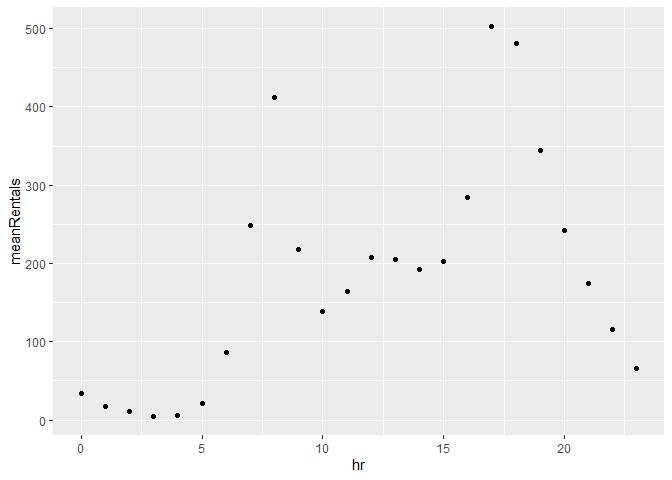
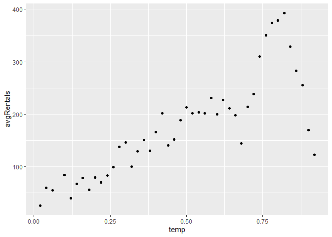
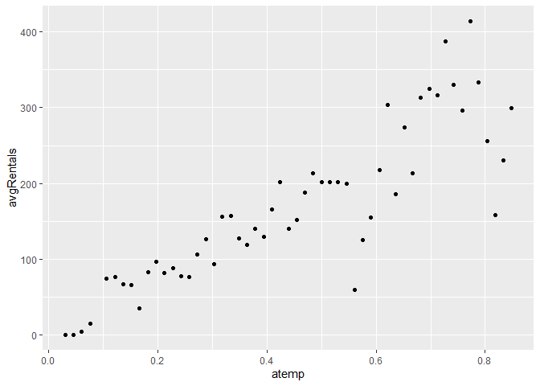
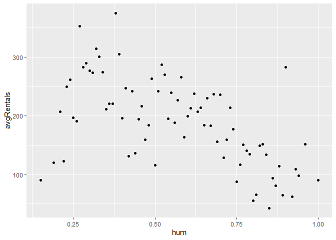
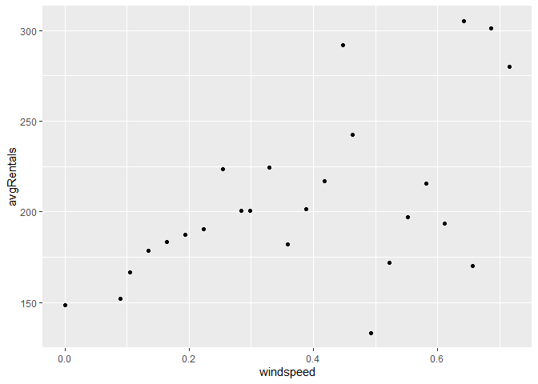

Joshua Burrows Project 2
================
16 October 2020

  - [Introduction](#introduction)
  - [Read in Data](#read-in-data)
  - [Data](#data)
      - [EDA](#eda)

# Introduction

# Read in Data

``` r
bikes <- read_csv(file = "../Bike-Sharing-Dataset/hour.csv")

bikes$season <- as.factor(bikes$season)
levels(bikes$season) <- c("winter", "spring", "summer", "fall")

bikes$yr <- bikes %>% transmute(yr = ifelse(bikes$yr == 0, 2011, 2012)) %>% unlist()

bikes$mnth <- as.factor(bikes$mnth)
levels(bikes$mnth) <- c("jan", "feb", "mar", "apr", "may", "jun", "jul", "aug", "sep", "oct", "nov", "dec")

bikes$weathersit <- as.factor(bikes$weathersit)
levels(bikes$weathersit) <- c("very good", "good", "bad", "very bad")


bikes %>% head()
```

    ## # A tibble: 6 x 17
    ##   instant dteday     season    yr mnth 
    ##     <dbl> <date>     <fct>  <dbl> <fct>
    ## 1       1 2011-01-01 winter  2011 jan  
    ## 2       2 2011-01-01 winter  2011 jan  
    ## 3       3 2011-01-01 winter  2011 jan  
    ## 4       4 2011-01-01 winter  2011 jan  
    ## 5       5 2011-01-01 winter  2011 jan  
    ## 6       6 2011-01-01 winter  2011 jan  
    ## # ... with 12 more variables: hr <dbl>,
    ## #   holiday <dbl>, weekday <dbl>,
    ## #   workingday <dbl>, weathersit <fct>,
    ## #   temp <dbl>, atemp <dbl>, hum <dbl>,
    ## #   windspeed <dbl>, casual <dbl>,
    ## #   registered <dbl>, cnt <dbl>

# Data

``` r
mon <- bikes %>% filter(weekday == 1)
mon %>% head()
```

    ## # A tibble: 6 x 17
    ##   instant dteday     season    yr mnth 
    ##     <dbl> <date>     <fct>  <dbl> <fct>
    ## 1      48 2011-01-03 winter  2011 jan  
    ## 2      49 2011-01-03 winter  2011 jan  
    ## 3      50 2011-01-03 winter  2011 jan  
    ## 4      51 2011-01-03 winter  2011 jan  
    ## 5      52 2011-01-03 winter  2011 jan  
    ## 6      53 2011-01-03 winter  2011 jan  
    ## # ... with 12 more variables: hr <dbl>,
    ## #   holiday <dbl>, weekday <dbl>,
    ## #   workingday <dbl>, weathersit <fct>,
    ## #   temp <dbl>, atemp <dbl>, hum <dbl>,
    ## #   windspeed <dbl>, casual <dbl>,
    ## #   registered <dbl>, cnt <dbl>

``` r
set.seed(123)
monIndex <- createDataPartition(mon$cnt, p = .7, list = FALSE)
```

## EDA

``` r
seasonSum <- mon %>% group_by(season) %>% summarize(min = min(cnt), Q1 = quantile(cnt, probs = c(.25), names = FALSE), median = median(cnt), mean = mean(cnt), Q3 = quantile(cnt, probs = c(.75), names = FALSE), max = max(cnt))

seasonSum %>% kable()
```

| season | min |    Q1 | median |     mean |     Q3 | max |
| :----- | --: | ----: | -----: | -------: | -----: | --: |
| winter |   1 | 19.75 |   71.5 | 104.2010 | 147.25 | 801 |
| spring |   1 | 46.00 |  157.5 | 191.3898 | 274.00 | 834 |
| summer |   1 | 56.50 |  189.0 | 234.8427 | 341.00 | 968 |
| fall   |   2 | 47.75 |  166.0 | 203.6167 | 302.00 | 922 |

``` r
yearSum <- mon %>% group_by(yr) %>% summarize(totalRentals = sum(cnt))
yearSum
```

    ## # A tibble: 2 x 2
    ##      yr totalRentals
    ##   <dbl>        <dbl>
    ## 1  2011       180221
    ## 2  2012       275282

``` r
monthSum <- mon %>% group_by(mnth) %>% summarize(min = min(cnt), Q1 = quantile(cnt, probs = c(.25), names = FALSE), median = median(cnt), mean = mean(cnt), Q3 = quantile(cnt, probs = c(.75), names = FALSE), max = max(cnt))

monthSum %>% kable()
```

| mnth | min |    Q1 | median |      mean |     Q3 | max |
| :--- | --: | ----: | -----: | --------: | -----: | --: |
| jan  |   1 | 17.75 |   61.0 |  81.64407 | 116.25 | 493 |
| feb  |   1 | 25.00 |   80.0 | 110.82447 | 154.25 | 529 |
| mar  |   1 | 30.75 |   99.5 | 150.87766 | 223.00 | 801 |
| apr  |   1 | 46.50 |  157.0 | 189.91589 | 279.50 | 729 |
| may  |   2 | 59.00 |  170.5 | 188.01389 | 270.50 | 769 |
| jun  |   1 | 45.25 |  182.5 | 228.26042 | 316.00 | 834 |
| jul  |   2 | 61.75 |  201.5 | 241.31481 | 367.00 | 872 |
| aug  |   1 | 59.75 |  192.5 | 229.93056 | 293.00 | 893 |
| sep  |   2 | 54.50 |  187.0 | 236.10995 | 342.50 | 968 |
| oct  |   2 | 51.00 |  174.0 | 213.47465 | 322.00 | 922 |
| nov  |   2 | 47.00 |  152.0 | 195.11518 | 277.50 | 663 |
| dec  |   1 | 23.25 |  113.0 | 147.09813 | 213.25 | 731 |

``` r
avgRentals <- mon %>% group_by(hr) %>% summarize(meanRentals = mean(cnt))

ggplot(avgRentals, aes(x = hr, y = meanRentals)) + geom_point()
```

<!-- -->

``` r
mon %>% group_by(holiday) %>% summarize(meanRentals = mean(cnt))
```

    ## # A tibble: 2 x 2
    ##   holiday meanRentals
    ##     <dbl>       <dbl>
    ## 1       0        187.
    ## 2       1        167.

``` r
mon %>% group_by(workingday) %>% summarize(meanRentals = mean(cnt))
```

    ## # A tibble: 2 x 2
    ##   workingday meanRentals
    ##        <dbl>       <dbl>
    ## 1          0        167.
    ## 2          1        187.

``` r
mon %>% group_by(weathersit) %>% summarize(meanRentals = mean(cnt))
```

    ## # A tibble: 4 x 2
    ##   weathersit meanRentals
    ##   <fct>            <dbl>
    ## 1 very good         192.
    ## 2 good              182.
    ## 3 bad               117.
    ## 4 very bad          164

``` r
tempAvg <- mon %>% group_by(temp) %>% summarize(avgRentals = mean(cnt))

ggplot(tempAvg, aes(x = temp, y = avgRentals)) + geom_point()
```

<!-- -->

``` r
atempAvg <- mon %>% group_by(atemp) %>% summarize(avgRentals = mean(cnt))

ggplot(atempAvg, aes(x = atemp, y = avgRentals)) + geom_point()
```

<!-- -->

``` r
humAvg <- mon %>% group_by(hum) %>% summarize(avgRentals = mean(cnt))

ggplot(humAvg, aes(x = hum, y = avgRentals)) + geom_point()
```

<!-- -->

``` r
windAvg <- mon %>% group_by(windspeed) %>% summarize(avgRentals = mean(cnt))

ggplot(windAvg, aes(x = windspeed, y = avgRentals)) + geom_point()
```

<!-- -->
