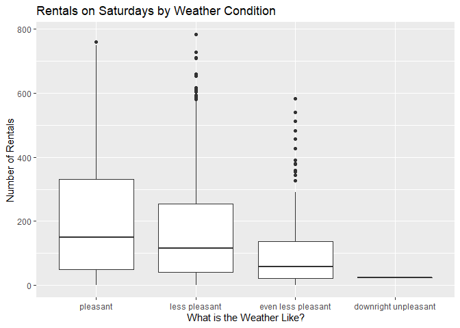

Joshua Burrows Project 2
================
16 October 2020

  - [Saturday: Introduction](#saturday-introduction)
  - [Read in Data](#read-in-data)
      - [Get Bikes Data](#get-bikes-data)
      - [Factors](#factors)
      - [Split by Day](#split-by-day)
  - [Exploratory Data Analysis](#exploratory-data-analysis)
      - [Correlations](#correlations)
      - [Summaries and Plots](#summaries-and-plots)
          - [Helper Function](#helper-function)
          - [Season](#season)
          - [Year](#year)
          - [Month](#month)
          - [Hour](#hour)
          - [Holiday](#holiday)
          - [Working Day](#working-day)
          - [Weather Condition](#weather-condition)
          - [Temperature](#temperature)
          - [Felt Temperature](#felt-temperature)
          - [Humidity](#humidity)
          - [Windspeed](#windspeed)
  - [Train Models](#train-models)
      - [Split Data](#split-data)
      - [Non-Ensemble Tree](#non-ensemble-tree)
          - [Training](#training)
          - [Model Information](#model-information)
      - [Boosted Tree](#boosted-tree)
          - [Train](#train)
          - [Model Information](#model-information-1)
  - [Test Models](#test-models)
  - [Best Model](#best-model)

# Saturday: Introduction

This document walks though the process of creating a model to predict
the number of bikes that will be rented on saturdays.

I compared two models - a *non-ensemble tree* and a *boosted tree* - and
picked the one that does better. These models use the following
predictor variables:

  - yr: year (2011 or 2012)  
  - mnth: month  
  - hr: hour of the day  
  - holiday: whether the day is a holiday  
  - weathersit: weather condition
      - pleasant: clear, few clouds, partly cloudy  
      - less pleasant: mist, mist + cloudy, mist + broken clouds, mist +
        few clouds  
      - even less pleasant: light snow, light Rain + scattered clouds,
        light rain + thunderstorm + scattered clouds  
      - downright unpleasant: snow + fog, heavy rain + ice pallets +
        thunderstorm + mist  
  - temp: normalized temperature in celsius  
  - hum: normalized humidity  
  - windspeed: normalized windspeed

You can return to the homepage for this project by clicking
[here](README.md).

# Read in Data

## Get Bikes Data

Read in data that has been downloaded from [the UCI Machine Learning
Library](https://archive.ics.uci.edu/ml/datasets/Bike+Sharing+Dataset).

``` r
bikes <- read_csv(file = "../Bike-Sharing-Dataset/hour.csv")

bikes %>% head() %>% kable()
```

| instant | dteday     | season | yr | mnth | hr | holiday | weekday | workingday | weathersit | temp |  atemp |  hum | windspeed | casual | registered | cnt |
| ------: | :--------- | -----: | -: | ---: | -: | ------: | ------: | ---------: | ---------: | ---: | -----: | ---: | --------: | -----: | ---------: | --: |
|       1 | 2011-01-01 |      1 |  0 |    1 |  0 |       0 |       6 |          0 |          1 | 0.24 | 0.2879 | 0.81 |    0.0000 |      3 |         13 |  16 |
|       2 | 2011-01-01 |      1 |  0 |    1 |  1 |       0 |       6 |          0 |          1 | 0.22 | 0.2727 | 0.80 |    0.0000 |      8 |         32 |  40 |
|       3 | 2011-01-01 |      1 |  0 |    1 |  2 |       0 |       6 |          0 |          1 | 0.22 | 0.2727 | 0.80 |    0.0000 |      5 |         27 |  32 |
|       4 | 2011-01-01 |      1 |  0 |    1 |  3 |       0 |       6 |          0 |          1 | 0.24 | 0.2879 | 0.75 |    0.0000 |      3 |         10 |  13 |
|       5 | 2011-01-01 |      1 |  0 |    1 |  4 |       0 |       6 |          0 |          1 | 0.24 | 0.2879 | 0.75 |    0.0000 |      0 |          1 |   1 |
|       6 | 2011-01-01 |      1 |  0 |    1 |  5 |       0 |       6 |          0 |          2 | 0.24 | 0.2576 | 0.75 |    0.0896 |      0 |          1 |   1 |

## Factors

Convert categorical variables to factors.

``` r
bikes$weekday <- as.factor(bikes$weekday)
levels(bikes$weekday) <- c("Sunday", "Monday", "Tuesday", "Wednesday", "Thursday", "Friday", "Saturday") 

bikes$season <- as.factor(bikes$season)
levels(bikes$season) <- c("winter", "spring", "summer", "fall")

bikes$yr <- as.factor(bikes$yr)
levels(bikes$yr) <- c("2011", "2012")

bikes$mnth <- as.factor(bikes$mnth)
levels(bikes$mnth) <- c("jan", "feb", "mar", "apr", "may", "jun", "jul", "aug", "sep", "oct", "nov", "dec")

bikes$weathersit <- as.factor(bikes$weathersit)
levels(bikes$weathersit) <- c("pleasant", "less pleasant", "even less pleasant", "downright unpleasant")

bikes$holiday <- as.factor(bikes$holiday)
levels(bikes$holiday) <- c("no", "yes")

bikes$workingday <- as.factor(bikes$workingday)
levels(bikes$workingday) <- c("no", "yes")

bikes %>% head() %>% kable()
```

| instant | dteday     | season | yr   | mnth | hr | holiday | weekday  | workingday | weathersit    | temp |  atemp |  hum | windspeed | casual | registered | cnt |
| ------: | :--------- | :----- | :--- | :--- | -: | :------ | :------- | :--------- | :------------ | ---: | -----: | ---: | --------: | -----: | ---------: | --: |
|       1 | 2011-01-01 | winter | 2011 | jan  |  0 | no      | Saturday | no         | pleasant      | 0.24 | 0.2879 | 0.81 |    0.0000 |      3 |         13 |  16 |
|       2 | 2011-01-01 | winter | 2011 | jan  |  1 | no      | Saturday | no         | pleasant      | 0.22 | 0.2727 | 0.80 |    0.0000 |      8 |         32 |  40 |
|       3 | 2011-01-01 | winter | 2011 | jan  |  2 | no      | Saturday | no         | pleasant      | 0.22 | 0.2727 | 0.80 |    0.0000 |      5 |         27 |  32 |
|       4 | 2011-01-01 | winter | 2011 | jan  |  3 | no      | Saturday | no         | pleasant      | 0.24 | 0.2879 | 0.75 |    0.0000 |      3 |         10 |  13 |
|       5 | 2011-01-01 | winter | 2011 | jan  |  4 | no      | Saturday | no         | pleasant      | 0.24 | 0.2879 | 0.75 |    0.0000 |      0 |          1 |   1 |
|       6 | 2011-01-01 | winter | 2011 | jan  |  5 | no      | Saturday | no         | less pleasant | 0.24 | 0.2576 | 0.75 |    0.0896 |      0 |          1 |   1 |

## Split by Day

Grab the data for saturday.

``` r
dayData <- bikes %>% filter(weekday == params$day)

dayData %>% head() %>% kable()
```

| instant | dteday     | season | yr   | mnth | hr | holiday | weekday  | workingday | weathersit    | temp |  atemp |  hum | windspeed | casual | registered | cnt |
| ------: | :--------- | :----- | :--- | :--- | -: | :------ | :------- | :--------- | :------------ | ---: | -----: | ---: | --------: | -----: | ---------: | --: |
|       1 | 2011-01-01 | winter | 2011 | jan  |  0 | no      | Saturday | no         | pleasant      | 0.24 | 0.2879 | 0.81 |    0.0000 |      3 |         13 |  16 |
|       2 | 2011-01-01 | winter | 2011 | jan  |  1 | no      | Saturday | no         | pleasant      | 0.22 | 0.2727 | 0.80 |    0.0000 |      8 |         32 |  40 |
|       3 | 2011-01-01 | winter | 2011 | jan  |  2 | no      | Saturday | no         | pleasant      | 0.22 | 0.2727 | 0.80 |    0.0000 |      5 |         27 |  32 |
|       4 | 2011-01-01 | winter | 2011 | jan  |  3 | no      | Saturday | no         | pleasant      | 0.24 | 0.2879 | 0.75 |    0.0000 |      3 |         10 |  13 |
|       5 | 2011-01-01 | winter | 2011 | jan  |  4 | no      | Saturday | no         | pleasant      | 0.24 | 0.2879 | 0.75 |    0.0000 |      0 |          1 |   1 |
|       6 | 2011-01-01 | winter | 2011 | jan  |  5 | no      | Saturday | no         | less pleasant | 0.24 | 0.2576 | 0.75 |    0.0896 |      0 |          1 |   1 |

# Exploratory Data Analysis

I started with a little bit of exploratory data analysis. The goal is to
look at the relationships between the predictors and number of bike
rentals.

## Correlations

Create a correlation plot for the quantitative predictors.

*atemp* represents the heat index, which is typically calculated using
temperature and humidity. So it makes sense to either eliminate *atemp*
from the model or keep *atemp* but eliminate *temp* and *hum*. I decided
to eliminate *atemp*.

``` r
corr <- dayData %>% select(temp, atemp, windspeed, hum) %>% cor()

corrplot(corr)
```

<!-- -->

## Summaries and Plots

Explore the relationship between the predictors and number of bikes
rented by creating some basic summaries and plots.

### Helper Function

Create a helper function to display basic numeric summaries for a given
grouping variable.

``` r
getSum <- function(varName, colName){ 
  
  sum <- dayData %>% group_by(dayData[[varName]]) %>% summarize(min = min(cnt), Q1 = quantile(cnt, probs = c(.25), names = FALSE), median = median(cnt), mean = mean(cnt), Q3 = quantile(cnt, probs = c(.75), names = FALSE), max = max(cnt), obs = n())
  
  output <- sum %>% kable(col.names = c(colName, "Minimum", "1st Quartile", "Median", "Mean", "3rd Quartile", "Maximum", "Number of Observations"))
  
  return(output)
  
} 
```

### Season

Explore how bike rentals on saturdays change with the seasons using a
basic numeric summary and a boxplot.

It does not make much sense to keep both *season* and *mnth* in the
model, so I decided to eliminate *season*.

``` r
getSum(varName = "season", colName = "Season")
```

| Season | Minimum | 1st Quartile | Median |     Mean | 3rd Quartile | Maximum | Number of Observations |
| :----- | ------: | -----------: | -----: | -------: | -----------: | ------: | ---------------------: |
| winter |       1 |        23.25 |   63.0 | 101.6610 |       129.75 |     690 |                    646 |
| spring |       1 |        53.75 |  167.5 | 222.2580 |       367.00 |     730 |                    624 |
| summer |       4 |        75.25 |  207.0 | 234.8816 |       367.00 |     783 |                    642 |
| fall   |       1 |        53.75 |  149.0 | 204.4183 |       314.25 |     760 |                    600 |

``` r
ggplot(dayData, aes(x = season, y = cnt)) + geom_boxplot() + labs(title = "Rentals by Season", x = "Season", y = "Number of Rentals") 
```

<!-- -->

### Year

Looking at total rentals each year gives us some idea of the long term
trend in bike rentals on saturdays. It would be helpful to have data
from more years.

``` r
yearSum <- dayData %>% group_by(yr) %>% summarize(totalRentals = sum(cnt))

yearSum %>% kable(col.names = c("Year", "Total Rentals"))
```

| Year | Total Rentals |
| :--- | ------------: |
| 2011 |        179743 |
| 2012 |        298064 |

### Month

Explore how bike rentals on saturdays change depending on the month.

As already noted, it is probably not worth including *mnth* and *season*
in the model, so *season* has been eliminated.

``` r
getSum(varName = "mnth", colName = "Month")
```

| Month | Minimum | 1st Quartile | Median |      Mean | 3rd Quartile | Maximum | Number of Observations |
| :---- | ------: | -----------: | -----: | --------: | -----------: | ------: | ---------------------: |
| jan   |       1 |        20.00 |   55.5 |  82.28505 |       100.50 |     512 |                    214 |
| feb   |       1 |        26.75 |   67.5 |  94.43750 |       137.00 |     499 |                    192 |
| mar   |       1 |        41.00 |  111.5 | 164.11574 |       223.00 |     690 |                    216 |
| apr   |       1 |        32.00 |  102.0 | 185.23611 |       291.00 |     678 |                    216 |
| may   |       2 |        66.25 |  222.0 | 249.10417 |       402.75 |     730 |                    192 |
| jun   |       5 |        86.75 |  244.0 | 264.32407 |       404.00 |     702 |                    216 |
| jul   |       5 |        71.75 |  210.0 | 218.01389 |       327.25 |     632 |                    216 |
| aug   |       4 |        64.75 |  175.5 | 224.68280 |       370.25 |     654 |                    186 |
| sep   |       5 |        79.75 |  213.5 | 266.40278 |       401.00 |     783 |                    216 |
| oct   |       1 |        46.50 |  157.5 | 226.87963 |       359.25 |     760 |                    216 |
| nov   |       2 |        46.75 |  142.0 | 178.66667 |       283.50 |     651 |                    192 |
| dec   |       1 |        29.00 |   92.5 | 133.12083 |       195.00 |     547 |                    240 |

``` r
ggplot(dayData, aes(x = mnth, y = cnt)) + geom_boxplot() + labs(title = "Retals by Month", x = "Month", y = "Number of Rentals")
```

<!-- -->

### Hour

Create a scatter plot to look at the relationship between time of day
and rentals on saturdays.

``` r
avgRentals <- dayData %>% group_by(hr) %>% summarize(meanRentals = mean(cnt))

ggplot(avgRentals, aes(x = hr, y = meanRentals)) + geom_point() + labs(title = "Total Rentals by Hour", x = "Hour of the Day", y = "Total Rentals") + geom_smooth()
```

<!-- -->

### Holiday

Explore change in bike rentals depending on whether the saturday in
question is a holiday.

``` r
getSum(varName = "holiday", colName = "Holiday")
```

| Holiday | Minimum | 1st Quartile | Median |     Mean | 3rd Quartile | Maximum | Number of Observations |
| :------ | ------: | -----------: | -----: | -------: | -----------: | ------: | ---------------------: |
| no      |       1 |           42 |    129 | 190.2098 |          300 |     783 |                   2512 |

``` r
ggplot(dayData, aes(x = holiday, y = cnt)) + geom_boxplot() + labs(title = "Rentals by Holiday", x = "Is it a Holiday?", y = "Number of Rentals")
```

<!-- -->

### Working Day

Average rentals by working day.

Working days are neither weekends nor holidays. I decided not to keep
this variable in the model because it wouldn’t make much sense in the
reports for Saturday and Sunday.

``` r
getSum(varName = "workingday", colName = "Working Day")
```

| Working Day | Minimum | 1st Quartile | Median |     Mean | 3rd Quartile | Maximum | Number of Observations |
| :---------- | ------: | -----------: | -----: | -------: | -----------: | ------: | ---------------------: |
| no          |       1 |           42 |    129 | 190.2098 |          300 |     783 |                   2512 |

``` r
ggplot(dayData, aes(x = workingday, y = cnt)) + geom_boxplot() + labs(title = "Rentals by Working Day", x = "Is it a Working Day?", y = "Number of Rentals")
```

<!-- -->

### Weather Condition

Explore how bike rentals on saturdays change depending on the weather.

``` r
getSum(varName = "weathersit", colName = "Weather Condition")
```

| Weather Condition    | Minimum | 1st Quartile | Median |     Mean | 3rd Quartile | Maximum | Number of Observations |
| :------------------- | ------: | -----------: | -----: | -------: | -----------: | ------: | ---------------------: |
| pleasant             |       1 |        49.00 |    149 | 207.5707 |       332.00 |     760 |                   1675 |
| less pleasant        |       1 |        41.00 |    116 | 171.0077 |       255.25 |     783 |                    648 |
| even less pleasant   |       1 |        20.75 |     57 | 102.6064 |       137.00 |     584 |                    188 |
| downright unpleasant |      23 |        23.00 |     23 |  23.0000 |        23.00 |      23 |                      1 |

``` r
ggplot(dayData, aes(x = weathersit, y = cnt)) + geom_boxplot() + labs(title = "Rentals by Weather Condition", x = "What is the Weather Like?", y = "Number of Rentals")
```

<!-- -->

### Temperature

Create a scatter plot to look at the relationship between temperature
and number of rentals on saturdays.

``` r
tempAvg <- dayData %>% group_by(temp) %>% summarize(avgRentals = mean(cnt))

ggplot(tempAvg, aes(x = temp, y = avgRentals)) + geom_point() + labs(title = "Average Rentals by Temperature", x = "Normalized Temperature", y = "Average Rentals") + geom_smooth()
```

<!-- -->

### Felt Temperature

Create a scatter plot to look at the relationship between felt
temperature and number of rentals on saturdays.

As already noted, it does not make much sense to keep *atemp* if *temp*
and *hum* will be in the model, so I eliminated *atemp* from the model.

``` r
atempAvg <- dayData %>% group_by(atemp) %>% summarize(avgRentals = mean(cnt))

ggplot(atempAvg, aes(x = atemp, y = avgRentals)) + geom_point() + labs(title = "Average Rentals by Temperature", x = "Normalized Feeling Temperature", y = "Average Rentals") + geom_smooth()
```

<!-- -->

### Humidity

Create a scatter plot to look at the relationship between humidity and
number of rentals on saturdays.

``` r
humAvg <- dayData %>% group_by(hum) %>% summarize(avgRentals = mean(cnt))

ggplot(humAvg, aes(x = hum, y = avgRentals)) + geom_point() + labs(title = "Average Rentals by Humidity", x = "Normalized Humidity", y = "Average Rentals") + geom_smooth()
```

<!-- -->

### Windspeed

Create a scatter plot to look at the relationship between windspeed and
number of rentals on saturdays.

``` r
windAvg <- dayData %>% group_by(windspeed) %>% summarize(avgRentals = mean(cnt))

ggplot(windAvg, aes(x = windspeed, y = avgRentals)) + geom_point() + labs(title = "Average Rentals by Windspeed", x = "Normalized Windspeed", y = "Average Rentals") + geom_smooth()
```

<!-- -->

# Train Models

After exploring the data, I created two models, a non-ensemble tree and
a boosted tree.

## Split Data

Split the data into a training set and a test set. The training set is
used to build the models, and the test set is used to evaluate them.

``` r
set.seed(123)
trainIndex <- createDataPartition(dayData$cnt, p = .75, list = FALSE)

train <- dayData[trainIndex,]
test <- dayData[-trainIndex,]
```

## Non-Ensemble Tree

### Training

Fit a non-ensemble tree model.

#### Tree Models

Tree models split each predictor space into regions and make a different
prediction for each region. For example, suppose we are interested in
predicting life expectancy based on exercise habits. We might split the
predictor space into **exercises less than one hour a week** and
**exercises at least one hour a week** and then predict that people in
the second group live longer.

How do we decide whether to split at one hour, one and a half hours, two
hours, etc? This decision is made using a method called “Recursive
Binary Splitting”, which we don’t have to worry about too much because
the *caret* package does it for us.

Ensemble tree models fit lots of trees and then average their results.
Here I have created a basic non-ensemble tree to model bicycle rentals.

#### Tuning Parameter

This model has one “tuning parameter” called *cp*. *cp* stands for
“Complexity Parameter”, and it controls the number of “nodes” that the
tree has.

The life expectancy example above has two terminal nodes: **less than
one hour** and **at least one hour**. We could complicate the example by
adding additional nodes. For instance, we could divide the group **less
than one hour** into two subgroups: **less than a half hour** and
**greater than half an hour but less than one hour**. And we could
divide **at least one hour a week** into **less than two hours** and
**greater than two hours**.

Sometimes increasing the number of nodes makes your model better, but
sometimes it makes it worse. There are lots of different methods for
picking the best number of nodes. For the bicycle rental model, I used a
method called “Leave One Out Cross Validation”.

*LOOCV* works by removing an observation from the data set, using the
rest of the data to create a model, and then seeing how well that model
does at predicting the observation that was left out. This process is
repeated for every observation, and the results are combined.

If we want to compare two different values of *cp*, we will go through
the *LOOCV* process twice and compare the results. In this way, we can
test different values of *cp* to see which one performs best.

I used the *caret* package to test 10 different values of *cp*.

#### Create the Model

``` r
set.seed(123)
tree <- train(cnt ~ yr + mnth + hr + holiday + weathersit + temp + hum + windspeed, 
              data = train, 
              method = "rpart", 
              trControl = trainControl(method = "LOOCV"), 
              tuneLength = 10)
```

### Model Information

My final non-ensemble tree model uses a *cp* of 0.0079781. Its root mean
square error on the training set is 80.1781334.

More information about this model is below.

``` r
tree
```

    ## CART 
    ## 
    ## 1885 samples
    ##    8 predictor
    ## 
    ## No pre-processing
    ## Resampling: Leave-One-Out Cross-Validation 
    ## Summary of sample sizes: 1884, 1884, 1884, 1884, 1884, 1884, ... 
    ## Resampling results across tuning parameters:
    ## 
    ##   cp           RMSE       Rsquared    
    ##   0.007978054   80.17813  0.8044506847
    ##   0.008916464   80.54285  0.8026897219
    ##   0.010115234   82.15722  0.7946488814
    ##   0.024321048   93.73519  0.7336966746
    ##   0.024592770   98.25098  0.7062826073
    ##   0.029298851  103.50359  0.6742232755
    ##   0.061831396  114.57950  0.6023116927
    ##   0.085312030  126.18490  0.5220972744
    ##   0.182196248  159.05074  0.2624332282
    ##   0.375003288  189.22133  0.0006208145
    ##   MAE      
    ##    60.52799
    ##    60.18036
    ##    61.27246
    ##    67.24425
    ##    72.97041
    ##    78.26759
    ##    85.14523
    ##    93.84836
    ##   124.13810
    ##   170.52746
    ## 
    ## RMSE was used to select the
    ##  optimal model using the
    ##  smallest value.
    ## The final value used for the model
    ##  was cp = 0.007978054.

``` r
plot(tree$finalModel)
text(tree$finalModel)
```

<!-- -->

## Boosted Tree

### Train

#### Boosted Tree Models

Boosted trees are another type of tree model. “Boosting” works by
fitting a series of trees, each of which is a modified version of the
previous tree. The idea is to hone in on the best model.

#### Tuning Paremeters

Four tuning parameters are involved:  
\- *n.trees*: number of boosting iterations  
\- *interaction.depth*: maximum tree depth  
\- *shrinkage*: how strongly each subsequent tree is influenced by the
previous tree  
\- *n.minobsinnode*: minimum terminal node size

Values for the tuning parameters are found using Cross Validation. Cross
Validation works by splitting the data into groups called “folds”. One
fold is left out, the rest are used to create a model, and then that
model is tested on the fold that was left out. This process is repeated
for each fold, and the results are combined. It should be clear that
*LOOCV* is just *CV* with the number of folds equal to the number of
observations.

I used the *caret* package to test 81 different combinations of tuning
parameters.

#### Create the Model

``` r
tuneGr <- expand.grid(n.trees = seq(from = 50, to = 150, by = 50), 
                     interaction.depth = 1:3, 
                     shrinkage = seq(from = .05, to = .15, by = .05), 
                     n.minobsinnode = 9:11)

set.seed(123)
boostTree <- train(cnt ~ yr + mnth + hr + holiday + weathersit + temp + hum + windspeed, 
                   data = train, 
                   method = "gbm", 
                   trControl = trainControl(method = "cv", number = 10),
                   tuneGrid = tuneGr, 
                   verbose = FALSE)
```

### Model Information

My final boosted tree model uses the following tuning parameters:

  - *n.trees*: 150  
  - *interaction.depth*: 3  
  - *shrinkage*: 0.15  
  - *n.minobsinnode*: 9

Its root mean square error on the training set is 47.7326038.

More information about this model is below.

``` r
boostTree
```

    ## Stochastic Gradient Boosting 
    ## 
    ## 1885 samples
    ##    8 predictor
    ## 
    ## No pre-processing
    ## Resampling: Cross-Validated (10 fold) 
    ## Summary of sample sizes: 1696, 1696, 1697, 1697, 1697, 1697, ... 
    ## Resampling results across tuning parameters:
    ## 
    ##   shrinkage  interaction.depth
    ##   0.05       1                
    ##   0.05       1                
    ##   0.05       1                
    ##   0.05       1                
    ##   0.05       1                
    ##   0.05       1                
    ##   0.05       1                
    ##   0.05       1                
    ##   0.05       1                
    ##   0.05       2                
    ##   0.05       2                
    ##   0.05       2                
    ##   0.05       2                
    ##   0.05       2                
    ##   0.05       2                
    ##   0.05       2                
    ##   0.05       2                
    ##   0.05       2                
    ##   0.05       3                
    ##   0.05       3                
    ##   0.05       3                
    ##   0.05       3                
    ##   0.05       3                
    ##   0.05       3                
    ##   0.05       3                
    ##   0.05       3                
    ##   0.05       3                
    ##   0.10       1                
    ##   0.10       1                
    ##   0.10       1                
    ##   0.10       1                
    ##   0.10       1                
    ##   0.10       1                
    ##   0.10       1                
    ##   0.10       1                
    ##   0.10       1                
    ##   0.10       2                
    ##   0.10       2                
    ##   0.10       2                
    ##   0.10       2                
    ##   0.10       2                
    ##   0.10       2                
    ##   0.10       2                
    ##   0.10       2                
    ##   0.10       2                
    ##   0.10       3                
    ##   0.10       3                
    ##   0.10       3                
    ##   0.10       3                
    ##   0.10       3                
    ##   0.10       3                
    ##   0.10       3                
    ##   0.10       3                
    ##   0.10       3                
    ##   0.15       1                
    ##   0.15       1                
    ##   0.15       1                
    ##   0.15       1                
    ##   0.15       1                
    ##   0.15       1                
    ##   0.15       1                
    ##   0.15       1                
    ##   0.15       1                
    ##   0.15       2                
    ##   0.15       2                
    ##   0.15       2                
    ##   0.15       2                
    ##   0.15       2                
    ##   0.15       2                
    ##   0.15       2                
    ##   0.15       2                
    ##   0.15       2                
    ##   0.15       3                
    ##   0.15       3                
    ##   0.15       3                
    ##   0.15       3                
    ##   0.15       3                
    ##   0.15       3                
    ##   0.15       3                
    ##   0.15       3                
    ##   0.15       3                
    ##   n.minobsinnode  n.trees  RMSE     
    ##    9               50      123.12012
    ##    9              100      104.05253
    ##    9              150       94.99042
    ##   10               50      123.03438
    ##   10              100      104.00991
    ##   10              150       94.82828
    ##   11               50      122.97375
    ##   11              100      103.98765
    ##   11              150       94.86271
    ##    9               50       91.54787
    ##    9              100       74.27491
    ##    9              150       67.30845
    ##   10               50       91.75531
    ##   10              100       74.65787
    ##   10              150       67.60221
    ##   11               50       91.62059
    ##   11              100       74.04471
    ##   11              150       67.15058
    ##    9               50       76.25361
    ##    9              100       60.38570
    ##    9              150       54.45916
    ##   10               50       76.23252
    ##   10              100       60.51039
    ##   10              150       54.55017
    ##   11               50       76.20624
    ##   11              100       60.41135
    ##   11              150       54.21944
    ##    9               50      103.66706
    ##    9              100       89.62970
    ##    9              150       84.02227
    ##   10               50      103.79859
    ##   10              100       89.66813
    ##   10              150       84.13727
    ##   11               50      103.38090
    ##   11              100       89.40919
    ##   11              150       83.96444
    ##    9               50       74.26818
    ##    9              100       63.58426
    ##    9              150       59.52621
    ##   10               50       74.21062
    ##   10              100       63.63781
    ##   10              150       59.66368
    ##   11               50       74.25545
    ##   11              100       63.61384
    ##   11              150       59.45951
    ##    9               50       60.18499
    ##    9              100       51.58472
    ##    9              150       49.14567
    ##   10               50       59.79659
    ##   10              100       51.12918
    ##   10              150       48.85106
    ##   11               50       60.43891
    ##   11              100       51.94305
    ##   11              150       49.23257
    ##    9               50       94.35999
    ##    9              100       83.63257
    ##    9              150       80.01783
    ##   10               50       94.15835
    ##   10              100       83.67117
    ##   10              150       80.04730
    ##   11               50       94.82674
    ##   11              100       84.20451
    ##   11              150       80.38641
    ##    9               50       67.50890
    ##    9              100       59.72893
    ##    9              150       56.75412
    ##   10               50       67.23473
    ##   10              100       59.39153
    ##   10              150       56.55062
    ##   11               50       67.50823
    ##   11              100       59.64703
    ##   11              150       56.37607
    ##    9               50       54.79420
    ##    9              100       49.67910
    ##    9              150       47.73260
    ##   10               50       54.61497
    ##   10              100       49.45234
    ##   10              150       47.83535
    ##   11               50       54.56661
    ##   11              100       49.55289
    ##   11              150       47.79126
    ##   Rsquared   MAE     
    ##   0.6367027  92.86539
    ##   0.7251143  77.37777
    ##   0.7547727  71.54990
    ##   0.6398445  92.93579
    ##   0.7239962  77.51631
    ##   0.7546054  71.66075
    ##   0.6402636  92.90974
    ##   0.7237482  77.48022
    ##   0.7543330  71.75602
    ##   0.8015244  68.20803
    ##   0.8496474  54.31523
    ##   0.8713203  49.95201
    ##   0.7990605  68.39102
    ##   0.8480506  54.74589
    ##   0.8705876  50.25780
    ##   0.8019810  68.31518
    ##   0.8506125  54.33775
    ##   0.8718590  50.06067
    ##   0.8576130  57.58529
    ##   0.8962297  44.83106
    ##   0.9129608  39.76241
    ##   0.8576769  57.64119
    ##   0.8958064  44.92572
    ##   0.9122862  39.86703
    ##   0.8580543  57.64133
    ##   0.8964072  44.73520
    ##   0.9136599  39.56572
    ##   0.7245601  77.46458
    ##   0.7730096  68.31039
    ##   0.7929542  64.62015
    ##   0.7233594  77.52496
    ##   0.7726972  68.42094
    ##   0.7927016  64.85086
    ##   0.7242399  77.21195
    ##   0.7739350  68.00658
    ##   0.7940852  64.56579
    ##   0.8488273  54.51733
    ##   0.8824461  47.49298
    ##   0.8946800  44.69436
    ##   0.8488148  54.46196
    ##   0.8820608  47.74854
    ##   0.8940121  44.97988
    ##   0.8485016  54.60322
    ##   0.8821343  47.75292
    ##   0.8948860  44.78401
    ##   0.8962376  44.71010
    ##   0.9199406  37.69030
    ##   0.9265739  35.49823
    ##   0.8973059  44.40979
    ##   0.9212075  37.35664
    ##   0.9272442  35.39065
    ##   0.8950542  44.69163
    ##   0.9188514  37.80684
    ##   0.9260180  35.42475
    ##   0.7549032  71.38032
    ##   0.7948879  64.54536
    ##   0.8090744  61.94954
    ##   0.7569011  71.54412
    ##   0.7949994  64.65816
    ##   0.8088514  62.23080
    ##   0.7532483  71.60581
    ##   0.7921131  65.09198
    ##   0.8071789  62.45837
    ##   0.8697252  50.19886
    ##   0.8939687  44.82322
    ##   0.9032464  42.41838
    ##   0.8700833  50.26231
    ##   0.8946485  44.68528
    ##   0.9035867  42.32514
    ##   0.8696486  50.56082
    ##   0.8938564  45.39130
    ##   0.9043604  42.48159
    ##   0.9106677  40.24473
    ##   0.9247495  36.11314
    ##   0.9302175  34.48578
    ##   0.9112001  40.05680
    ##   0.9253391  36.07246
    ##   0.9299497  34.56125
    ##   0.9116703  39.92332
    ##   0.9251580  35.91265
    ##   0.9300708  34.31748
    ## 
    ## RMSE was used to select the
    ##  optimal model using the
    ##  smallest value.
    ## The final values used for the
    ##  shrinkage = 0.15 and n.minobsinnode
    ##  = 9.

# Test Models

Test the models on the test set. Select the model that performs better.

Performance is measured using Root Mean Square Error, which is a measure
of how close the model gets to correctly predicting the test data. The
RMSE for each model is displayed below.

``` r
treePreds <- predict(tree, test)
treeRMSE <- postResample(treePreds, test$cnt)[1]

boostPreds <- predict(boostTree, test)
boostRMSE <- postResample(boostPreds, test$cnt)[1]

modelPerformance <- data.frame(model = c("Non-Ensemble Tree", "Boosted Tree"), RMSE = c(treeRMSE, boostRMSE))

modelPerformance %>% kable(col.names = c("Model", "Test RMSE"))
```

| Model             | Test RMSE |
| :---------------- | --------: |
| Non-Ensemble Tree |  76.79965 |
| Boosted Tree      |  45.33721 |

# Best Model

``` r
best <- modelPerformance %>% filter(RMSE == min(RMSE))
worst <- modelPerformance %>% filter(RMSE == max(RMSE))
```

The boosted tree performs better than the non-ensemble tree.

The boosted tree model is saved to the `final` object below.

``` r
if(best$model == "Non-Ensemble Tree"){
  final <- tree
} else if(best$model == "Boosted Tree"){
  final <- boostTree
} else{
  stop("Error")
}

final$finalModel
```

    ## A gradient boosted model with gaussian loss function.
    ## 150 iterations were performed.
    ## There were 20 predictors of which 17 had non-zero influence.
