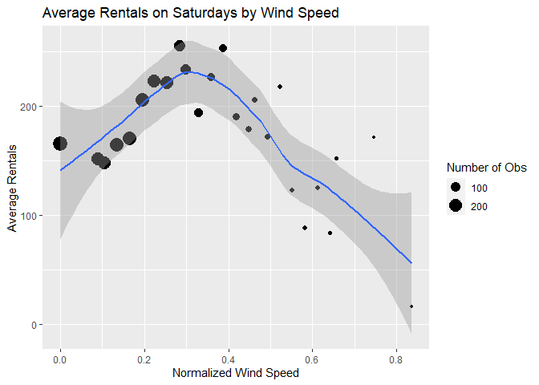
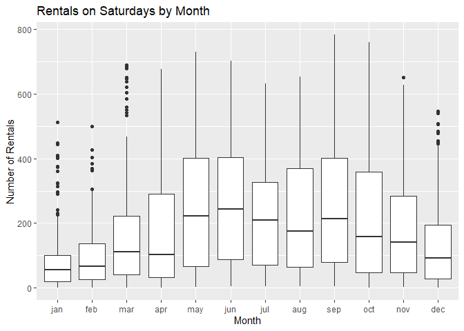

Joshua Burrows Project 2
================
16 October 2020

  - [Bike Rentals on Saturdays:
    Introduction](#bike-rentals-on-saturdays-introduction)
  - [Read in Data](#read-in-data)
      - [Get Bikes Data](#get-bikes-data)
      - [Factors](#factors)
      - [Filter by Day](#filter-by-day)
  - [Exploratory Data Analysis](#exploratory-data-analysis)
      - [Quantitative Predictors](#quantitative-predictors)
          - [Correlations](#correlations)
          - [Hour](#hour)
          - [Temperature](#temperature)
          - [Felt Temperature](#felt-temperature)
          - [Humidity](#humidity)
          - [Wind Speed](#wind-speed)
      - [Categorical Predictors](#categorical-predictors)
          - [Helper Function](#helper-function)
          - [Season](#season)
          - [Year](#year)
          - [Month](#month)
          - [Holiday](#holiday)
          - [Working Day](#working-day)
          - [Weather Condition](#weather-condition)
  - [Train Models](#train-models)
      - [Split Data](#split-data)
      - [Non-Ensemble Tree](#non-ensemble-tree)
          - [Training](#training)
              - [Tree Models](#tree-models)
              - [Tuning Parameter](#tuning-parameter)
              - [Formula](#formula)
              - [Create the Model](#create-the-model)
          - [Model Information](#model-information)
      - [Boosted Tree](#boosted-tree)
          - [Training](#training-1)
              - [Boosted Tree Models](#boosted-tree-models)
              - [Tuning Paremeters](#tuning-paremeters)
              - [Create the Model](#create-the-model-1)
          - [Model Information](#model-information-1)
      - [Multiple Linear Regression](#multiple-linear-regression)
          - [Training](#training-2)
              - [Create the Model](#create-the-model-2)
  - [Test Models](#test-models)
  - [Best Model](#best-model)

# Bike Rentals on Saturdays: Introduction

This document walks though the process of creating a model to predict
hourly bike rentals on Saturdays. I compared two models - a
*non-ensemble tree* and a *boosted tree* - and picked the one that does
better.

The data comes from the Capital bike sharing system, and it is available
[here](https://archive.ics.uci.edu/ml/datasets/Bike+Sharing+Dataset).
This data includes an hourly count of bike rentals for 2011 and 2012 as
well as information about the weather and the time of year.

My models use the following predictor variables:

  - *yr*: year (2011 or 2012)  
  - *mnth*: month  
  - *hr*: hour of the day  
  - *holiday*: whether the day is a holiday  
  - *weathersit*: weather condition
      - pleasant: clear, few clouds, partly cloudy  
      - less pleasant: mist, mist + cloudy, mist + broken clouds, mist +
        few clouds  
      - even less pleasant: light snow, light rain + scattered clouds,
        light rain + thunderstorm + scattered clouds  
      - downright unpleasant: snow + fog, heavy rain + ice pallets +
        thunderstorm + mist  
  - *temp*: normalized temperature in celsius  
  - *hum*: normalized humidity  
  - *windspeed*: normalized wind speed

You can return to the homepage for this project by clicking
[here](https://jkburrows.github.io/ST558-Project-2/). The github repo
for this project is
[here](https://github.com/JKBurrows/ST558-Project-2).

# Read in Data

## Get Bikes Data

Read in data.

``` r
bikes <- read_csv(file = "hour.csv")

bikes %>% head() %>% kable()
```

| instant | dteday     | season | yr | mnth | hr | holiday | weekday | workingday | weathersit | temp |  atemp |  hum | windspeed | casual | registered | cnt |
| ------: | :--------- | -----: | -: | ---: | -: | ------: | ------: | ---------: | ---------: | ---: | -----: | ---: | --------: | -----: | ---------: | --: |
|       1 | 2011-01-01 |      1 |  0 |    1 |  0 |       0 |       6 |          0 |          1 | 0.24 | 0.2879 | 0.81 |    0.0000 |      3 |         13 |  16 |
|       2 | 2011-01-01 |      1 |  0 |    1 |  1 |       0 |       6 |          0 |          1 | 0.22 | 0.2727 | 0.80 |    0.0000 |      8 |         32 |  40 |
|       3 | 2011-01-01 |      1 |  0 |    1 |  2 |       0 |       6 |          0 |          1 | 0.22 | 0.2727 | 0.80 |    0.0000 |      5 |         27 |  32 |
|       4 | 2011-01-01 |      1 |  0 |    1 |  3 |       0 |       6 |          0 |          1 | 0.24 | 0.2879 | 0.75 |    0.0000 |      3 |         10 |  13 |
|       5 | 2011-01-01 |      1 |  0 |    1 |  4 |       0 |       6 |          0 |          1 | 0.24 | 0.2879 | 0.75 |    0.0000 |      0 |          1 |   1 |
|       6 | 2011-01-01 |      1 |  0 |    1 |  5 |       0 |       6 |          0 |          2 | 0.24 | 0.2576 | 0.75 |    0.0896 |      0 |          1 |   1 |

## Factors

Convert categorical variables to factors.

``` r
bikes$weekday <- as.factor(bikes$weekday)
levels(bikes$weekday) <- c("Sunday", "Monday", "Tuesday", "Wednesday", "Thursday", "Friday", "Saturday") 

bikes$season <- as.factor(bikes$season)
levels(bikes$season) <- c("winter", "spring", "summer", "fall")

bikes$yr <- as.factor(bikes$yr)
levels(bikes$yr) <- c("2011", "2012")

bikes$mnth <- as.factor(bikes$mnth)
levels(bikes$mnth) <- c("jan", "feb", "mar", "apr", "may", "jun", "jul", "aug", "sep", "oct", "nov", "dec")

bikes$weathersit <- as.factor(bikes$weathersit)
levels(bikes$weathersit) <- c("pleasant", "less pleasant", "even less pleasant", "downright unpleasant")

bikes$holiday <- as.factor(bikes$holiday)
levels(bikes$holiday) <- c("no", "yes")

bikes$workingday <- as.factor(bikes$workingday)
levels(bikes$workingday) <- c("no", "yes")

bikes %>% head() %>% kable()
```

| instant | dteday     | season | yr   | mnth | hr | holiday | weekday  | workingday | weathersit    | temp |  atemp |  hum | windspeed | casual | registered | cnt |
| ------: | :--------- | :----- | :--- | :--- | -: | :------ | :------- | :--------- | :------------ | ---: | -----: | ---: | --------: | -----: | ---------: | --: |
|       1 | 2011-01-01 | winter | 2011 | jan  |  0 | no      | Saturday | no         | pleasant      | 0.24 | 0.2879 | 0.81 |    0.0000 |      3 |         13 |  16 |
|       2 | 2011-01-01 | winter | 2011 | jan  |  1 | no      | Saturday | no         | pleasant      | 0.22 | 0.2727 | 0.80 |    0.0000 |      8 |         32 |  40 |
|       3 | 2011-01-01 | winter | 2011 | jan  |  2 | no      | Saturday | no         | pleasant      | 0.22 | 0.2727 | 0.80 |    0.0000 |      5 |         27 |  32 |
|       4 | 2011-01-01 | winter | 2011 | jan  |  3 | no      | Saturday | no         | pleasant      | 0.24 | 0.2879 | 0.75 |    0.0000 |      3 |         10 |  13 |
|       5 | 2011-01-01 | winter | 2011 | jan  |  4 | no      | Saturday | no         | pleasant      | 0.24 | 0.2879 | 0.75 |    0.0000 |      0 |          1 |   1 |
|       6 | 2011-01-01 | winter | 2011 | jan  |  5 | no      | Saturday | no         | less pleasant | 0.24 | 0.2576 | 0.75 |    0.0896 |      0 |          1 |   1 |

## Filter by Day

Grab the data for Saturday.

``` r
dayData <- bikes %>% filter(weekday == params$day)

dayData %>% head() %>% kable()
```

| instant | dteday     | season | yr   | mnth | hr | holiday | weekday  | workingday | weathersit    | temp |  atemp |  hum | windspeed | casual | registered | cnt |
| ------: | :--------- | :----- | :--- | :--- | -: | :------ | :------- | :--------- | :------------ | ---: | -----: | ---: | --------: | -----: | ---------: | --: |
|       1 | 2011-01-01 | winter | 2011 | jan  |  0 | no      | Saturday | no         | pleasant      | 0.24 | 0.2879 | 0.81 |    0.0000 |      3 |         13 |  16 |
|       2 | 2011-01-01 | winter | 2011 | jan  |  1 | no      | Saturday | no         | pleasant      | 0.22 | 0.2727 | 0.80 |    0.0000 |      8 |         32 |  40 |
|       3 | 2011-01-01 | winter | 2011 | jan  |  2 | no      | Saturday | no         | pleasant      | 0.22 | 0.2727 | 0.80 |    0.0000 |      5 |         27 |  32 |
|       4 | 2011-01-01 | winter | 2011 | jan  |  3 | no      | Saturday | no         | pleasant      | 0.24 | 0.2879 | 0.75 |    0.0000 |      3 |         10 |  13 |
|       5 | 2011-01-01 | winter | 2011 | jan  |  4 | no      | Saturday | no         | pleasant      | 0.24 | 0.2879 | 0.75 |    0.0000 |      0 |          1 |   1 |
|       6 | 2011-01-01 | winter | 2011 | jan  |  5 | no      | Saturday | no         | less pleasant | 0.24 | 0.2576 | 0.75 |    0.0896 |      0 |          1 |   1 |

# Exploratory Data Analysis

I started with a little bit of exploratory data analysis. The goal is to
look at the relationships between the predictors and number of bike
rentals.

## Quantitative Predictors

### Correlations

Visualize the strength of the relationships between the quantitative
predictors.

Unsurprisingly, *atemp* and *temp* are strongly correlated. *atemp*
represents the heat index, which is typically calculated using
temperature and humidity. So it makes sense to either eliminate *atemp*
from the model or keep *atemp* but eliminate *temp* and *hum*. I decided
to eliminate *atemp*.

``` r
corr <- dayData %>% 
  select(temp, atemp, windspeed, hum) %>% 
  cor()

corrplot(corr)
```

<!-- -->

### Hour

Create a scatter plot to investigate the relationship between time of
day and rentals on Saturdays. Fit a line through the points to get a
basic idea of how number or rentals changes with the time of day.

``` r
avgRentals <- dayData %>% 
  group_by(hr) %>% 
  summarize(meanRentals = mean(cnt))

corrHour <- cor(avgRentals$hr, avgRentals$meanRentals)

ggplot(avgRentals, aes(x = hr, y = meanRentals)) +
  geom_point() + 
  labs(title = paste0("Total Rentals on ", paste0(params$day, "s"), " by Hour"), 
       x = "Hour of the Day", 
       y = "Total Rentals") + 
  geom_smooth()
```

<!-- -->

The correlation between hour and average rentals is 0.5228067.

Be careful, correlation measures straight line relationships, so if the
plot above shows a curved relationship, correlation may not be a useful
measure.

### Temperature

Create a scatter plot to investigate the relationship between
temperature and average rentals on Saturdays. Fit a line through the
points to get a basic idea of average rentals changes with temperature.

The size of the dots represents the number of observations at each
temperature.

``` r
tempAvg <- dayData %>% 
  group_by(temp) %>% 
  summarize(avgRentals = mean(cnt), n = n())

corrTemp <- cor(tempAvg$temp, tempAvg$avgRentals)

ggplot(tempAvg, aes(x = temp, y = avgRentals)) + 
  geom_point(aes(size = n)) + 
  geom_smooth() + 
  labs(title = paste0("Average Rentals on ", paste0(params$day, "s"), " by Temperature"), 
       x = "Normalized Temperature", 
       y = "Average Rentals") + 
  scale_size_continuous(name = "Number of Obs")
```

<!-- -->

The correlation between temperature and average rentals is 0.9251964.

Be careful, correlation measures straight line relationships, so if the
plot above shows a curved relationship, correlation may not be a useful
measure.

### Felt Temperature

Create a scatter plot to investigate the relationship between felt
temperature and average rentals on Saturdays. Fit a line through the
points to get a basic idea of how average rentals changes with felt
temperature.

The size of the dots represents the number of observations at each felt
temperature.

As already noted, it does not make much sense to keep *atemp* if *temp*
and *hum* will be in the model, so I eliminated *atemp* from the model.

``` r
atempAvg <- dayData %>% 
  group_by(atemp) %>% 
  summarize(avgRentals = mean(cnt), n = n())

corrATemp <- cor(atempAvg$atemp, atempAvg$avgRentals)

ggplot(atempAvg, aes(x = atemp, y = avgRentals)) +
  geom_point(aes(size = n)) + 
  geom_smooth() + 
  labs(title = paste0("Average Rentals on ", paste0(params$day, "s"), " by Felt Temperature"), 
       x = "Normalized Feeling Temperature", 
       y = "Average Rentals") + 
  scale_size_continuous(name = "Number of Obs")
```

<!-- -->

The correlation between felt temperature and average rentals is
0.894597.

Be careful, correlation measures straight line relationships, so if the
plot above shows a curved relationship, correlation may not be a useful
measure.

### Humidity

Create a scatter plot to investigate the relationship between humidity
and average rentals on Saturdays. Fit a line through the points to get a
basic idea of how average rentals changes with humidity.

The size of the dots represents the number of observations at each
humidity level.

``` r
humAvg <- dayData %>% 
  group_by(hum) %>% 
  summarize(avgRentals = mean(cnt), n = n())

corrHum <- cor(humAvg$hum, humAvg$avgRentals)

ggplot(humAvg, aes(x = hum, y = avgRentals)) + 
  geom_point(aes(size = n)) + 
  geom_smooth() + 
  labs(title = paste0("Average Rentals on ", paste0(params$day, "s"), " by Humidity"), 
       x = "Normalized Humidity", 
       y = "Average Rentals") + 
  scale_size_continuous(name = "Number of Obs")
```

<!-- -->

The correlation between humidity and average rentals is -0.535821.

Be careful, correlation measures straight line relationships, so if the
plot above shows a curved relationship, correlation may not be a useful
measure.

### Wind Speed

Create a scatter plot to investigate the relationship between wind speed
and average rentals on Saturdays. Fit a line through the points to get a
basic idea of how average rentals changes with wind speed.

The size of the dots represents the number of observations at each wind
speed.

``` r
windAvg <- dayData %>% 
  group_by(windspeed) %>% 
  summarize(avgRentals = mean(cnt), n = n())

corrWind <- cor(windAvg$windspeed, windAvg$avgRentals)

ggplot(windAvg, aes(x = windspeed, y = avgRentals)) + 
  geom_point(aes(size = n)) + 
  geom_smooth() + 
  labs(title = paste0("Average Rentals on ", paste0(params$day, "s"), " by Wind Speed"), 
       x = "Normalized Wind Speed", 
       y = "Average Rentals") + 
  scale_size_continuous(name = "Number of Obs")
```

<!-- -->

The correlation between wind speed and average rentals is -0.48637.

Be careful, correlation measures straight line relationships, so if the
plot above shows a curved relationship, correlation may not be a useful
measure.

## Categorical Predictors

### Helper Function

Create a helper function to display basic numeric summaries for a given
grouping variable.

``` r
getSum <- function(varName, colName){ 
  
  sum <- dayData %>% 
    group_by(dayData[[varName]]) %>% 
    summarize(min = min(cnt), 
              Q1 = quantile(cnt, probs = c(.25), names = FALSE), 
              median = median(cnt), 
              mean = mean(cnt), 
              Q3 = quantile(cnt, probs = c(.75), names = FALSE), 
              max = max(cnt), 
              obs = n())
  
  output <- sum %>% 
    kable(col.names = c(colName, 
                        "Minimum", 
                        "1st Quartile", 
                        "Median", 
                        "Mean", 
                        "3rd Quartile", 
                        "Maximum", 
                        "Number of Observations"))
  
  return(output)
  
} 
```

### Season

Explore how bike rentals on Saturdays change with the seasons using a
basic numeric summary and a boxplot. The numeric summary gives you an
idea of center and spread. So does the boxplot, but it is better for
identifying outliers.

It does not make much sense to keep both *season* and *mnth* in the
model, so I decided to eliminate *season*.

``` r
getSum(varName = "season", colName = "Season")
```

| Season | Minimum | 1st Quartile | Median |     Mean | 3rd Quartile | Maximum | Number of Observations |
| :----- | ------: | -----------: | -----: | -------: | -----------: | ------: | ---------------------: |
| winter |       1 |        23.25 |   63.0 | 101.6610 |       129.75 |     690 |                    646 |
| spring |       1 |        53.75 |  167.5 | 222.2580 |       367.00 |     730 |                    624 |
| summer |       4 |        75.25 |  207.0 | 234.8816 |       367.00 |     783 |                    642 |
| fall   |       1 |        53.75 |  149.0 | 204.4183 |       314.25 |     760 |                    600 |

``` r
ggplot(dayData, aes(x = season, y = cnt)) + 
  geom_boxplot() + 
  labs(title = paste0("Rentals on ", paste0(params$day, "s"), " by Season"), 
       x = "Season", 
       y = "Number of Rentals") 
```

<!-- -->

### Year

Looking at total rentals each year gives us some idea of the long term
trend in bike rentals on Saturdays. It would be helpful to have data
from more years, though.

``` r
yearSum <- dayData %>% 
  group_by(yr) %>% 
  summarize(totalRentals = sum(cnt))

yearSum %>% kable(col.names = c("Year", "Total Rentals"))
```

| Year | Total Rentals |
| :--- | ------------: |
| 2011 |        179743 |
| 2012 |        298064 |

### Month

Explore how bike rentals on Saturdays change depending on the month
using a basic numeric summary and a boxplot. The numeric summary gives
you an idea of center and spread. So does the boxplot, but it is better
for identifying outliers.

As already noted, it is probably not worth including *mnth* and *season*
in the model, so *season* has been eliminated.

``` r
getSum(varName = "mnth", colName = "Month")
```

| Month | Minimum | 1st Quartile | Median |      Mean | 3rd Quartile | Maximum | Number of Observations |
| :---- | ------: | -----------: | -----: | --------: | -----------: | ------: | ---------------------: |
| jan   |       1 |        20.00 |   55.5 |  82.28505 |       100.50 |     512 |                    214 |
| feb   |       1 |        26.75 |   67.5 |  94.43750 |       137.00 |     499 |                    192 |
| mar   |       1 |        41.00 |  111.5 | 164.11574 |       223.00 |     690 |                    216 |
| apr   |       1 |        32.00 |  102.0 | 185.23611 |       291.00 |     678 |                    216 |
| may   |       2 |        66.25 |  222.0 | 249.10417 |       402.75 |     730 |                    192 |
| jun   |       5 |        86.75 |  244.0 | 264.32407 |       404.00 |     702 |                    216 |
| jul   |       5 |        71.75 |  210.0 | 218.01389 |       327.25 |     632 |                    216 |
| aug   |       4 |        64.75 |  175.5 | 224.68280 |       370.25 |     654 |                    186 |
| sep   |       5 |        79.75 |  213.5 | 266.40278 |       401.00 |     783 |                    216 |
| oct   |       1 |        46.50 |  157.5 | 226.87963 |       359.25 |     760 |                    216 |
| nov   |       2 |        46.75 |  142.0 | 178.66667 |       283.50 |     651 |                    192 |
| dec   |       1 |        29.00 |   92.5 | 133.12083 |       195.00 |     547 |                    240 |

``` r
ggplot(dayData, aes(x = mnth, y = cnt)) + 
  geom_boxplot() + 
  labs(title = paste0("Rentals on ", paste0(params$day, "s"), " by Month"), 
       x = "Month", 
       y = "Number of Rentals")
```

<!-- -->

### Holiday

Explore how bike rentals change depending on whether the Saturday in
question is a holiday using a basic numeric summary and a boxplot. The
numeric summary gives you an idea of center and spread. So does the
boxplot, but it is better for identifying outliers.

Note: There are no holidays on Saturday or Sunday because the holiday
data has been extracted from the [Washington D.C. HR department’s
holiday schedule](https://dchr.dc.gov/page/holiday-schedules), which
only lists holidays that fall during the work week. Accordingly, I have
left the *holiday* variable out of the models for Saturday and Sunday.

``` r
getSum(varName = "holiday", colName = "Holiday")
```

| Holiday | Minimum | 1st Quartile | Median |     Mean | 3rd Quartile | Maximum | Number of Observations |
| :------ | ------: | -----------: | -----: | -------: | -----------: | ------: | ---------------------: |
| no      |       1 |           42 |    129 | 190.2098 |          300 |     783 |                   2512 |

``` r
ggplot(dayData, aes(x = holiday, y = cnt)) + 
  geom_boxplot() + 
  labs(title = paste0("Rentals on ", paste0(params$day, "s"), " by Holiday"), 
       x = "Is it a Holiday?", 
       y = "Number of Rentals")
```

<!-- -->

### Working Day

Explore how bike rentals change depending on whether the day in question
is a working day using a basic numeric summary and a boxplot. The
numeric summary gives you an idea of center and spread. So does the
boxplot, but it is better for identifying outliers.

Working days are neither weekends nor holidays. I decided not to keep
this variable in the model because it wouldn’t make much sense in the
reports for Saturday and Sunday.

``` r
getSum(varName = "workingday", colName = "Working Day")
```

| Working Day | Minimum | 1st Quartile | Median |     Mean | 3rd Quartile | Maximum | Number of Observations |
| :---------- | ------: | -----------: | -----: | -------: | -----------: | ------: | ---------------------: |
| no          |       1 |           42 |    129 | 190.2098 |          300 |     783 |                   2512 |

``` r
ggplot(dayData, aes(x = workingday, y = cnt)) +
  geom_boxplot() + 
  labs(title = paste0("Rentals on ", paste0(params$day, "s"), " by Working Day"), 
       x = "Is it a Working Day?", 
       y = "Number of Rentals")
```

<!-- -->

### Weather Condition

Explore how bike rentals on Saturdays change depending on the weather
using a basic numeric summary and a boxplot. The numeric summary gives
you an idea of center and spread. So does the boxplot, but it is better
for identifying outliers.

``` r
getSum(varName = "weathersit", colName = "Weather Condition")
```

| Weather Condition    | Minimum | 1st Quartile | Median |     Mean | 3rd Quartile | Maximum | Number of Observations |
| :------------------- | ------: | -----------: | -----: | -------: | -----------: | ------: | ---------------------: |
| pleasant             |       1 |        49.00 |    149 | 207.5707 |       332.00 |     760 |                   1675 |
| less pleasant        |       1 |        41.00 |    116 | 171.0077 |       255.25 |     783 |                    648 |
| even less pleasant   |       1 |        20.75 |     57 | 102.6064 |       137.00 |     584 |                    188 |
| downright unpleasant |      23 |        23.00 |     23 |  23.0000 |        23.00 |      23 |                      1 |

``` r
ggplot(dayData, aes(x = weathersit, y = cnt)) +
  geom_boxplot() + 
  labs(title = paste0("Rentals on ", paste0(params$day, "s"), " by Weather Condition"), 
       x = "What is the Weather Like?", 
       y = "Number of Rentals")
```

<!-- -->

# Train Models

After exploring the data, I created two models, a non-ensemble tree and
a boosted tree.

## Split Data

Split the data into a training set and a test set. The training set is
used to build the models, and the test set is used to evaluate them.

``` r
set.seed(123)
trainIndex <- createDataPartition(dayData$cnt, p = .7, list = FALSE)

train <- dayData[trainIndex,]
test <- dayData[-trainIndex,]
```

## Non-Ensemble Tree

### Training

Fit a non-ensemble tree model.

#### Tree Models

Tree models split each predictor space into regions and make a different
prediction for each region. For example, suppose we are interested in
predicting life expectancy based on exercise habits. We might split the
predictor space into **exercises less than one hour a week** and
**exercises at least one hour a week** and then predict that people in
the second group live longer.

How do we decide whether to split at one hour, one and a half hours, two
hours, etc? This decision is made using a method called “Recursive
Binary Splitting”, which we don’t have to worry about too much because
the *caret* package does it for us.

Ensemble tree models fit lots of trees and then average their results.
Here I have created a basic non-ensemble tree to model bicycle rentals.

#### Tuning Parameter

This model has one “tuning parameter” called *cp*. *cp* stands for
“Complexity Parameter”, and it controls the number of “nodes” that the
tree has.

The life expectancy example above has two terminal nodes: **less than
one hour** and **at least one hour**. We could complicate the example by
adding additional nodes. For instance, we could divide the group **less
than one hour** into two subgroups: **less than half an hour** and
**greater than half an hour but less than one hour**. And we could
divide **at least one hour a week** into **less than two hours but at
least one hour** and **greater than two hours**.

Sometimes increasing the number of nodes makes your model better, but
sometimes it makes it worse. There are lots of different methods for
picking the best number of nodes. For the bicycle rental model, I used a
method called “Leave One Out Cross Validation”.

*LOOCV* works by removing an observation from the data set, using the
rest of the data to create a model, and then seeing how well that model
does at predicting the observation that was left out. This process is
repeated for every observation, and the results are combined.

If we want to compare two different values of *cp*, we will go through
the *LOOCV* process twice and compare the results. In this way, we can
test different values of *cp* to see which one performs best.

I used the *caret* package to test 10 different values of *cp*.

#### Formula

The formula that is used to build the models is below. As previously
mentioned, *holiday* will be dropped from the models for Saturday and
Sunday, but kept in the models for weekdays.

``` r
if(params$day == "Saturday" | params$day == "Sunday"){
  form <- formula(cnt ~ yr + mnth + hr + temp + hum + windspeed, showEnv = FALSE)
} else if(params$day %in% c("Monday", "Tuesday", "Wednesday", "Thursday", "Friday")){
  form <- formula(cnt ~ yr + mnth + hr + holiday + temp + hum + windspeed, showEnv = FALSE)
} else{
  stop("error")
}

form
```

    ## cnt ~ yr + mnth + hr + temp + hum + windspeed
    ## <environment: 0x7f9e077a6088>

#### Create the Model

Train the non-ensemble tree model using the above formula.

``` r
set.seed(123)
tree <- train(form, 
              data = train, 
              method = "rpart", 
              trControl = trainControl(method = "LOOCV"), 
              tuneLength = 10)
```

### Model Information

My final non-ensemble tree model uses a *cp* of 0.0083345. Its root mean
square error on the training set is 82.1837351.

More information about this model is below.

``` r
tree
```

    ## CART 
    ## 
    ## 1761 samples
    ##    6 predictor
    ## 
    ## No pre-processing
    ## Resampling: Leave-One-Out Cross-Validation 
    ## Summary of sample sizes: 1760, 1760, 1760, 1760, 1760, 1760, ... 
    ## Resampling results across tuning parameters:
    ## 
    ##   cp           RMSE       Rsquared      MAE      
    ##   0.008334501   82.18374  0.7898260089   61.44532
    ##   0.008727964   82.49446  0.7879764752   61.64060
    ##   0.015018208   84.64180  0.7769211745   63.35573
    ##   0.020414016   94.05201  0.7245975658   70.64124
    ##   0.022276901   96.62086  0.7093696491   70.90121
    ##   0.024758571  102.16778  0.6746786079   77.35276
    ##   0.062778891  114.20214  0.5955614350   84.19869
    ##   0.083298237  126.83268  0.5055766859   94.10628
    ##   0.187037946  157.36674  0.2617699378  122.72613
    ##   0.375907146  186.84951  0.0008385972  168.83956
    ## 
    ## RMSE was used to select the optimal model using the smallest value.
    ## The final value used for the model was cp = 0.008334501.

``` r
rpart.plot(tree$finalModel)
```

<!-- -->

## Boosted Tree

### Training

#### Boosted Tree Models

Boosted trees are another type of tree model. “Boosting” works by
fitting a series of trees, each of which is a modified version of the
previous tree. The idea is to hone in on the best model.

#### Tuning Paremeters

Four tuning parameters are involved:  
\- *n.trees*: number of boosting iterations  
\- *interaction.depth*: maximum tree depth  
\- *shrinkage*: how strongly each subsequent tree is influenced by the
previous tree  
\- *n.minobsinnode*: minimum terminal node size

Values for the tuning parameters are found using Cross Validation. Cross
Validation works by splitting the data into groups called “folds”. One
fold is left out, the rest are used to create a model, and then that
model is tested on the fold that was left out. This process is repeated
for each fold, and the results are combined. It should be clear that
*LOOCV* is just *CV* with the number of folds equal to the number of
observations.

I used the *caret* package to test 81 different combinations of tuning
parameters.

#### Create the Model

Train the boosted tree model using the same formula as above.

``` r
tuneGr <- expand.grid(n.trees = seq(from = 50, to = 150, by = 50), 
                     interaction.depth = 1:3, 
                     shrinkage = seq(from = .05, to = .15, by = .05), 
                     n.minobsinnode = 9:11)

set.seed(123)
boostTree <- train(form, 
                   data = train, 
                   method = "gbm", 
                   trControl = trainControl(method = "cv", number = 10),
                   tuneGrid = tuneGr, 
                   verbose = FALSE)
```

### Model Information

My final boosted tree model uses the following tuning parameters:

  - *n.trees*: 150  
  - *interaction.depth*: 3  
  - *shrinkage*: 0.15  
  - *n.minobsinnode*: 10

Its root mean square error on the training set is 50.1912407.

More information about this model is below.

``` r
boostTree
```

    ## Stochastic Gradient Boosting 
    ## 
    ## 1761 samples
    ##    6 predictor
    ## 
    ## No pre-processing
    ## Resampling: Cross-Validated (10 fold) 
    ## Summary of sample sizes: 1584, 1585, 1585, 1585, 1585, 1585, ... 
    ## Resampling results across tuning parameters:
    ## 
    ##   shrinkage  interaction.depth  n.minobsinnode  n.trees  RMSE       Rsquared   MAE     
    ##   0.05       1                   9               50      121.22966  0.6390050  91.18267
    ##   0.05       1                   9              100      102.73006  0.7221633  76.48751
    ##   0.05       1                   9              150       94.05099  0.7512609  70.86399
    ##   0.05       1                  10               50      121.32581  0.6401499  91.27533
    ##   0.05       1                  10              100      102.87652  0.7209920  76.52738
    ##   0.05       1                  10              150       94.15011  0.7510475  70.94962
    ##   0.05       1                  11               50      121.09505  0.6402574  91.13832
    ##   0.05       1                  11              100      102.87544  0.7215239  76.61721
    ##   0.05       1                  11              150       94.17096  0.7512156  70.88076
    ##   0.05       2                   9               50       90.68756  0.7982901  67.21831
    ##   0.05       2                   9              100       74.61877  0.8414004  54.09451
    ##   0.05       2                   9              150       68.99681  0.8592486  50.60566
    ##   0.05       2                  10               50       90.69033  0.7989819  67.18393
    ##   0.05       2                  10              100       74.43676  0.8428249  53.93114
    ##   0.05       2                  10              150       68.57684  0.8611223  50.28818
    ##   0.05       2                  11               50       90.88090  0.7979734  67.30593
    ##   0.05       2                  11              100       74.50948  0.8422679  53.99351
    ##   0.05       2                  11              150       68.56709  0.8613041  50.31736
    ##   0.05       3                   9               50       76.37993  0.8518288  57.40505
    ##   0.05       3                   9              100       61.78881  0.8875382  45.24894
    ##   0.05       3                   9              150       56.14295  0.9039362  40.57289
    ##   0.05       3                  10               50       76.40579  0.8520180  57.29439
    ##   0.05       3                  10              100       61.45571  0.8891266  45.11562
    ##   0.05       3                  10              150       55.99420  0.9047519  40.34244
    ##   0.05       3                  11               50       76.32649  0.8526651  57.27331
    ##   0.05       3                  11              100       61.71072  0.8880789  45.16074
    ##   0.05       3                  11              150       56.23475  0.9036215  40.51470
    ##   0.10       1                   9               50      102.48577  0.7224834  76.44084
    ##   0.10       1                   9              100       89.14574  0.7681788  67.84652
    ##   0.10       1                   9              150       84.27752  0.7858334  64.68064
    ##   0.10       1                  10               50      102.75376  0.7205255  76.69026
    ##   0.10       1                  10              100       89.17856  0.7673730  67.93587
    ##   0.10       1                  10              150       84.65573  0.7835733  65.06664
    ##   0.10       1                  11               50      102.40875  0.7231785  76.13236
    ##   0.10       1                  11              100       88.95184  0.7686584  67.73252
    ##   0.10       1                  11              150       84.19577  0.7857788  64.61720
    ##   0.10       2                   9               50       74.53432  0.8413722  54.10066
    ##   0.10       2                   9              100       65.22678  0.8716177  48.42064
    ##   0.10       2                   9              150       61.63548  0.8827542  46.13923
    ##   0.10       2                  10               50       74.77419  0.8397825  54.32600
    ##   0.10       2                  10              100       65.49537  0.8699339  48.70382
    ##   0.10       2                  10              150       61.83586  0.8816802  46.29400
    ##   0.10       2                  11               50       74.68503  0.8405748  54.04449
    ##   0.10       2                  11              100       65.50938  0.8700323  48.55399
    ##   0.10       2                  11              150       61.89160  0.8812795  46.32627
    ##   0.10       3                   9               50       61.96323  0.8864212  45.46100
    ##   0.10       3                   9              100       53.68787  0.9104790  38.68246
    ##   0.10       3                   9              150       51.47608  0.9167338  36.85994
    ##   0.10       3                  10               50       61.58580  0.8878311  45.01092
    ##   0.10       3                  10              100       53.08340  0.9123369  38.20265
    ##   0.10       3                  10              150       50.90514  0.9183537  36.45863
    ##   0.10       3                  11               50       61.55480  0.8882112  44.99160
    ##   0.10       3                  11              100       53.77943  0.9102149  38.70879
    ##   0.10       3                  11              150       51.64343  0.9161046  36.92798
    ##   0.15       1                   9               50       93.51661  0.7514325  70.51728
    ##   0.15       1                   9              100       84.33079  0.7845537  64.80591
    ##   0.15       1                   9              150       81.12935  0.7977475  62.66130
    ##   0.15       1                  10               50       93.61040  0.7509503  70.97444
    ##   0.15       1                  10              100       84.55778  0.7839219  64.79371
    ##   0.15       1                  10              150       81.00700  0.7984554  62.56219
    ##   0.15       1                  11               50       93.70540  0.7518372  70.86551
    ##   0.15       1                  11              100       84.33604  0.7840773  64.92398
    ##   0.15       1                  11              150       80.98025  0.7983308  62.59151
    ##   0.15       2                   9               50       68.31219  0.8611822  50.27457
    ##   0.15       2                   9              100       61.72454  0.8815740  46.26589
    ##   0.15       2                   9              150       59.14953  0.8905559  44.05019
    ##   0.15       2                  10               50       69.16251  0.8573521  50.91421
    ##   0.15       2                  10              100       62.22313  0.8797838  46.58892
    ##   0.15       2                  10              150       59.88823  0.8875639  44.81231
    ##   0.15       2                  11               50       68.82731  0.8575952  50.92128
    ##   0.15       2                  11              100       61.96809  0.8809473  46.36414
    ##   0.15       2                  11              150       59.22503  0.8902430  44.15803
    ##   0.15       3                   9               50       57.30390  0.9000086  41.28458
    ##   0.15       3                   9              100       52.30794  0.9138844  37.52441
    ##   0.15       3                   9              150       50.80849  0.9183989  36.14627
    ##   0.15       3                  10               50       56.83692  0.9004090  41.08228
    ##   0.15       3                  10              100       51.83857  0.9151642  37.38910
    ##   0.15       3                  10              150       50.19124  0.9200498  35.96289
    ##   0.15       3                  11               50       56.40309  0.9029070  40.66791
    ##   0.15       3                  11              100       51.80894  0.9156588  37.01529
    ##   0.15       3                  11              150       50.25187  0.9202367  35.89290
    ## 
    ## RMSE was used to select the optimal model using the smallest value.
    ## The final values used for the model were n.trees = 150, interaction.depth = 3, shrinkage = 0.15 and n.minobsinnode
    ##  = 10.

## Multiple Linear Regression

### Training

#### Create the Model

``` r
mlr <- lm(form, data = train)
```

# Test Models

I tested the models on the test set and selected the model that
performed best.

Performance was measured using Root Mean Square Error, which is a
measure of how close the model gets to correctly predicting the test
data. The RMSE for each model is displayed below.

``` r
treePreds <- predict(tree, test)
treeRMSE <- postResample(treePreds, test$cnt)[1]

boostPreds <- predict(boostTree, test)
boostRMSE <- postResample(boostPreds, test$cnt)[1]

mlrPreds <- predict(mlr, test)
mlrRMSE <- postResample(mlrPreds, test$cnt)[1]

modelPerformance <- data.frame(model = c("Non-Ensemble Tree", "Boosted Tree", "MLR"), 
                               trainRMSE = c(min(tree$results$RMSE), min(boostTree$results$RMSE),
                                             summary(mlr)$sigma), 
                               testRMSE = c(treeRMSE, boostRMSE, mlrRMSE))

modelPerformance %>% kable(col.names = c("Model", "Train RMSE", "Test RMSE"))
```

| Model             | Train RMSE | Test RMSE |
| :---------------- | ---------: | --------: |
| Non-Ensemble Tree |   82.18374 |  78.67562 |
| Boosted Tree      |   50.19124 |  47.74385 |
| MLR               |  118.31991 | 117.55908 |

# Best Model

``` r
best <- modelPerformance %>% filter(testRMSE == min(testRMSE))
worst <- modelPerformance %>% filter(testRMSE == max(testRMSE))
```

The boosted tree performs better than the mlr as judged by RMSE on the
test set.

The boosted tree model is saved to the `final` object below.

``` r
if(best$model == "Non-Ensemble Tree"){
  final <- tree
} else if(best$model == "Boosted Tree"){
  final <- boostTree
} else{
  stop("Error")
}

final$finalModel
```

    ## A gradient boosted model with gaussian loss function.
    ## 150 iterations were performed.
    ## There were 16 predictors of which 15 had non-zero influence.
