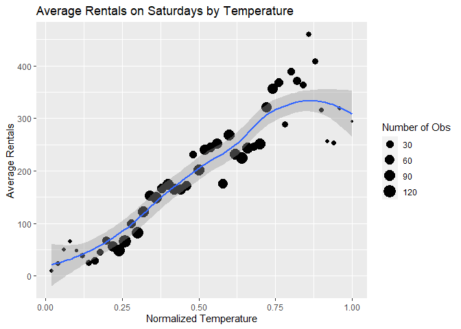
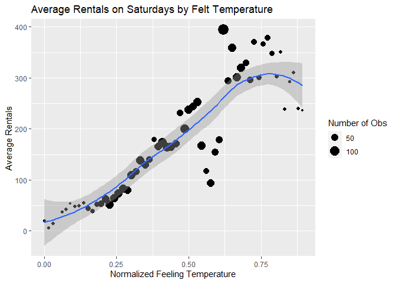
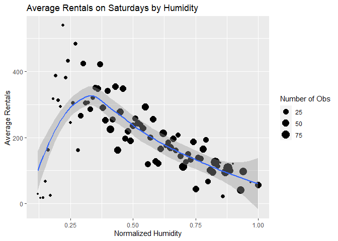
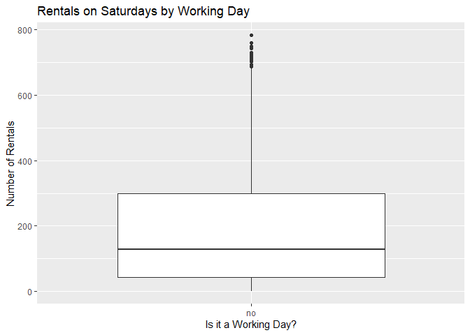

Joshua Burrows Project 2
================
16 October 2020

  - [Bike Rentals on Saturdays:
    Introduction](#bike-rentals-on-saturdays-introduction)
  - [Read in Data](#read-in-data)
      - [Get Bikes Data](#get-bikes-data)
      - [Factors](#factors)
      - [Filter by Day](#filter-by-day)
  - [Exploratory Data Analysis](#exploratory-data-analysis)
      - [Quantitative Predictors](#quantitative-predictors)
          - [Correlations](#correlations)
          - [Hour](#hour)
          - [Temperature](#temperature)
          - [Felt Temperature](#felt-temperature)
          - [Humidity](#humidity)
          - [Wind Speed](#wind-speed)
      - [Categorical Predictors](#categorical-predictors)
          - [Helper Function](#helper-function)
          - [Season](#season)
          - [Year](#year)
          - [Month](#month)
          - [Holiday](#holiday)
          - [Working Day](#working-day)
          - [Weather Condition](#weather-condition)
  - [Train Models](#train-models)
      - [Split Data](#split-data)
      - [Non-Ensemble Tree](#non-ensemble-tree)
          - [Training](#training)
              - [Tree Models](#tree-models)
              - [Tuning Parameter](#tuning-parameter)
              - [Formula](#formula)
              - [Create the Model](#create-the-model)
          - [Model Information](#model-information)
      - [Boosted Tree](#boosted-tree)
          - [Training](#training-1)
              - [Boosted Tree Models](#boosted-tree-models)
              - [Tuning Paremeters](#tuning-paremeters)
              - [Create the Model](#create-the-model-1)
          - [Model Information](#model-information-1)
  - [Test Models](#test-models)
  - [Best Model](#best-model)

# Bike Rentals on Saturdays: Introduction

This document walks though the process of creating a model to predict
hourly bike rentals on Saturdays. I compared two models - a
*non-ensemble tree* and a *boosted tree* - and picked the one that does
better.

The data comes from the Capital bike sharing system, and it is available
[here](https://archive.ics.uci.edu/ml/datasets/Bike+Sharing+Dataset).
This data includes an hourly count of bike rentals for 2011 and 2012 as
well as information about the weather and the time of year.

My models use the following predictor variables:

  - *yr*: year (2011 or 2012)  
  - *mnth*: month  
  - *hr*: hour of the day  
  - *holiday*: whether the day is a holiday  
  - *weathersit*: weather condition
      - pleasant: clear, few clouds, partly cloudy  
      - less pleasant: mist, mist + cloudy, mist + broken clouds, mist +
        few clouds  
      - even less pleasant: light snow, light Rain + scattered clouds,
        light rain + thunderstorm + scattered clouds  
      - downright unpleasant: snow + fog, heavy rain + ice pallets +
        thunderstorm + mist  
  - *temp*: normalized temperature in celsius  
  - *hum*: normalized humidity  
  - *windspeed*: normalized wind speed

You can return to the homepage for this project by clicking
[here](README.md). The github repo for this project is
[here](https://github.com/JKBurrows/ST558-Project-2).

# Read in Data

## Get Bikes Data

Read in data.

``` r
bikes <- read_csv(file = "../Bike-Sharing-Dataset/hour.csv")

bikes %>% head() %>% kable()
```

| instant | dteday     | season | yr | mnth | hr | holiday | weekday | workingday | weathersit | temp |  atemp |  hum | windspeed | casual | registered | cnt |
| ------: | :--------- | -----: | -: | ---: | -: | ------: | ------: | ---------: | ---------: | ---: | -----: | ---: | --------: | -----: | ---------: | --: |
|       1 | 2011-01-01 |      1 |  0 |    1 |  0 |       0 |       6 |          0 |          1 | 0.24 | 0.2879 | 0.81 |    0.0000 |      3 |         13 |  16 |
|       2 | 2011-01-01 |      1 |  0 |    1 |  1 |       0 |       6 |          0 |          1 | 0.22 | 0.2727 | 0.80 |    0.0000 |      8 |         32 |  40 |
|       3 | 2011-01-01 |      1 |  0 |    1 |  2 |       0 |       6 |          0 |          1 | 0.22 | 0.2727 | 0.80 |    0.0000 |      5 |         27 |  32 |
|       4 | 2011-01-01 |      1 |  0 |    1 |  3 |       0 |       6 |          0 |          1 | 0.24 | 0.2879 | 0.75 |    0.0000 |      3 |         10 |  13 |
|       5 | 2011-01-01 |      1 |  0 |    1 |  4 |       0 |       6 |          0 |          1 | 0.24 | 0.2879 | 0.75 |    0.0000 |      0 |          1 |   1 |
|       6 | 2011-01-01 |      1 |  0 |    1 |  5 |       0 |       6 |          0 |          2 | 0.24 | 0.2576 | 0.75 |    0.0896 |      0 |          1 |   1 |

## Factors

Convert categorical variables to factors.

``` r
bikes$weekday <- as.factor(bikes$weekday)
levels(bikes$weekday) <- c("Sunday", "Monday", "Tuesday", "Wednesday", "Thursday", "Friday", "Saturday") 

bikes$season <- as.factor(bikes$season)
levels(bikes$season) <- c("winter", "spring", "summer", "fall")

bikes$yr <- as.factor(bikes$yr)
levels(bikes$yr) <- c("2011", "2012")

bikes$mnth <- as.factor(bikes$mnth)
levels(bikes$mnth) <- c("jan", "feb", "mar", "apr", "may", "jun", "jul", "aug", "sep", "oct", "nov", "dec")

bikes$weathersit <- as.factor(bikes$weathersit)
levels(bikes$weathersit) <- c("pleasant", "less pleasant", "even less pleasant", "downright unpleasant")

bikes$holiday <- as.factor(bikes$holiday)
levels(bikes$holiday) <- c("no", "yes")

bikes$workingday <- as.factor(bikes$workingday)
levels(bikes$workingday) <- c("no", "yes")

bikes %>% head() %>% kable()
```

| instant | dteday     | season | yr   | mnth | hr | holiday | weekday  | workingday | weathersit    | temp |  atemp |  hum | windspeed | casual | registered | cnt |
| ------: | :--------- | :----- | :--- | :--- | -: | :------ | :------- | :--------- | :------------ | ---: | -----: | ---: | --------: | -----: | ---------: | --: |
|       1 | 2011-01-01 | winter | 2011 | jan  |  0 | no      | Saturday | no         | pleasant      | 0.24 | 0.2879 | 0.81 |    0.0000 |      3 |         13 |  16 |
|       2 | 2011-01-01 | winter | 2011 | jan  |  1 | no      | Saturday | no         | pleasant      | 0.22 | 0.2727 | 0.80 |    0.0000 |      8 |         32 |  40 |
|       3 | 2011-01-01 | winter | 2011 | jan  |  2 | no      | Saturday | no         | pleasant      | 0.22 | 0.2727 | 0.80 |    0.0000 |      5 |         27 |  32 |
|       4 | 2011-01-01 | winter | 2011 | jan  |  3 | no      | Saturday | no         | pleasant      | 0.24 | 0.2879 | 0.75 |    0.0000 |      3 |         10 |  13 |
|       5 | 2011-01-01 | winter | 2011 | jan  |  4 | no      | Saturday | no         | pleasant      | 0.24 | 0.2879 | 0.75 |    0.0000 |      0 |          1 |   1 |
|       6 | 2011-01-01 | winter | 2011 | jan  |  5 | no      | Saturday | no         | less pleasant | 0.24 | 0.2576 | 0.75 |    0.0896 |      0 |          1 |   1 |

## Filter by Day

Grab the data for Saturday.

``` r
dayData <- bikes %>% filter(weekday == params$day)

dayData %>% head() %>% kable()
```

| instant | dteday     | season | yr   | mnth | hr | holiday | weekday  | workingday | weathersit    | temp |  atemp |  hum | windspeed | casual | registered | cnt |
| ------: | :--------- | :----- | :--- | :--- | -: | :------ | :------- | :--------- | :------------ | ---: | -----: | ---: | --------: | -----: | ---------: | --: |
|       1 | 2011-01-01 | winter | 2011 | jan  |  0 | no      | Saturday | no         | pleasant      | 0.24 | 0.2879 | 0.81 |    0.0000 |      3 |         13 |  16 |
|       2 | 2011-01-01 | winter | 2011 | jan  |  1 | no      | Saturday | no         | pleasant      | 0.22 | 0.2727 | 0.80 |    0.0000 |      8 |         32 |  40 |
|       3 | 2011-01-01 | winter | 2011 | jan  |  2 | no      | Saturday | no         | pleasant      | 0.22 | 0.2727 | 0.80 |    0.0000 |      5 |         27 |  32 |
|       4 | 2011-01-01 | winter | 2011 | jan  |  3 | no      | Saturday | no         | pleasant      | 0.24 | 0.2879 | 0.75 |    0.0000 |      3 |         10 |  13 |
|       5 | 2011-01-01 | winter | 2011 | jan  |  4 | no      | Saturday | no         | pleasant      | 0.24 | 0.2879 | 0.75 |    0.0000 |      0 |          1 |   1 |
|       6 | 2011-01-01 | winter | 2011 | jan  |  5 | no      | Saturday | no         | less pleasant | 0.24 | 0.2576 | 0.75 |    0.0896 |      0 |          1 |   1 |

# Exploratory Data Analysis

I started with a little bit of exploratory data analysis. The goal is to
look at the relationships between the predictors and number of bike
rentals.

## Quantitative Predictors

### Correlations

Visualize the strength of the relationships between the quantitative
predictors.

Unsurprisingly, *atemp* and *temp* are strongly correlated. *atemp*
represents the heat index, which is typically calculated using
temperature and humidity. So it makes sense to either eliminate *atemp*
from the model or keep *atemp* but eliminate *temp* and *hum*. I decided
to eliminate *atemp*.

``` r
corr <- dayData %>% 
  select(temp, atemp, windspeed, hum) %>% 
  cor()

corrplot(corr)
```

<!-- -->

### Hour

Create a scatter plot to investigate the relationship between time of
day and rentals on Saturdays. Fit a line through the points to get a
basic idea of how number or rentals changes with the time of day.

``` r
avgRentals <- dayData %>% 
  group_by(hr) %>% 
  summarize(meanRentals = mean(cnt))

corrHour <- cor(avgRentals$hr, avgRentals$meanRentals)

ggplot(avgRentals, aes(x = hr, y = meanRentals)) +
  geom_point() + 
  labs(title = paste0("Total Rentals on ", paste0(params$day, "s"), " by Hour"), 
       x = "Hour of the Day", 
       y = "Total Rentals") + 
  geom_smooth()
```

<!-- -->

The correlation between hour and average rentals is 0.5228067.

Be careful, correlation measures straight line relationships, so if the
plot above shows a curved relationship, correlation may not be a useful
measure.

### Temperature

Create a scatter plot to investigate the relationship between
temperature and average rentals on Saturdays. Fit a line through the
points to get a basic idea of average rentals changes with temperature.

The size of the dots represents the number of observations at each
temperature.

``` r
tempAvg <- dayData %>% 
  group_by(temp) %>% 
  summarize(avgRentals = mean(cnt), n = n())

corrTemp <- cor(tempAvg$temp, tempAvg$avgRentals)

ggplot(tempAvg, aes(x = temp, y = avgRentals)) + 
  geom_point(aes(size = n)) + 
  geom_smooth() + 
  labs(title = paste0("Average Rentals on ", paste0(params$day, "s"), " by Temperature"), 
       x = "Normalized Temperature", 
       y = "Average Rentals") + 
  scale_size_continuous(name = "Number of Obs")
```

<!-- -->

The correlation between temperature and average rentals is 0.9251964.

Be careful, correlation measures straight line relationships, so if the
plot above shows a curved relationship, correlation may not be a useful
measure.

### Felt Temperature

Create a scatter plot to investigate the relationship between felt
temperature and average rentals on Saturdays. Fit a line through the
points to get a basic idea of how average rentals changes with felt
temperature.

The size of the dots represents the number of observations at each felt
temperature.

As already noted, it does not make much sense to keep *atemp* if *temp*
and *hum* will be in the model, so I eliminated *atemp* from the model.

``` r
atempAvg <- dayData %>% 
  group_by(atemp) %>% 
  summarize(avgRentals = mean(cnt), n = n())

corrATemp <- cor(atempAvg$atemp, atempAvg$avgRentals)

ggplot(atempAvg, aes(x = atemp, y = avgRentals)) +
  geom_point(aes(size = n)) + 
  geom_smooth() + 
  labs(title = paste0("Average Rentals on ", paste0(params$day, "s"), " by Felt Temperature"), 
       x = "Normalized Feeling Temperature", 
       y = "Average Rentals") + 
  scale_size_continuous(name = "Number of Obs")
```

<!-- -->

The correlation between felt temperature and average rentals is
0.894597.

Be careful, correlation measures straight line relationships, so if the
plot above shows a curved relationship, correlation may not be a useful
measure.

### Humidity

Create a scatter plot to investigate the relationship between humidity
and average rentals on Saturdays. Fit a line through the points to get a
basic idea of how average rentals changes with humidity.

The size of the dots represents the number of observations at each
humidity level.

``` r
humAvg <- dayData %>% 
  group_by(hum) %>% 
  summarize(avgRentals = mean(cnt), n = n())

corrHum <- cor(humAvg$hum, humAvg$avgRentals)

ggplot(humAvg, aes(x = hum, y = avgRentals)) + 
  geom_point(aes(size = n)) + 
  geom_smooth() + 
  labs(title = paste0("Average Rentals on ", paste0(params$day, "s"), " by Humidity"), 
       x = "Normalized Humidity", 
       y = "Average Rentals") + 
  scale_size_continuous(name = "Number of Obs")
```

<!-- -->

The correlation between humidity and average rentals is -0.535821.

Be careful, correlation measures straight line relationships, so if the
plot above shows a curved relationship, correlation may not be a useful
measure.

### Wind Speed

Create a scatter plot to investigate the relationship between wind speed
and average rentals on Saturdays. Fit a line through the points to get a
basic idea of how average rentals changes with wind speed.

The size of the dots represents the number of observations at each wind
speed.

``` r
windAvg <- dayData %>% 
  group_by(windspeed) %>% 
  summarize(avgRentals = mean(cnt), n = n())

corrWind <- cor(windAvg$windspeed, windAvg$avgRentals)

ggplot(windAvg, aes(x = windspeed, y = avgRentals)) + 
  geom_point(aes(size = n)) + 
  geom_smooth() + 
  labs(title = paste0("Average Rentals on ", paste0(params$day, "s"), " by Wind Speed"), 
       x = "Normalized Wind Speed", 
       y = "Average Rentals") + 
  scale_size_continuous(name = "Number of Obs")
```

<!-- -->

The correlation between wind speed and average rentals is -0.48637.

Be careful, correlation measures straight line relationships, so if the
plot above shows a curved relationship, correlation may not be a useful
measure.

## Categorical Predictors

### Helper Function

Create a helper function to display basic numeric summaries for a given
grouping variable.

``` r
getSum <- function(varName, colName){ 
  
  sum <- dayData %>% 
    group_by(dayData[[varName]]) %>% 
    summarize(min = min(cnt), 
              Q1 = quantile(cnt, probs = c(.25), names = FALSE), 
              median = median(cnt), 
              mean = mean(cnt), 
              Q3 = quantile(cnt, probs = c(.75), names = FALSE), 
              max = max(cnt), 
              obs = n())
  
  output <- sum %>% 
    kable(col.names = c(colName, 
                        "Minimum", 
                        "1st Quartile", 
                        "Median", 
                        "Mean", 
                        "3rd Quartile", 
                        "Maximum", 
                        "Number of Observations"))
  
  return(output)
  
} 
```

### Season

Explore how bike rentals on Saturdays change with the seasons using a
basic numeric summary and a boxplot. The numeric summary gives you an
idea of center and spread. So does the boxplot, but it is better for
identifying outliers.

It does not make much sense to keep both *season* and *mnth* in the
model, so I decided to eliminate *season*.

``` r
getSum(varName = "season", colName = "Season")
```

| Season | Minimum | 1st Quartile | Median |     Mean | 3rd Quartile | Maximum | Number of Observations |
| :----- | ------: | -----------: | -----: | -------: | -----------: | ------: | ---------------------: |
| winter |       1 |        23.25 |   63.0 | 101.6610 |       129.75 |     690 |                    646 |
| spring |       1 |        53.75 |  167.5 | 222.2580 |       367.00 |     730 |                    624 |
| summer |       4 |        75.25 |  207.0 | 234.8816 |       367.00 |     783 |                    642 |
| fall   |       1 |        53.75 |  149.0 | 204.4183 |       314.25 |     760 |                    600 |

``` r
ggplot(dayData, aes(x = season, y = cnt)) + 
  geom_boxplot() + 
  labs(title = paste0("Rentals on ", paste0(params$day, "s"), " by Season"), 
       x = "Season", 
       y = "Number of Rentals") 
```

<!-- -->

### Year

Looking at total rentals each year gives us some idea of the long term
trend in bike rentals on Saturdays. It would be helpful to have data
from more years, though.

``` r
yearSum <- dayData %>% 
  group_by(yr) %>% 
  summarize(totalRentals = sum(cnt))

yearSum %>% kable(col.names = c("Year", "Total Rentals"))
```

| Year | Total Rentals |
| :--- | ------------: |
| 2011 |        179743 |
| 2012 |        298064 |

### Month

Explore how bike rentals on Saturdays change depending on the month
using a basic numeric summary and a boxplot. The numeric summary gives
you an idea of center and spread. So does the boxplot, but it is better
for identifying outliers.

As already noted, it is probably not worth including *mnth* and *season*
in the model, so *season* has been eliminated.

``` r
getSum(varName = "mnth", colName = "Month")
```

| Month | Minimum | 1st Quartile | Median |      Mean | 3rd Quartile | Maximum | Number of Observations |
| :---- | ------: | -----------: | -----: | --------: | -----------: | ------: | ---------------------: |
| jan   |       1 |        20.00 |   55.5 |  82.28505 |       100.50 |     512 |                    214 |
| feb   |       1 |        26.75 |   67.5 |  94.43750 |       137.00 |     499 |                    192 |
| mar   |       1 |        41.00 |  111.5 | 164.11574 |       223.00 |     690 |                    216 |
| apr   |       1 |        32.00 |  102.0 | 185.23611 |       291.00 |     678 |                    216 |
| may   |       2 |        66.25 |  222.0 | 249.10417 |       402.75 |     730 |                    192 |
| jun   |       5 |        86.75 |  244.0 | 264.32407 |       404.00 |     702 |                    216 |
| jul   |       5 |        71.75 |  210.0 | 218.01389 |       327.25 |     632 |                    216 |
| aug   |       4 |        64.75 |  175.5 | 224.68280 |       370.25 |     654 |                    186 |
| sep   |       5 |        79.75 |  213.5 | 266.40278 |       401.00 |     783 |                    216 |
| oct   |       1 |        46.50 |  157.5 | 226.87963 |       359.25 |     760 |                    216 |
| nov   |       2 |        46.75 |  142.0 | 178.66667 |       283.50 |     651 |                    192 |
| dec   |       1 |        29.00 |   92.5 | 133.12083 |       195.00 |     547 |                    240 |

``` r
ggplot(dayData, aes(x = mnth, y = cnt)) + 
  geom_boxplot() + 
  labs(title = paste0("Rentals on ", paste0(params$day, "s"), " by Month"), 
       x = "Month", 
       y = "Number of Rentals")
```

<!-- -->

### Holiday

Explore how bike rentals change depending on whether the Saturday in
question is a holiday using a basic numeric summary and a boxplot. The
numeric summary gives you an idea of center and spread. So does the
boxplot, but it is better for identifying outliers.

Note: There are no holidays on Saturday or Sunday because the holiday
data has been extracted from the [Washington D.C. HR department’s
holiday schedule](https://dchr.dc.gov/page/holiday-schedules), which
only lists holidays that fall during the work week. Accordingly, I have
left the *holiday* variable out of the models for Saturday and Sunday.

``` r
getSum(varName = "holiday", colName = "Holiday")
```

| Holiday | Minimum | 1st Quartile | Median |     Mean | 3rd Quartile | Maximum | Number of Observations |
| :------ | ------: | -----------: | -----: | -------: | -----------: | ------: | ---------------------: |
| no      |       1 |           42 |    129 | 190.2098 |          300 |     783 |                   2512 |

``` r
ggplot(dayData, aes(x = holiday, y = cnt)) + 
  geom_boxplot() + 
  labs(title = paste0("Rentals on ", paste0(params$day, "s"), " by Holiday"), 
       x = "Is it a Holiday?", 
       y = "Number of Rentals")
```

<!-- -->

### Working Day

Explore how bike rentals change depending on whether the day in question
is a working day using a basic numeric summary and a boxplot. The
numeric summary gives you an idea of center and spread. So does the
boxplot, but it is better for identifying outliers.

Working days are neither weekends nor holidays. I decided not to keep
this variable in the model because it wouldn’t make much sense in the
reports for Saturday and Sunday.

``` r
getSum(varName = "workingday", colName = "Working Day")
```

| Working Day | Minimum | 1st Quartile | Median |     Mean | 3rd Quartile | Maximum | Number of Observations |
| :---------- | ------: | -----------: | -----: | -------: | -----------: | ------: | ---------------------: |
| no          |       1 |           42 |    129 | 190.2098 |          300 |     783 |                   2512 |

``` r
ggplot(dayData, aes(x = workingday, y = cnt)) +
  geom_boxplot() + 
  labs(title = paste0("Rentals on ", paste0(params$day, "s"), " by Working Day"), 
       x = "Is it a Working Day?", 
       y = "Number of Rentals")
```

<!-- -->

### Weather Condition

Explore how bike rentals on Saturdays change depending on the weather
using a basic numeric summary and a boxplot. The numeric summary gives
you an idea of center and spread. So does the boxplot, but it is better
for identifying outliers.

``` r
getSum(varName = "weathersit", colName = "Weather Condition")
```

| Weather Condition    | Minimum | 1st Quartile | Median |     Mean | 3rd Quartile | Maximum | Number of Observations |
| :------------------- | ------: | -----------: | -----: | -------: | -----------: | ------: | ---------------------: |
| pleasant             |       1 |        49.00 |    149 | 207.5707 |       332.00 |     760 |                   1675 |
| less pleasant        |       1 |        41.00 |    116 | 171.0077 |       255.25 |     783 |                    648 |
| even less pleasant   |       1 |        20.75 |     57 | 102.6064 |       137.00 |     584 |                    188 |
| downright unpleasant |      23 |        23.00 |     23 |  23.0000 |        23.00 |      23 |                      1 |

``` r
ggplot(dayData, aes(x = weathersit, y = cnt)) +
  geom_boxplot() + 
  labs(title = paste0("Rentals on ", paste0(params$day, "s"), " by Weather Condition"), 
       x = "What is the Weather Like?", 
       y = "Number of Rentals")
```

<!-- -->

# Train Models

After exploring the data, I created two models, a non-ensemble tree and
a boosted tree.

## Split Data

Split the data into a training set and a test set. The training set is
used to build the models, and the test set is used to evaluate them.

``` r
set.seed(123)
trainIndex <- createDataPartition(dayData$cnt, p = .7, list = FALSE)

train <- dayData[trainIndex,]
test <- dayData[-trainIndex,]
```

## Non-Ensemble Tree

### Training

Fit a non-ensemble tree model.

#### Tree Models

Tree models split each predictor space into regions and make a different
prediction for each region. For example, suppose we are interested in
predicting life expectancy based on exercise habits. We might split the
predictor space into **exercises less than one hour a week** and
**exercises at least one hour a week** and then predict that people in
the second group live longer.

How do we decide whether to split at one hour, one and a half hours, two
hours, etc? This decision is made using a method called “Recursive
Binary Splitting”, which we don’t have to worry about too much because
the *caret* package does it for us.

Ensemble tree models fit lots of trees and then average their results.
Here I have created a basic non-ensemble tree to model bicycle rentals.

#### Tuning Parameter

This model has one “tuning parameter” called *cp*. *cp* stands for
“Complexity Parameter”, and it controls the number of “nodes” that the
tree has.

The life expectancy example above has two terminal nodes: **less than
one hour** and **at least one hour**. We could complicate the example by
adding additional nodes. For instance, we could divide the group **less
than one hour** into two subgroups: **less than half an hour** and
**greater than half an hour but less than one hour**. And we could
divide **at least one hour a week** into **less than two hours but at
least one hour** and **greater than two hours**.

Sometimes increasing the number of nodes makes your model better, but
sometimes it makes it worse. There are lots of different methods for
picking the best number of nodes. For the bicycle rental model, I used a
method called “Leave One Out Cross Validation”.

*LOOCV* works by removing an observation from the data set, using the
rest of the data to create a model, and then seeing how well that model
does at predicting the observation that was left out. This process is
repeated for every observation, and the results are combined.

If we want to compare two different values of *cp*, we will go through
the *LOOCV* process twice and compare the results. In this way, we can
test different values of *cp* to see which one performs best.

I used the *caret* package to test 10 different values of *cp*.

#### Formula

As previously mentioned, *holiday* will be dropped from the models for
Saturday and Sunday, but kept in the models for weekdays.

``` r
if(params$day == "Saturday" | params$day == "Sunday"){
  form <- formula(cnt ~ yr + mnth + hr + weathersit + temp + hum + windspeed)
} else if(params$day %in% c("Monday", "Tuesday", "Wednesday", "Thursday", "Friday")){
  form <- formula(cnt ~ yr + mnth + hr + holiday + weathersit + temp + hum + windspeed)
} else{
  stop("error")
}

form
```

    ## cnt ~ yr + mnth + hr + weathersit + temp + hum + windspeed
    ## <environment: 0x00000120333253a0>

#### Create the Model

Train the non-ensemble tree model using the above formula.

``` r
set.seed(123)
tree <- train(form, 
              data = train, 
              method = "rpart", 
              trControl = trainControl(method = "LOOCV"), 
              tuneLength = 10)
```

### Model Information

My final non-ensemble tree model uses a *cp* of 0.0083345. Its root mean
square error on the training set is 82.1837351.

More information about this model is below.

``` r
tree
```

    ## CART 
    ## 
    ## 1761 samples
    ##    7 predictor
    ## 
    ## No pre-processing
    ## Resampling: Leave-One-Out Cross-Validation 
    ## Summary of sample sizes: 1760, 1760, 1760, 1760, 1760, 1760, ... 
    ## Resampling results across tuning parameters:
    ## 
    ##   cp           RMSE       Rsquared    
    ##   0.008334501   82.18374  0.7898260089
    ##   0.008727964   82.49446  0.7879764752
    ##   0.015018208   84.64180  0.7769211745
    ##   0.020414016   94.05201  0.7245975658
    ##   0.022276901   96.62086  0.7093696491
    ##   0.024758571  102.16778  0.6746786079
    ##   0.062778891  114.20214  0.5955614350
    ##   0.083298237  126.83268  0.5055766859
    ##   0.187037946  157.36674  0.2617699378
    ##   0.375907146  186.84951  0.0008385972
    ##   MAE      
    ##    61.44532
    ##    61.64060
    ##    63.35573
    ##    70.64124
    ##    70.90121
    ##    77.35276
    ##    84.19869
    ##    94.10628
    ##   122.72613
    ##   168.83956
    ## 
    ## RMSE was used to select the
    ##  optimal model using the
    ##  smallest value.
    ## The final value used for the model
    ##  was cp = 0.008334501.

``` r
rpart.plot(tree$finalModel)
```

<!-- -->

## Boosted Tree

### Training

#### Boosted Tree Models

Boosted trees are another type of tree model. “Boosting” works by
fitting a series of trees, each of which is a modified version of the
previous tree. The idea is to hone in on the best model.

#### Tuning Paremeters

Four tuning parameters are involved:  
\- *n.trees*: number of boosting iterations  
\- *interaction.depth*: maximum tree depth  
\- *shrinkage*: how strongly each subsequent tree is influenced by the
previous tree  
\- *n.minobsinnode*: minimum terminal node size

Values for the tuning parameters are found using Cross Validation. Cross
Validation works by splitting the data into groups called “folds”. One
fold is left out, the rest are used to create a model, and then that
model is tested on the fold that was left out. This process is repeated
for each fold, and the results are combined. It should be clear that
*LOOCV* is just *CV* with the number of folds equal to the number of
observations.

I used the *caret* package to test 81 different combinations of tuning
parameters.

#### Create the Model

Train the boosted tree model using the same formula as above.

``` r
tuneGr <- expand.grid(n.trees = seq(from = 50, to = 150, by = 50), 
                     interaction.depth = 1:3, 
                     shrinkage = seq(from = .05, to = .15, by = .05), 
                     n.minobsinnode = 9:11)

set.seed(123)
boostTree <- train(form, 
                   data = train, 
                   method = "gbm", 
                   trControl = trainControl(method = "cv", number = 10),
                   tuneGrid = tuneGr, 
                   verbose = FALSE)
```

### Model Information

My final boosted tree model uses the following tuning parameters:

  - *n.trees*: 150  
  - *interaction.depth*: 3  
  - *shrinkage*: 0.15  
  - *n.minobsinnode*: 11

Its root mean square error on the training set is 47.8735425.

More information about this model is below.

``` r
boostTree
```

    ## Stochastic Gradient Boosting 
    ## 
    ## 1761 samples
    ##    7 predictor
    ## 
    ## No pre-processing
    ## Resampling: Cross-Validated (10 fold) 
    ## Summary of sample sizes: 1584, 1585, 1585, 1585, 1585, 1585, ... 
    ## Resampling results across tuning parameters:
    ## 
    ##   shrinkage  interaction.depth
    ##   0.05       1                
    ##   0.05       1                
    ##   0.05       1                
    ##   0.05       1                
    ##   0.05       1                
    ##   0.05       1                
    ##   0.05       1                
    ##   0.05       1                
    ##   0.05       1                
    ##   0.05       2                
    ##   0.05       2                
    ##   0.05       2                
    ##   0.05       2                
    ##   0.05       2                
    ##   0.05       2                
    ##   0.05       2                
    ##   0.05       2                
    ##   0.05       2                
    ##   0.05       3                
    ##   0.05       3                
    ##   0.05       3                
    ##   0.05       3                
    ##   0.05       3                
    ##   0.05       3                
    ##   0.05       3                
    ##   0.05       3                
    ##   0.05       3                
    ##   0.10       1                
    ##   0.10       1                
    ##   0.10       1                
    ##   0.10       1                
    ##   0.10       1                
    ##   0.10       1                
    ##   0.10       1                
    ##   0.10       1                
    ##   0.10       1                
    ##   0.10       2                
    ##   0.10       2                
    ##   0.10       2                
    ##   0.10       2                
    ##   0.10       2                
    ##   0.10       2                
    ##   0.10       2                
    ##   0.10       2                
    ##   0.10       2                
    ##   0.10       3                
    ##   0.10       3                
    ##   0.10       3                
    ##   0.10       3                
    ##   0.10       3                
    ##   0.10       3                
    ##   0.10       3                
    ##   0.10       3                
    ##   0.10       3                
    ##   0.15       1                
    ##   0.15       1                
    ##   0.15       1                
    ##   0.15       1                
    ##   0.15       1                
    ##   0.15       1                
    ##   0.15       1                
    ##   0.15       1                
    ##   0.15       1                
    ##   0.15       2                
    ##   0.15       2                
    ##   0.15       2                
    ##   0.15       2                
    ##   0.15       2                
    ##   0.15       2                
    ##   0.15       2                
    ##   0.15       2                
    ##   0.15       2                
    ##   0.15       3                
    ##   0.15       3                
    ##   0.15       3                
    ##   0.15       3                
    ##   0.15       3                
    ##   0.15       3                
    ##   0.15       3                
    ##   0.15       3                
    ##   0.15       3                
    ##   n.minobsinnode  n.trees  RMSE     
    ##    9               50      121.22966
    ##    9              100      102.73006
    ##    9              150       94.02033
    ##   10               50      121.32581
    ##   10              100      102.87652
    ##   10              150       94.11952
    ##   11               50      121.09505
    ##   11              100      102.87544
    ##   11              150       94.07831
    ##    9               50       90.73885
    ##    9              100       73.97953
    ##    9              150       67.62581
    ##   10               50       90.75501
    ##   10              100       73.81631
    ##   10              150       67.44633
    ##   11               50       90.88552
    ##   11              100       73.83478
    ##   11              150       67.51806
    ##    9               50       75.86740
    ##    9              100       60.51628
    ##    9              150       54.61179
    ##   10               50       75.96379
    ##   10              100       60.45169
    ##   10              150       54.57890
    ##   11               50       76.06220
    ##   11              100       60.59501
    ##   11              150       54.88361
    ##    9               50      102.48577
    ##    9              100       88.95836
    ##    9              150       83.85131
    ##   10               50      102.75376
    ##   10              100       88.90765
    ##   10              150       84.00185
    ##   11               50      102.40875
    ##   11              100       88.68673
    ##   11              150       83.71761
    ##    9               50       73.98383
    ##    9              100       64.16804
    ##    9              150       60.37510
    ##   10               50       74.16223
    ##   10              100       64.10099
    ##   10              150       60.26710
    ##   11               50       74.16912
    ##   11              100       64.23179
    ##   11              150       60.28169
    ##    9               50       60.60129
    ##    9              100       52.29556
    ##    9              150       49.79203
    ##   10               50       60.25118
    ##   10              100       51.37470
    ##   10              150       49.12107
    ##   11               50       60.54053
    ##   11              100       52.35414
    ##   11              150       49.95265
    ##    9               50       93.51967
    ##    9              100       83.87569
    ##    9              150       80.43625
    ##   10               50       93.67007
    ##   10              100       84.28414
    ##   10              150       80.66075
    ##   11               50       93.66753
    ##   11              100       83.96899
    ##   11              150       80.49629
    ##    9               50       67.24280
    ##    9              100       59.90908
    ##    9              150       57.48586
    ##   10               50       68.08585
    ##   10              100       60.44091
    ##   10              150       58.08248
    ##   11               50       67.82146
    ##   11              100       60.53599
    ##   11              150       57.99092
    ##    9               50       55.13350
    ##    9              100       49.99917
    ##    9              150       48.57964
    ##   10               50       55.00414
    ##   10              100       49.90400
    ##   10              150       48.12578
    ##   11               50       54.76596
    ##   11              100       49.35494
    ##   11              150       47.87354
    ##   Rsquared   MAE     
    ##   0.6390050  91.18267
    ##   0.7221633  76.48751
    ##   0.7516883  70.90419
    ##   0.6401499  91.27533
    ##   0.7209920  76.52738
    ##   0.7515094  71.00092
    ##   0.6402574  91.13832
    ##   0.7215239  76.61721
    ##   0.7525786  70.90160
    ##   0.7984732  67.22250
    ##   0.8452826  54.08045
    ##   0.8657356  50.09569
    ##   0.7991876  67.24124
    ##   0.8466721  53.97063
    ##   0.8663491  50.00010
    ##   0.7984118  67.33086
    ##   0.8466215  53.92816
    ##   0.8663051  49.97566
    ##   0.8548108  57.02496
    ##   0.8932599  44.74946
    ##   0.9098874  40.06447
    ##   0.8548129  57.03716
    ##   0.8937246  44.73845
    ##   0.9101712  39.77036
    ##   0.8545255  57.15136
    ##   0.8931204  44.78188
    ##   0.9090772  40.11998
    ##   0.7224834  76.44084
    ##   0.7692938  67.91939
    ##   0.7881811  64.52000
    ##   0.7205255  76.69026
    ##   0.7691390  67.93278
    ##   0.7870522  64.81513
    ##   0.7231785  76.13236
    ##   0.7702974  67.72786
    ##   0.7882981  64.47801
    ##   0.8449342  54.09276
    ##   0.8759548  47.90276
    ##   0.8878559  45.23333
    ##   0.8444459  54.37778
    ##   0.8759456  48.09291
    ##   0.8881139  45.47106
    ##   0.8439904  54.06891
    ##   0.8757447  47.96660
    ##   0.8880192  45.30027
    ##   0.8922953  44.82635
    ##   0.9155671  37.98472
    ##   0.9224603  36.07970
    ##   0.8933437  44.35928
    ##   0.9184201  37.32049
    ##   0.9245247  35.54288
    ##   0.8925918  44.71801
    ##   0.9152828  38.29496
    ##   0.9219346  36.33871
    ##   0.7518866  70.64320
    ##   0.7871775  64.52222
    ##   0.8012707  62.25002
    ##   0.7512505  71.14153
    ##   0.7856070  64.68790
    ##   0.8002448  62.43058
    ##   0.7520601  70.94293
    ##   0.7861432  64.93504
    ##   0.8007406  62.43890
    ##   0.8664106  50.10996
    ##   0.8889405  45.20271
    ##   0.8968240  43.15200
    ##   0.8622711  50.64223
    ##   0.8869536  45.67951
    ##   0.8945679  43.65682
    ##   0.8629801  50.47156
    ##   0.8869215  45.53994
    ##   0.8953014  43.46961
    ##   0.9078876  40.25010
    ##   0.9217440  36.24125
    ##   0.9260253  35.00543
    ##   0.9074737  40.36733
    ##   0.9219946  36.32944
    ##   0.9271064  34.85429
    ##   0.9087627  40.13193
    ##   0.9239013  35.73266
    ##   0.9280711  34.57345
    ## 
    ## RMSE was used to select the
    ##  optimal model using the
    ##  smallest value.
    ## The final values used for the
    ##  shrinkage = 0.15 and n.minobsinnode
    ##  = 11.

# Test Models

I tested the models on the test set and selected the model that
performed best.

Performance was measured using Root Mean Square Error, which is a
measure of how close the model gets to correctly predicting the test
data. The RMSE for each model is displayed below.

``` r
treePreds <- predict(tree, test)
treeRMSE <- postResample(treePreds, test$cnt)[1]

boostPreds <- predict(boostTree, test)
boostRMSE <- postResample(boostPreds, test$cnt)[1]

modelPerformance <- data.frame(model = c("Non-Ensemble Tree", "Boosted Tree"), 
                               trainRMSE = c(min(tree$results$RMSE), min(boostTree$results$RMSE)), 
                               testRMSE = c(treeRMSE, boostRMSE))

modelPerformance %>% kable(col.names = c("Model", "Train RMSE", "Test RMSE"))
```

| Model             | Train RMSE | Test RMSE |
| :---------------- | ---------: | --------: |
| Non-Ensemble Tree |   82.18374 |  78.67562 |
| Boosted Tree      |   47.87354 |  46.76480 |

# Best Model

``` r
best <- modelPerformance %>% filter(testRMSE == min(testRMSE))
worst <- modelPerformance %>% filter(testRMSE == max(testRMSE))
```

The boosted tree performs better than the non-ensemble tree as judged by
RMSE on the test set.

The boosted tree model is saved to the `final` object below.

``` r
if(best$model == "Non-Ensemble Tree"){
  final <- tree
} else if(best$model == "Boosted Tree"){
  final <- boostTree
} else{
  stop("Error")
}

final$finalModel
```

    ## A gradient boosted model with gaussian loss function.
    ## 150 iterations were performed.
    ## There were 19 predictors of which 17 had non-zero influence.
