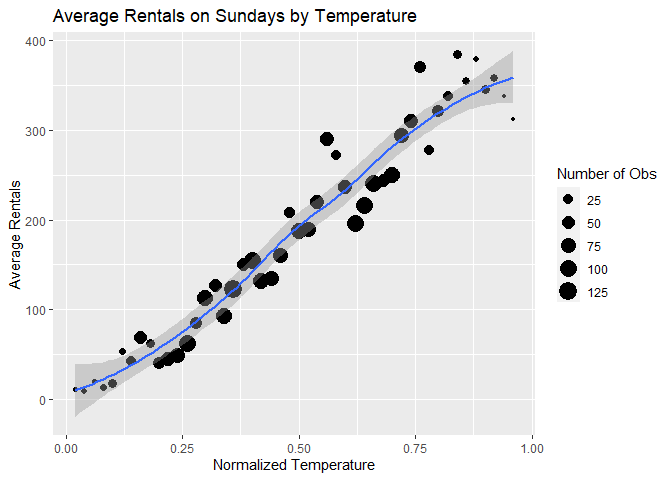

Joshua Burrows Project 2
================
16 October 2020

  - [Bike Rentals on Sundays:
    Introduction](#bike-rentals-on-sundays-introduction)
  - [Read in Data](#read-in-data)
      - [Get Bikes Data](#get-bikes-data)
      - [Factors](#factors)
      - [Filter by Day](#filter-by-day)
  - [Exploratory Data Analysis](#exploratory-data-analysis)
      - [Quantitative Predictors](#quantitative-predictors)
          - [Correlations](#correlations)
          - [Hour](#hour)
          - [Temperature](#temperature)
          - [Felt Temperature](#felt-temperature)
          - [Humidity](#humidity)
          - [Wind Speed](#wind-speed)
      - [Categorical Predictors](#categorical-predictors)
          - [Helper Function](#helper-function)
          - [Season](#season)
          - [Year](#year)
          - [Month](#month)
          - [Holiday](#holiday)
          - [Working Day](#working-day)
          - [Weather Condition](#weather-condition)
  - [Train Models](#train-models)
      - [Split Data](#split-data)
      - [Non-Ensemble Tree](#non-ensemble-tree)
          - [Training](#training)
              - [Tree Models](#tree-models)
              - [Tuning Parameter](#tuning-parameter)
              - [Formula](#formula)
              - [Create the Model](#create-the-model)
          - [Model Information](#model-information)
      - [Boosted Tree](#boosted-tree)
          - [Training](#training-1)
              - [Boosted Tree Models](#boosted-tree-models)
              - [Tuning Paremeters](#tuning-paremeters)
              - [Create the Model](#create-the-model-1)
          - [Model Information](#model-information-1)
      - [Multiple Linear Regression](#multiple-linear-regression)
          - [Training](#training-2)
              - [Create the Model](#create-the-model-2)
  - [Test Models](#test-models)
  - [Best Model](#best-model)

# Bike Rentals on Sundays: Introduction

This document walks though the process of creating a model to predict
hourly bike rentals on Sundays. I compared two models - a *non-ensemble
tree* and a *boosted tree* - and picked the one that does better.

The data comes from the Capital bike sharing system, and it is available
[here](https://archive.ics.uci.edu/ml/datasets/Bike+Sharing+Dataset).
This data includes an hourly count of bike rentals for 2011 and 2012 as
well as information about the weather and the time of year.

My models use the following predictor variables:

  - *yr*: year (2011 or 2012)  
  - *mnth*: month  
  - *hr*: hour of the day  
  - *holiday*: whether the day is a holiday  
  - *weathersit*: weather condition
      - pleasant: clear, few clouds, partly cloudy  
      - less pleasant: mist, mist + cloudy, mist + broken clouds, mist +
        few clouds  
      - even less pleasant: light snow, light rain + scattered clouds,
        light rain + thunderstorm + scattered clouds  
      - downright unpleasant: snow + fog, heavy rain + ice pallets +
        thunderstorm + mist  
  - *temp*: normalized temperature in celsius  
  - *hum*: normalized humidity  
  - *windspeed*: normalized wind speed

You can return to the homepage for this project by clicking
[here](https://jkburrows.github.io/ST558-Project-2/). The github repo
for this project is
[here](https://github.com/JKBurrows/ST558-Project-2).

# Read in Data

## Get Bikes Data

Read in data.

``` r
bikes <- read_csv(file = "hour.csv")

bikes %>% head() %>% kable()
```

| instant | dteday     | season | yr | mnth | hr | holiday | weekday | workingday | weathersit | temp |  atemp |  hum | windspeed | casual | registered | cnt |
| ------: | :--------- | -----: | -: | ---: | -: | ------: | ------: | ---------: | ---------: | ---: | -----: | ---: | --------: | -----: | ---------: | --: |
|       1 | 2011-01-01 |      1 |  0 |    1 |  0 |       0 |       6 |          0 |          1 | 0.24 | 0.2879 | 0.81 |    0.0000 |      3 |         13 |  16 |
|       2 | 2011-01-01 |      1 |  0 |    1 |  1 |       0 |       6 |          0 |          1 | 0.22 | 0.2727 | 0.80 |    0.0000 |      8 |         32 |  40 |
|       3 | 2011-01-01 |      1 |  0 |    1 |  2 |       0 |       6 |          0 |          1 | 0.22 | 0.2727 | 0.80 |    0.0000 |      5 |         27 |  32 |
|       4 | 2011-01-01 |      1 |  0 |    1 |  3 |       0 |       6 |          0 |          1 | 0.24 | 0.2879 | 0.75 |    0.0000 |      3 |         10 |  13 |
|       5 | 2011-01-01 |      1 |  0 |    1 |  4 |       0 |       6 |          0 |          1 | 0.24 | 0.2879 | 0.75 |    0.0000 |      0 |          1 |   1 |
|       6 | 2011-01-01 |      1 |  0 |    1 |  5 |       0 |       6 |          0 |          2 | 0.24 | 0.2576 | 0.75 |    0.0896 |      0 |          1 |   1 |

## Factors

Convert categorical variables to factors.

``` r
bikes$weekday <- as.factor(bikes$weekday)
levels(bikes$weekday) <- c("Sunday", "Monday", "Tuesday", "Wednesday", "Thursday", "Friday", "Saturday") 

bikes$season <- as.factor(bikes$season)
levels(bikes$season) <- c("winter", "spring", "summer", "fall")

bikes$yr <- as.factor(bikes$yr)
levels(bikes$yr) <- c("2011", "2012")

bikes$mnth <- as.factor(bikes$mnth)
levels(bikes$mnth) <- c("jan", "feb", "mar", "apr", "may", "jun", "jul", "aug", "sep", "oct", "nov", "dec")

bikes$weathersit <- as.factor(bikes$weathersit)
levels(bikes$weathersit) <- c("pleasant", "less pleasant", "even less pleasant", "downright unpleasant")

bikes$holiday <- as.factor(bikes$holiday)
levels(bikes$holiday) <- c("no", "yes")

bikes$workingday <- as.factor(bikes$workingday)
levels(bikes$workingday) <- c("no", "yes")

bikes %>% head() %>% kable()
```

| instant | dteday     | season | yr   | mnth | hr | holiday | weekday  | workingday | weathersit    | temp |  atemp |  hum | windspeed | casual | registered | cnt |
| ------: | :--------- | :----- | :--- | :--- | -: | :------ | :------- | :--------- | :------------ | ---: | -----: | ---: | --------: | -----: | ---------: | --: |
|       1 | 2011-01-01 | winter | 2011 | jan  |  0 | no      | Saturday | no         | pleasant      | 0.24 | 0.2879 | 0.81 |    0.0000 |      3 |         13 |  16 |
|       2 | 2011-01-01 | winter | 2011 | jan  |  1 | no      | Saturday | no         | pleasant      | 0.22 | 0.2727 | 0.80 |    0.0000 |      8 |         32 |  40 |
|       3 | 2011-01-01 | winter | 2011 | jan  |  2 | no      | Saturday | no         | pleasant      | 0.22 | 0.2727 | 0.80 |    0.0000 |      5 |         27 |  32 |
|       4 | 2011-01-01 | winter | 2011 | jan  |  3 | no      | Saturday | no         | pleasant      | 0.24 | 0.2879 | 0.75 |    0.0000 |      3 |         10 |  13 |
|       5 | 2011-01-01 | winter | 2011 | jan  |  4 | no      | Saturday | no         | pleasant      | 0.24 | 0.2879 | 0.75 |    0.0000 |      0 |          1 |   1 |
|       6 | 2011-01-01 | winter | 2011 | jan  |  5 | no      | Saturday | no         | less pleasant | 0.24 | 0.2576 | 0.75 |    0.0896 |      0 |          1 |   1 |

## Filter by Day

Grab the data for Sunday.

``` r
dayData <- bikes %>% filter(weekday == params$day)

dayData %>% head() %>% kable()
```

| instant | dteday     | season | yr   | mnth | hr | holiday | weekday | workingday | weathersit         | temp |  atemp |  hum | windspeed | casual | registered | cnt |
| ------: | :--------- | :----- | :--- | :--- | -: | :------ | :------ | :--------- | :----------------- | ---: | -----: | ---: | --------: | -----: | ---------: | --: |
|      25 | 2011-01-02 | winter | 2011 | jan  |  0 | no      | Sunday  | no         | less pleasant      | 0.46 | 0.4545 | 0.88 |    0.2985 |      4 |         13 |  17 |
|      26 | 2011-01-02 | winter | 2011 | jan  |  1 | no      | Sunday  | no         | less pleasant      | 0.44 | 0.4394 | 0.94 |    0.2537 |      1 |         16 |  17 |
|      27 | 2011-01-02 | winter | 2011 | jan  |  2 | no      | Sunday  | no         | less pleasant      | 0.42 | 0.4242 | 1.00 |    0.2836 |      1 |          8 |   9 |
|      28 | 2011-01-02 | winter | 2011 | jan  |  3 | no      | Sunday  | no         | less pleasant      | 0.46 | 0.4545 | 0.94 |    0.1940 |      2 |          4 |   6 |
|      29 | 2011-01-02 | winter | 2011 | jan  |  4 | no      | Sunday  | no         | less pleasant      | 0.46 | 0.4545 | 0.94 |    0.1940 |      2 |          1 |   3 |
|      30 | 2011-01-02 | winter | 2011 | jan  |  6 | no      | Sunday  | no         | even less pleasant | 0.42 | 0.4242 | 0.77 |    0.2985 |      0 |          2 |   2 |

# Exploratory Data Analysis

I started with a little bit of exploratory data analysis. The goal is to
look at the relationships between the predictors and number of bike
rentals.

## Quantitative Predictors

### Correlations

Visualize the strength of the relationships between the quantitative
predictors.

Unsurprisingly, *atemp* and *temp* are strongly correlated. *atemp*
represents the heat index, which is typically calculated using
temperature and humidity. So it makes sense to either eliminate *atemp*
from the model or keep *atemp* but eliminate *temp* and *hum*. I decided
to eliminate *atemp*.

``` r
corr <- dayData %>% 
  select(temp, atemp, windspeed, hum) %>% 
  cor()

corrplot(corr)
```

<!-- -->

### Hour

Create a scatter plot to investigate the relationship between time of
day and rentals on Sundays. Fit a line through the points to get a basic
idea of how number or rentals changes with the time of day.

``` r
avgRentals <- dayData %>% 
  group_by(hr) %>% 
  summarize(meanRentals = mean(cnt))

corrHour <- cor(avgRentals$hr, avgRentals$meanRentals)

ggplot(avgRentals, aes(x = hr, y = meanRentals)) +
  geom_point() + 
  labs(title = paste0("Total Rentals on ", paste0(params$day, "s"), " by Hour"), 
       x = "Hour of the Day", 
       y = "Total Rentals") + 
  geom_smooth()
```

<!-- -->

The correlation between hour and average rentals is 0.4426479.

Be careful, correlation measures straight line relationships, so if the
plot above shows a curved relationship, correlation may not be a useful
measure.

### Temperature

Create a scatter plot to investigate the relationship between
temperature and average rentals on Sundays. Fit a line through the
points to get a basic idea of average rentals changes with temperature.

The size of the dots represents the number of observations at each
temperature.

``` r
tempAvg <- dayData %>% 
  group_by(temp) %>% 
  summarize(avgRentals = mean(cnt), n = n())

corrTemp <- cor(tempAvg$temp, tempAvg$avgRentals)

ggplot(tempAvg, aes(x = temp, y = avgRentals)) + 
  geom_point(aes(size = n)) + 
  geom_smooth() + 
  labs(title = paste0("Average Rentals on ", paste0(params$day, "s"), " by Temperature"), 
       x = "Normalized Temperature", 
       y = "Average Rentals") + 
  scale_size_continuous(name = "Number of Obs")
```

<!-- -->

The correlation between temperature and average rentals is 0.9710369.

Be careful, correlation measures straight line relationships, so if the
plot above shows a curved relationship, correlation may not be a useful
measure.

### Felt Temperature

Create a scatter plot to investigate the relationship between felt
temperature and average rentals on Sundays. Fit a line through the
points to get a basic idea of how average rentals changes with felt
temperature.

The size of the dots represents the number of observations at each felt
temperature.

As already noted, it does not make much sense to keep *atemp* if *temp*
and *hum* will be in the model, so I eliminated *atemp* from the model.

``` r
atempAvg <- dayData %>% 
  group_by(atemp) %>% 
  summarize(avgRentals = mean(cnt), n = n())

corrATemp <- cor(atempAvg$atemp, atempAvg$avgRentals)

ggplot(atempAvg, aes(x = atemp, y = avgRentals)) +
  geom_point(aes(size = n)) + 
  geom_smooth() + 
  labs(title = paste0("Average Rentals on ", paste0(params$day, "s"), " by Felt Temperature"), 
       x = "Normalized Feeling Temperature", 
       y = "Average Rentals") + 
  scale_size_continuous(name = "Number of Obs")
```

<!-- -->

The correlation between felt temperature and average rentals is
0.9046467.

Be careful, correlation measures straight line relationships, so if the
plot above shows a curved relationship, correlation may not be a useful
measure.

### Humidity

Create a scatter plot to investigate the relationship between humidity
and average rentals on Sundays. Fit a line through the points to get a
basic idea of how average rentals changes with humidity.

The size of the dots represents the number of observations at each
humidity level.

``` r
humAvg <- dayData %>% 
  group_by(hum) %>% 
  summarize(avgRentals = mean(cnt), n = n())

corrHum <- cor(humAvg$hum, humAvg$avgRentals)

ggplot(humAvg, aes(x = hum, y = avgRentals)) + 
  geom_point(aes(size = n)) + 
  geom_smooth() + 
  labs(title = paste0("Average Rentals on ", paste0(params$day, "s"), " by Humidity"), 
       x = "Normalized Humidity", 
       y = "Average Rentals") + 
  scale_size_continuous(name = "Number of Obs")
```

<!-- -->

The correlation between humidity and average rentals is -0.8857646.

Be careful, correlation measures straight line relationships, so if the
plot above shows a curved relationship, correlation may not be a useful
measure.

### Wind Speed

Create a scatter plot to investigate the relationship between wind speed
and average rentals on Sundays. Fit a line through the points to get a
basic idea of how average rentals changes with wind speed.

The size of the dots represents the number of observations at each wind
speed.

``` r
windAvg <- dayData %>% 
  group_by(windspeed) %>% 
  summarize(avgRentals = mean(cnt), n = n())

corrWind <- cor(windAvg$windspeed, windAvg$avgRentals)

ggplot(windAvg, aes(x = windspeed, y = avgRentals)) + 
  geom_point(aes(size = n)) + 
  geom_smooth() + 
  labs(title = paste0("Average Rentals on ", paste0(params$day, "s"), " by Wind Speed"), 
       x = "Normalized Wind Speed", 
       y = "Average Rentals") + 
  scale_size_continuous(name = "Number of Obs")
```

<!-- -->

The correlation between wind speed and average rentals is -0.2271752.

Be careful, correlation measures straight line relationships, so if the
plot above shows a curved relationship, correlation may not be a useful
measure.

## Categorical Predictors

### Helper Function

Create a helper function to display basic numeric summaries for a given
grouping variable.

``` r
getSum <- function(varName, colName){ 
  
  sum <- dayData %>% 
    group_by(dayData[[varName]]) %>% 
    summarize(min = min(cnt), 
              Q1 = quantile(cnt, probs = c(.25), names = FALSE), 
              median = median(cnt), 
              mean = mean(cnt), 
              Q3 = quantile(cnt, probs = c(.75), names = FALSE), 
              max = max(cnt), 
              obs = n())
  
  output <- sum %>% 
    kable(col.names = c(colName, 
                        "Minimum", 
                        "1st Quartile", 
                        "Median", 
                        "Mean", 
                        "3rd Quartile", 
                        "Maximum", 
                        "Number of Observations"))
  
  return(output)
  
} 
```

### Season

Explore how bike rentals on Sundays change with the seasons using a
basic numeric summary and a boxplot. The numeric summary gives you an
idea of center and spread. So does the boxplot, but it is better for
identifying outliers.

It does not make much sense to keep both *season* and *mnth* in the
model, so I decided to eliminate *season*.

``` r
getSum(varName = "season", colName = "Season")
```

| Season | Minimum | 1st Quartile | Median |      Mean | 3rd Quartile | Maximum | Number of Observations |
| :----- | ------: | -----------: | -----: | --------: | -----------: | ------: | ---------------------: |
| winter |       1 |           20 |   59.0 |  94.34953 |       126.75 |     554 |                    638 |
| spring |       2 |           47 |  143.0 | 208.10594 |       358.00 |     686 |                    623 |
| summer |       1 |           73 |  186.0 | 224.36143 |       356.00 |     757 |                    617 |
| fall   |       1 |           50 |  125.5 | 185.49840 |       293.50 |     776 |                    624 |

``` r
ggplot(dayData, aes(x = season, y = cnt)) + 
  geom_boxplot() + 
  labs(title = paste0("Rentals on ", paste0(params$day, "s"), " by Season"), 
       x = "Season", 
       y = "Number of Rentals") 
```

<!-- -->

### Year

Looking at total rentals each year gives us some idea of the long term
trend in bike rentals on Sundays. It would be helpful to have data from
more years, though.

``` r
yearSum <- dayData %>% 
  group_by(yr) %>% 
  summarize(totalRentals = sum(cnt))

yearSum %>% kable(col.names = c("Year", "Total Rentals"))
```

| Year | Total Rentals |
| :--- | ------------: |
| 2011 |        177074 |
| 2012 |        266953 |

### Month

Explore how bike rentals on Sundays change depending on the month using
a basic numeric summary and a boxplot. The numeric summary gives you an
idea of center and spread. So does the boxplot, but it is better for
identifying outliers.

As already noted, it is probably not worth including *mnth* and *season*
in the model, so *season* has been eliminated.

``` r
getSum(varName = "mnth", colName = "Month")
```

| Month | Minimum | 1st Quartile | Median |      Mean | 3rd Quartile | Maximum | Number of Observations |
| :---- | ------: | -----------: | -----: | --------: | -----------: | ------: | ---------------------: |
| jan   |       1 |        18.00 |   55.0 |  76.62025 |       105.00 |     351 |                    237 |
| feb   |       1 |        23.00 |   63.0 |  95.13228 |       154.00 |     353 |                    189 |
| mar   |       2 |        23.00 |   78.5 | 140.46809 |       218.75 |     554 |                    188 |
| apr   |       3 |        36.00 |   95.5 | 184.03704 |       304.50 |     681 |                    216 |
| may   |       5 |        63.25 |  169.5 | 221.67593 |       366.25 |     637 |                    216 |
| jun   |       6 |        85.50 |  209.5 | 247.51562 |       396.25 |     686 |                    192 |
| jul   |       1 |        90.75 |  189.5 | 220.75417 |       346.00 |     628 |                    240 |
| aug   |       1 |        66.00 |  183.0 | 203.37297 |       313.00 |     626 |                    185 |
| sep   |       1 |        78.25 |  187.5 | 256.64815 |       403.25 |     776 |                    216 |
| oct   |       3 |        53.25 |  132.0 | 197.28704 |       322.75 |     675 |                    216 |
| nov   |       2 |        43.75 |  121.5 | 171.92188 |       276.25 |     724 |                    192 |
| dec   |       1 |        27.50 |   85.0 | 114.69302 |       171.50 |     520 |                    215 |

``` r
ggplot(dayData, aes(x = mnth, y = cnt)) + 
  geom_boxplot() + 
  labs(title = paste0("Rentals on ", paste0(params$day, "s"), " by Month"), 
       x = "Month", 
       y = "Number of Rentals")
```

<!-- -->

### Holiday

Explore how bike rentals change depending on whether the Sunday in
question is a holiday using a basic numeric summary and a boxplot. The
numeric summary gives you an idea of center and spread. So does the
boxplot, but it is better for identifying outliers.

Note: There are no holidays on Saturday or Sunday because the holiday
data has been extracted from the [Washington D.C. HR department’s
holiday schedule](https://dchr.dc.gov/page/holiday-schedules), which
only lists holidays that fall during the work week. Accordingly, I have
left the *holiday* variable out of the models for Saturday and Sunday.

``` r
getSum(varName = "holiday", colName = "Holiday")
```

| Holiday | Minimum | 1st Quartile | Median |     Mean | 3rd Quartile | Maximum | Number of Observations |
| :------ | ------: | -----------: | -----: | -------: | -----------: | ------: | ---------------------: |
| no      |       1 |           40 |    116 | 177.4688 |          288 |     776 |                   2502 |

``` r
ggplot(dayData, aes(x = holiday, y = cnt)) + 
  geom_boxplot() + 
  labs(title = paste0("Rentals on ", paste0(params$day, "s"), " by Holiday"), 
       x = "Is it a Holiday?", 
       y = "Number of Rentals")
```

<!-- -->

### Working Day

Explore how bike rentals change depending on whether the day in question
is a working day using a basic numeric summary and a boxplot. The
numeric summary gives you an idea of center and spread. So does the
boxplot, but it is better for identifying outliers.

Working days are neither weekends nor holidays. I decided not to keep
this variable in the model because it wouldn’t make much sense in the
reports for Saturday and Sunday.

``` r
getSum(varName = "workingday", colName = "Working Day")
```

| Working Day | Minimum | 1st Quartile | Median |     Mean | 3rd Quartile | Maximum | Number of Observations |
| :---------- | ------: | -----------: | -----: | -------: | -----------: | ------: | ---------------------: |
| no          |       1 |           40 |    116 | 177.4688 |          288 |     776 |                   2502 |

``` r
ggplot(dayData, aes(x = workingday, y = cnt)) +
  geom_boxplot() + 
  labs(title = paste0("Rentals on ", paste0(params$day, "s"), " by Working Day"), 
       x = "Is it a Working Day?", 
       y = "Number of Rentals")
```

<!-- -->

### Weather Condition

Explore how bike rentals on Sundays change depending on the weather
using a basic numeric summary and a boxplot. The numeric summary gives
you an idea of center and spread. So does the boxplot, but it is better
for identifying outliers.

``` r
getSum(varName = "weathersit", colName = "Weather Condition")
```

| Weather Condition  | Minimum | 1st Quartile | Median |     Mean | 3rd Quartile | Maximum | Number of Observations |
| :----------------- | ------: | -----------: | -----: | -------: | -----------: | ------: | ---------------------: |
| pleasant           |       1 |           49 |    132 | 194.6703 |          314 |     776 |                   1765 |
| less pleasant      |       1 |           28 |     93 | 142.1778 |          230 |     626 |                    568 |
| even less pleasant |       1 |           27 |     68 | 116.4320 |          173 |     626 |                    169 |

``` r
ggplot(dayData, aes(x = weathersit, y = cnt)) +
  geom_boxplot() + 
  labs(title = paste0("Rentals on ", paste0(params$day, "s"), " by Weather Condition"), 
       x = "What is the Weather Like?", 
       y = "Number of Rentals")
```

<!-- -->

# Train Models

After exploring the data, I created two models, a non-ensemble tree and
a boosted tree.

## Split Data

Split the data into a training set and a test set. The training set is
used to build the models, and the test set is used to evaluate them.

``` r
set.seed(123)
trainIndex <- createDataPartition(dayData$cnt, p = .7, list = FALSE)

train <- dayData[trainIndex,]
test <- dayData[-trainIndex,]
```

## Non-Ensemble Tree

### Training

Fit a non-ensemble tree model.

#### Tree Models

Tree models split each predictor space into regions and make a different
prediction for each region. For example, suppose we are interested in
predicting life expectancy based on exercise habits. We might split the
predictor space into **exercises less than one hour a week** and
**exercises at least one hour a week** and then predict that people in
the second group live longer.

How do we decide whether to split at one hour, one and a half hours, two
hours, etc? This decision is made using a method called “Recursive
Binary Splitting”, which we don’t have to worry about too much because
the *caret* package does it for us.

Ensemble tree models fit lots of trees and then average their results.
Here I have created a basic non-ensemble tree to model bicycle rentals.

#### Tuning Parameter

This model has one “tuning parameter” called *cp*. *cp* stands for
“Complexity Parameter”, and it controls the number of “nodes” that the
tree has.

The life expectancy example above has two terminal nodes: **less than
one hour** and **at least one hour**. We could complicate the example by
adding additional nodes. For instance, we could divide the group **less
than one hour** into two subgroups: **less than half an hour** and
**greater than half an hour but less than one hour**. And we could
divide **at least one hour a week** into **less than two hours but at
least one hour** and **greater than two hours**.

Sometimes increasing the number of nodes makes your model better, but
sometimes it makes it worse. There are lots of different methods for
picking the best number of nodes. For the bicycle rental model, I used a
method called “Leave One Out Cross Validation”.

*LOOCV* works by removing an observation from the data set, using the
rest of the data to create a model, and then seeing how well that model
does at predicting the observation that was left out. This process is
repeated for every observation, and the results are combined.

If we want to compare two different values of *cp*, we will go through
the *LOOCV* process twice and compare the results. In this way, we can
test different values of *cp* to see which one performs best.

I used the *caret* package to test 10 different values of *cp*.

#### Formula

The formula that is used to build the models is below. As previously
mentioned, *holiday* will be dropped from the models for Saturday and
Sunday, but kept in the models for weekdays.

``` r
if(params$day == "Saturday" | params$day == "Sunday"){
  form <- formula(cnt ~ yr + mnth + hr + temp + hum + windspeed, showEnv = FALSE)
} else if(params$day %in% c("Monday", "Tuesday", "Wednesday", "Thursday", "Friday")){
  form <- formula(cnt ~ yr + mnth + hr + holiday + temp + hum + windspeed, showEnv = FALSE)
} else{
  stop("error")
}

form
```

    ## cnt ~ yr + mnth + hr + temp + hum + windspeed
    ## <environment: 0x7f9e0858dde0>

#### Create the Model

Train the non-ensemble tree model using the above formula.

``` r
set.seed(123)
tree <- train(form, 
              data = train, 
              method = "rpart", 
              trControl = trainControl(method = "LOOCV"), 
              tuneLength = 10)
```

### Model Information

My final non-ensemble tree model uses a *cp* of 0.0087132. Its root mean
square error on the training set is 77.5151263.

More information about this model is below.

``` r
tree
```

    ## CART 
    ## 
    ## 1752 samples
    ##    6 predictor
    ## 
    ## No pre-processing
    ## Resampling: Leave-One-Out Cross-Validation 
    ## Summary of sample sizes: 1751, 1751, 1751, 1751, 1751, 1751, ... 
    ## Resampling results across tuning parameters:
    ## 
    ##   cp           RMSE       Rsquared      MAE      
    ##   0.007759842   77.55145  0.7890722715   57.94130
    ##   0.008713219   77.51513  0.7892589301   58.16462
    ##   0.012681059   82.53138  0.7614323260   61.29459
    ##   0.018030687   85.13892  0.7461702122   62.39522
    ##   0.024663038   90.50624  0.7127864751   67.53981
    ##   0.048859856   98.53953  0.6597247949   73.50135
    ##   0.052167140  106.10045  0.6056775594   81.78655
    ##   0.116254292  121.14185  0.4948376679   91.05641
    ##   0.179041235  152.04571  0.2230183908  119.91852
    ##   0.346949714  177.92031  0.0009529839  160.02679
    ## 
    ## RMSE was used to select the optimal model using the smallest value.
    ## The final value used for the model was cp = 0.008713219.

``` r
rpart.plot(tree$finalModel)
```

<!-- -->

## Boosted Tree

### Training

#### Boosted Tree Models

Boosted trees are another type of tree model. “Boosting” works by
fitting a series of trees, each of which is a modified version of the
previous tree. The idea is to hone in on the best model.

#### Tuning Paremeters

Four tuning parameters are involved:  
\- *n.trees*: number of boosting iterations  
\- *interaction.depth*: maximum tree depth  
\- *shrinkage*: how strongly each subsequent tree is influenced by the
previous tree  
\- *n.minobsinnode*: minimum terminal node size

Values for the tuning parameters are found using Cross Validation. Cross
Validation works by splitting the data into groups called “folds”. One
fold is left out, the rest are used to create a model, and then that
model is tested on the fold that was left out. This process is repeated
for each fold, and the results are combined. It should be clear that
*LOOCV* is just *CV* with the number of folds equal to the number of
observations.

I used the *caret* package to test 81 different combinations of tuning
parameters.

#### Create the Model

Train the boosted tree model using the same formula as above.

``` r
tuneGr <- expand.grid(n.trees = seq(from = 50, to = 150, by = 50), 
                     interaction.depth = 1:3, 
                     shrinkage = seq(from = .05, to = .15, by = .05), 
                     n.minobsinnode = 9:11)

set.seed(123)
boostTree <- train(form, 
                   data = train, 
                   method = "gbm", 
                   trControl = trainControl(method = "cv", number = 10),
                   tuneGrid = tuneGr, 
                   verbose = FALSE)
```

### Model Information

My final boosted tree model uses the following tuning parameters:

  - *n.trees*: 150  
  - *interaction.depth*: 3  
  - *shrinkage*: 0.15  
  - *n.minobsinnode*: 11

Its root mean square error on the training set is 46.6044427.

More information about this model is below.

``` r
boostTree
```

    ## Stochastic Gradient Boosting 
    ## 
    ## 1752 samples
    ##    6 predictor
    ## 
    ## No pre-processing
    ## Resampling: Cross-Validated (10 fold) 
    ## Summary of sample sizes: 1576, 1576, 1576, 1578, 1577, 1579, ... 
    ## Resampling results across tuning parameters:
    ## 
    ##   shrinkage  interaction.depth  n.minobsinnode  n.trees  RMSE       Rsquared   MAE     
    ##   0.05       1                   9               50      116.08121  0.6474695  89.47772
    ##   0.05       1                   9              100       96.67881  0.7372006  72.59738
    ##   0.05       1                   9              150       87.21815  0.7635602  65.78434
    ##   0.05       1                  10               50      115.60250  0.6527233  89.11421
    ##   0.05       1                  10              100       96.55833  0.7373100  72.54782
    ##   0.05       1                  10              150       87.08085  0.7642857  65.70462
    ##   0.05       1                  11               50      115.71276  0.6497846  88.99099
    ##   0.05       1                  11              100       96.53957  0.7383157  72.54514
    ##   0.05       1                  11              150       87.06374  0.7650125  65.73224
    ##   0.05       2                   9               50       83.38828  0.8136608  63.02463
    ##   0.05       2                   9              100       68.23439  0.8494946  50.03671
    ##   0.05       2                   9              150       62.97038  0.8680113  45.71463
    ##   0.05       2                  10               50       83.60997  0.8126519  63.24935
    ##   0.05       2                  10              100       68.16114  0.8498170  50.09111
    ##   0.05       2                  10              150       63.04515  0.8672426  45.94728
    ##   0.05       2                  11               50       83.51833  0.8132137  63.29874
    ##   0.05       2                  11              100       68.29274  0.8492048  50.11153
    ##   0.05       2                  11              150       63.02393  0.8676764  45.74519
    ##   0.05       3                   9               50       70.56801  0.8606070  54.65934
    ##   0.05       3                   9              100       57.38465  0.8911630  41.84073
    ##   0.05       3                   9              150       52.61788  0.9061207  37.20361
    ##   0.05       3                  10               50       70.39357  0.8615296  54.37420
    ##   0.05       3                  10              100       57.59064  0.8908607  41.79015
    ##   0.05       3                  10              150       52.85402  0.9055371  37.23219
    ##   0.05       3                  11               50       70.95683  0.8591400  54.95660
    ##   0.05       3                  11              100       57.77475  0.8895753  41.93670
    ##   0.05       3                  11              150       52.98915  0.9047007  37.35112
    ##   0.10       1                   9               50       96.15235  0.7389194  72.28429
    ##   0.10       1                   9              100       82.26018  0.7784390  62.59784
    ##   0.10       1                   9              150       77.39856  0.7965826  59.47470
    ##   0.10       1                  10               50       96.03494  0.7393389  72.11485
    ##   0.10       1                  10              100       82.15024  0.7790253  62.38202
    ##   0.10       1                  10              150       77.50472  0.7963155  59.47661
    ##   0.10       1                  11               50       96.20011  0.7384737  72.12487
    ##   0.10       1                  11              100       82.38985  0.7765706  62.66566
    ##   0.10       1                  11              150       77.60777  0.7957823  59.59174
    ##   0.10       2                   9               50       68.40913  0.8476923  50.28572
    ##   0.10       2                   9              100       60.40985  0.8760107  44.05646
    ##   0.10       2                   9              150       57.46215  0.8863181  42.25663
    ##   0.10       2                  10               50       68.54340  0.8467634  50.38460
    ##   0.10       2                  10              100       60.51499  0.8757648  44.15550
    ##   0.10       2                  10              150       57.25437  0.8869923  41.99875
    ##   0.10       2                  11               50       68.28362  0.8475805  50.15520
    ##   0.10       2                  11              100       60.02344  0.8776848  43.70919
    ##   0.10       2                  11              150       56.93358  0.8878881  41.78499
    ##   0.10       3                   9               50       57.35494  0.8916678  41.54818
    ##   0.10       3                   9              100       50.39240  0.9128789  35.39293
    ##   0.10       3                   9              150       47.89816  0.9203507  33.77152
    ##   0.10       3                  10               50       57.35767  0.8906648  41.62511
    ##   0.10       3                  10              100       50.64828  0.9111919  35.76383
    ##   0.10       3                  10              150       48.37634  0.9183366  34.26052
    ##   0.10       3                  11               50       57.42109  0.8903369  41.71204
    ##   0.10       3                  11              100       50.63257  0.9114802  35.61532
    ##   0.10       3                  11              150       48.44025  0.9184101  34.10947
    ##   0.15       1                   9               50       86.93361  0.7608050  65.76495
    ##   0.15       1                   9              100       77.90877  0.7934360  59.87729
    ##   0.15       1                   9              150       74.87001  0.8062505  57.90672
    ##   0.15       1                  10               50       86.52933  0.7638229  65.40238
    ##   0.15       1                  10              100       77.53290  0.7961650  59.43334
    ##   0.15       1                  10              150       74.36796  0.8090020  57.44645
    ##   0.15       1                  11               50       86.93010  0.7620438  65.55414
    ##   0.15       1                  11              100       77.71738  0.7948015  59.66461
    ##   0.15       1                  11              150       74.52539  0.8083956  57.61837
    ##   0.15       2                   9               50       62.91661  0.8679419  45.87781
    ##   0.15       2                   9              100       56.89822  0.8888135  41.73660
    ##   0.15       2                   9              150       54.58599  0.8966722  39.94724
    ##   0.15       2                  10               50       63.15247  0.8665157  46.09025
    ##   0.15       2                  10              100       57.13265  0.8872378  42.07452
    ##   0.15       2                  10              150       54.61040  0.8961545  40.11293
    ##   0.15       2                  11               50       62.80964  0.8676285  45.68168
    ##   0.15       2                  11              100       56.72500  0.8889318  41.64143
    ##   0.15       2                  11              150       54.71453  0.8957854  40.12914
    ##   0.15       3                   9               50       52.79438  0.9045893  37.52365
    ##   0.15       3                   9              100       48.22435  0.9190219  34.18981
    ##   0.15       3                   9              150       46.92662  0.9231112  33.37029
    ##   0.15       3                  10               50       53.37884  0.9024772  37.90272
    ##   0.15       3                  10              100       48.76128  0.9173766  34.81713
    ##   0.15       3                  10              150       46.94715  0.9229153  33.42844
    ##   0.15       3                  11               50       52.86862  0.9044394  37.49688
    ##   0.15       3                  11              100       48.51714  0.9178277  34.37244
    ##   0.15       3                  11              150       46.60444  0.9239279  33.18395
    ## 
    ## RMSE was used to select the optimal model using the smallest value.
    ## The final values used for the model were n.trees = 150, interaction.depth = 3, shrinkage = 0.15 and n.minobsinnode
    ##  = 11.

## Multiple Linear Regression

### Training

#### Create the Model

``` r
mlr <- lm(form, data = train)
```

# Test Models

I tested the models on the test set and selected the model that
performed best.

Performance was measured using Root Mean Square Error, which is a
measure of how close the model gets to correctly predicting the test
data. The RMSE for each model is displayed below.

``` r
treePreds <- predict(tree, test)
treeRMSE <- postResample(treePreds, test$cnt)[1]

boostPreds <- predict(boostTree, test)
boostRMSE <- postResample(boostPreds, test$cnt)[1]

mlrPreds <- predict(mlr, test)
mlrRMSE <- postResample(mlrPreds, test$cnt)[1]

modelPerformance <- data.frame(model = c("Non-Ensemble Tree", "Boosted Tree", "MLR"), 
                               trainRMSE = c(min(tree$results$RMSE), min(boostTree$results$RMSE),
                                             summary(mlr)$sigma), 
                               testRMSE = c(treeRMSE, boostRMSE, mlrRMSE))

modelPerformance %>% kable(col.names = c("Model", "Train RMSE", "Test RMSE"))
```

| Model             | Train RMSE | Test RMSE |
| :---------------- | ---------: | --------: |
| Non-Ensemble Tree |   76.14064 |  76.59745 |
| Boosted Tree      |   46.08397 |  45.20287 |
| MLR               |  112.86962 | 115.89641 |

# Best Model

``` r
best <- modelPerformance %>% filter(testRMSE == min(testRMSE))
worst <- modelPerformance %>% filter(testRMSE == max(testRMSE))
```

The boosted tree performs better than the non-ensemble tree, mlr as
judged by RMSE on the test set.

The boosted tree model is saved to the `final` object below.

``` r
if(best$model == "Non-Ensemble Tree"){
  final <- tree
} else if(best$model == "Boosted Tree"){
  final <- boostTree
} else{
  stop("Error")
}

final$finalModel
```

    ## A gradient boosted model with gaussian loss function.
    ## 150 iterations were performed.
    ## There were 19 predictors of which 17 had non-zero influence.
