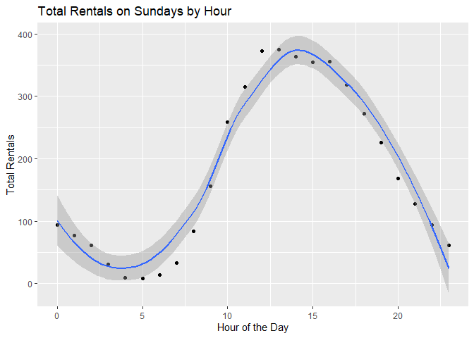
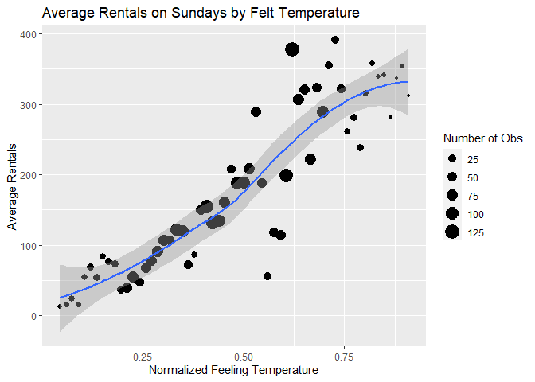
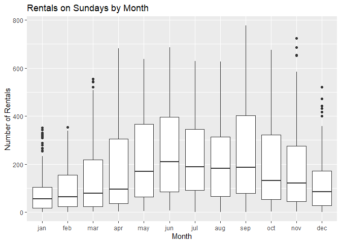
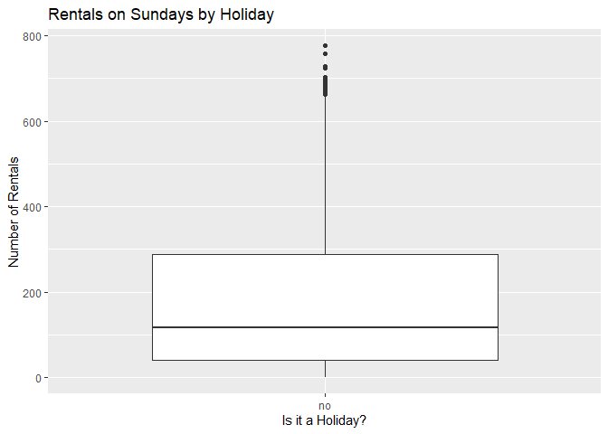
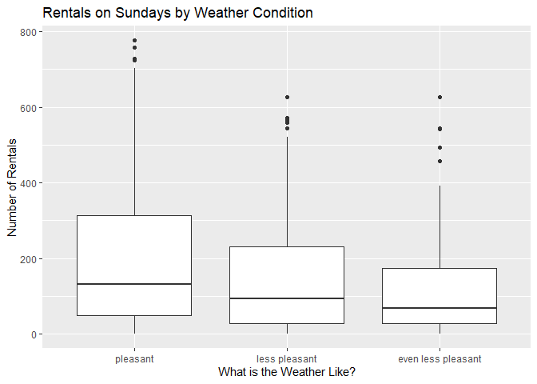

Joshua Burrows Project 2
================
16 October 2020

  - [Bike Rentals on Sundays:
    Introduction](#bike-rentals-on-sundays-introduction)
  - [Read in Data](#read-in-data)
      - [Get Bikes Data](#get-bikes-data)
      - [Factors](#factors)
      - [Filter by Day](#filter-by-day)
  - [Exploratory Data Analysis](#exploratory-data-analysis)
      - [Quantitative Predictors](#quantitative-predictors)
          - [Correlations](#correlations)
          - [Hour](#hour)
          - [Temperature](#temperature)
          - [Felt Temperature](#felt-temperature)
          - [Humidity](#humidity)
          - [Windspeed](#windspeed)
      - [Categorical Predictors](#categorical-predictors)
          - [Helper Function](#helper-function)
          - [Season](#season)
          - [Year](#year)
          - [Month](#month)
          - [Holiday](#holiday)
          - [Working Day](#working-day)
          - [Weather Condition](#weather-condition)
  - [Train Models](#train-models)
      - [Split Data](#split-data)
      - [Non-Ensemble Tree](#non-ensemble-tree)
          - [Training](#training)
              - [Tree Models](#tree-models)
              - [Tuning Parameter](#tuning-parameter)
              - [Create the Model](#create-the-model)
          - [Model Information](#model-information)
      - [Boosted Tree](#boosted-tree)
          - [Training](#training-1)
              - [Boosted Tree Models](#boosted-tree-models)
              - [Tuning Paremeters](#tuning-paremeters)
              - [Create the Model](#create-the-model-1)
          - [Model Information](#model-information-1)
  - [Test Models](#test-models)
  - [Best Model](#best-model)

# Bike Rentals on Sundays: Introduction

This document walks though the process of creating a model to predict
the number of bikes that will be rented on sundays.

I compared two models - a *non-ensemble tree* and a *boosted tree* - and
picked the one that does better. These models use the following
predictor variables:

  - yr: year (2011 or 2012)  
  - mnth: month  
  - hr: hour of the day  
  - holiday: whether the day is a holiday  
  - weathersit: weather condition
      - pleasant: clear, few clouds, partly cloudy  
      - less pleasant: mist, mist + cloudy, mist + broken clouds, mist +
        few clouds  
      - even less pleasant: light snow, light Rain + scattered clouds,
        light rain + thunderstorm + scattered clouds  
      - downright unpleasant: snow + fog, heavy rain + ice pallets +
        thunderstorm + mist  
  - temp: normalized temperature in celsius  
  - hum: normalized humidity  
  - windspeed: normalized windspeed

You can return to the homepage for this project by clicking
[here](README.md).

# Read in Data

## Get Bikes Data

Read in data that has been downloaded from [the UCI Machine Learning
Library](https://archive.ics.uci.edu/ml/datasets/Bike+Sharing+Dataset).

``` r
bikes <- read_csv(file = "../Bike-Sharing-Dataset/hour.csv")

bikes %>%
  head() %>%
  kable()
```

| instant | dteday     | season | yr | mnth | hr | holiday | weekday | workingday | weathersit | temp |  atemp |  hum | windspeed | casual | registered | cnt |
| ------: | :--------- | -----: | -: | ---: | -: | ------: | ------: | ---------: | ---------: | ---: | -----: | ---: | --------: | -----: | ---------: | --: |
|       1 | 2011-01-01 |      1 |  0 |    1 |  0 |       0 |       6 |          0 |          1 | 0.24 | 0.2879 | 0.81 |    0.0000 |      3 |         13 |  16 |
|       2 | 2011-01-01 |      1 |  0 |    1 |  1 |       0 |       6 |          0 |          1 | 0.22 | 0.2727 | 0.80 |    0.0000 |      8 |         32 |  40 |
|       3 | 2011-01-01 |      1 |  0 |    1 |  2 |       0 |       6 |          0 |          1 | 0.22 | 0.2727 | 0.80 |    0.0000 |      5 |         27 |  32 |
|       4 | 2011-01-01 |      1 |  0 |    1 |  3 |       0 |       6 |          0 |          1 | 0.24 | 0.2879 | 0.75 |    0.0000 |      3 |         10 |  13 |
|       5 | 2011-01-01 |      1 |  0 |    1 |  4 |       0 |       6 |          0 |          1 | 0.24 | 0.2879 | 0.75 |    0.0000 |      0 |          1 |   1 |
|       6 | 2011-01-01 |      1 |  0 |    1 |  5 |       0 |       6 |          0 |          2 | 0.24 | 0.2576 | 0.75 |    0.0896 |      0 |          1 |   1 |

## Factors

Convert categorical variables to factors.

``` r
bikes$weekday <- as.factor(bikes$weekday)
levels(bikes$weekday) <- c("Sunday", "Monday", "Tuesday", "Wednesday", "Thursday", "Friday", "Saturday")

bikes$season <- as.factor(bikes$season)
levels(bikes$season) <- c("winter", "spring", "summer", "fall")

bikes$yr <- as.factor(bikes$yr)
levels(bikes$yr) <- c("2011", "2012")

bikes$mnth <- as.factor(bikes$mnth)
levels(bikes$mnth) <- c("jan", "feb", "mar", "apr", "may", "jun", "jul", "aug", "sep", "oct", "nov", "dec")

bikes$weathersit <- as.factor(bikes$weathersit)
levels(bikes$weathersit) <- c("pleasant", "less pleasant", "even less pleasant", "downright unpleasant")

bikes$holiday <- as.factor(bikes$holiday)
levels(bikes$holiday) <- c("no", "yes")

bikes$workingday <- as.factor(bikes$workingday)
levels(bikes$workingday) <- c("no", "yes")

bikes %>%
  head() %>%
  kable()
```

| instant | dteday     | season | yr   | mnth | hr | holiday | weekday  | workingday | weathersit    | temp |  atemp |  hum | windspeed | casual | registered | cnt |
| ------: | :--------- | :----- | :--- | :--- | -: | :------ | :------- | :--------- | :------------ | ---: | -----: | ---: | --------: | -----: | ---------: | --: |
|       1 | 2011-01-01 | winter | 2011 | jan  |  0 | no      | Saturday | no         | pleasant      | 0.24 | 0.2879 | 0.81 |    0.0000 |      3 |         13 |  16 |
|       2 | 2011-01-01 | winter | 2011 | jan  |  1 | no      | Saturday | no         | pleasant      | 0.22 | 0.2727 | 0.80 |    0.0000 |      8 |         32 |  40 |
|       3 | 2011-01-01 | winter | 2011 | jan  |  2 | no      | Saturday | no         | pleasant      | 0.22 | 0.2727 | 0.80 |    0.0000 |      5 |         27 |  32 |
|       4 | 2011-01-01 | winter | 2011 | jan  |  3 | no      | Saturday | no         | pleasant      | 0.24 | 0.2879 | 0.75 |    0.0000 |      3 |         10 |  13 |
|       5 | 2011-01-01 | winter | 2011 | jan  |  4 | no      | Saturday | no         | pleasant      | 0.24 | 0.2879 | 0.75 |    0.0000 |      0 |          1 |   1 |
|       6 | 2011-01-01 | winter | 2011 | jan  |  5 | no      | Saturday | no         | less pleasant | 0.24 | 0.2576 | 0.75 |    0.0896 |      0 |          1 |   1 |

## Filter by Day

Grab the data for sunday.

``` r
dayData <- bikes %>% filter(weekday == params$day)

dayData %>%
  head() %>%
  kable()
```

| instant | dteday     | season | yr   | mnth | hr | holiday | weekday | workingday | weathersit         | temp |  atemp |  hum | windspeed | casual | registered | cnt |
| ------: | :--------- | :----- | :--- | :--- | -: | :------ | :------ | :--------- | :----------------- | ---: | -----: | ---: | --------: | -----: | ---------: | --: |
|      25 | 2011-01-02 | winter | 2011 | jan  |  0 | no      | Sunday  | no         | less pleasant      | 0.46 | 0.4545 | 0.88 |    0.2985 |      4 |         13 |  17 |
|      26 | 2011-01-02 | winter | 2011 | jan  |  1 | no      | Sunday  | no         | less pleasant      | 0.44 | 0.4394 | 0.94 |    0.2537 |      1 |         16 |  17 |
|      27 | 2011-01-02 | winter | 2011 | jan  |  2 | no      | Sunday  | no         | less pleasant      | 0.42 | 0.4242 | 1.00 |    0.2836 |      1 |          8 |   9 |
|      28 | 2011-01-02 | winter | 2011 | jan  |  3 | no      | Sunday  | no         | less pleasant      | 0.46 | 0.4545 | 0.94 |    0.1940 |      2 |          4 |   6 |
|      29 | 2011-01-02 | winter | 2011 | jan  |  4 | no      | Sunday  | no         | less pleasant      | 0.46 | 0.4545 | 0.94 |    0.1940 |      2 |          1 |   3 |
|      30 | 2011-01-02 | winter | 2011 | jan  |  6 | no      | Sunday  | no         | even less pleasant | 0.42 | 0.4242 | 0.77 |    0.2985 |      0 |          2 |   2 |

# Exploratory Data Analysis

I started with a little bit of exploratory data analysis. The goal is to
look at the relationships between the predictors and number of bike
rentals.

## Quantitative Predictors

### Correlations

Visualize the strength of the relationships between the quantitative
predictors.

Unsurprisingly, *atemp* and *temp* are strongly correlated. *atemp*
represents the heat index, which is typically calculated using
temperature and humidity. So it makes sense to either eliminate *atemp*
from the model or keep *atemp* but eliminate *temp* and *hum*. I decided
to eliminate *atemp*.

``` r
corr <- dayData %>%
  select(temp, atemp, windspeed, hum) %>%
  cor()

corrplot(corr)
```

<!-- -->

### Hour

Create a scatter plot to investigate the relationship between time of
day and rentals on sundays. Fit a line through the points to get a basic
idea of their relationship.

``` r
avgRentals <- dayData %>%
  group_by(hr) %>%
  summarize(meanRentals = mean(cnt))

corrHour <- cor(avgRentals$hr, avgRentals$meanRentals)

ggplot(avgRentals, aes(x = hr, y = meanRentals)) +
  geom_point() +
  labs(title = paste0("Total Rentals on ", paste0(params$day, "s"), " by Hour"), x = "Hour of the Day", y = "Total Rentals") +
  geom_smooth()
```

<!-- -->

The correlation between hour and average rentals is 0.4426479.

Be careful, correlation measures straight line relationships, so if the
plot above shows a curved relationship, correlation may not be a useful
measure.

### Temperature

Create a scatter plot to investigate the relationship between
temperature and number of rentals on sundays. Fit a line through the
points to get a basic idea of their relationship.

The size of the dots represents the number of observations at each
temperature.

``` r
tempAvg <- dayData %>%
  group_by(temp) %>%
  summarize(avgRentals = mean(cnt), n = n())

corrTemp <- cor(tempAvg$temp, tempAvg$avgRentals)

ggplot(tempAvg, aes(x = temp, y = avgRentals)) +
  geom_point(aes(size = n)) +
  geom_smooth() +
  labs(title = paste0("Average Rentals on ", paste0(params$day, "s"), " by Temperature"), x = "Normalized Temperature", y = "Average Rentals") +
  scale_size_continuous(name = "Number of Obs")
```

<!-- -->

The correlation between temperature and average rentals is 0.9710369.

Be careful, correlation measures straight line relationships, so if the
plot above shows a curved relationship, correlation may not be a useful
measure.

### Felt Temperature

Create a scatter plot to investigate the relationship between felt
temperature and number of rentals on sundays. Fit a line through the
points to get a basic idea of their relationship.

The size of the dots represents the number of observations at each felt
temperatrure.

As already noted, it does not make much sense to keep *atemp* if *temp*
and *hum* will be in the model, so I eliminated *atemp* from the model.

``` r
atempAvg <- dayData %>%
  group_by(atemp) %>%
  summarize(avgRentals = mean(cnt), n = n())

corrATemp <- cor(atempAvg$atemp, atempAvg$avgRentals)

ggplot(atempAvg, aes(x = atemp, y = avgRentals)) +
  geom_point(aes(size = n)) +
  geom_smooth() +
  labs(title = paste0("Average Rentals on ", paste0(params$day, "s"), " by Felt Temperature"), x = "Normalized Feeling Temperature", y = "Average Rentals") +
  scale_size_continuous(name = "Number of Obs")
```

<!-- -->

The correlation between felt temperature and average rentals is
0.9046467.

Be careful, correlation measures straight line relationships, so if the
plot above shows a curved relationship, correlation may not be a useful
measure.

### Humidity

Create a scatter plot to investigate the relationship between humidity
and number of rentals on sundays. Fit a line through the points to get a
basic idea of their relationship.

The size of the dots represents the number of observations at each
humidity level.

``` r
humAvg <- dayData %>%
  group_by(hum) %>%
  summarize(avgRentals = mean(cnt), n = n())

corrHum <- cor(humAvg$hum, humAvg$avgRentals)

ggplot(humAvg, aes(x = hum, y = avgRentals)) +
  geom_point(aes(size = n)) +
  geom_smooth() +
  labs(title = paste0("Average Rentals on ", paste0(params$day, "s"), " by Humidity"), x = "Normalized Humidity", y = "Average Rentals") +
  scale_size_continuous(name = "Number of Obs")
```

<!-- -->

The correlation between humidity and average rentals is -0.8857646.

Be careful, correlation measures straight line relationships, so if the
plot above shows a curved relationship, correlation may not be a useful
measure.

### Windspeed

Create a scatter plot to investigate the relationship between windspeed
and number of rentals on sundays. Fit a line through the points to get a
basic idea of their relationship.

The size of the dots represents the number of observations at each
windspeed.

``` r
windAvg <- dayData %>%
  group_by(windspeed) %>%
  summarize(avgRentals = mean(cnt), n = n())

corrWind <- cor(windAvg$windspeed, windAvg$avgRentals)

ggplot(windAvg, aes(x = windspeed, y = avgRentals)) +
  geom_point(aes(size = n)) +
  geom_smooth() +
  labs(title = paste0("Average Rentals on ", paste0(params$day, "s"), " by Windspeed"), x = "Normalized Windspeed", y = "Average Rentals") +
  scale_size_continuous(name = "Number of Obs")
```

<!-- -->

The correlation between windspeed and average rentals is -0.2271752.

Be careful, correlation measures straight line relationships, so if the
plot above shows a curved relationship, correlation may not be a useful
measure.

## Categorical Predictors

### Helper Function

Create a helper function to display basic numeric summaries for a given
grouping variable.

``` r
getSum <- function(varName, colName) {
  sum <- dayData %>%
    group_by(dayData[[varName]]) %>%
    summarize(min = min(cnt), Q1 = quantile(cnt, probs = c(.25), names = FALSE), median = median(cnt), mean = mean(cnt), Q3 = quantile(cnt, probs = c(.75), names = FALSE), max = max(cnt), obs = n())

  output <- sum %>% kable(col.names = c(colName, "Minimum", "1st Quartile", "Median", "Mean", "3rd Quartile", "Maximum", "Number of Observations"))

  return(output)
}
```

### Season

Explore how bike rentals on sundays change with the seasons using a
basic numeric summary and a boxplot. The boxplot can be used to identify
outliers.

It does not make much sense to keep both *season* and *mnth* in the
model, so I decided to eliminate *season*.

``` r
getSum(varName = "season", colName = "Season")
```

| Season | Minimum | 1st Quartile | Median |      Mean | 3rd Quartile | Maximum | Number of Observations |
| :----- | ------: | -----------: | -----: | --------: | -----------: | ------: | ---------------------: |
| winter |       1 |           20 |   59.0 |  94.34953 |       126.75 |     554 |                    638 |
| spring |       2 |           47 |  143.0 | 208.10594 |       358.00 |     686 |                    623 |
| summer |       1 |           73 |  186.0 | 224.36143 |       356.00 |     757 |                    617 |
| fall   |       1 |           50 |  125.5 | 185.49840 |       293.50 |     776 |                    624 |

``` r
ggplot(dayData, aes(x = season, y = cnt)) +
  geom_boxplot() +
  labs(title = paste0("Rentals on ", paste0(params$day, "s"), " by Season"), x = "Season", y = "Number of Rentals")
```

<!-- -->

### Year

Looking at total rentals each year gives us some idea of the long term
trend in bike rentals on sundays. It would be helpful to have data from
more years, though.

``` r
yearSum <- dayData %>%
  group_by(yr) %>%
  summarize(totalRentals = sum(cnt))

yearSum %>% kable(col.names = c("Year", "Total Rentals"))
```

| Year | Total Rentals |
| :--- | ------------: |
| 2011 |        177074 |
| 2012 |        266953 |

### Month

Explore how bike rentals on sundays change depending on the month.

As already noted, it is probably not worth including *mnth* and *season*
in the model, so *season* has been eliminated.

``` r
getSum(varName = "mnth", colName = "Month")
```

| Month | Minimum | 1st Quartile | Median |      Mean | 3rd Quartile | Maximum | Number of Observations |
| :---- | ------: | -----------: | -----: | --------: | -----------: | ------: | ---------------------: |
| jan   |       1 |        18.00 |   55.0 |  76.62025 |       105.00 |     351 |                    237 |
| feb   |       1 |        23.00 |   63.0 |  95.13228 |       154.00 |     353 |                    189 |
| mar   |       2 |        23.00 |   78.5 | 140.46809 |       218.75 |     554 |                    188 |
| apr   |       3 |        36.00 |   95.5 | 184.03704 |       304.50 |     681 |                    216 |
| may   |       5 |        63.25 |  169.5 | 221.67593 |       366.25 |     637 |                    216 |
| jun   |       6 |        85.50 |  209.5 | 247.51562 |       396.25 |     686 |                    192 |
| jul   |       1 |        90.75 |  189.5 | 220.75417 |       346.00 |     628 |                    240 |
| aug   |       1 |        66.00 |  183.0 | 203.37297 |       313.00 |     626 |                    185 |
| sep   |       1 |        78.25 |  187.5 | 256.64815 |       403.25 |     776 |                    216 |
| oct   |       3 |        53.25 |  132.0 | 197.28704 |       322.75 |     675 |                    216 |
| nov   |       2 |        43.75 |  121.5 | 171.92188 |       276.25 |     724 |                    192 |
| dec   |       1 |        27.50 |   85.0 | 114.69302 |       171.50 |     520 |                    215 |

``` r
ggplot(dayData, aes(x = mnth, y = cnt)) +
  geom_boxplot() +
  labs(title = paste0("Rentals on ", paste0(params$day, "s"), " by Month"), x = "Month", y = "Number of Rentals")
```

<!-- -->

### Holiday

Explore how bike rentals change depending on whether the sunday in
question is a holiday.

Note: There are no holidays on Saturday or Sunday because the holiday
data has been extracted from the [Washington D.C. HR Department’s
Holiday Schedule](https://dchr.dc.gov/page/holiday-schedules), which
only lists holidays that fall during the work week.

``` r
getSum(varName = "holiday", colName = "Holiday")
```

| Holiday | Minimum | 1st Quartile | Median |     Mean | 3rd Quartile | Maximum | Number of Observations |
| :------ | ------: | -----------: | -----: | -------: | -----------: | ------: | ---------------------: |
| no      |       1 |           40 |    116 | 177.4688 |          288 |     776 |                   2502 |

``` r
ggplot(dayData, aes(x = holiday, y = cnt)) +
  geom_boxplot() +
  labs(title = paste0("Rentals on ", paste0(params$day, "s"), " by Holiday"), x = "Is it a Holiday?", y = "Number of Rentals")
```

<!-- -->

### Working Day

Explore how bike rentals change depending on whether the day in question
is a working day.

Working days are neither weekends nor holidays. I decided not to keep
this variable in the model because it wouldn’t make much sense in the
reports for Saturday and Sunday.

``` r
getSum(varName = "workingday", colName = "Working Day")
```

| Working Day | Minimum | 1st Quartile | Median |     Mean | 3rd Quartile | Maximum | Number of Observations |
| :---------- | ------: | -----------: | -----: | -------: | -----------: | ------: | ---------------------: |
| no          |       1 |           40 |    116 | 177.4688 |          288 |     776 |                   2502 |

``` r
ggplot(dayData, aes(x = workingday, y = cnt)) +
  geom_boxplot() +
  labs(title = paste0("Rentals on ", paste0(params$day, "s"), " by Working Day"), x = "Is it a Working Day?", y = "Number of Rentals")
```

<!-- -->

### Weather Condition

Explore how bike rentals on sundays change depending on the weather.

``` r
getSum(varName = "weathersit", colName = "Weather Condition")
```

| Weather Condition  | Minimum | 1st Quartile | Median |     Mean | 3rd Quartile | Maximum | Number of Observations |
| :----------------- | ------: | -----------: | -----: | -------: | -----------: | ------: | ---------------------: |
| pleasant           |       1 |           49 |    132 | 194.6703 |          314 |     776 |                   1765 |
| less pleasant      |       1 |           28 |     93 | 142.1778 |          230 |     626 |                    568 |
| even less pleasant |       1 |           27 |     68 | 116.4320 |          173 |     626 |                    169 |

``` r
ggplot(dayData, aes(x = weathersit, y = cnt)) +
  geom_boxplot() +
  labs(title = paste0("Rentals on ", paste0(params$day, "s"), " by Weather Condition"), x = "What is the Weather Like?", y = "Number of Rentals")
```

<!-- -->

# Train Models

After exploring the data, I created two models, a non-ensemble tree and
a boosted tree.

## Split Data

Split the data into a training set and a test set. The training set is
used to build the models, and the test set is used to evaluate them.

``` r
set.seed(123)
trainIndex <- createDataPartition(dayData$cnt, p = .75, list = FALSE)

train <- dayData[trainIndex, ]
test <- dayData[-trainIndex, ]
```

## Non-Ensemble Tree

### Training

Fit a non-ensemble tree model.

#### Tree Models

Tree models split each predictor space into regions and make a different
prediction for each region. For example, suppose we are interested in
predicting life expectancy based on exercise habits. We might split the
predictor space into **exercises less than one hour a week** and
**exercises at least one hour a week** and then predict that people in
the second group live longer.

How do we decide whether to split at one hour, one and a half hours, two
hours, etc? This decision is made using a method called “Recursive
Binary Splitting”, which we don’t have to worry about too much because
the *caret* package does it for us.

Ensemble tree models fit lots of trees and then average their results.
Here I have created a basic non-ensemble tree to model bicycle rentals.

#### Tuning Parameter

This model has one “tuning parameter” called *cp*. *cp* stands for
“Complexity Parameter”, and it controls the number of “nodes” that the
tree has.

The life expectancy example above has two terminal nodes: **less than
one hour** and **at least one hour**. We could complicate the example by
adding additional nodes. For instance, we could divide the group **less
than one hour** into two subgroups: **less than half an hour** and
**greater than half an hour but less than one hour**. And we could
divide **at least one hour a week** into **less than two hours but at
least one hour** and **greater than two hours**.

Sometimes increasing the number of nodes makes your model better, but
sometimes it makes it worse. There are lots of different methods for
picking the best number of nodes. For the bicycle rental model, I used a
method called “Leave One Out Cross Validation”.

*LOOCV* works by removing an observation from the data set, using the
rest of the data to create a model, and then seeing how well that model
does at predicting the observation that was left out. This process is
repeated for every observation, and the results are combined.

If we want to compare two different values of *cp*, we will go through
the *LOOCV* process twice and compare the results. In this way, we can
test different values of *cp* to see which one performs best.

I used the *caret* package to test 10 different values of *cp*.

#### Create the Model

``` r
set.seed(123)
tree <- train(cnt ~ yr + mnth + hr + holiday + weathersit + temp + hum + windspeed,
  data = train,
  method = "rpart",
  trControl = trainControl(method = "LOOCV"),
  tuneLength = 10
)
```

### Model Information

My final non-ensemble tree model uses a *cp* of 0.0081939. Its root mean
square error on the training set is 78.6768785.

More information about this model is below.

``` r
tree
```

    ## CART 
    ## 
    ## 1878 samples
    ##    8 predictor
    ## 
    ## No pre-processing
    ## Resampling: Leave-One-Out Cross-Validation 
    ## Summary of sample sizes: 1877, 1877, 1877, 1877, 1877, 1877, ... 
    ## Resampling results across tuning parameters:
    ## 
    ##   cp           RMSE       Rsquared   
    ##   0.008147515   78.68687  0.783048629
    ##   0.008193910   78.67688  0.783127468
    ##   0.010022046   83.30876  0.757029635
    ##   0.016664711   85.11336  0.746815142
    ##   0.018774305   89.11208  0.721843123
    ##   0.045389736   96.35193  0.675074565
    ##   0.055565828  105.18350  0.613085367
    ##   0.128411254  122.06696  0.490138975
    ##   0.179984368  152.61953  0.220727007
    ##   0.345081710  178.01990  0.001225679
    ##   MAE      
    ##    59.85957
    ##    59.77172
    ##    62.13171
    ##    62.78849
    ##    66.73530
    ##    74.36512
    ##    80.43099
    ##    91.69718
    ##   120.26482
    ##   159.99444
    ## 
    ## RMSE was used to select the
    ##  optimal model using the
    ##  smallest value.
    ## The final value used for the model
    ##  was cp = 0.00819391.

``` r
plot(tree$finalModel)
text(tree$finalModel)
```

<!-- -->

## Boosted Tree

### Training

#### Boosted Tree Models

Boosted trees are another type of tree model. “Boosting” works by
fitting a series of trees, each of which is a modified version of the
previous tree. The idea is to hone in on the best model.

#### Tuning Paremeters

Four tuning parameters are involved:  
\- *n.trees*: number of boosting iterations  
\- *interaction.depth*: maximum tree depth  
\- *shrinkage*: how strongly each subsequent tree is influenced by the
previous tree  
\- *n.minobsinnode*: minimum terminal node size

Values for the tuning parameters are found using Cross Validation. Cross
Validation works by splitting the data into groups called “folds”. One
fold is left out, the rest are used to create a model, and then that
model is tested on the fold that was left out. This process is repeated
for each fold, and the results are combined. It should be clear that
*LOOCV* is just *CV* with the number of folds equal to the number of
observations.

I used the *caret* package to test 81 different combinations of tuning
parameters.

#### Create the Model

``` r
tuneGr <- expand.grid(
  n.trees = seq(from = 50, to = 150, by = 50),
  interaction.depth = 1:3,
  shrinkage = seq(from = .05, to = .15, by = .05),
  n.minobsinnode = 9:11
)

set.seed(123)
boostTree <- train(cnt ~ yr + mnth + hr + holiday + weathersit + temp + hum + windspeed,
  data = train,
  method = "gbm",
  trControl = trainControl(method = "cv", number = 10),
  tuneGrid = tuneGr,
  verbose = FALSE
)
```

### Model Information

My final boosted tree model uses the following tuning parameters:

  - *n.trees*: 150  
  - *interaction.depth*: 3  
  - *shrinkage*: 0.15  
  - *n.minobsinnode*: 10

Its root mean square error on the training set is 45.3176349.

More information about this model is below.

``` r
boostTree
```

    ## Stochastic Gradient Boosting 
    ## 
    ## 1878 samples
    ##    8 predictor
    ## 
    ## No pre-processing
    ## Resampling: Cross-Validated (10 fold) 
    ## Summary of sample sizes: 1690, 1690, 1691, 1691, 1691, 1691, ... 
    ## Resampling results across tuning parameters:
    ## 
    ##   shrinkage  interaction.depth
    ##   0.05       1                
    ##   0.05       1                
    ##   0.05       1                
    ##   0.05       1                
    ##   0.05       1                
    ##   0.05       1                
    ##   0.05       1                
    ##   0.05       1                
    ##   0.05       1                
    ##   0.05       2                
    ##   0.05       2                
    ##   0.05       2                
    ##   0.05       2                
    ##   0.05       2                
    ##   0.05       2                
    ##   0.05       2                
    ##   0.05       2                
    ##   0.05       2                
    ##   0.05       3                
    ##   0.05       3                
    ##   0.05       3                
    ##   0.05       3                
    ##   0.05       3                
    ##   0.05       3                
    ##   0.05       3                
    ##   0.05       3                
    ##   0.05       3                
    ##   0.10       1                
    ##   0.10       1                
    ##   0.10       1                
    ##   0.10       1                
    ##   0.10       1                
    ##   0.10       1                
    ##   0.10       1                
    ##   0.10       1                
    ##   0.10       1                
    ##   0.10       2                
    ##   0.10       2                
    ##   0.10       2                
    ##   0.10       2                
    ##   0.10       2                
    ##   0.10       2                
    ##   0.10       2                
    ##   0.10       2                
    ##   0.10       2                
    ##   0.10       3                
    ##   0.10       3                
    ##   0.10       3                
    ##   0.10       3                
    ##   0.10       3                
    ##   0.10       3                
    ##   0.10       3                
    ##   0.10       3                
    ##   0.10       3                
    ##   0.15       1                
    ##   0.15       1                
    ##   0.15       1                
    ##   0.15       1                
    ##   0.15       1                
    ##   0.15       1                
    ##   0.15       1                
    ##   0.15       1                
    ##   0.15       1                
    ##   0.15       2                
    ##   0.15       2                
    ##   0.15       2                
    ##   0.15       2                
    ##   0.15       2                
    ##   0.15       2                
    ##   0.15       2                
    ##   0.15       2                
    ##   0.15       2                
    ##   0.15       3                
    ##   0.15       3                
    ##   0.15       3                
    ##   0.15       3                
    ##   0.15       3                
    ##   0.15       3                
    ##   0.15       3                
    ##   0.15       3                
    ##   0.15       3                
    ##   n.minobsinnode  n.trees  RMSE     
    ##    9               50      115.49487
    ##    9              100       96.54152
    ##    9              150       87.32887
    ##   10               50      115.54675
    ##   10              100       96.60309
    ##   10              150       87.34776
    ##   11               50      115.67762
    ##   11              100       96.64362
    ##   11              150       87.44576
    ##    9               50       84.01723
    ##    9              100       68.31408
    ##    9              150       62.82747
    ##   10               50       84.00238
    ##   10              100       68.44251
    ##   10              150       62.99492
    ##   11               50       84.16304
    ##   11              100       68.20694
    ##   11              150       62.78509
    ##    9               50       70.33926
    ##    9              100       56.33892
    ##    9              150       51.50185
    ##   10               50       70.45999
    ##   10              100       56.71411
    ##   10              150       51.75119
    ##   11               50       70.44895
    ##   11              100       56.54102
    ##   11              150       51.44392
    ##    9               50       96.23885
    ##    9              100       82.56516
    ##    9              150       77.87010
    ##   10               50       96.08308
    ##   10              100       82.47086
    ##   10              150       77.71621
    ##   11               50       96.12911
    ##   11              100       82.55025
    ##   11              150       77.71259
    ##    9               50       68.36390
    ##    9              100       59.56657
    ##    9              150       56.16871
    ##   10               50       68.47923
    ##   10              100       60.16667
    ##   10              150       56.77416
    ##   11               50       68.19556
    ##   11              100       59.56379
    ##   11              150       56.33116
    ##    9               50       56.45837
    ##    9              100       49.21547
    ##    9              150       46.84382
    ##   10               50       56.76515
    ##   10              100       49.23863
    ##   10              150       46.70109
    ##   11               50       56.25667
    ##   11              100       49.22376
    ##   11              150       46.70776
    ##    9               50       87.07226
    ##    9              100       77.74974
    ##    9              150       74.43873
    ##   10               50       87.01583
    ##   10              100       77.81590
    ##   10              150       74.37356
    ##   11               50       87.08949
    ##   11              100       77.81982
    ##   11              150       74.32399
    ##    9               50       63.14044
    ##    9              100       56.71563
    ##    9              150       54.39893
    ##   10               50       62.80983
    ##   10              100       56.60843
    ##   10              150       54.20784
    ##   11               50       62.69844
    ##   11              100       56.62712
    ##   11              150       54.06428
    ##    9               50       51.83829
    ##    9              100       47.08229
    ##    9              150       45.49403
    ##   10               50       51.61124
    ##   10              100       47.08137
    ##   10              150       45.31763
    ##   11               50       52.15689
    ##   11              100       47.46909
    ##   11              150       45.84182
    ##   Rsquared   MAE     
    ##   0.6525987  88.34291
    ##   0.7373888  72.08095
    ##   0.7639900  65.57623
    ##   0.6534606  88.35230
    ##   0.7367589  71.88098
    ##   0.7627598  65.45596
    ##   0.6490784  88.49956
    ##   0.7374084  71.94073
    ##   0.7632354  65.52150
    ##   0.8094377  62.99203
    ##   0.8505767  49.94730
    ##   0.8693025  45.83457
    ##   0.8092237  63.00458
    ##   0.8496543  50.13580
    ##   0.8682145  46.02619
    ##   0.8085231  63.23791
    ##   0.8502415  50.06193
    ##   0.8689717  46.00646
    ##   0.8608250  54.27305
    ##   0.8951089  41.27730
    ##   0.9097446  36.59742
    ##   0.8593950  54.26847
    ##   0.8937650  41.47978
    ##   0.9086633  36.73248
    ##   0.8598389  54.45317
    ##   0.8940303  41.43830
    ##   0.9097767  36.61499
    ##   0.7346413  71.52541
    ##   0.7764006  62.69131
    ##   0.7951522  59.66035
    ##   0.7371941  71.61394
    ##   0.7779556  62.66434
    ##   0.7961332  59.70681
    ##   0.7360448  71.82460
    ##   0.7770468  62.80261
    ##   0.7957362  59.64530
    ##   0.8492355  50.19534
    ##   0.8798940  43.54104
    ##   0.8915337  41.31668
    ##   0.8477019  50.27175
    ##   0.8770830  43.98871
    ##   0.8889727  41.74095
    ##   0.8504568  50.12158
    ##   0.8804607  43.71574
    ##   0.8911038  41.53455
    ##   0.8944334  41.32120
    ##   0.9164727  35.22489
    ##   0.9236279  33.57026
    ##   0.8929070  41.66554
    ##   0.9162887  35.19350
    ##   0.9240805  33.31268
    ##   0.8947637  41.12727
    ##   0.9163726  35.08911
    ##   0.9241075  33.34546
    ##   0.7604380  65.28632
    ##   0.7949983  59.52620
    ##   0.8092279  57.56101
    ##   0.7616098  65.43482
    ##   0.7948410  59.83563
    ##   0.8092541  57.50763
    ##   0.7622887  65.51186
    ##   0.7952414  59.69617
    ##   0.8098801  57.60150
    ##   0.8665180  46.64345
    ##   0.8890301  42.01916
    ##   0.8972509  40.19338
    ##   0.8676777  46.23723
    ##   0.8897842  41.90787
    ##   0.8978529  40.17904
    ##   0.8688240  46.04150
    ##   0.8895756  41.70360
    ##   0.8987193  39.89354
    ##   0.9076738  36.96650
    ##   0.9225151  33.40331
    ##   0.9275831  32.30612
    ##   0.9088067  36.91814
    ##   0.9226939  33.42867
    ##   0.9282739  32.12123
    ##   0.9070428  37.03708
    ##   0.9215163  33.69441
    ##   0.9266201  32.60459
    ## 
    ## RMSE was used to select the
    ##  optimal model using the
    ##  smallest value.
    ## The final values used for the
    ##  shrinkage = 0.15 and n.minobsinnode
    ##  = 10.

# Test Models

I tested the models on the test set and selected the model that
performed best.

Performance was measured using Root Mean Square Error, which is a
measure of how close the model gets to correctly predicting the test
data. The RMSE for each model is displayed below.

``` r
treePreds <- predict(tree, test)
treeRMSE <- postResample(treePreds, test$cnt)[1]

boostPreds <- predict(boostTree, test)
boostRMSE <- postResample(boostPreds, test$cnt)[1]

modelPerformance <- data.frame(model = c("Non-Ensemble Tree", "Boosted Tree"), trainRMSE = c(min(tree$results$RMSE), min(boostTree$results$RMSE)), testRMSE = c(treeRMSE, boostRMSE))

modelPerformance %>% kable(col.names = c("Model", "Train RMSE", "Test RMSE"))
```

| Model             | Train RMSE | Test RMSE |
| :---------------- | ---------: | --------: |
| Non-Ensemble Tree |   78.67688 |  75.27749 |
| Boosted Tree      |   45.31763 |  45.81498 |

# Best Model

``` r
best <- modelPerformance %>% filter(testRMSE == min(testRMSE))
worst <- modelPerformance %>% filter(testRMSE == max(testRMSE))
```

The boosted tree performs better than the non-ensemble tree as judged by
RMSE on the test set.

The boosted tree model is saved to the `final` object below.

``` r
if (best$model == "Non-Ensemble Tree") {
  final <- tree
} else if (best$model == "Boosted Tree") {
  final <- boostTree
} else {
  stop("Error")
}

final$finalModel
```

    ## A gradient boosted model with gaussian loss function.
    ## 150 iterations were performed.
    ## There were 20 predictors of which 17 had non-zero influence.
