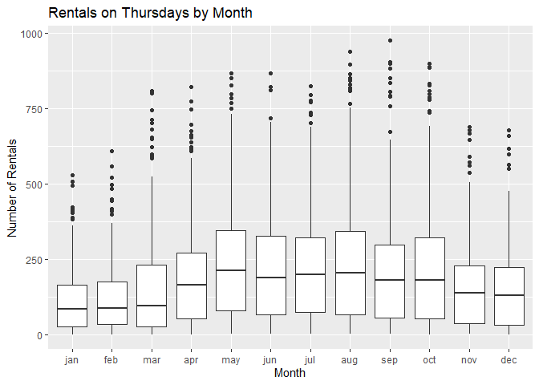
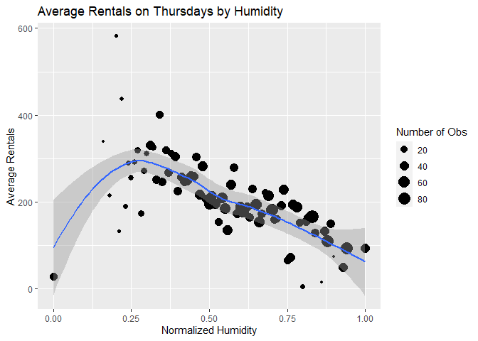

Joshua Burrows Project 2
================
16 October 2020

  - [Thursday: Introduction](#thursday-introduction)
  - [Read in Data](#read-in-data)
      - [Get Bikes Data](#get-bikes-data)
      - [Factors](#factors)
      - [Split by Day](#split-by-day)
  - [Exploratory Data Analysis](#exploratory-data-analysis)
      - [Correlations](#correlations)
      - [Summaries and Plots](#summaries-and-plots)
          - [Helper Function](#helper-function)
          - [Season](#season)
          - [Year](#year)
          - [Month](#month)
          - [Hour](#hour)
          - [Holiday](#holiday)
          - [Working Day](#working-day)
          - [Weather Condition](#weather-condition)
          - [Temperature](#temperature)
          - [Felt Temperature](#felt-temperature)
          - [Humidity](#humidity)
          - [Windspeed](#windspeed)
  - [Train Models](#train-models)
      - [Split Data](#split-data)
      - [Non-Ensemble Tree](#non-ensemble-tree)
          - [Training](#training)
          - [Model Information](#model-information)
      - [Boosted Tree](#boosted-tree)
          - [Train](#train)
          - [Model Information](#model-information-1)
  - [Test Models](#test-models)
  - [Best Model](#best-model)

# Thursday: Introduction

This document walks though the process of creating a model to predict
the number of bikes that will be rented on thursdays.

I compared two models - a *non-ensemble tree* and a *boosted tree* - and
picked the one that does better. These models use the following
predictor variables:

  - yr: year (2011 or 2012)  
  - mnth: month  
  - hr: hour of the day  
  - holiday: whether the day is a holiday  
  - weathersit: weather condition
      - pleasant: clear, few clouds, partly cloudy  
      - less pleasant: mist, mist + cloudy, mist + broken clouds, mist +
        few clouds  
      - even less pleasant: light snow, light Rain + scattered clouds,
        light rain + thunderstorm + scattered clouds  
      - downright unpleasant: snow + fog, heavy rain + ice pallets +
        thunderstorm + mist  
  - temp: normalized temperature in celsius  
  - hum: normalized humidity  
  - windspeed: normalized windspeed

You can return to the homepage for this project by clicking
[here](README.md).

# Read in Data

## Get Bikes Data

Read in data that has been downloaded from [the UCI Machine Learning
Library](https://archive.ics.uci.edu/ml/datasets/Bike+Sharing+Dataset).

``` r
bikes <- read_csv(file = "../Bike-Sharing-Dataset/hour.csv")

bikes %>% head() %>% kable()
```

| instant | dteday     | season | yr | mnth | hr | holiday | weekday | workingday | weathersit | temp |  atemp |  hum | windspeed | casual | registered | cnt |
| ------: | :--------- | -----: | -: | ---: | -: | ------: | ------: | ---------: | ---------: | ---: | -----: | ---: | --------: | -----: | ---------: | --: |
|       1 | 2011-01-01 |      1 |  0 |    1 |  0 |       0 |       6 |          0 |          1 | 0.24 | 0.2879 | 0.81 |    0.0000 |      3 |         13 |  16 |
|       2 | 2011-01-01 |      1 |  0 |    1 |  1 |       0 |       6 |          0 |          1 | 0.22 | 0.2727 | 0.80 |    0.0000 |      8 |         32 |  40 |
|       3 | 2011-01-01 |      1 |  0 |    1 |  2 |       0 |       6 |          0 |          1 | 0.22 | 0.2727 | 0.80 |    0.0000 |      5 |         27 |  32 |
|       4 | 2011-01-01 |      1 |  0 |    1 |  3 |       0 |       6 |          0 |          1 | 0.24 | 0.2879 | 0.75 |    0.0000 |      3 |         10 |  13 |
|       5 | 2011-01-01 |      1 |  0 |    1 |  4 |       0 |       6 |          0 |          1 | 0.24 | 0.2879 | 0.75 |    0.0000 |      0 |          1 |   1 |
|       6 | 2011-01-01 |      1 |  0 |    1 |  5 |       0 |       6 |          0 |          2 | 0.24 | 0.2576 | 0.75 |    0.0896 |      0 |          1 |   1 |

## Factors

Convert categorical variables to factors.

``` r
bikes$weekday <- as.factor(bikes$weekday)
levels(bikes$weekday) <- c("Sunday", "Monday", "Tuesday", "Wednesday", "Thursday", "Friday", "Saturday") 

bikes$season <- as.factor(bikes$season)
levels(bikes$season) <- c("winter", "spring", "summer", "fall")

bikes$yr <- as.factor(bikes$yr)
levels(bikes$yr) <- c("2011", "2012")

bikes$mnth <- as.factor(bikes$mnth)
levels(bikes$mnth) <- c("jan", "feb", "mar", "apr", "may", "jun", "jul", "aug", "sep", "oct", "nov", "dec")

bikes$weathersit <- as.factor(bikes$weathersit)
levels(bikes$weathersit) <- c("pleasant", "less pleasant", "even less pleasant", "downright unpleasant")

bikes$holiday <- as.factor(bikes$holiday)
levels(bikes$holiday) <- c("no", "yes")

bikes$workingday <- as.factor(bikes$workingday)
levels(bikes$workingday) <- c("no", "yes")

bikes %>% head() %>% kable()
```

| instant | dteday     | season | yr   | mnth | hr | holiday | weekday  | workingday | weathersit    | temp |  atemp |  hum | windspeed | casual | registered | cnt |
| ------: | :--------- | :----- | :--- | :--- | -: | :------ | :------- | :--------- | :------------ | ---: | -----: | ---: | --------: | -----: | ---------: | --: |
|       1 | 2011-01-01 | winter | 2011 | jan  |  0 | no      | Saturday | no         | pleasant      | 0.24 | 0.2879 | 0.81 |    0.0000 |      3 |         13 |  16 |
|       2 | 2011-01-01 | winter | 2011 | jan  |  1 | no      | Saturday | no         | pleasant      | 0.22 | 0.2727 | 0.80 |    0.0000 |      8 |         32 |  40 |
|       3 | 2011-01-01 | winter | 2011 | jan  |  2 | no      | Saturday | no         | pleasant      | 0.22 | 0.2727 | 0.80 |    0.0000 |      5 |         27 |  32 |
|       4 | 2011-01-01 | winter | 2011 | jan  |  3 | no      | Saturday | no         | pleasant      | 0.24 | 0.2879 | 0.75 |    0.0000 |      3 |         10 |  13 |
|       5 | 2011-01-01 | winter | 2011 | jan  |  4 | no      | Saturday | no         | pleasant      | 0.24 | 0.2879 | 0.75 |    0.0000 |      0 |          1 |   1 |
|       6 | 2011-01-01 | winter | 2011 | jan  |  5 | no      | Saturday | no         | less pleasant | 0.24 | 0.2576 | 0.75 |    0.0896 |      0 |          1 |   1 |

## Split by Day

Grab the data for thursday.

``` r
dayData <- bikes %>% filter(weekday == params$day)

dayData %>% head() %>% kable()
```

| instant | dteday     | season | yr   | mnth | hr | holiday | weekday  | workingday | weathersit    | temp |  atemp |  hum | windspeed | casual | registered | cnt |
| ------: | :--------- | :----- | :--- | :--- | -: | :------ | :------- | :--------- | :------------ | ---: | -----: | ---: | --------: | -----: | ---------: | --: |
|     116 | 2011-01-06 | winter | 2011 | jan  |  0 | no      | Thursday | yes        | pleasant      | 0.18 | 0.2424 | 0.55 |    0.0000 |      0 |         11 |  11 |
|     117 | 2011-01-06 | winter | 2011 | jan  |  1 | no      | Thursday | yes        | pleasant      | 0.16 | 0.2273 | 0.64 |    0.0000 |      0 |          4 |   4 |
|     118 | 2011-01-06 | winter | 2011 | jan  |  2 | no      | Thursday | yes        | pleasant      | 0.16 | 0.2273 | 0.64 |    0.0000 |      0 |          2 |   2 |
|     119 | 2011-01-06 | winter | 2011 | jan  |  4 | no      | Thursday | yes        | less pleasant | 0.16 | 0.1970 | 0.64 |    0.0896 |      0 |          1 |   1 |
|     120 | 2011-01-06 | winter | 2011 | jan  |  5 | no      | Thursday | yes        | less pleasant | 0.14 | 0.1818 | 0.69 |    0.0896 |      0 |          4 |   4 |
|     121 | 2011-01-06 | winter | 2011 | jan  |  6 | no      | Thursday | yes        | less pleasant | 0.14 | 0.1667 | 0.63 |    0.1045 |      0 |         36 |  36 |

# Exploratory Data Analysis

I started with a little bit of exploratory data analysis. The goal is to
look at the relationships between the predictors and number of bike
rentals.

## Correlations

Create a correlation plot for the quantitative predictors.

*atemp* represents the heat index, which is typically calculated using
temperature and humidity. So it makes sense to either eliminate *atemp*
from the model or keep *atemp* but eliminate *temp* and *hum*. I decided
to eliminate *atemp*.

``` r
corr <- dayData %>% select(temp, atemp, windspeed, hum) %>% cor()

corrplot(corr)
```

<!-- -->

## Summaries and Plots

Explore the relationship between the predictors and number of bikes
rented by creating some basic summaries and plots.

### Helper Function

Create a helper function to display basic numeric summaries for a given
grouping variable.

``` r
getSum <- function(varName, colName){ 
  
  sum <- dayData %>% group_by(dayData[[varName]]) %>% summarize(min = min(cnt), Q1 = quantile(cnt, probs = c(.25), names = FALSE), median = median(cnt), mean = mean(cnt), Q3 = quantile(cnt, probs = c(.75), names = FALSE), max = max(cnt), obs = n())
  
  output <- sum %>% kable(col.names = c(colName, "Minimum", "1st Quartile", "Median", "Mean", "3rd Quartile", "Maximum", "Number of Observations"))
  
  return(output)
  
} 
```

### Season

Explore how bike rentals on thursdays change with the seasons using a
basic numeric summary and a boxplot.

It does not make much sense to keep both *season* and *mnth* in the
model, so I decided to eliminate *season*.

``` r
getSum(varName = "season", colName = "Season")
```

| Season | Minimum | 1st Quartile | Median |     Mean | 3rd Quartile | Maximum | Number of Observations |
| :----- | ------: | -----------: | -----: | -------: | -----------: | ------: | ---------------------: |
| winter |       1 |        26.00 |   88.5 | 125.1817 |       178.75 |     746 |                    578 |
| spring |       1 |        50.25 |  179.5 | 216.6779 |       304.00 |     869 |                    624 |
| summer |       2 |        65.00 |  193.0 | 237.7958 |       327.00 |     976 |                    671 |
| fall   |       1 |        42.00 |  157.5 | 197.7793 |       279.00 |     905 |                    598 |

``` r
ggplot(dayData, aes(x = season, y = cnt)) + geom_boxplot() + labs(title = "Rentals by Season", x = "Season", y = "Number of Rentals") 
```

<!-- -->

### Year

Looking at total rentals each year gives us some idea of the long term
trend in bike rentals on thursdays. It would be helpful to have data
from more years.

``` r
yearSum <- dayData %>% group_by(yr) %>% summarize(totalRentals = sum(cnt))

yearSum %>% kable(col.names = c("Year", "Total Rentals"))
```

| Year | Total Rentals |
| :--- | ------------: |
| 2011 |        174552 |
| 2012 |        310843 |

### Month

Explore how bike rentals on thursdays change depending on the month.

As already noted, it is probably not worth including *mnth* and *season*
in the model, so *season* has been eliminated.

``` r
getSum(varName = "mnth", colName = "Month")
```

| Month | Minimum | 1st Quartile | Median |     Mean | 3rd Quartile | Maximum | Number of Observations |
| :---- | ------: | -----------: | -----: | -------: | -----------: | ------: | ---------------------: |
| jan   |       1 |        26.50 |   86.0 | 114.8914 |       164.50 |     530 |                    175 |
| feb   |       1 |        35.00 |   87.0 | 121.8413 |       175.00 |     610 |                    189 |
| mar   |       1 |        27.25 |   97.0 | 160.3782 |       233.00 |     810 |                    238 |
| apr   |       1 |        52.25 |  166.0 | 198.5000 |       271.50 |     822 |                    192 |
| may   |       2 |        79.00 |  214.0 | 245.5278 |       346.50 |     868 |                    216 |
| jun   |       2 |        66.50 |  188.5 | 234.2407 |       327.00 |     869 |                    216 |
| jul   |       4 |        75.50 |  199.0 | 234.3177 |       322.25 |     825 |                    192 |
| aug   |       3 |        66.50 |  205.0 | 251.5972 |       342.25 |     941 |                    216 |
| sep   |       2 |        57.00 |  181.0 | 229.6279 |       299.50 |     976 |                    215 |
| oct   |       1 |        52.75 |  181.5 | 230.7188 |       322.25 |     901 |                    192 |
| nov   |       2 |        36.25 |  139.5 | 167.9860 |       228.00 |     689 |                    214 |
| dec   |       1 |        31.00 |  130.5 | 154.6204 |       224.25 |     679 |                    216 |

``` r
ggplot(dayData, aes(x = mnth, y = cnt)) + geom_boxplot() + labs(title = "Retals by Month", x = "Month", y = "Number of Rentals")
```

<!-- -->

### Hour

Create a scatter plot to look at the relationship between time of day
and rentals on thursdays.

``` r
avgRentals <- dayData %>% group_by(hr) %>% summarize(meanRentals = mean(cnt))

ggplot(avgRentals, aes(x = hr, y = meanRentals)) + geom_point() + labs(title = "Total Rentals by Hour", x = "Hour of the Day", y = "Total Rentals") + geom_smooth()
```

<!-- -->

### Holiday

Explore change in bike rentals depending on whether the thursday in
question is a holiday.

``` r
getSum(varName = "holiday", colName = "Holiday")
```

| Holiday | Minimum | 1st Quartile | Median |      Mean | 3rd Quartile | Maximum | Number of Observations |
| :------ | ------: | -----------: | -----: | --------: | -----------: | ------: | ---------------------: |
| no      |       1 |        44.00 |    156 | 198.71028 |       283.50 |     976 |                   2423 |
| yes     |       2 |        22.75 |     46 |  81.66667 |       124.75 |     269 |                     48 |

``` r
ggplot(dayData, aes(x = holiday, y = cnt)) + geom_boxplot() + labs(title = "Rentals by Holiday", x = "Is it a Holiday?", y = "Number of Rentals")
```

<!-- -->

### Working Day

Average rentals by working day.

Working days are neither weekends nor holidays. I decided not to keep
this variable in the model because it wouldn’t make much sense in the
reports for Saturday and Sunday.

``` r
getSum(varName = "workingday", colName = "Working Day")
```

| Working Day | Minimum | 1st Quartile | Median |      Mean | 3rd Quartile | Maximum | Number of Observations |
| :---------- | ------: | -----------: | -----: | --------: | -----------: | ------: | ---------------------: |
| no          |       2 |        22.75 |     46 |  81.66667 |       124.75 |     269 |                     48 |
| yes         |       1 |        44.00 |    156 | 198.71028 |       283.50 |     976 |                   2423 |

``` r
ggplot(dayData, aes(x = workingday, y = cnt)) + geom_boxplot() + labs(title = "Rentals by Working Day", x = "Is it a Working Day?", y = "Number of Rentals")
```

<!-- -->

### Weather Condition

Explore how bike rentals on thursdays change depending on the weather.

``` r
getSum(varName = "weathersit", colName = "Weather Condition")
```

| Weather Condition  | Minimum | 1st Quartile | Median |     Mean | 3rd Quartile | Maximum | Number of Observations |
| :----------------- | ------: | -----------: | -----: | -------: | -----------: | ------: | ---------------------: |
| pleasant           |       1 |        49.75 |  170.0 | 214.2754 |        299.0 |     976 |                   1656 |
| less pleasant      |       1 |        37.75 |  142.5 | 176.2374 |        257.0 |     905 |                    636 |
| even less pleasant |       1 |        16.50 |   63.0 | 103.1732 |        142.5 |     689 |                    179 |

``` r
ggplot(dayData, aes(x = weathersit, y = cnt)) + geom_boxplot() + labs(title = "Rentals by Weather Condition", x = "What is the Weather Like?", y = "Number of Rentals")
```

<!-- -->

### Temperature

Create a scatter plot to look at the relationship between temperature
and number of rentals on thursdays.

``` r
tempAvg <- dayData %>% group_by(temp) %>% summarize(avgRentals = mean(cnt))

ggplot(tempAvg, aes(x = temp, y = avgRentals)) + geom_point() + labs(title = "Average Rentals by Temperature", x = "Normalized Temperature", y = "Average Rentals") + geom_smooth()
```

<!-- -->

### Felt Temperature

Create a scatter plot to look at the relationship between felt
temperature and number of rentals on thursdays.

As already noted, it does not make much sense to keep *atemp* if *temp*
and *hum* will be in the model, so I eliminated *atemp* from the model.

``` r
atempAvg <- dayData %>% group_by(atemp) %>% summarize(avgRentals = mean(cnt))

ggplot(atempAvg, aes(x = atemp, y = avgRentals)) + geom_point() + labs(title = "Average Rentals by Temperature", x = "Normalized Feeling Temperature", y = "Average Rentals") + geom_smooth()
```

<!-- -->

### Humidity

Create a scatter plot to look at the relationship between humidity and
number of rentals on thursdays.

``` r
humAvg <- dayData %>% group_by(hum) %>% summarize(avgRentals = mean(cnt))

ggplot(humAvg, aes(x = hum, y = avgRentals)) + geom_point() + labs(title = "Average Rentals by Humidity", x = "Normalized Humidity", y = "Average Rentals") + geom_smooth()
```

<!-- -->

### Windspeed

Create a scatter plot to look at the relationship between windspeed and
number of rentals on thursdays.

``` r
windAvg <- dayData %>% group_by(windspeed) %>% summarize(avgRentals = mean(cnt))

ggplot(windAvg, aes(x = windspeed, y = avgRentals)) + geom_point() + labs(title = "Average Rentals by Windspeed", x = "Normalized Windspeed", y = "Average Rentals") + geom_smooth()
```

<!-- -->

# Train Models

After exploring the data, I created two models, a non-ensemble tree and
a boosted tree.

## Split Data

Split the data into a training set and a test set. The training set is
used to build the models, and the test set is used to evaluate them.

``` r
set.seed(123)
trainIndex <- createDataPartition(dayData$cnt, p = .75, list = FALSE)

train <- dayData[trainIndex,]
test <- dayData[-trainIndex,]
```

## Non-Ensemble Tree

### Training

Fit a non-ensemble tree model.

#### Tree Models

Tree models split each predictor space into regions and make a different
prediction for each region. For example, suppose we are interested in
predicting life expectancy based on exercise habits. We might split the
predictor space into **exercises less than one hour a week** and
**exercises at least one hour a week** and then predict that people in
the second group live longer.

How do we decide whether to split at one hour, one and a half hours, two
hours, etc? This decision is made using a method called “Recursive
Binary Splitting”, which we don’t have to worry about too much because
the *caret* package does it for us.

Ensemble tree models fit lots of trees and then average their results.
Here I have created a basic non-ensemble tree to model bicycle rentals.

#### Tuning Parameter

This model has one “tuning parameter” called *cp*. *cp* stands for
“Complexity Parameter”, and it controls the number of “nodes” that the
tree has.

The life expectancy example above has two terminal nodes: **less than
one hour** and **at least one hour**. We could complicate the example by
adding additional nodes. For instance, we could divide the group **less
than one hour** into two subgroups: **less than a half hour** and
**greater than half an hour but less than one hour**. And we could
divide **at least one hour a week** into **less than two hours** and
**greater than two hours**.

Sometimes increasing the number of nodes makes your model better, but
sometimes it makes it worse. There are lots of different methods for
picking the best number of nodes. For the bicycle rental model, I used a
method called “Leave One Out Cross Validation”.

*LOOCV* works by removing an observation from the data set, using the
rest of the data to create a model, and then seeing how well that model
does at predicting the observation that was left out. This process is
repeated for every observation, and the results are combined.

If we want to compare two different values of *cp*, we will go through
the *LOOCV* process twice and compare the results. In this way, we can
test different values of *cp* to see which one performs best.

I used the *caret* package to test 10 different values of *cp*.

#### Create the Model

``` r
set.seed(123)
tree <- train(cnt ~ yr + mnth + hr + holiday + weathersit + temp + hum + windspeed, 
              data = train, 
              method = "rpart", 
              trControl = trainControl(method = "LOOCV"), 
              tuneLength = 10)
```

### Model Information

My final non-ensemble tree model uses a *cp* of 0.0136265. Its root mean
square error on the training set is 87.5543507.

More information about this model is below.

``` r
tree
```

    ## CART 
    ## 
    ## 1855 samples
    ##    8 predictor
    ## 
    ## No pre-processing
    ## Resampling: Leave-One-Out Cross-Validation 
    ## Summary of sample sizes: 1854, 1854, 1854, 1854, 1854, 1854, ... 
    ## Resampling results across tuning parameters:
    ## 
    ##   cp          RMSE       Rsquared   
    ##   0.01362654   87.55435  0.776692872
    ##   0.01611810   96.11930  0.731165997
    ##   0.01757619   96.88260  0.726534608
    ##   0.02189043  104.29207  0.683650511
    ##   0.03096962  105.94003  0.673309814
    ##   0.04400959  115.46028  0.613601503
    ##   0.06798016  125.05827  0.545280515
    ##   0.06915967  147.77346  0.372838288
    ##   0.11399768  167.29079  0.214535003
    ##   0.32106308  188.94682  0.005993058
    ##   MAE      
    ##    63.74210
    ##    69.86308
    ##    69.87807
    ##    77.40749
    ##    76.17245
    ##    80.62437
    ##    87.53709
    ##   102.40482
    ##   123.81730
    ##   162.30644
    ## 
    ## RMSE was used to select the
    ##  optimal model using the
    ##  smallest value.
    ## The final value used for the model
    ##  was cp = 0.01362654.

``` r
plot(tree$finalModel)
text(tree$finalModel)
```

<!-- -->

## Boosted Tree

### Train

#### Boosted Tree Models

Boosted trees are another type of tree model. “Boosting” works by
fitting a series of trees, each of which is a modified version of the
previous tree. The idea is to hone in on the best model.

#### Tuning Paremeters

Four tuning parameters are involved:  
\- *n.trees*: number of boosting iterations  
\- *interaction.depth*: maximum tree depth  
\- *shrinkage*: how strongly each subsequent tree is influenced by the
previous tree  
\- *n.minobsinnode*: minimum terminal node size

Values for the tuning parameters are found using Cross Validation. Cross
Validation works by splitting the data into groups called “folds”. One
fold is left out, the rest are used to create a model, and then that
model is tested on the fold that was left out. This process is repeated
for each fold, and the results are combined. It should be clear that
*LOOCV* is just *CV* with the number of folds equal to the number of
observations.

I used the *caret* package to test 81 different combinations of tuning
parameters.

#### Create the Model

``` r
tuneGr <- expand.grid(n.trees = seq(from = 50, to = 150, by = 50), 
                     interaction.depth = 1:3, 
                     shrinkage = seq(from = .05, to = .15, by = .05), 
                     n.minobsinnode = 9:11)

set.seed(123)
boostTree <- train(cnt ~ yr + mnth + hr + holiday + weathersit + temp + hum + windspeed, 
                   data = train, 
                   method = "gbm", 
                   trControl = trainControl(method = "cv", number = 10),
                   tuneGrid = tuneGr, 
                   verbose = FALSE)
```

### Model Information

My final boosted tree model uses the following tuning parameters:

  - *n.trees*: 150  
  - *interaction.depth*: 3  
  - *shrinkage*: 0.15  
  - *n.minobsinnode*: 9

Its root mean square error on the training set is 48.7319143.

More information about this model is below.

``` r
boostTree
```

    ## Stochastic Gradient Boosting 
    ## 
    ## 1855 samples
    ##    8 predictor
    ## 
    ## No pre-processing
    ## Resampling: Cross-Validated (10 fold) 
    ## Summary of sample sizes: 1670, 1669, 1670, 1670, 1670, 1670, ... 
    ## Resampling results across tuning parameters:
    ## 
    ##   shrinkage  interaction.depth
    ##   0.05       1                
    ##   0.05       1                
    ##   0.05       1                
    ##   0.05       1                
    ##   0.05       1                
    ##   0.05       1                
    ##   0.05       1                
    ##   0.05       1                
    ##   0.05       1                
    ##   0.05       2                
    ##   0.05       2                
    ##   0.05       2                
    ##   0.05       2                
    ##   0.05       2                
    ##   0.05       2                
    ##   0.05       2                
    ##   0.05       2                
    ##   0.05       2                
    ##   0.05       3                
    ##   0.05       3                
    ##   0.05       3                
    ##   0.05       3                
    ##   0.05       3                
    ##   0.05       3                
    ##   0.05       3                
    ##   0.05       3                
    ##   0.05       3                
    ##   0.10       1                
    ##   0.10       1                
    ##   0.10       1                
    ##   0.10       1                
    ##   0.10       1                
    ##   0.10       1                
    ##   0.10       1                
    ##   0.10       1                
    ##   0.10       1                
    ##   0.10       2                
    ##   0.10       2                
    ##   0.10       2                
    ##   0.10       2                
    ##   0.10       2                
    ##   0.10       2                
    ##   0.10       2                
    ##   0.10       2                
    ##   0.10       2                
    ##   0.10       3                
    ##   0.10       3                
    ##   0.10       3                
    ##   0.10       3                
    ##   0.10       3                
    ##   0.10       3                
    ##   0.10       3                
    ##   0.10       3                
    ##   0.10       3                
    ##   0.15       1                
    ##   0.15       1                
    ##   0.15       1                
    ##   0.15       1                
    ##   0.15       1                
    ##   0.15       1                
    ##   0.15       1                
    ##   0.15       1                
    ##   0.15       1                
    ##   0.15       2                
    ##   0.15       2                
    ##   0.15       2                
    ##   0.15       2                
    ##   0.15       2                
    ##   0.15       2                
    ##   0.15       2                
    ##   0.15       2                
    ##   0.15       2                
    ##   0.15       3                
    ##   0.15       3                
    ##   0.15       3                
    ##   0.15       3                
    ##   0.15       3                
    ##   0.15       3                
    ##   0.15       3                
    ##   0.15       3                
    ##   0.15       3                
    ##   n.minobsinnode  n.trees  RMSE     
    ##    9               50      140.07790
    ##    9              100      125.52867
    ##    9              150      117.28501
    ##   10               50      140.15360
    ##   10              100      125.67390
    ##   10              150      117.32228
    ##   11               50      139.89355
    ##   11              100      125.59733
    ##   11              150      117.24580
    ##    9               50      112.02309
    ##    9              100       89.17017
    ##    9              150       76.52709
    ##   10               50      111.80498
    ##   10              100       89.67353
    ##   10              150       76.30771
    ##   11               50      112.31546
    ##   11              100       89.84394
    ##   11              150       76.85589
    ##    9               50       94.29636
    ##    9              100       70.74597
    ##    9              150       60.61396
    ##   10               50       94.85075
    ##   10              100       71.34358
    ##   10              150       60.78453
    ##   11               50       94.29800
    ##   11              100       71.02445
    ##   11              150       60.74483
    ##    9               50      125.09540
    ##    9              100      111.31300
    ##    9              150      102.53293
    ##   10               50      125.50063
    ##   10              100      111.27828
    ##   10              150      102.68627
    ##   11               50      125.00330
    ##   11              100      111.39208
    ##   11              150      102.76349
    ##    9               50       89.27838
    ##    9              100       70.50111
    ##    9              150       65.61476
    ##   10               50       88.91307
    ##   10              100       70.32962
    ##   10              150       65.52811
    ##   11               50       88.82525
    ##   11              100       70.13998
    ##   11              150       65.47041
    ##    9               50       70.85034
    ##    9              100       56.06610
    ##    9              150       51.59789
    ##   10               50       71.01557
    ##   10              100       55.76147
    ##   10              150       51.63949
    ##   11               50       70.28561
    ##   11              100       56.33584
    ##   11              150       52.08347
    ##    9               50      116.29482
    ##    9              100      102.46223
    ##    9              150       93.80080
    ##   10               50      116.66370
    ##   10              100      102.57978
    ##   10              150       94.07313
    ##   11               50      116.66306
    ##   11              100      102.61979
    ##   11              150       93.88979
    ##    9               50       75.36745
    ##    9              100       65.38581
    ##    9              150       62.51815
    ##   10               50       75.80916
    ##   10              100       65.25906
    ##   10              150       62.46646
    ##   11               50       75.78478
    ##   11              100       65.70907
    ##   11              150       62.78550
    ##    9               50       60.39182
    ##    9              100       51.16632
    ##    9              150       48.73191
    ##   10               50       59.88679
    ##   10              100       52.22426
    ##   10              150       49.71056
    ##   11               50       61.58430
    ##   11              100       52.81097
    ##   11              150       49.89472
    ##   Rsquared   MAE     
    ##   0.5062520  97.37501
    ##   0.5970282  85.00306
    ##   0.6398651  79.69255
    ##   0.5064494  97.60429
    ##   0.5988016  84.95782
    ##   0.6399844  79.71825
    ##   0.5054607  97.32789
    ##   0.5982590  84.95054
    ##   0.6389980  79.55808
    ##   0.7034049  75.27372
    ##   0.8018124  57.49199
    ##   0.8483997  50.73778
    ##   0.7076515  75.02626
    ##   0.7996824  57.69441
    ##   0.8493494  50.83431
    ##   0.7032012  75.50980
    ##   0.7979060  57.95953
    ##   0.8477026  50.95894
    ##   0.8084179  64.81372
    ##   0.8762483  47.60021
    ##   0.9039254  41.49101
    ##   0.8057117  64.86934
    ##   0.8746293  47.73400
    ##   0.9032830  41.53146
    ##   0.8099978  64.82840
    ##   0.8758436  47.71233
    ##   0.9032099  41.48452
    ##   0.6005110  84.53104
    ##   0.6740334  75.38611
    ##   0.7237899  69.41148
    ##   0.5972547  84.88857
    ##   0.6738770  75.35737
    ##   0.7231894  69.49130
    ##   0.6015355  84.70326
    ##   0.6719229  75.20990
    ##   0.7220343  69.66825
    ##   0.7996311  57.34345
    ##   0.8652945  47.74293
    ##   0.8791274  45.10402
    ##   0.8039655  57.48151
    ##   0.8658189  47.34089
    ##   0.8800401  44.62222
    ##   0.8017596  57.35879
    ##   0.8667217  47.34440
    ##   0.8798086  44.76211
    ##   0.8742730  47.82400
    ##   0.9141018  38.84526
    ##   0.9241724  36.05873
    ##   0.8743155  47.45613
    ##   0.9144665  38.53490
    ##   0.9240820  35.82990
    ##   0.8775182  47.29899
    ##   0.9135634  38.90024
    ##   0.9230473  35.94330
    ##   0.6444823  78.98565
    ##   0.7241147  69.56396
    ##   0.7651713  64.12809
    ##   0.6405040  79.36847
    ##   0.7240375  69.56938
    ##   0.7638727  64.42133
    ##   0.6419989  79.38202
    ##   0.7231215  69.58904
    ##   0.7646576  64.20465
    ##   0.8503712  50.37490
    ##   0.8798217  45.16253
    ##   0.8878785  43.34567
    ##   0.8481984  50.56928
    ##   0.8801307  44.99069
    ##   0.8878350  43.25098
    ##   0.8495594  50.71883
    ##   0.8780182  45.22059
    ##   0.8866600  43.74139
    ##   0.9032100  41.45720
    ##   0.9255376  35.58068
    ##   0.9312765  33.96084
    ##   0.9044530  40.98512
    ##   0.9220735  35.95001
    ##   0.9281817  34.14490
    ##   0.8980200  42.10414
    ##   0.9203417  36.56694
    ##   0.9275360  34.65910
    ## 
    ## RMSE was used to select the
    ##  optimal model using the
    ##  smallest value.
    ## The final values used for the
    ##  shrinkage = 0.15 and n.minobsinnode
    ##  = 9.

# Test Models

Test the models on the test set. Select the model that performs better.

Performance is measured using Root Mean Square Error, which is a measure
of how close the model gets to correctly predicting the test data. The
RMSE for each model is displayed below.

``` r
treePreds <- predict(tree, test)
treeRMSE <- postResample(treePreds, test$cnt)[1]

boostPreds <- predict(boostTree, test)
boostRMSE <- postResample(boostPreds, test$cnt)[1]

modelPerformance <- data.frame(model = c("Non-Ensemble Tree", "Boosted Tree"), RMSE = c(treeRMSE, boostRMSE))

modelPerformance %>% kable(col.names = c("Model", "Test RMSE"))
```

| Model             | Test RMSE |
| :---------------- | --------: |
| Non-Ensemble Tree |  94.82727 |
| Boosted Tree      |  54.41630 |

# Best Model

``` r
best <- modelPerformance %>% filter(RMSE == min(RMSE))
worst <- modelPerformance %>% filter(RMSE == max(RMSE))
```

The boosted tree performs better than the non-ensemble tree.

The boosted tree model is saved to the `final` object below.

``` r
if(best$model == "Non-Ensemble Tree"){
  final <- tree
} else if(best$model == "Boosted Tree"){
  final <- boostTree
} else{
  stop("Error")
}

final$finalModel
```

    ## A gradient boosted model with gaussian loss function.
    ## 150 iterations were performed.
    ## There were 20 predictors of which 18 had non-zero influence.
