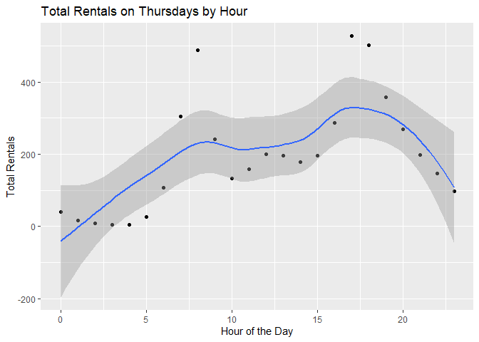
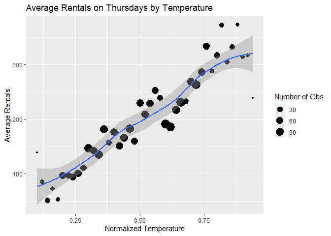
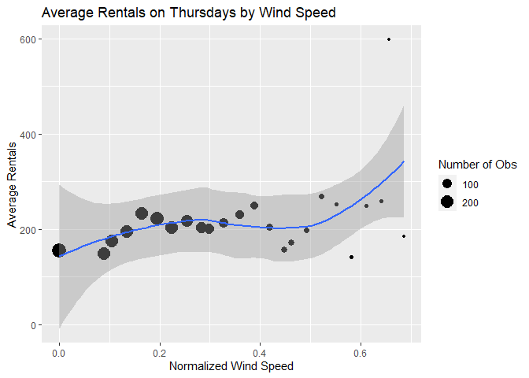

Joshua Burrows Project 2
================
16 October 2020

  - [Render Code](#render-code)
  - [Introduction](#introduction)
  - [Read in Data](#read-in-data)
  - [Data](#data)
      - [EDA](#eda)
          - [Predictor Summaries and
            Plots](#predictor-summaries-and-plots)
          - [Correlation between
            Predictors](#correlation-between-predictors)
  - [Train Models](#train-models)
      - [Tree](#tree)
      - [Boosted Tree](#boosted-tree)
  - [Test Models](#test-models)
      - [Tree](#tree-1)
  - [Best Model](#best-model)

# Render Code

The following code runs in a separate R script to render a different
document for each day of the week.

# Introduction

The day is Thursday.

# Read in Data

``` r
bikes <- read_csv(file = "../Bike-Sharing-Dataset/hour.csv")

bikes$weekday <- as.factor(bikes$weekday)
levels(bikes$weekday) <- c("Sunday", "Monday", "Tuesday", "Wednesday", "Thursday", "Friday", "Saturday") 

bikes$season <- as.factor(bikes$season)
levels(bikes$season) <- c("winter", "spring", "summer", "fall")

bikes$yr <- as.factor(bikes$yr)
levels(bikes$yr) <- c("2011", "2012")

bikes$mnth <- as.factor(bikes$mnth)
levels(bikes$mnth) <- c("jan", "feb", "mar", "apr", "may", "jun", "jul", "aug", "sep", "oct", "nov", "dec")

bikes$weathersit <- as.factor(bikes$weathersit)
levels(bikes$weathersit) <- c("very good", "good", "bad", "very bad")

bikes$holiday <- as.factor(bikes$holiday)
levels(bikes$holiday) <- c("no", "yes")

bikes %>% head()
```

    ## # A tibble: 6 x 17
    ##   instant dteday     season yr    mnth 
    ##     <dbl> <date>     <fct>  <fct> <fct>
    ## 1       1 2011-01-01 winter 2011  jan  
    ## 2       2 2011-01-01 winter 2011  jan  
    ## 3       3 2011-01-01 winter 2011  jan  
    ## 4       4 2011-01-01 winter 2011  jan  
    ## 5       5 2011-01-01 winter 2011  jan  
    ## 6       6 2011-01-01 winter 2011  jan  
    ## # ... with 12 more variables: hr <dbl>,
    ## #   holiday <fct>, weekday <fct>,
    ## #   workingday <dbl>, weathersit <fct>,
    ## #   temp <dbl>, atemp <dbl>, hum <dbl>,
    ## #   windspeed <dbl>, casual <dbl>,
    ## #   registered <dbl>, cnt <dbl>

# Data

``` r
dayData <- bikes %>% filter(weekday == params$day)
dayData %>% head()
```

    ## # A tibble: 6 x 17
    ##   instant dteday     season yr    mnth 
    ##     <dbl> <date>     <fct>  <fct> <fct>
    ## 1     116 2011-01-06 winter 2011  jan  
    ## 2     117 2011-01-06 winter 2011  jan  
    ## 3     118 2011-01-06 winter 2011  jan  
    ## 4     119 2011-01-06 winter 2011  jan  
    ## 5     120 2011-01-06 winter 2011  jan  
    ## 6     121 2011-01-06 winter 2011  jan  
    ## # ... with 12 more variables: hr <dbl>,
    ## #   holiday <fct>, weekday <fct>,
    ## #   workingday <dbl>, weathersit <fct>,
    ## #   temp <dbl>, atemp <dbl>, hum <dbl>,
    ## #   windspeed <dbl>, casual <dbl>,
    ## #   registered <dbl>, cnt <dbl>

``` r
set.seed(123)
dayIndex <- createDataPartition(dayData$cnt, p = .7, list = FALSE)
```

## EDA

### Predictor Summaries and Plots

Summary statistics of rental count by season

``` r
seasonSum <- dayData %>% group_by(season) %>% summarize(min = min(cnt), Q1 = quantile(cnt, probs = c(.25), names = FALSE), median = median(cnt), mean = mean(cnt), Q3 = quantile(cnt, probs = c(.75), names = FALSE), max = max(cnt))

seasonSum %>% kable()
```

| season | min |    Q1 | median |     mean |     Q3 | max |
| :----- | --: | ----: | -----: | -------: | -----: | --: |
| winter |   1 | 26.00 |   88.5 | 125.1817 | 178.75 | 746 |
| spring |   1 | 50.25 |  179.5 | 216.6779 | 304.00 | 869 |
| summer |   2 | 65.00 |  193.0 | 237.7958 | 327.00 | 976 |
| fall   |   1 | 42.00 |  157.5 | 197.7793 | 279.00 | 905 |

Total rentals each year

``` r
yearSum <- dayData %>% group_by(yr) %>% summarize(totalRentals = sum(cnt))
yearSum %>% kable()
```

| yr   | totalRentals |
| :--- | -----------: |
| 2011 |       174552 |
| 2012 |       310843 |

Summary statistics of rental count by dayDatath. It is probably not
worth including *dayDatath* and *season* in the model, so I eliminated
*season*.

``` r
dayDatathSum <- dayData %>% group_by(mnth) %>% summarize(min = min(cnt), Q1 = quantile(cnt, probs = c(.25), names = FALSE), median = median(cnt), mean = mean(cnt), Q3 = quantile(cnt, probs = c(.75), names = FALSE), max = max(cnt))

dayDatathSum %>% kable()
```

| mnth | min |    Q1 | median |     mean |     Q3 | max |
| :--- | --: | ----: | -----: | -------: | -----: | --: |
| jan  |   1 | 26.50 |   86.0 | 114.8914 | 164.50 | 530 |
| feb  |   1 | 35.00 |   87.0 | 121.8413 | 175.00 | 610 |
| mar  |   1 | 27.25 |   97.0 | 160.3782 | 233.00 | 810 |
| apr  |   1 | 52.25 |  166.0 | 198.5000 | 271.50 | 822 |
| may  |   2 | 79.00 |  214.0 | 245.5278 | 346.50 | 868 |
| jun  |   2 | 66.50 |  188.5 | 234.2407 | 327.00 | 869 |
| jul  |   4 | 75.50 |  199.0 | 234.3177 | 322.25 | 825 |
| aug  |   3 | 66.50 |  205.0 | 251.5972 | 342.25 | 941 |
| sep  |   2 | 57.00 |  181.0 | 229.6279 | 299.50 | 976 |
| oct  |   1 | 52.75 |  181.5 | 230.7188 | 322.25 | 901 |
| nov  |   2 | 36.25 |  139.5 | 167.9860 | 228.00 | 689 |
| dec  |   1 | 31.00 |  130.5 | 154.6204 | 224.25 | 679 |

Scatter plot of total rentals by hour of the day

``` r
avgRentals <- dayData %>% group_by(hr) %>% summarize(meanRentals = mean(cnt))

ggplot(avgRentals, aes(x = hr, y = meanRentals)) + geom_point() + labs(title = "Total Rentals by Hour", x = "Hour of the Day", y = "Total Rentals") 
```

<!-- -->

Average rentals by holiday

``` r
dayData %>% group_by(holiday) %>% summarize(meanRentals = mean(cnt)) %>% kable()
```

| holiday | meanRentals |
| :------ | ----------: |
| no      |   198.71028 |
| yes     |    81.66667 |

Average rentals by working day. Working days are neither weekends nor
holidays. I decided to eliminate this variable from the model because
some of the days under consideration are weekends.

``` r
dayData %>% group_by(workingday) %>% summarize(meanRentals = mean(cnt)) %>% kable()
```

| workingday | meanRentals |
| ---------: | ----------: |
|          0 |    81.66667 |
|          1 |   198.71028 |

Average rentals by weather condition

``` r
dayData %>% group_by(weathersit) %>% summarize(meanRentals = mean(cnt)) %>% kable()
```

| weathersit | meanRentals |
| :--------- | ----------: |
| very good  |    214.2754 |
| good       |    176.2374 |
| bad        |    103.1732 |

Scatter plot of average rentals and temperature

``` r
tempAvg <- dayData %>% group_by(temp) %>% summarize(avgRentals = mean(cnt))

ggplot(tempAvg, aes(x = temp, y = avgRentals)) + geom_point() + labs(title = "Average Rentals by Temperature", x = "Normalized Temperature", "Average Rentals")
```

<!-- -->

Scatter plot of average rentals and feeling temperature. It does not
make much sense to keep *temp* and *atemp*, so I eliminated *atemp* from
the model.

``` r
atempAvg <- dayData %>% group_by(atemp) %>% summarize(avgRentals = mean(cnt))

ggplot(atempAvg, aes(x = atemp, y = avgRentals)) + geom_point() + labs(title = "Average Rentals by Temperature", x = "Normalized Feeling Temperature", "Average Rentals")
```

<!-- -->

Scatter plot of average rentals by humidity

``` r
humAvg <- dayData %>% group_by(hum) %>% summarize(avgRentals = mean(cnt))

ggplot(humAvg, aes(x = hum, y = avgRentals)) + geom_point() + labs(title = "Average Rentals by Humidity", x = "Normalized Humidity", y = "Average Rentals") 
```

<!-- -->

Average rentals by windspeed

``` r
windAvg <- dayData %>% group_by(windspeed) %>% summarize(avgRentals = mean(cnt))

ggplot(windAvg, aes(x = windspeed, y = avgRentals)) + geom_point() + labs(title = "Average Rentals by Windspeed", x = "Normalized Windspeed", y = "Average Rentals")
```

<!-- -->

### Correlation between Predictors

Correlation plot of quantitative predictors.

It does not make much sense to keep *temp* and *atemp*, so I eliminated
*atemp* from the model.

``` r
corr <- dayData %>% select(temp, atemp, windspeed, hum) %>% cor()

corrplot(corr)
```

<!-- -->

# Train Models

## Tree

``` r
set.seed(123)
trialTrainIndex <- sample(1:nrow(dayData), size = 100)
trialTrain <- dayData[trialTrainIndex,]
trialTrain
```

    ## # A tibble: 100 x 17
    ##    instant dteday     season yr    mnth 
    ##      <dbl> <date>     <fct>  <fct> <fct>
    ##  1   17275 2012-12-27 winter 2012  dec  
    ##  2   15637 2012-10-18 fall   2012  oct  
    ##  3    3742 2011-06-09 spring 2011  jun  
    ##  4    1408 2011-03-03 winter 2011  mar  
    ##  5   12948 2012-06-28 summer 2012  jun  
    ##  6    8085 2011-12-08 fall   2011  dec  
    ##  7    8911 2012-01-12 winter 2012  jan  
    ##  8    8926 2012-01-12 winter 2012  jan  
    ##  9    7406 2011-11-10 fall   2011  nov  
    ## 10    4745 2011-07-21 summer 2011  jul  
    ## # ... with 90 more rows, and 12 more
    ## #   variables: hr <dbl>, holiday <fct>,
    ## #   weekday <fct>, workingday <dbl>,
    ## #   weathersit <fct>, temp <dbl>,
    ## #   atemp <dbl>, hum <dbl>,
    ## #   windspeed <dbl>, casual <dbl>,
    ## #   registered <dbl>, cnt <dbl>

``` r
trialTestIndex <- sample(1:nrow(dayData), size = 50)
trialTest <- dayData[trialTestIndex,]
trialTest
```

    ## # A tibble: 50 x 17
    ##    instant dteday     season yr    mnth 
    ##      <dbl> <date>     <fct>  <fct> <fct>
    ##  1    7253 2011-11-03 fall   2011  nov  
    ##  2    2390 2011-04-14 spring 2011  apr  
    ##  3   13782 2012-08-02 summer 2012  aug  
    ##  4    8920 2012-01-12 winter 2012  jan  
    ##  5   12606 2012-06-14 spring 2012  jun  
    ##  6    9595 2012-02-09 winter 2012  feb  
    ##  7    6921 2011-10-20 fall   2011  oct  
    ##  8   14633 2012-09-06 summer 2012  sep  
    ##  9    7066 2011-10-27 fall   2011  oct  
    ## 10    1074 2011-02-17 winter 2011  feb  
    ## # ... with 40 more rows, and 12 more
    ## #   variables: hr <dbl>, holiday <fct>,
    ## #   weekday <fct>, workingday <dbl>,
    ## #   weathersit <fct>, temp <dbl>,
    ## #   atemp <dbl>, hum <dbl>,
    ## #   windspeed <dbl>, casual <dbl>,
    ## #   registered <dbl>, cnt <dbl>

``` r
set.seed(123)
tree <- train(cnt ~ yr + mnth + hr + holiday + weathersit + temp + hum + windspeed, 
              data = trialTrain, 
              method = "rpart", 
              trControl = trainControl(method = "LOOCV"))
tree
```

    ## CART 
    ## 
    ## 100 samples
    ##   8 predictor
    ## 
    ## No pre-processing
    ## Resampling: Leave-One-Out Cross-Validation 
    ## Summary of sample sizes: 99, 99, 99, 99, 99, 99, ... 
    ## Resampling results across tuning parameters:
    ## 
    ##   cp         RMSE      Rsquared   
    ##   0.1212676  158.6550  0.384121751
    ##   0.1635887  178.6530  0.218923405
    ##   0.3233809  203.3912  0.001085579
    ##   MAE     
    ##   113.5197
    ##   132.5209
    ##   174.8626
    ## 
    ## RMSE was used to select the
    ##  optimal model using the
    ##  smallest value.
    ## The final value used for the model
    ##  was cp = 0.1212676.

## Boosted Tree

``` r
set.seed(123)
boostTree <- train(cnt ~ yr + mnth + hr + holiday + weathersit + temp + hum + windspeed, 
                   data = trialTrain, 
                   method = "gbm", 
                   trControl = trainControl(method = "LOOCV"), 
                   verbose = FALSE)
boostTree
```

    ## Stochastic Gradient Boosting 
    ## 
    ## 100 samples
    ##   8 predictor
    ## 
    ## No pre-processing
    ## Resampling: Leave-One-Out Cross-Validation 
    ## Summary of sample sizes: 99, 99, 99, 99, 99, 99, ... 
    ## Resampling results across tuning parameters:
    ## 
    ##   n.trees  interaction.depth  RMSE     
    ##    50      1                  141.54885
    ##    50      2                  125.03587
    ##    50      3                  121.63061
    ##   100      1                  129.89621
    ##   100      2                  110.30085
    ##   100      3                  106.76908
    ##   150      1                  122.92910
    ##   150      2                  102.75496
    ##   150      3                   99.30585
    ##   Rsquared   MAE      
    ##   0.4963049  101.81081
    ##   0.6142098   86.01737
    ##   0.6361888   82.84257
    ##   0.5770904   94.77161
    ##   0.6980125   76.69861
    ##   0.7195108   73.97526
    ##   0.6209561   90.56393
    ##   0.7361776   72.07472
    ##   0.7527048   71.91849
    ## 
    ## Tuning parameter 'shrinkage' was
    ## 
    ## Tuning parameter 'n.minobsinnode'
    ##  was held constant at a value of 10
    ## RMSE was used to select the
    ##  optimal model using the
    ##  smallest value.
    ## The final values used for the
    ##  shrinkage = 0.1 and n.minobsinnode
    ##  = 10.

# Test Models

## Tree

``` r
treePreds <- predict(tree, trialTrain)
treeRMSE <- postResample(treePreds, trialTrain$cnt)[1]

boostPreds <- predict(boostTree, trialTrain)
boostRMSE <- postResample(boostPreds, trialTrain$cnt)[1]

modelPerformance <- data.frame(model = c("Non-Ensemble Tree", "Boosted Tree"), RMSE = c(treeRMSE, boostRMSE))

best <- modelPerformance %>% filter(RMSE == min(RMSE))

if(best$model == "Non-Ensemble Tree"){
  final <- tree
} else if(best$model == "Boosted Tree"){
  final <- boostTree
} else{
  stop("Error")
}

final
```

    ## Stochastic Gradient Boosting 
    ## 
    ## 100 samples
    ##   8 predictor
    ## 
    ## No pre-processing
    ## Resampling: Leave-One-Out Cross-Validation 
    ## Summary of sample sizes: 99, 99, 99, 99, 99, 99, ... 
    ## Resampling results across tuning parameters:
    ## 
    ##   n.trees  interaction.depth  RMSE     
    ##    50      1                  141.54885
    ##    50      2                  125.03587
    ##    50      3                  121.63061
    ##   100      1                  129.89621
    ##   100      2                  110.30085
    ##   100      3                  106.76908
    ##   150      1                  122.92910
    ##   150      2                  102.75496
    ##   150      3                   99.30585
    ##   Rsquared   MAE      
    ##   0.4963049  101.81081
    ##   0.6142098   86.01737
    ##   0.6361888   82.84257
    ##   0.5770904   94.77161
    ##   0.6980125   76.69861
    ##   0.7195108   73.97526
    ##   0.6209561   90.56393
    ##   0.7361776   72.07472
    ##   0.7527048   71.91849
    ## 
    ## Tuning parameter 'shrinkage' was
    ## 
    ## Tuning parameter 'n.minobsinnode'
    ##  was held constant at a value of 10
    ## RMSE was used to select the
    ##  optimal model using the
    ##  smallest value.
    ## The final values used for the
    ##  shrinkage = 0.1 and n.minobsinnode
    ##  = 10.

# Best Model
