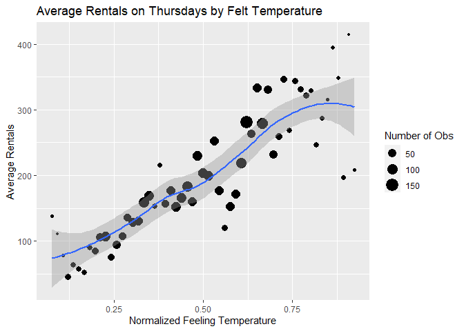
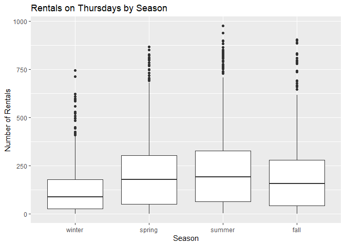
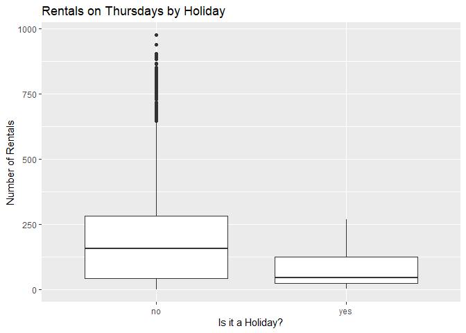
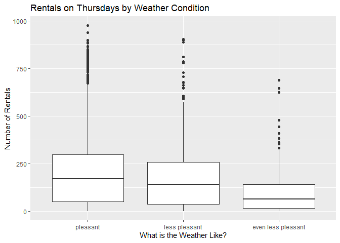

Joshua Burrows Project 2
================
16 October 2020

  - [Bike Rentals on Thursdays:
    Introduction](#bike-rentals-on-thursdays-introduction)
  - [Read in Data](#read-in-data)
      - [Get Bikes Data](#get-bikes-data)
      - [Factors](#factors)
      - [Filter by Day](#filter-by-day)
  - [Exploratory Data Analysis](#exploratory-data-analysis)
      - [Quantitative Predictors](#quantitative-predictors)
          - [Correlations](#correlations)
          - [Hour](#hour)
          - [Temperature](#temperature)
          - [Felt Temperature](#felt-temperature)
          - [Humidity](#humidity)
          - [Wind Speed](#wind-speed)
      - [Categorical Predictors](#categorical-predictors)
          - [Helper Function](#helper-function)
          - [Season](#season)
          - [Year](#year)
          - [Month](#month)
          - [Holiday](#holiday)
          - [Working Day](#working-day)
          - [Weather Condition](#weather-condition)
  - [Train Models](#train-models)
      - [Split Data](#split-data)
      - [Non-Ensemble Tree](#non-ensemble-tree)
          - [Training](#training)
              - [Tree Models](#tree-models)
              - [Tuning Parameter](#tuning-parameter)
              - [Formula](#formula)
              - [Create the Model](#create-the-model)
          - [Model Information](#model-information)
      - [Boosted Tree](#boosted-tree)
          - [Training](#training-1)
              - [Boosted Tree Models](#boosted-tree-models)
              - [Tuning Paremeters](#tuning-paremeters)
              - [Create the Model](#create-the-model-1)
          - [Model Information](#model-information-1)
  - [Test Models](#test-models)
  - [Best Model](#best-model)

# Bike Rentals on Thursdays: Introduction

This document walks though the process of creating a model to predict
hourly bike rentals on Thursdays. I compared two models - a
*non-ensemble tree* and a *boosted tree* - and picked the one that does
better.

The data comes from the Capital bike sharing system, and it is available
[here](https://archive.ics.uci.edu/ml/datasets/Bike+Sharing+Dataset).
This data includes an hourly count of bike rentals for 2011 and 2012 as
well as information about the weather and the time of year.

My models use the following predictor variables:

  - *yr*: year (2011 or 2012)  
  - *mnth*: month  
  - *hr*: hour of the day  
  - *holiday*: whether the day is a holiday  
  - *weathersit*: weather condition
      - pleasant: clear, few clouds, partly cloudy  
      - less pleasant: mist, mist + cloudy, mist + broken clouds, mist +
        few clouds  
      - even less pleasant: light snow, light rain + scattered clouds,
        light rain + thunderstorm + scattered clouds  
      - downright unpleasant: snow + fog, heavy rain + ice pallets +
        thunderstorm + mist  
  - *temp*: normalized temperature in celsius  
  - *hum*: normalized humidity  
  - *windspeed*: normalized wind speed

You can return to the homepage for this project by clicking
[here](https://jkburrows.github.io/ST558-Project-2/). The github repo
for this project is
[here](https://github.com/JKBurrows/ST558-Project-2).

# Read in Data

## Get Bikes Data

Read in data.

``` r
bikes <- read_csv(file = "../Bike-Sharing-Dataset/hour.csv")

bikes %>% head() %>% kable()
```

| instant | dteday     | season | yr | mnth | hr | holiday | weekday | workingday | weathersit | temp |  atemp |  hum | windspeed | casual | registered | cnt |
| ------: | :--------- | -----: | -: | ---: | -: | ------: | ------: | ---------: | ---------: | ---: | -----: | ---: | --------: | -----: | ---------: | --: |
|       1 | 2011-01-01 |      1 |  0 |    1 |  0 |       0 |       6 |          0 |          1 | 0.24 | 0.2879 | 0.81 |    0.0000 |      3 |         13 |  16 |
|       2 | 2011-01-01 |      1 |  0 |    1 |  1 |       0 |       6 |          0 |          1 | 0.22 | 0.2727 | 0.80 |    0.0000 |      8 |         32 |  40 |
|       3 | 2011-01-01 |      1 |  0 |    1 |  2 |       0 |       6 |          0 |          1 | 0.22 | 0.2727 | 0.80 |    0.0000 |      5 |         27 |  32 |
|       4 | 2011-01-01 |      1 |  0 |    1 |  3 |       0 |       6 |          0 |          1 | 0.24 | 0.2879 | 0.75 |    0.0000 |      3 |         10 |  13 |
|       5 | 2011-01-01 |      1 |  0 |    1 |  4 |       0 |       6 |          0 |          1 | 0.24 | 0.2879 | 0.75 |    0.0000 |      0 |          1 |   1 |
|       6 | 2011-01-01 |      1 |  0 |    1 |  5 |       0 |       6 |          0 |          2 | 0.24 | 0.2576 | 0.75 |    0.0896 |      0 |          1 |   1 |

## Factors

Convert categorical variables to factors.

``` r
bikes$weekday <- as.factor(bikes$weekday)
levels(bikes$weekday) <- c("Sunday", "Monday", "Tuesday", "Wednesday", "Thursday", "Friday", "Saturday") 

bikes$season <- as.factor(bikes$season)
levels(bikes$season) <- c("winter", "spring", "summer", "fall")

bikes$yr <- as.factor(bikes$yr)
levels(bikes$yr) <- c("2011", "2012")

bikes$mnth <- as.factor(bikes$mnth)
levels(bikes$mnth) <- c("jan", "feb", "mar", "apr", "may", "jun", "jul", "aug", "sep", "oct", "nov", "dec")

bikes$weathersit <- as.factor(bikes$weathersit)
levels(bikes$weathersit) <- c("pleasant", "less pleasant", "even less pleasant", "downright unpleasant")

bikes$holiday <- as.factor(bikes$holiday)
levels(bikes$holiday) <- c("no", "yes")

bikes$workingday <- as.factor(bikes$workingday)
levels(bikes$workingday) <- c("no", "yes")

bikes %>% head() %>% kable()
```

| instant | dteday     | season | yr   | mnth | hr | holiday | weekday  | workingday | weathersit    | temp |  atemp |  hum | windspeed | casual | registered | cnt |
| ------: | :--------- | :----- | :--- | :--- | -: | :------ | :------- | :--------- | :------------ | ---: | -----: | ---: | --------: | -----: | ---------: | --: |
|       1 | 2011-01-01 | winter | 2011 | jan  |  0 | no      | Saturday | no         | pleasant      | 0.24 | 0.2879 | 0.81 |    0.0000 |      3 |         13 |  16 |
|       2 | 2011-01-01 | winter | 2011 | jan  |  1 | no      | Saturday | no         | pleasant      | 0.22 | 0.2727 | 0.80 |    0.0000 |      8 |         32 |  40 |
|       3 | 2011-01-01 | winter | 2011 | jan  |  2 | no      | Saturday | no         | pleasant      | 0.22 | 0.2727 | 0.80 |    0.0000 |      5 |         27 |  32 |
|       4 | 2011-01-01 | winter | 2011 | jan  |  3 | no      | Saturday | no         | pleasant      | 0.24 | 0.2879 | 0.75 |    0.0000 |      3 |         10 |  13 |
|       5 | 2011-01-01 | winter | 2011 | jan  |  4 | no      | Saturday | no         | pleasant      | 0.24 | 0.2879 | 0.75 |    0.0000 |      0 |          1 |   1 |
|       6 | 2011-01-01 | winter | 2011 | jan  |  5 | no      | Saturday | no         | less pleasant | 0.24 | 0.2576 | 0.75 |    0.0896 |      0 |          1 |   1 |

## Filter by Day

Grab the data for Thursday.

``` r
dayData <- bikes %>% filter(weekday == params$day)

dayData %>% head() %>% kable()
```

| instant | dteday     | season | yr   | mnth | hr | holiday | weekday  | workingday | weathersit    | temp |  atemp |  hum | windspeed | casual | registered | cnt |
| ------: | :--------- | :----- | :--- | :--- | -: | :------ | :------- | :--------- | :------------ | ---: | -----: | ---: | --------: | -----: | ---------: | --: |
|     116 | 2011-01-06 | winter | 2011 | jan  |  0 | no      | Thursday | yes        | pleasant      | 0.18 | 0.2424 | 0.55 |    0.0000 |      0 |         11 |  11 |
|     117 | 2011-01-06 | winter | 2011 | jan  |  1 | no      | Thursday | yes        | pleasant      | 0.16 | 0.2273 | 0.64 |    0.0000 |      0 |          4 |   4 |
|     118 | 2011-01-06 | winter | 2011 | jan  |  2 | no      | Thursday | yes        | pleasant      | 0.16 | 0.2273 | 0.64 |    0.0000 |      0 |          2 |   2 |
|     119 | 2011-01-06 | winter | 2011 | jan  |  4 | no      | Thursday | yes        | less pleasant | 0.16 | 0.1970 | 0.64 |    0.0896 |      0 |          1 |   1 |
|     120 | 2011-01-06 | winter | 2011 | jan  |  5 | no      | Thursday | yes        | less pleasant | 0.14 | 0.1818 | 0.69 |    0.0896 |      0 |          4 |   4 |
|     121 | 2011-01-06 | winter | 2011 | jan  |  6 | no      | Thursday | yes        | less pleasant | 0.14 | 0.1667 | 0.63 |    0.1045 |      0 |         36 |  36 |

# Exploratory Data Analysis

I started with a little bit of exploratory data analysis. The goal is to
look at the relationships between the predictors and number of bike
rentals.

## Quantitative Predictors

### Correlations

Visualize the strength of the relationships between the quantitative
predictors.

Unsurprisingly, *atemp* and *temp* are strongly correlated. *atemp*
represents the heat index, which is typically calculated using
temperature and humidity. So it makes sense to either eliminate *atemp*
from the model or keep *atemp* but eliminate *temp* and *hum*. I decided
to eliminate *atemp*.

``` r
corr <- dayData %>% 
  select(temp, atemp, windspeed, hum) %>% 
  cor()

corrplot(corr)
```

<!-- -->

### Hour

Create a scatter plot to investigate the relationship between time of
day and rentals on Thursdays. Fit a line through the points to get a
basic idea of how number or rentals changes with the time of day.

``` r
avgRentals <- dayData %>% 
  group_by(hr) %>% 
  summarize(meanRentals = mean(cnt))

corrHour <- cor(avgRentals$hr, avgRentals$meanRentals)

ggplot(avgRentals, aes(x = hr, y = meanRentals)) +
  geom_point() + 
  labs(title = paste0("Total Rentals on ", paste0(params$day, "s"), " by Hour"), 
       x = "Hour of the Day", 
       y = "Total Rentals") + 
  geom_smooth()
```

<!-- -->

The correlation between hour and average rentals is 0.5101831.

Be careful, correlation measures straight line relationships, so if the
plot above shows a curved relationship, correlation may not be a useful
measure.

### Temperature

Create a scatter plot to investigate the relationship between
temperature and average rentals on Thursdays. Fit a line through the
points to get a basic idea of average rentals changes with temperature.

The size of the dots represents the number of observations at each
temperature.

``` r
tempAvg <- dayData %>% 
  group_by(temp) %>% 
  summarize(avgRentals = mean(cnt), n = n())

corrTemp <- cor(tempAvg$temp, tempAvg$avgRentals)

ggplot(tempAvg, aes(x = temp, y = avgRentals)) + 
  geom_point(aes(size = n)) + 
  geom_smooth() + 
  labs(title = paste0("Average Rentals on ", paste0(params$day, "s"), " by Temperature"), 
       x = "Normalized Temperature", 
       y = "Average Rentals") + 
  scale_size_continuous(name = "Number of Obs")
```

<!-- -->

The correlation between temperature and average rentals is 0.9327168.

Be careful, correlation measures straight line relationships, so if the
plot above shows a curved relationship, correlation may not be a useful
measure.

### Felt Temperature

Create a scatter plot to investigate the relationship between felt
temperature and average rentals on Thursdays. Fit a line through the
points to get a basic idea of how average rentals changes with felt
temperature.

The size of the dots represents the number of observations at each felt
temperature.

As already noted, it does not make much sense to keep *atemp* if *temp*
and *hum* will be in the model, so I eliminated *atemp* from the model.

``` r
atempAvg <- dayData %>% 
  group_by(atemp) %>% 
  summarize(avgRentals = mean(cnt), n = n())

corrATemp <- cor(atempAvg$atemp, atempAvg$avgRentals)

ggplot(atempAvg, aes(x = atemp, y = avgRentals)) +
  geom_point(aes(size = n)) + 
  geom_smooth() + 
  labs(title = paste0("Average Rentals on ", paste0(params$day, "s"), " by Felt Temperature"), 
       x = "Normalized Feeling Temperature", 
       y = "Average Rentals") + 
  scale_size_continuous(name = "Number of Obs")
```

<!-- -->

The correlation between felt temperature and average rentals is
0.8720184.

Be careful, correlation measures straight line relationships, so if the
plot above shows a curved relationship, correlation may not be a useful
measure.

### Humidity

Create a scatter plot to investigate the relationship between humidity
and average rentals on Thursdays. Fit a line through the points to get a
basic idea of how average rentals changes with humidity.

The size of the dots represents the number of observations at each
humidity level.

``` r
humAvg <- dayData %>% 
  group_by(hum) %>% 
  summarize(avgRentals = mean(cnt), n = n())

corrHum <- cor(humAvg$hum, humAvg$avgRentals)

ggplot(humAvg, aes(x = hum, y = avgRentals)) + 
  geom_point(aes(size = n)) + 
  geom_smooth() + 
  labs(title = paste0("Average Rentals on ", paste0(params$day, "s"), " by Humidity"), 
       x = "Normalized Humidity", 
       y = "Average Rentals") + 
  scale_size_continuous(name = "Number of Obs")
```

<!-- -->

The correlation between humidity and average rentals is -0.6350748.

Be careful, correlation measures straight line relationships, so if the
plot above shows a curved relationship, correlation may not be a useful
measure.

### Wind Speed

Create a scatter plot to investigate the relationship between wind speed
and average rentals on Thursdays. Fit a line through the points to get a
basic idea of how average rentals changes with wind speed.

The size of the dots represents the number of observations at each wind
speed.

``` r
windAvg <- dayData %>% 
  group_by(windspeed) %>% 
  summarize(avgRentals = mean(cnt), n = n())

corrWind <- cor(windAvg$windspeed, windAvg$avgRentals)

ggplot(windAvg, aes(x = windspeed, y = avgRentals)) + 
  geom_point(aes(size = n)) + 
  geom_smooth() + 
  labs(title = paste0("Average Rentals on ", paste0(params$day, "s"), " by Wind Speed"), 
       x = "Normalized Wind Speed", 
       y = "Average Rentals") + 
  scale_size_continuous(name = "Number of Obs")
```

<!-- -->

The correlation between wind speed and average rentals is 0.4083983.

Be careful, correlation measures straight line relationships, so if the
plot above shows a curved relationship, correlation may not be a useful
measure.

## Categorical Predictors

### Helper Function

Create a helper function to display basic numeric summaries for a given
grouping variable.

``` r
getSum <- function(varName, colName){ 
  
  sum <- dayData %>% 
    group_by(dayData[[varName]]) %>% 
    summarize(min = min(cnt), 
              Q1 = quantile(cnt, probs = c(.25), names = FALSE), 
              median = median(cnt), 
              mean = mean(cnt), 
              Q3 = quantile(cnt, probs = c(.75), names = FALSE), 
              max = max(cnt), 
              obs = n())
  
  output <- sum %>% 
    kable(col.names = c(colName, 
                        "Minimum", 
                        "1st Quartile", 
                        "Median", 
                        "Mean", 
                        "3rd Quartile", 
                        "Maximum", 
                        "Number of Observations"))
  
  return(output)
  
} 
```

### Season

Explore how bike rentals on Thursdays change with the seasons using a
basic numeric summary and a boxplot. The numeric summary gives you an
idea of center and spread. So does the boxplot, but it is better for
identifying outliers.

It does not make much sense to keep both *season* and *mnth* in the
model, so I decided to eliminate *season*.

``` r
getSum(varName = "season", colName = "Season")
```

| Season | Minimum | 1st Quartile | Median |     Mean | 3rd Quartile | Maximum | Number of Observations |
| :----- | ------: | -----------: | -----: | -------: | -----------: | ------: | ---------------------: |
| winter |       1 |        26.00 |   88.5 | 125.1817 |       178.75 |     746 |                    578 |
| spring |       1 |        50.25 |  179.5 | 216.6779 |       304.00 |     869 |                    624 |
| summer |       2 |        65.00 |  193.0 | 237.7958 |       327.00 |     976 |                    671 |
| fall   |       1 |        42.00 |  157.5 | 197.7793 |       279.00 |     905 |                    598 |

``` r
ggplot(dayData, aes(x = season, y = cnt)) + 
  geom_boxplot() + 
  labs(title = paste0("Rentals on ", paste0(params$day, "s"), " by Season"), 
       x = "Season", 
       y = "Number of Rentals") 
```

<!-- -->

### Year

Looking at total rentals each year gives us some idea of the long term
trend in bike rentals on Thursdays. It would be helpful to have data
from more years, though.

``` r
yearSum <- dayData %>% 
  group_by(yr) %>% 
  summarize(totalRentals = sum(cnt))

yearSum %>% kable(col.names = c("Year", "Total Rentals"))
```

| Year | Total Rentals |
| :--- | ------------: |
| 2011 |        174552 |
| 2012 |        310843 |

### Month

Explore how bike rentals on Thursdays change depending on the month
using a basic numeric summary and a boxplot. The numeric summary gives
you an idea of center and spread. So does the boxplot, but it is better
for identifying outliers.

As already noted, it is probably not worth including *mnth* and *season*
in the model, so *season* has been eliminated.

``` r
getSum(varName = "mnth", colName = "Month")
```

| Month | Minimum | 1st Quartile | Median |     Mean | 3rd Quartile | Maximum | Number of Observations |
| :---- | ------: | -----------: | -----: | -------: | -----------: | ------: | ---------------------: |
| jan   |       1 |        26.50 |   86.0 | 114.8914 |       164.50 |     530 |                    175 |
| feb   |       1 |        35.00 |   87.0 | 121.8413 |       175.00 |     610 |                    189 |
| mar   |       1 |        27.25 |   97.0 | 160.3782 |       233.00 |     810 |                    238 |
| apr   |       1 |        52.25 |  166.0 | 198.5000 |       271.50 |     822 |                    192 |
| may   |       2 |        79.00 |  214.0 | 245.5278 |       346.50 |     868 |                    216 |
| jun   |       2 |        66.50 |  188.5 | 234.2407 |       327.00 |     869 |                    216 |
| jul   |       4 |        75.50 |  199.0 | 234.3177 |       322.25 |     825 |                    192 |
| aug   |       3 |        66.50 |  205.0 | 251.5972 |       342.25 |     941 |                    216 |
| sep   |       2 |        57.00 |  181.0 | 229.6279 |       299.50 |     976 |                    215 |
| oct   |       1 |        52.75 |  181.5 | 230.7188 |       322.25 |     901 |                    192 |
| nov   |       2 |        36.25 |  139.5 | 167.9860 |       228.00 |     689 |                    214 |
| dec   |       1 |        31.00 |  130.5 | 154.6204 |       224.25 |     679 |                    216 |

``` r
ggplot(dayData, aes(x = mnth, y = cnt)) + 
  geom_boxplot() + 
  labs(title = paste0("Rentals on ", paste0(params$day, "s"), " by Month"), 
       x = "Month", 
       y = "Number of Rentals")
```

<!-- -->

### Holiday

Explore how bike rentals change depending on whether the Thursday in
question is a holiday using a basic numeric summary and a boxplot. The
numeric summary gives you an idea of center and spread. So does the
boxplot, but it is better for identifying outliers.

Note: There are no holidays on Saturday or Sunday because the holiday
data has been extracted from the [Washington D.C. HR department’s
holiday schedule](https://dchr.dc.gov/page/holiday-schedules), which
only lists holidays that fall during the work week. Accordingly, I have
left the *holiday* variable out of the models for Saturday and Sunday.

``` r
getSum(varName = "holiday", colName = "Holiday")
```

| Holiday | Minimum | 1st Quartile | Median |      Mean | 3rd Quartile | Maximum | Number of Observations |
| :------ | ------: | -----------: | -----: | --------: | -----------: | ------: | ---------------------: |
| no      |       1 |        44.00 |    156 | 198.71028 |       283.50 |     976 |                   2423 |
| yes     |       2 |        22.75 |     46 |  81.66667 |       124.75 |     269 |                     48 |

``` r
ggplot(dayData, aes(x = holiday, y = cnt)) + 
  geom_boxplot() + 
  labs(title = paste0("Rentals on ", paste0(params$day, "s"), " by Holiday"), 
       x = "Is it a Holiday?", 
       y = "Number of Rentals")
```

<!-- -->

### Working Day

Explore how bike rentals change depending on whether the day in question
is a working day using a basic numeric summary and a boxplot. The
numeric summary gives you an idea of center and spread. So does the
boxplot, but it is better for identifying outliers.

Working days are neither weekends nor holidays. I decided not to keep
this variable in the model because it wouldn’t make much sense in the
reports for Saturday and Sunday.

``` r
getSum(varName = "workingday", colName = "Working Day")
```

| Working Day | Minimum | 1st Quartile | Median |      Mean | 3rd Quartile | Maximum | Number of Observations |
| :---------- | ------: | -----------: | -----: | --------: | -----------: | ------: | ---------------------: |
| no          |       2 |        22.75 |     46 |  81.66667 |       124.75 |     269 |                     48 |
| yes         |       1 |        44.00 |    156 | 198.71028 |       283.50 |     976 |                   2423 |

``` r
ggplot(dayData, aes(x = workingday, y = cnt)) +
  geom_boxplot() + 
  labs(title = paste0("Rentals on ", paste0(params$day, "s"), " by Working Day"), 
       x = "Is it a Working Day?", 
       y = "Number of Rentals")
```

<!-- -->

### Weather Condition

Explore how bike rentals on Thursdays change depending on the weather
using a basic numeric summary and a boxplot. The numeric summary gives
you an idea of center and spread. So does the boxplot, but it is better
for identifying outliers.

``` r
getSum(varName = "weathersit", colName = "Weather Condition")
```

| Weather Condition  | Minimum | 1st Quartile | Median |     Mean | 3rd Quartile | Maximum | Number of Observations |
| :----------------- | ------: | -----------: | -----: | -------: | -----------: | ------: | ---------------------: |
| pleasant           |       1 |        49.75 |  170.0 | 214.2754 |        299.0 |     976 |                   1656 |
| less pleasant      |       1 |        37.75 |  142.5 | 176.2374 |        257.0 |     905 |                    636 |
| even less pleasant |       1 |        16.50 |   63.0 | 103.1732 |        142.5 |     689 |                    179 |

``` r
ggplot(dayData, aes(x = weathersit, y = cnt)) +
  geom_boxplot() + 
  labs(title = paste0("Rentals on ", paste0(params$day, "s"), " by Weather Condition"), 
       x = "What is the Weather Like?", 
       y = "Number of Rentals")
```

<!-- -->

# Train Models

After exploring the data, I created two models, a non-ensemble tree and
a boosted tree.

## Split Data

Split the data into a training set and a test set. The training set is
used to build the models, and the test set is used to evaluate them.

``` r
set.seed(123)
trainIndex <- createDataPartition(dayData$cnt, p = .7, list = FALSE)

train <- dayData[trainIndex,]
test <- dayData[-trainIndex,]
```

## Non-Ensemble Tree

### Training

Fit a non-ensemble tree model.

#### Tree Models

Tree models split each predictor space into regions and make a different
prediction for each region. For example, suppose we are interested in
predicting life expectancy based on exercise habits. We might split the
predictor space into **exercises less than one hour a week** and
**exercises at least one hour a week** and then predict that people in
the second group live longer.

How do we decide whether to split at one hour, one and a half hours, two
hours, etc? This decision is made using a method called “Recursive
Binary Splitting”, which we don’t have to worry about too much because
the *caret* package does it for us.

Ensemble tree models fit lots of trees and then average their results.
Here I have created a basic non-ensemble tree to model bicycle rentals.

#### Tuning Parameter

This model has one “tuning parameter” called *cp*. *cp* stands for
“Complexity Parameter”, and it controls the number of “nodes” that the
tree has.

The life expectancy example above has two terminal nodes: **less than
one hour** and **at least one hour**. We could complicate the example by
adding additional nodes. For instance, we could divide the group **less
than one hour** into two subgroups: **less than half an hour** and
**greater than half an hour but less than one hour**. And we could
divide **at least one hour a week** into **less than two hours but at
least one hour** and **greater than two hours**.

Sometimes increasing the number of nodes makes your model better, but
sometimes it makes it worse. There are lots of different methods for
picking the best number of nodes. For the bicycle rental model, I used a
method called “Leave One Out Cross Validation”.

*LOOCV* works by removing an observation from the data set, using the
rest of the data to create a model, and then seeing how well that model
does at predicting the observation that was left out. This process is
repeated for every observation, and the results are combined.

If we want to compare two different values of *cp*, we will go through
the *LOOCV* process twice and compare the results. In this way, we can
test different values of *cp* to see which one performs best.

I used the *caret* package to test 10 different values of *cp*.

#### Formula

The formula that is used to build the models is below. As previously
mentioned, *holiday* will be dropped from the models for Saturday and
Sunday, but kept in the models for weekdays.

``` r
if(params$day == "Saturday" | params$day == "Sunday"){
  form <- formula(cnt ~ yr + mnth + hr + weathersit + temp + hum + windspeed, showEnv = FALSE)
} else if(params$day %in% c("Monday", "Tuesday", "Wednesday", "Thursday", "Friday")){
  form <- formula(cnt ~ yr + mnth + hr + holiday + weathersit + temp + hum + windspeed, showEnv = FALSE)
} else{
  stop("error")
}

form
```

    ## cnt ~ yr + mnth + hr + holiday + weathersit + temp + hum + windspeed
    ## <environment: 0x0000020a089b8e80>

#### Create the Model

Train the non-ensemble tree model using the above formula.

``` r
set.seed(123)
tree <- train(form, 
              data = train, 
              method = "rpart", 
              trControl = trainControl(method = "LOOCV"), 
              tuneLength = 10)
```

### Model Information

My final non-ensemble tree model uses a *cp* of 0.0097157. Its root mean
square error on the training set is 85.0086598.

More information about this model is below.

``` r
tree
```

    ## CART 
    ## 
    ## 1731 samples
    ##    8 predictor
    ## 
    ## No pre-processing
    ## Resampling: Leave-One-Out Cross-Validation 
    ## Summary of sample sizes: 1730, 1730, 1730, 1730, 1730, 1730, ... 
    ## Resampling results across tuning parameters:
    ## 
    ##   cp           RMSE       Rsquared   
    ##   0.009715714   85.00866  0.797226224
    ##   0.015938153   96.36465  0.739833329
    ##   0.022738217   97.65346  0.732279799
    ##   0.024955408  105.62294  0.687430897
    ##   0.029313165  107.28421  0.677173237
    ##   0.042730372  116.07185  0.623580236
    ##   0.067266410  126.21502  0.553799926
    ##   0.075245307  150.66928  0.372009923
    ##   0.117175107  171.26601  0.208212981
    ##   0.315680607  192.28153  0.006681004
    ##   MAE      
    ##    62.38823
    ##    70.77808
    ##    70.91852
    ##    78.50316
    ##    76.74182
    ##    80.90577
    ##    88.72168
    ##   104.47499
    ##   126.75578
    ##   164.99971
    ## 
    ## RMSE was used to select the
    ##  optimal model using the
    ##  smallest value.
    ## The final value used for the model
    ##  was cp = 0.009715714.

``` r
rpart.plot(tree$finalModel)
```

<!-- -->

## Boosted Tree

### Training

#### Boosted Tree Models

Boosted trees are another type of tree model. “Boosting” works by
fitting a series of trees, each of which is a modified version of the
previous tree. The idea is to hone in on the best model.

#### Tuning Paremeters

Four tuning parameters are involved:  
\- *n.trees*: number of boosting iterations  
\- *interaction.depth*: maximum tree depth  
\- *shrinkage*: how strongly each subsequent tree is influenced by the
previous tree  
\- *n.minobsinnode*: minimum terminal node size

Values for the tuning parameters are found using Cross Validation. Cross
Validation works by splitting the data into groups called “folds”. One
fold is left out, the rest are used to create a model, and then that
model is tested on the fold that was left out. This process is repeated
for each fold, and the results are combined. It should be clear that
*LOOCV* is just *CV* with the number of folds equal to the number of
observations.

I used the *caret* package to test 81 different combinations of tuning
parameters.

#### Create the Model

Train the boosted tree model using the same formula as above.

``` r
tuneGr <- expand.grid(n.trees = seq(from = 50, to = 150, by = 50), 
                     interaction.depth = 1:3, 
                     shrinkage = seq(from = .05, to = .15, by = .05), 
                     n.minobsinnode = 9:11)

set.seed(123)
boostTree <- train(form, 
                   data = train, 
                   method = "gbm", 
                   trControl = trainControl(method = "cv", number = 10),
                   tuneGrid = tuneGr, 
                   verbose = FALSE)
```

### Model Information

My final boosted tree model uses the following tuning parameters:

  - *n.trees*: 150  
  - *interaction.depth*: 3  
  - *shrinkage*: 0.15  
  - *n.minobsinnode*: 9

Its root mean square error on the training set is 48.0312217.

More information about this model is below.

``` r
boostTree
```

    ## Stochastic Gradient Boosting 
    ## 
    ## 1731 samples
    ##    8 predictor
    ## 
    ## No pre-processing
    ## Resampling: Cross-Validated (10 fold) 
    ## Summary of sample sizes: 1557, 1557, 1557, 1559, 1559, 1558, ... 
    ## Resampling results across tuning parameters:
    ## 
    ##   shrinkage  interaction.depth
    ##   0.05       1                
    ##   0.05       1                
    ##   0.05       1                
    ##   0.05       1                
    ##   0.05       1                
    ##   0.05       1                
    ##   0.05       1                
    ##   0.05       1                
    ##   0.05       1                
    ##   0.05       2                
    ##   0.05       2                
    ##   0.05       2                
    ##   0.05       2                
    ##   0.05       2                
    ##   0.05       2                
    ##   0.05       2                
    ##   0.05       2                
    ##   0.05       2                
    ##   0.05       3                
    ##   0.05       3                
    ##   0.05       3                
    ##   0.05       3                
    ##   0.05       3                
    ##   0.05       3                
    ##   0.05       3                
    ##   0.05       3                
    ##   0.05       3                
    ##   0.10       1                
    ##   0.10       1                
    ##   0.10       1                
    ##   0.10       1                
    ##   0.10       1                
    ##   0.10       1                
    ##   0.10       1                
    ##   0.10       1                
    ##   0.10       1                
    ##   0.10       2                
    ##   0.10       2                
    ##   0.10       2                
    ##   0.10       2                
    ##   0.10       2                
    ##   0.10       2                
    ##   0.10       2                
    ##   0.10       2                
    ##   0.10       2                
    ##   0.10       3                
    ##   0.10       3                
    ##   0.10       3                
    ##   0.10       3                
    ##   0.10       3                
    ##   0.10       3                
    ##   0.10       3                
    ##   0.10       3                
    ##   0.10       3                
    ##   0.15       1                
    ##   0.15       1                
    ##   0.15       1                
    ##   0.15       1                
    ##   0.15       1                
    ##   0.15       1                
    ##   0.15       1                
    ##   0.15       1                
    ##   0.15       1                
    ##   0.15       2                
    ##   0.15       2                
    ##   0.15       2                
    ##   0.15       2                
    ##   0.15       2                
    ##   0.15       2                
    ##   0.15       2                
    ##   0.15       2                
    ##   0.15       2                
    ##   0.15       3                
    ##   0.15       3                
    ##   0.15       3                
    ##   0.15       3                
    ##   0.15       3                
    ##   0.15       3                
    ##   0.15       3                
    ##   0.15       3                
    ##   0.15       3                
    ##   n.minobsinnode  n.trees  RMSE     
    ##    9               50      142.93553
    ##    9              100      127.88547
    ##    9              150      119.44467
    ##   10               50      143.05103
    ##   10              100      127.86366
    ##   10              150      119.28300
    ##   11               50      143.01658
    ##   11              100      128.00916
    ##   11              150      119.28287
    ##    9               50      113.52583
    ##    9              100       88.45097
    ##    9              150       75.24941
    ##   10               50      113.44236
    ##   10              100       88.36363
    ##   10              150       75.00341
    ##   11               50      113.08894
    ##   11              100       88.62961
    ##   11              150       75.27726
    ##    9               50       94.95930
    ##    9              100       68.91610
    ##    9              150       58.20668
    ##   10               50       94.08818
    ##   10              100       68.31263
    ##   10              150       58.28895
    ##   11               50       94.69249
    ##   11              100       68.73953
    ##   11              150       58.79681
    ##    9               50      127.56690
    ##    9              100      113.00159
    ##    9              150      103.94808
    ##   10               50      127.38962
    ##   10              100      112.88807
    ##   10              150      103.58210
    ##   11               50      127.68742
    ##   11              100      113.04844
    ##   11              150      103.77254
    ##    9               50       87.57260
    ##    9              100       69.22793
    ##    9              150       64.61496
    ##   10               50       88.02134
    ##   10              100       69.37456
    ##   10              150       64.82881
    ##   11               50       87.65305
    ##   11              100       69.64110
    ##   11              150       65.04461
    ##    9               50       68.96785
    ##    9              100       53.98735
    ##    9              150       49.88146
    ##   10               50       67.98546
    ##   10              100       53.35795
    ##   10              150       49.14237
    ##   11               50       68.42556
    ##   11              100       53.75994
    ##   11              150       49.54762
    ##    9               50      118.93794
    ##    9              100      103.78093
    ##    9              150       94.84100
    ##   10               50      118.68930
    ##   10              100      103.58264
    ##   10              150       94.47525
    ##   11               50      119.29041
    ##   11              100      103.80818
    ##   11              150       94.79078
    ##    9               50       74.61677
    ##    9              100       64.92410
    ##    9              150       62.43071
    ##   10               50       74.43798
    ##   10              100       64.93536
    ##   10              150       62.28653
    ##   11               50       74.73024
    ##   11              100       64.73294
    ##   11              150       61.71229
    ##    9               50       58.21734
    ##    9              100       49.93492
    ##    9              150       48.03122
    ##   10               50       58.71100
    ##   10              100       50.25263
    ##   10              150       48.45012
    ##   11               50       58.44133
    ##   11              100       49.84882
    ##   11              150       48.11452
    ##   Rsquared   MAE     
    ##   0.5072289  99.28685
    ##   0.5983868  86.78218
    ##   0.6405573  81.49583
    ##   0.5050173  99.24412
    ##   0.5975502  86.83976
    ##   0.6419110  81.49723
    ##   0.5027932  99.21991
    ##   0.5969066  86.84297
    ##   0.6412059  81.53978
    ##   0.7089444  76.52087
    ##   0.8157514  57.65486
    ##   0.8598150  50.42790
    ##   0.7099155  76.53522
    ##   0.8167330  57.76874
    ##   0.8610529  50.44392
    ##   0.7130993  75.94799
    ##   0.8145399  57.83898
    ##   0.8601534  50.48290
    ##   0.8153276  65.41562
    ##   0.8897701  46.83458
    ##   0.9155118  40.56732
    ##   0.8227404  65.03549
    ##   0.8922109  46.41629
    ##   0.9148000  40.38093
    ##   0.8196705  65.41947
    ##   0.8905820  46.51410
    ##   0.9141287  40.56246
    ##   0.5976938  86.67450
    ##   0.6779435  77.24163
    ##   0.7299322  71.28773
    ##   0.5986042  86.64247
    ##   0.6792614  77.32166
    ##   0.7322737  71.03455
    ##   0.5981991  86.64027
    ##   0.6802816  77.38347
    ##   0.7286989  71.17151
    ##   0.8180639  57.39134
    ##   0.8750642  47.50960
    ##   0.8872418  44.95941
    ##   0.8164308  57.94528
    ##   0.8749402  47.74240
    ##   0.8865690  45.01322
    ##   0.8173804  57.19291
    ##   0.8736269  47.75807
    ##   0.8867315  45.12206
    ##   0.8888677  46.58202
    ##   0.9243013  37.67079
    ##   0.9326738  34.96429
    ##   0.8902998  46.22221
    ##   0.9252173  37.40501
    ##   0.9341640  34.47385
    ##   0.8897262  46.30230
    ##   0.9243134  37.59906
    ##   0.9332549  34.75794
    ##   0.6419437  81.12180
    ##   0.7290813  71.21705
    ##   0.7700304  65.64469
    ##   0.6444162  81.02619
    ##   0.7303700  70.98837
    ##   0.7713900  65.42097
    ##   0.6387198  81.62783
    ##   0.7276685  71.35172
    ##   0.7693942  65.74067
    ##   0.8598585  50.17302
    ##   0.8859581  45.47293
    ##   0.8928410  43.92318
    ##   0.8610509  50.19796
    ##   0.8857781  45.56127
    ##   0.8933543  43.79963
    ##   0.8592069  50.38447
    ##   0.8873032  44.86351
    ##   0.8956977  42.98286
    ##   0.9138637  40.17486
    ##   0.9318797  34.90629
    ##   0.9360951  33.33109
    ##   0.9121870  40.37225
    ##   0.9311109  35.09227
    ##   0.9352624  33.72228
    ##   0.9132848  40.30761
    ##   0.9324584  34.74390
    ##   0.9361321  33.30519
    ## 
    ## RMSE was used to select the
    ##  optimal model using the
    ##  smallest value.
    ## The final values used for the
    ##  shrinkage = 0.15 and n.minobsinnode
    ##  = 9.

# Test Models

I tested the models on the test set and selected the model that
performed best.

Performance was measured using Root Mean Square Error, which is a
measure of how close the model gets to correctly predicting the test
data. The RMSE for each model is displayed below.

``` r
treePreds <- predict(tree, test)
treeRMSE <- postResample(treePreds, test$cnt)[1]

boostPreds <- predict(boostTree, test)
boostRMSE <- postResample(boostPreds, test$cnt)[1]

modelPerformance <- data.frame(model = c("Non-Ensemble Tree", "Boosted Tree"), 
                               trainRMSE = c(min(tree$results$RMSE), min(boostTree$results$RMSE)), 
                               testRMSE = c(treeRMSE, boostRMSE))

modelPerformance %>% kable(col.names = c("Model", "Train RMSE", "Test RMSE"))
```

| Model             | Train RMSE | Test RMSE |
| :---------------- | ---------: | --------: |
| Non-Ensemble Tree |   85.00866 |  93.25128 |
| Boosted Tree      |   48.03122 |  54.40953 |

# Best Model

``` r
best <- modelPerformance %>% filter(testRMSE == min(testRMSE))
worst <- modelPerformance %>% filter(testRMSE == max(testRMSE))
```

The boosted tree performs better than the non-ensemble tree as judged by
RMSE on the test set.

The boosted tree model is saved to the `final` object below.

``` r
if(best$model == "Non-Ensemble Tree"){
  final <- tree
} else if(best$model == "Boosted Tree"){
  final <- boostTree
} else{
  stop("Error")
}

final$finalModel
```

    ## A gradient boosted model with gaussian loss function.
    ## 150 iterations were performed.
    ## There were 20 predictors of which 19 had non-zero influence.
