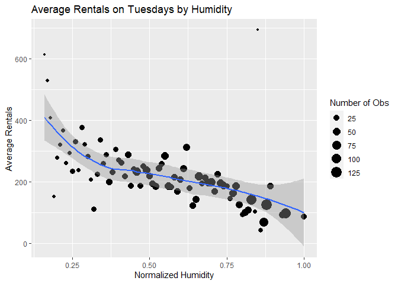
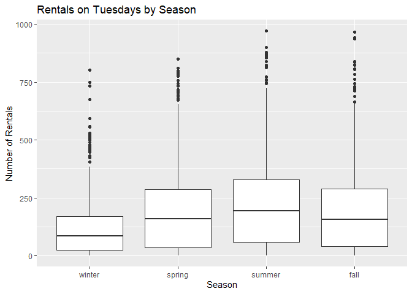
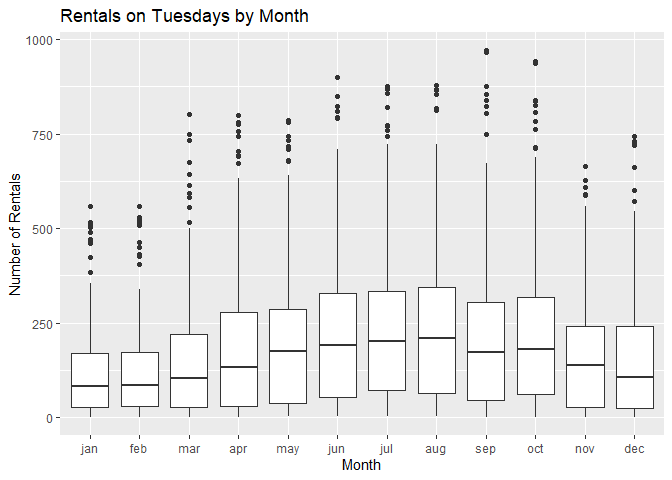
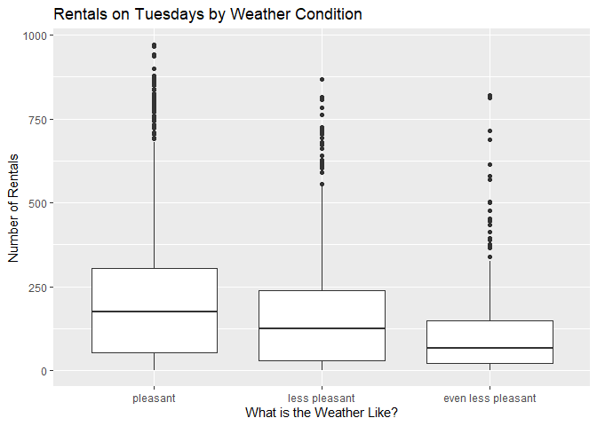

Joshua Burrows Project 2
================
16 October 2020

  - [Bike Rentals on Tuesdays:
    Introduction](#bike-rentals-on-tuesdays-introduction)
  - [Read in Data](#read-in-data)
      - [Get Bikes Data](#get-bikes-data)
      - [Factors](#factors)
      - [Filter by Day](#filter-by-day)
  - [Exploratory Data Analysis](#exploratory-data-analysis)
      - [Quantitative Predictors](#quantitative-predictors)
          - [Correlations](#correlations)
          - [Hour](#hour)
          - [Temperature](#temperature)
          - [Felt Temperature](#felt-temperature)
          - [Humidity](#humidity)
          - [Windspeed](#windspeed)
      - [Categorical Predictors](#categorical-predictors)
          - [Helper Function](#helper-function)
          - [Season](#season)
          - [Year](#year)
          - [Month](#month)
          - [Holiday](#holiday)
          - [Working Day](#working-day)
          - [Weather Condition](#weather-condition)
  - [Train Models](#train-models)
      - [Split Data](#split-data)
      - [Non-Ensemble Tree](#non-ensemble-tree)
          - [Training](#training)
              - [Tree Models](#tree-models)
              - [Tuning Parameter](#tuning-parameter)
              - [Create the Model](#create-the-model)
          - [Model Information](#model-information)
      - [Boosted Tree](#boosted-tree)
          - [Training](#training-1)
              - [Boosted Tree Models](#boosted-tree-models)
              - [Tuning Paremeters](#tuning-paremeters)
              - [Create the Model](#create-the-model-1)
          - [Model Information](#model-information-1)
  - [Test Models](#test-models)
  - [Best Model](#best-model)

# Bike Rentals on Tuesdays: Introduction

This document walks though the process of creating a model to predict
the number of bikes that will be rented on tuesdays.

I compared two models - a *non-ensemble tree* and a *boosted tree* - and
picked the one that does better. These models use the following
predictor variables:

  - yr: year (2011 or 2012)  
  - mnth: month  
  - hr: hour of the day  
  - holiday: whether the day is a holiday  
  - weathersit: weather condition
      - pleasant: clear, few clouds, partly cloudy  
      - less pleasant: mist, mist + cloudy, mist + broken clouds, mist +
        few clouds  
      - even less pleasant: light snow, light Rain + scattered clouds,
        light rain + thunderstorm + scattered clouds  
      - downright unpleasant: snow + fog, heavy rain + ice pallets +
        thunderstorm + mist  
  - temp: normalized temperature in celsius  
  - hum: normalized humidity  
  - windspeed: normalized windspeed

You can return to the homepage for this project by clicking
[here](README.md).

# Read in Data

## Get Bikes Data

Read in data that has been downloaded from [the UCI Machine Learning
Library](https://archive.ics.uci.edu/ml/datasets/Bike+Sharing+Dataset).

``` r
bikes <- read_csv(file = "../Bike-Sharing-Dataset/hour.csv")

bikes %>%
  head() %>%
  kable()
```

| instant | dteday     | season | yr | mnth | hr | holiday | weekday | workingday | weathersit | temp |  atemp |  hum | windspeed | casual | registered | cnt |
| ------: | :--------- | -----: | -: | ---: | -: | ------: | ------: | ---------: | ---------: | ---: | -----: | ---: | --------: | -----: | ---------: | --: |
|       1 | 2011-01-01 |      1 |  0 |    1 |  0 |       0 |       6 |          0 |          1 | 0.24 | 0.2879 | 0.81 |    0.0000 |      3 |         13 |  16 |
|       2 | 2011-01-01 |      1 |  0 |    1 |  1 |       0 |       6 |          0 |          1 | 0.22 | 0.2727 | 0.80 |    0.0000 |      8 |         32 |  40 |
|       3 | 2011-01-01 |      1 |  0 |    1 |  2 |       0 |       6 |          0 |          1 | 0.22 | 0.2727 | 0.80 |    0.0000 |      5 |         27 |  32 |
|       4 | 2011-01-01 |      1 |  0 |    1 |  3 |       0 |       6 |          0 |          1 | 0.24 | 0.2879 | 0.75 |    0.0000 |      3 |         10 |  13 |
|       5 | 2011-01-01 |      1 |  0 |    1 |  4 |       0 |       6 |          0 |          1 | 0.24 | 0.2879 | 0.75 |    0.0000 |      0 |          1 |   1 |
|       6 | 2011-01-01 |      1 |  0 |    1 |  5 |       0 |       6 |          0 |          2 | 0.24 | 0.2576 | 0.75 |    0.0896 |      0 |          1 |   1 |

## Factors

Convert categorical variables to factors.

``` r
bikes$weekday <- as.factor(bikes$weekday)
levels(bikes$weekday) <- c("Sunday", "Monday", "Tuesday", "Wednesday", "Thursday", "Friday", "Saturday")

bikes$season <- as.factor(bikes$season)
levels(bikes$season) <- c("winter", "spring", "summer", "fall")

bikes$yr <- as.factor(bikes$yr)
levels(bikes$yr) <- c("2011", "2012")

bikes$mnth <- as.factor(bikes$mnth)
levels(bikes$mnth) <- c("jan", "feb", "mar", "apr", "may", "jun", "jul", "aug", "sep", "oct", "nov", "dec")

bikes$weathersit <- as.factor(bikes$weathersit)
levels(bikes$weathersit) <- c("pleasant", "less pleasant", "even less pleasant", "downright unpleasant")

bikes$holiday <- as.factor(bikes$holiday)
levels(bikes$holiday) <- c("no", "yes")

bikes$workingday <- as.factor(bikes$workingday)
levels(bikes$workingday) <- c("no", "yes")

bikes %>%
  head() %>%
  kable()
```

| instant | dteday     | season | yr   | mnth | hr | holiday | weekday  | workingday | weathersit    | temp |  atemp |  hum | windspeed | casual | registered | cnt |
| ------: | :--------- | :----- | :--- | :--- | -: | :------ | :------- | :--------- | :------------ | ---: | -----: | ---: | --------: | -----: | ---------: | --: |
|       1 | 2011-01-01 | winter | 2011 | jan  |  0 | no      | Saturday | no         | pleasant      | 0.24 | 0.2879 | 0.81 |    0.0000 |      3 |         13 |  16 |
|       2 | 2011-01-01 | winter | 2011 | jan  |  1 | no      | Saturday | no         | pleasant      | 0.22 | 0.2727 | 0.80 |    0.0000 |      8 |         32 |  40 |
|       3 | 2011-01-01 | winter | 2011 | jan  |  2 | no      | Saturday | no         | pleasant      | 0.22 | 0.2727 | 0.80 |    0.0000 |      5 |         27 |  32 |
|       4 | 2011-01-01 | winter | 2011 | jan  |  3 | no      | Saturday | no         | pleasant      | 0.24 | 0.2879 | 0.75 |    0.0000 |      3 |         10 |  13 |
|       5 | 2011-01-01 | winter | 2011 | jan  |  4 | no      | Saturday | no         | pleasant      | 0.24 | 0.2879 | 0.75 |    0.0000 |      0 |          1 |   1 |
|       6 | 2011-01-01 | winter | 2011 | jan  |  5 | no      | Saturday | no         | less pleasant | 0.24 | 0.2576 | 0.75 |    0.0896 |      0 |          1 |   1 |

## Filter by Day

Grab the data for tuesday.

``` r
dayData <- bikes %>% filter(weekday == params$day)

dayData %>%
  head() %>%
  kable()
```

| instant | dteday     | season | yr   | mnth | hr | holiday | weekday | workingday | weathersit | temp |  atemp |  hum | windspeed | casual | registered | cnt |
| ------: | :--------- | :----- | :--- | :--- | -: | :------ | :------ | :--------- | :--------- | ---: | -----: | ---: | --------: | -----: | ---------: | --: |
|      70 | 2011-01-04 | winter | 2011 | jan  |  0 | no      | Tuesday | yes        | pleasant   | 0.16 | 0.1818 | 0.55 |    0.1045 |      0 |          5 |   5 |
|      71 | 2011-01-04 | winter | 2011 | jan  |  1 | no      | Tuesday | yes        | pleasant   | 0.16 | 0.1818 | 0.59 |    0.1045 |      0 |          2 |   2 |
|      72 | 2011-01-04 | winter | 2011 | jan  |  2 | no      | Tuesday | yes        | pleasant   | 0.14 | 0.1515 | 0.63 |    0.1343 |      0 |          1 |   1 |
|      73 | 2011-01-04 | winter | 2011 | jan  |  4 | no      | Tuesday | yes        | pleasant   | 0.14 | 0.1818 | 0.63 |    0.0896 |      0 |          2 |   2 |
|      74 | 2011-01-04 | winter | 2011 | jan  |  5 | no      | Tuesday | yes        | pleasant   | 0.12 | 0.1515 | 0.68 |    0.1045 |      0 |          4 |   4 |
|      75 | 2011-01-04 | winter | 2011 | jan  |  6 | no      | Tuesday | yes        | pleasant   | 0.12 | 0.1515 | 0.74 |    0.1045 |      0 |         36 |  36 |

# Exploratory Data Analysis

I started with a little bit of exploratory data analysis. The goal is to
look at the relationships between the predictors and number of bike
rentals.

## Quantitative Predictors

### Correlations

Visualize the strength of the relationships between the quantitative
predictors.

Unsurprisingly, *atemp* and *temp* are strongly correlated. *atemp*
represents the heat index, which is typically calculated using
temperature and humidity. So it makes sense to either eliminate *atemp*
from the model or keep *atemp* but eliminate *temp* and *hum*. I decided
to eliminate *atemp*.

``` r
corr <- dayData %>%
  select(temp, atemp, windspeed, hum) %>%
  cor()

corrplot(corr)
```

<!-- -->

### Hour

Create a scatter plot to investigate the relationship between time of
day and rentals on tuesdays. Fit a line through the points to get a
basic idea of their relationship.

``` r
avgRentals <- dayData %>%
  group_by(hr) %>%
  summarize(meanRentals = mean(cnt))

corrHour <- cor(avgRentals$hr, avgRentals$meanRentals)

ggplot(avgRentals, aes(x = hr, y = meanRentals)) +
  geom_point() +
  labs(title = paste0("Total Rentals on ", paste0(params$day, "s"), " by Hour"), x = "Hour of the Day", y = "Total Rentals") +
  geom_smooth()
```

<!-- -->

The correlation between hour and average rentals is 0.491732.

Be careful, correlation measures straight line relationships, so if the
plot above shows a curved relationship, correlation may not be a useful
measure.

### Temperature

Create a scatter plot to investigate the relationship between
temperature and number of rentals on tuesdays. Fit a line through the
points to get a basic idea of their relationship.

The size of the dots represents the number of observations at each
temperature.

``` r
tempAvg <- dayData %>%
  group_by(temp) %>%
  summarize(avgRentals = mean(cnt), n = n())

corrTemp <- cor(tempAvg$temp, tempAvg$avgRentals)

ggplot(tempAvg, aes(x = temp, y = avgRentals)) +
  geom_point(aes(size = n)) +
  geom_smooth() +
  labs(title = paste0("Average Rentals on ", paste0(params$day, "s"), " by Temperature"), x = "Normalized Temperature", y = "Average Rentals") +
  scale_size_continuous(name = "Number of Obs")
```

<!-- -->

The correlation between temperature and average rentals is 0.9036214.

Be careful, correlation measures straight line relationships, so if the
plot above shows a curved relationship, correlation may not be a useful
measure.

### Felt Temperature

Create a scatter plot to investigate the relationship between felt
temperature and number of rentals on tuesdays. Fit a line through the
points to get a basic idea of their relationship.

The size of the dots represents the number of observations at each felt
temperatrure.

As already noted, it does not make much sense to keep *atemp* if *temp*
and *hum* will be in the model, so I eliminated *atemp* from the model.

``` r
atempAvg <- dayData %>%
  group_by(atemp) %>%
  summarize(avgRentals = mean(cnt), n = n())

corrATemp <- cor(atempAvg$atemp, atempAvg$avgRentals)

ggplot(atempAvg, aes(x = atemp, y = avgRentals)) +
  geom_point(aes(size = n)) +
  geom_smooth() +
  labs(title = paste0("Average Rentals on ", paste0(params$day, "s"), " by Felt Temperature"), x = "Normalized Feeling Temperature", y = "Average Rentals") +
  scale_size_continuous(name = "Number of Obs")
```

<!-- -->

The correlation between felt temperature and average rentals is
0.861061.

Be careful, correlation measures straight line relationships, so if the
plot above shows a curved relationship, correlation may not be a useful
measure.

### Humidity

Create a scatter plot to investigate the relationship between humidity
and number of rentals on tuesdays. Fit a line through the points to get
a basic idea of their relationship.

The size of the dots represents the number of observations at each
humidity level.

``` r
humAvg <- dayData %>%
  group_by(hum) %>%
  summarize(avgRentals = mean(cnt), n = n())

corrHum <- cor(humAvg$hum, humAvg$avgRentals)

ggplot(humAvg, aes(x = hum, y = avgRentals)) +
  geom_point(aes(size = n)) +
  geom_smooth() +
  labs(title = paste0("Average Rentals on ", paste0(params$day, "s"), " by Humidity"), x = "Normalized Humidity", y = "Average Rentals") +
  scale_size_continuous(name = "Number of Obs")
```

<!-- -->

The correlation between humidity and average rentals is -0.55744.

Be careful, correlation measures straight line relationships, so if the
plot above shows a curved relationship, correlation may not be a useful
measure.

### Windspeed

Create a scatter plot to investigate the relationship between windspeed
and number of rentals on tuesdays. Fit a line through the points to get
a basic idea of their relationship.

The size of the dots represents the number of observations at each
windspeed.

``` r
windAvg <- dayData %>%
  group_by(windspeed) %>%
  summarize(avgRentals = mean(cnt), n = n())

corrWind <- cor(windAvg$windspeed, windAvg$avgRentals)

ggplot(windAvg, aes(x = windspeed, y = avgRentals)) +
  geom_point(aes(size = n)) +
  geom_smooth() +
  labs(title = paste0("Average Rentals on ", paste0(params$day, "s"), " by Windspeed"), x = "Normalized Windspeed", y = "Average Rentals") +
  scale_size_continuous(name = "Number of Obs")
```

<!-- -->

The correlation between windspeed and average rentals is -0.4214456.

Be careful, correlation measures straight line relationships, so if the
plot above shows a curved relationship, correlation may not be a useful
measure.

## Categorical Predictors

### Helper Function

Create a helper function to display basic numeric summaries for a given
grouping variable.

``` r
getSum <- function(varName, colName) {
  sum <- dayData %>%
    group_by(dayData[[varName]]) %>%
    summarize(min = min(cnt), Q1 = quantile(cnt, probs = c(.25), names = FALSE), median = median(cnt), mean = mean(cnt), Q3 = quantile(cnt, probs = c(.75), names = FALSE), max = max(cnt), obs = n())

  output <- sum %>% kable(col.names = c(colName, "Minimum", "1st Quartile", "Median", "Mean", "3rd Quartile", "Maximum", "Number of Observations"))

  return(output)
}
```

### Season

Explore how bike rentals on tuesdays change with the seasons using a
basic numeric summary and a boxplot. The boxplot can be used to identify
outliers.

It does not make much sense to keep both *season* and *mnth* in the
model, so I decided to eliminate *season*.

``` r
getSum(varName = "season", colName = "Season")
```

| Season | Minimum | 1st Quartile | Median |     Mean | 3rd Quartile | Maximum | Number of Observations |
| :----- | ------: | -----------: | -----: | -------: | -----------: | ------: | ---------------------: |
| winter |       1 |         23.5 |   85.0 | 122.2644 |       170.00 |     801 |                    571 |
| spring |       1 |         35.0 |  159.5 | 201.0401 |       285.25 |     850 |                    624 |
| summer |       1 |         57.0 |  192.0 | 236.0355 |       328.00 |     970 |                    647 |
| fall   |       1 |         40.0 |  157.0 | 198.2520 |       289.00 |     967 |                    611 |

``` r
ggplot(dayData, aes(x = season, y = cnt)) +
  geom_boxplot() +
  labs(title = paste0("Rentals on ", paste0(params$day, "s"), " by Season"), x = "Season", y = "Number of Rentals")
```

<!-- -->

### Year

Looking at total rentals each year gives us some idea of the long term
trend in bike rentals on tuesdays. It would be helpful to have data from
more years, though.

``` r
yearSum <- dayData %>%
  group_by(yr) %>%
  summarize(totalRentals = sum(cnt))

yearSum %>% kable(col.names = c("Year", "Total Rentals"))
```

| Year | Total Rentals |
| :--- | ------------: |
| 2011 |        180338 |
| 2012 |        288771 |

### Month

Explore how bike rentals on tuesdays change depending on the month.

As already noted, it is probably not worth including *mnth* and *season*
in the model, so *season* has been eliminated.

``` r
getSum(varName = "mnth", colName = "Month")
```

| Month | Minimum | 1st Quartile | Median |     Mean | 3rd Quartile | Maximum | Number of Observations |
| :---- | ------: | -----------: | -----: | -------: | -----------: | ------: | ---------------------: |
| jan   |       1 |        27.25 |   83.0 | 116.7172 |       168.75 |     559 |                    198 |
| feb   |       1 |        29.50 |   86.0 | 123.4536 |       172.00 |     559 |                    183 |
| mar   |       1 |        25.50 |  104.0 | 149.6093 |       220.50 |     801 |                    215 |
| apr   |       1 |        29.50 |  132.0 | 189.8281 |       277.50 |     800 |                    192 |
| may   |       2 |        37.50 |  175.0 | 209.3750 |       286.25 |     785 |                    240 |
| jun   |       2 |        54.00 |  189.5 | 236.7031 |       328.50 |     900 |                    192 |
| jul   |       2 |        72.00 |  200.0 | 243.5093 |       334.00 |     877 |                    216 |
| aug   |       3 |        63.00 |  208.5 | 247.1019 |       343.25 |     878 |                    216 |
| sep   |       1 |        45.50 |  172.0 | 217.1518 |       304.00 |     970 |                    191 |
| oct   |       1 |        60.50 |  180.0 | 224.5369 |       317.50 |     943 |                    203 |
| nov   |       1 |        27.50 |  136.5 | 168.3426 |       242.00 |     665 |                    216 |
| dec   |       1 |        24.50 |  107.0 | 155.5288 |       242.00 |     743 |                    191 |

``` r
ggplot(dayData, aes(x = mnth, y = cnt)) +
  geom_boxplot() +
  labs(title = paste0("Rentals on ", paste0(params$day, "s"), " by Month"), x = "Month", y = "Number of Rentals")
```

<!-- -->

### Holiday

Explore how bike rentals change depending on whether the tuesday in
question is a holiday.

Note: There are no holidays on Saturday or Sunday because the holiday
data has been extracted from the [Washington D.C. HR Department’s
Holiday Schedule](https://dchr.dc.gov/page/holiday-schedules), which
only lists holidays that fall during the work week.

``` r
getSum(varName = "holiday", colName = "Holiday")
```

| Holiday | Minimum | 1st Quartile | Median |      Mean | 3rd Quartile | Maximum | Number of Observations |
| :------ | ------: | -----------: | -----: | --------: | -----------: | ------: | ---------------------: |
| no      |       1 |           36 |    149 | 192.63210 |          277 |     970 |                   2430 |
| yes     |       1 |           12 |     32 |  44.04348 |           68 |     126 |                     23 |

``` r
ggplot(dayData, aes(x = holiday, y = cnt)) +
  geom_boxplot() +
  labs(title = paste0("Rentals on ", paste0(params$day, "s"), " by Holiday"), x = "Is it a Holiday?", y = "Number of Rentals")
```

<!-- -->

### Working Day

Explore how bike rentals change depending on whether the day in question
is a working day.

Working days are neither weekends nor holidays. I decided not to keep
this variable in the model because it wouldn’t make much sense in the
reports for Saturday and Sunday.

``` r
getSum(varName = "workingday", colName = "Working Day")
```

| Working Day | Minimum | 1st Quartile | Median |      Mean | 3rd Quartile | Maximum | Number of Observations |
| :---------- | ------: | -----------: | -----: | --------: | -----------: | ------: | ---------------------: |
| no          |       1 |           12 |     32 |  44.04348 |           68 |     126 |                     23 |
| yes         |       1 |           36 |    149 | 192.63210 |          277 |     970 |                   2430 |

``` r
ggplot(dayData, aes(x = workingday, y = cnt)) +
  geom_boxplot() +
  labs(title = paste0("Rentals on ", paste0(params$day, "s"), " by Working Day"), x = "Is it a Working Day?", y = "Number of Rentals")
```

<!-- -->

### Weather Condition

Explore how bike rentals on tuesdays change depending on the weather.

``` r
getSum(varName = "weathersit", colName = "Weather Condition")
```

| Weather Condition  | Minimum | 1st Quartile | Median |     Mean | 3rd Quartile | Maximum | Number of Observations |
| :----------------- | ------: | -----------: | -----: | -------: | -----------: | ------: | ---------------------: |
| pleasant           |       1 |        52.25 |  174.5 | 214.8364 |       303.75 |     970 |                   1522 |
| less pleasant      |       1 |        28.00 |  123.5 | 164.7133 |       238.75 |     868 |                    694 |
| even less pleasant |       1 |        20.00 |   66.0 | 117.3713 |       147.00 |     819 |                    237 |

``` r
ggplot(dayData, aes(x = weathersit, y = cnt)) +
  geom_boxplot() +
  labs(title = paste0("Rentals on ", paste0(params$day, "s"), " by Weather Condition"), x = "What is the Weather Like?", y = "Number of Rentals")
```

<!-- -->

# Train Models

After exploring the data, I created two models, a non-ensemble tree and
a boosted tree.

## Split Data

Split the data into a training set and a test set. The training set is
used to build the models, and the test set is used to evaluate them.

``` r
set.seed(123)
trainIndex <- createDataPartition(dayData$cnt, p = .75, list = FALSE)

train <- dayData[trainIndex, ]
test <- dayData[-trainIndex, ]
```

## Non-Ensemble Tree

### Training

Fit a non-ensemble tree model.

#### Tree Models

Tree models split each predictor space into regions and make a different
prediction for each region. For example, suppose we are interested in
predicting life expectancy based on exercise habits. We might split the
predictor space into **exercises less than one hour a week** and
**exercises at least one hour a week** and then predict that people in
the second group live longer.

How do we decide whether to split at one hour, one and a half hours, two
hours, etc? This decision is made using a method called “Recursive
Binary Splitting”, which we don’t have to worry about too much because
the *caret* package does it for us.

Ensemble tree models fit lots of trees and then average their results.
Here I have created a basic non-ensemble tree to model bicycle rentals.

#### Tuning Parameter

This model has one “tuning parameter” called *cp*. *cp* stands for
“Complexity Parameter”, and it controls the number of “nodes” that the
tree has.

The life expectancy example above has two terminal nodes: **less than
one hour** and **at least one hour**. We could complicate the example by
adding additional nodes. For instance, we could divide the group **less
than one hour** into two subgroups: **less than half an hour** and
**greater than half an hour but less than one hour**. And we could
divide **at least one hour a week** into **less than two hours but at
least one hour** and **greater than two hours**.

Sometimes increasing the number of nodes makes your model better, but
sometimes it makes it worse. There are lots of different methods for
picking the best number of nodes. For the bicycle rental model, I used a
method called “Leave One Out Cross Validation”.

*LOOCV* works by removing an observation from the data set, using the
rest of the data to create a model, and then seeing how well that model
does at predicting the observation that was left out. This process is
repeated for every observation, and the results are combined.

If we want to compare two different values of *cp*, we will go through
the *LOOCV* process twice and compare the results. In this way, we can
test different values of *cp* to see which one performs best.

I used the *caret* package to test 10 different values of *cp*.

#### Create the Model

``` r
set.seed(123)
tree <- train(cnt ~ yr + mnth + hr + holiday + weathersit + temp + hum + windspeed,
  data = train,
  method = "rpart",
  trControl = trainControl(method = "LOOCV"),
  tuneLength = 10
)
```

### Model Information

My final non-ensemble tree model uses a *cp* of 0.0141219. Its root mean
square error on the training set is 96.6554901.

More information about this model is below.

``` r
tree
```

    ## CART 
    ## 
    ## 1842 samples
    ##    8 predictor
    ## 
    ## No pre-processing
    ## Resampling: Leave-One-Out Cross-Validation 
    ## Summary of sample sizes: 1841, 1841, 1841, 1841, 1841, 1841, ... 
    ## Resampling results across tuning parameters:
    ## 
    ##   cp          RMSE       Rsquared   
    ##   0.01412194   96.65549  0.734057346
    ##   0.01659336   97.94673  0.726829542
    ##   0.02471014  102.76231  0.699403394
    ##   0.02771196  113.94146  0.631210710
    ##   0.03837376  122.65444  0.573476403
    ##   0.04170343  126.17983  0.547680629
    ##   0.05674204  134.69306  0.484855151
    ##   0.06972403  155.21842  0.323353074
    ##   0.07606903  169.99304  0.201516988
    ##   0.30827401  192.36864  0.001537765
    ##   MAE      
    ##    66.75540
    ##    69.01500
    ##    71.22150
    ##    81.08673
    ##    89.38095
    ##    87.60200
    ##    94.21281
    ##   108.86114
    ##   124.97724
    ##   165.86999
    ## 
    ## RMSE was used to select the
    ##  optimal model using the
    ##  smallest value.
    ## The final value used for the model
    ##  was cp = 0.01412194.

``` r
plot(tree$finalModel)
text(tree$finalModel)
```

<!-- -->

## Boosted Tree

### Training

#### Boosted Tree Models

Boosted trees are another type of tree model. “Boosting” works by
fitting a series of trees, each of which is a modified version of the
previous tree. The idea is to hone in on the best model.

#### Tuning Paremeters

Four tuning parameters are involved:  
\- *n.trees*: number of boosting iterations  
\- *interaction.depth*: maximum tree depth  
\- *shrinkage*: how strongly each subsequent tree is influenced by the
previous tree  
\- *n.minobsinnode*: minimum terminal node size

Values for the tuning parameters are found using Cross Validation. Cross
Validation works by splitting the data into groups called “folds”. One
fold is left out, the rest are used to create a model, and then that
model is tested on the fold that was left out. This process is repeated
for each fold, and the results are combined. It should be clear that
*LOOCV* is just *CV* with the number of folds equal to the number of
observations.

I used the *caret* package to test 81 different combinations of tuning
parameters.

#### Create the Model

``` r
tuneGr <- expand.grid(
  n.trees = seq(from = 50, to = 150, by = 50),
  interaction.depth = 1:3,
  shrinkage = seq(from = .05, to = .15, by = .05),
  n.minobsinnode = 9:11
)

set.seed(123)
boostTree <- train(cnt ~ yr + mnth + hr + holiday + weathersit + temp + hum + windspeed,
  data = train,
  method = "gbm",
  trControl = trainControl(method = "cv", number = 10),
  tuneGrid = tuneGr,
  verbose = FALSE
)
```

### Model Information

My final boosted tree model uses the following tuning parameters:

  - *n.trees*: 150  
  - *interaction.depth*: 3  
  - *shrinkage*: 0.15  
  - *n.minobsinnode*: 9

Its root mean square error on the training set is 51.6995956.

More information about this model is below.

``` r
boostTree
```

    ## Stochastic Gradient Boosting 
    ## 
    ## 1842 samples
    ##    8 predictor
    ## 
    ## No pre-processing
    ## Resampling: Cross-Validated (10 fold) 
    ## Summary of sample sizes: 1656, 1658, 1658, 1659, 1658, 1658, ... 
    ## Resampling results across tuning parameters:
    ## 
    ##   shrinkage  interaction.depth
    ##   0.05       1                
    ##   0.05       1                
    ##   0.05       1                
    ##   0.05       1                
    ##   0.05       1                
    ##   0.05       1                
    ##   0.05       1                
    ##   0.05       1                
    ##   0.05       1                
    ##   0.05       2                
    ##   0.05       2                
    ##   0.05       2                
    ##   0.05       2                
    ##   0.05       2                
    ##   0.05       2                
    ##   0.05       2                
    ##   0.05       2                
    ##   0.05       2                
    ##   0.05       3                
    ##   0.05       3                
    ##   0.05       3                
    ##   0.05       3                
    ##   0.05       3                
    ##   0.05       3                
    ##   0.05       3                
    ##   0.05       3                
    ##   0.05       3                
    ##   0.10       1                
    ##   0.10       1                
    ##   0.10       1                
    ##   0.10       1                
    ##   0.10       1                
    ##   0.10       1                
    ##   0.10       1                
    ##   0.10       1                
    ##   0.10       1                
    ##   0.10       2                
    ##   0.10       2                
    ##   0.10       2                
    ##   0.10       2                
    ##   0.10       2                
    ##   0.10       2                
    ##   0.10       2                
    ##   0.10       2                
    ##   0.10       2                
    ##   0.10       3                
    ##   0.10       3                
    ##   0.10       3                
    ##   0.10       3                
    ##   0.10       3                
    ##   0.10       3                
    ##   0.10       3                
    ##   0.10       3                
    ##   0.10       3                
    ##   0.15       1                
    ##   0.15       1                
    ##   0.15       1                
    ##   0.15       1                
    ##   0.15       1                
    ##   0.15       1                
    ##   0.15       1                
    ##   0.15       1                
    ##   0.15       1                
    ##   0.15       2                
    ##   0.15       2                
    ##   0.15       2                
    ##   0.15       2                
    ##   0.15       2                
    ##   0.15       2                
    ##   0.15       2                
    ##   0.15       2                
    ##   0.15       2                
    ##   0.15       3                
    ##   0.15       3                
    ##   0.15       3                
    ##   0.15       3                
    ##   0.15       3                
    ##   0.15       3                
    ##   0.15       3                
    ##   0.15       3                
    ##   0.15       3                
    ##   n.minobsinnode  n.trees  RMSE     
    ##    9               50      144.19483
    ##    9              100      128.83740
    ##    9              150      119.39092
    ##   10               50      144.14014
    ##   10              100      128.80263
    ##   10              150      119.58870
    ##   11               50      144.19882
    ##   11              100      128.92040
    ##   11              150      119.52393
    ##    9               50      115.62785
    ##    9              100       93.05320
    ##    9              150       78.08119
    ##   10               50      115.32190
    ##   10              100       92.83891
    ##   10              150       78.19499
    ##   11               50      115.36064
    ##   11              100       92.88142
    ##   11              150       78.39594
    ##    9               50       98.49132
    ##    9              100       73.61310
    ##    9              150       62.81894
    ##   10               50       99.43780
    ##   10              100       73.73657
    ##   10              150       62.91061
    ##   11               50       98.97730
    ##   11              100       74.21994
    ##   11              150       63.26635
    ##    9               50      128.50136
    ##    9              100      112.85032
    ##    9              150      103.22163
    ##   10               50      128.60120
    ##   10              100      112.78513
    ##   10              150      103.41577
    ##   11               50      128.15770
    ##   11              100      112.76910
    ##   11              150      103.19760
    ##    9               50       92.14326
    ##    9              100       71.04954
    ##    9              150       66.36179
    ##   10               50       91.63201
    ##   10              100       71.43134
    ##   10              150       66.05462
    ##   11               50       92.68055
    ##   11              100       71.74108
    ##   11              150       66.36505
    ##    9               50       73.41033
    ##    9              100       57.91585
    ##    9              150       53.84601
    ##   10               50       73.25931
    ##   10              100       57.61729
    ##   10              150       53.76243
    ##   11               50       73.67951
    ##   11              100       58.72536
    ##   11              150       54.14029
    ##    9               50      119.02233
    ##    9              100      102.93632
    ##    9              150       93.39311
    ##   10               50      118.84043
    ##   10              100      102.80067
    ##   10              150       93.03701
    ##   11               50      119.02715
    ##   11              100      102.91824
    ##   11              150       93.24499
    ##    9               50       77.72659
    ##    9              100       66.54043
    ##    9              150       63.32321
    ##   10               50       77.90732
    ##   10              100       66.44204
    ##   10              150       64.08774
    ##   11               50       77.36408
    ##   11              100       66.39329
    ##   11              150       63.58338
    ##    9               50       62.60948
    ##    9              100       53.70798
    ##    9              150       51.69960
    ##   10               50       62.88497
    ##   10              100       54.74487
    ##   10              150       52.27619
    ##   11               50       63.03116
    ##   11              100       54.44684
    ##   11              150       52.34969
    ##   Rsquared   MAE      
    ##   0.4935995  102.12942
    ##   0.5933562   88.04362
    ##   0.6423141   81.29095
    ##   0.4912994  101.98537
    ##   0.5939614   87.89516
    ##   0.6390712   81.38895
    ##   0.4924445  101.84923
    ##   0.5918689   88.05513
    ##   0.6399540   81.37727
    ##   0.6946322   78.76761
    ##   0.7911049   60.42517
    ##   0.8483095   51.70776
    ##   0.7001191   78.60097
    ##   0.7936439   60.15832
    ##   0.8467915   51.56367
    ##   0.6999972   78.66383
    ##   0.7908785   60.23836
    ##   0.8453915   51.65910
    ##   0.8010688   67.96606
    ##   0.8719887   48.26016
    ##   0.9000532   41.07515
    ##   0.7962671   68.19474
    ##   0.8712650   48.04773
    ##   0.8999858   41.00219
    ##   0.7976154   68.03194
    ##   0.8697877   48.66745
    ##   0.8985309   41.08963
    ##   0.5935877   87.69298
    ##   0.6795977   76.73989
    ##   0.7314462   70.06635
    ##   0.5916695   87.64569
    ##   0.6791758   76.66696
    ##   0.7304406   70.28416
    ##   0.5967616   87.65354
    ##   0.6788929   76.70790
    ##   0.7313988   70.02298
    ##   0.7944764   59.57353
    ##   0.8668246   47.63203
    ##   0.8792780   44.47537
    ##   0.7972219   59.66151
    ##   0.8655519   47.50779
    ##   0.8802535   44.08134
    ##   0.7917996   60.08144
    ##   0.8645617   47.75322
    ##   0.8787001   44.18448
    ##   0.8708808   48.31674
    ##   0.9108555   38.07868
    ##   0.9199636   35.53270
    ##   0.8734641   48.15232
    ##   0.9118595   37.74953
    ##   0.9204378   35.31118
    ##   0.8713028   48.52503
    ##   0.9084996   38.42144
    ##   0.9187839   35.54326
    ##   0.6395127   81.08252
    ##   0.7332397   69.71869
    ##   0.7756145   63.22863
    ##   0.6425916   80.72024
    ##   0.7335423   69.61293
    ##   0.7777902   62.88472
    ##   0.6416239   81.10529
    ##   0.7319139   69.68079
    ##   0.7763215   63.40636
    ##   0.8477253   51.67879
    ##   0.8784927   44.49965
    ##   0.8877752   42.58643
    ##   0.8453065   51.45883
    ##   0.8780821   44.45911
    ##   0.8847373   42.95559
    ##   0.8476545   51.02085
    ##   0.8780328   44.27591
    ##   0.8861635   42.46237
    ##   0.8993303   41.07585
    ##   0.9202205   35.28194
    ##   0.9245698   33.69253
    ##   0.8974336   41.12466
    ##   0.9172523   35.94227
    ##   0.9236090   34.10200
    ##   0.8979489   41.12305
    ##   0.9175377   35.50540
    ##   0.9233493   33.91549
    ## 
    ## RMSE was used to select the
    ##  optimal model using the
    ##  smallest value.
    ## The final values used for the
    ##  shrinkage = 0.15 and n.minobsinnode
    ##  = 9.

# Test Models

I tested the models on the test set and selected the model that
performed best.

Performance was measured using Root Mean Square Error, which is a
measure of how close the model gets to correctly predicting the test
data. The RMSE for each model is displayed below.

``` r
treePreds <- predict(tree, test)
treeRMSE <- postResample(treePreds, test$cnt)[1]

boostPreds <- predict(boostTree, test)
boostRMSE <- postResample(boostPreds, test$cnt)[1]

modelPerformance <- data.frame(model = c("Non-Ensemble Tree", "Boosted Tree"), trainRMSE = c(min(tree$results$RMSE), min(boostTree$results$RMSE)), testRMSE = c(treeRMSE, boostRMSE))

modelPerformance %>% kable(col.names = c("Model", "Train RMSE", "Test RMSE"))
```

| Model             | Train RMSE | Test RMSE |
| :---------------- | ---------: | --------: |
| Non-Ensemble Tree |   96.65549 |  92.11417 |
| Boosted Tree      |   51.69960 |  52.38218 |

# Best Model

``` r
best <- modelPerformance %>% filter(testRMSE == min(testRMSE))
worst <- modelPerformance %>% filter(testRMSE == max(testRMSE))
```

The boosted tree performs better than the non-ensemble tree as judged by
RMSE on the test set.

The boosted tree model is saved to the `final` object below.

``` r
if (best$model == "Non-Ensemble Tree") {
  final <- tree
} else if (best$model == "Boosted Tree") {
  final <- boostTree
} else {
  stop("Error")
}

final$finalModel
```

    ## A gradient boosted model with gaussian loss function.
    ## 150 iterations were performed.
    ## There were 20 predictors of which 19 had non-zero influence.
