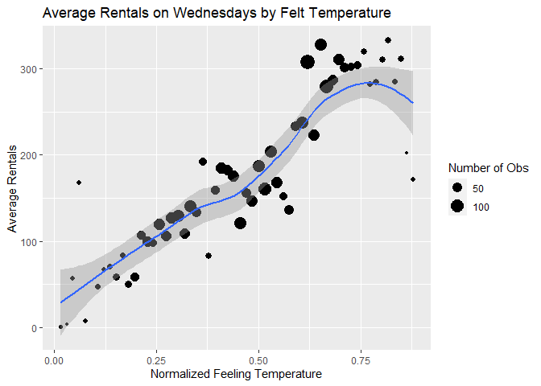
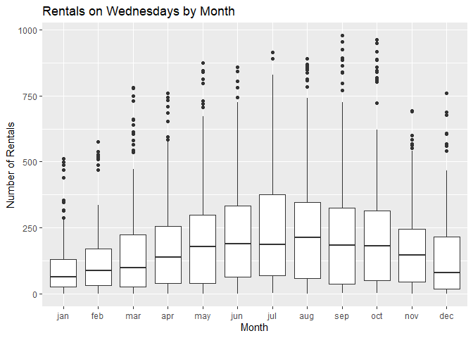

Joshua Burrows Project 2
================
16 October 2020

  - [Bike Rentals on Wednesdays:
    Introduction](#bike-rentals-on-wednesdays-introduction)
  - [Read in Data](#read-in-data)
      - [Get Bikes Data](#get-bikes-data)
      - [Factors](#factors)
      - [Filter by Day](#filter-by-day)
  - [Exploratory Data Analysis](#exploratory-data-analysis)
      - [Quantitative Predictors](#quantitative-predictors)
          - [Correlations](#correlations)
          - [Hour](#hour)
          - [Temperature](#temperature)
          - [Felt Temperature](#felt-temperature)
          - [Humidity](#humidity)
          - [Wind Speed](#wind-speed)
      - [Categorical Predictors](#categorical-predictors)
          - [Helper Function](#helper-function)
          - [Season](#season)
          - [Year](#year)
          - [Month](#month)
          - [Holiday](#holiday)
          - [Working Day](#working-day)
          - [Weather Condition](#weather-condition)
  - [Train Models](#train-models)
      - [Split Data](#split-data)
      - [Non-Ensemble Tree](#non-ensemble-tree)
          - [Training](#training)
              - [Tree Models](#tree-models)
              - [Tuning Parameter](#tuning-parameter)
              - [Formula](#formula)
              - [Create the Model](#create-the-model)
          - [Model Information](#model-information)
      - [Boosted Tree](#boosted-tree)
          - [Training](#training-1)
              - [Boosted Tree Models](#boosted-tree-models)
              - [Tuning Paremeters](#tuning-paremeters)
              - [Create the Model](#create-the-model-1)
          - [Model Information](#model-information-1)
      - [Multiple Linear Regression](#multiple-linear-regression)
          - [Training](#training-2)
              - [Create the Model](#create-the-model-2)
  - [Test Models](#test-models)
  - [Best Model](#best-model)

# Bike Rentals on Wednesdays: Introduction

This document walks though the process of creating a model to predict
hourly bike rentals on Wednesdays. I compared two models - a
*non-ensemble tree* and a *boosted tree* - and picked the one that does
better.

The data comes from the Capital bike sharing system, and it is available
[here](https://archive.ics.uci.edu/ml/datasets/Bike+Sharing+Dataset).
This data includes an hourly count of bike rentals for 2011 and 2012 as
well as information about the weather and the time of year.

My models use the following predictor variables:

  - *yr*: year (2011 or 2012)  
  - *mnth*: month  
  - *hr*: hour of the day  
  - *holiday*: whether the day is a holiday  
  - *weathersit*: weather condition
      - pleasant: clear, few clouds, partly cloudy  
      - less pleasant: mist, mist + cloudy, mist + broken clouds, mist +
        few clouds  
      - even less pleasant: light snow, light rain + scattered clouds,
        light rain + thunderstorm + scattered clouds  
      - downright unpleasant: snow + fog, heavy rain + ice pallets +
        thunderstorm + mist  
  - *temp*: normalized temperature in celsius  
  - *hum*: normalized humidity  
  - *windspeed*: normalized wind speed

You can return to the homepage for this project by clicking
[here](https://jkburrows.github.io/ST558-Project-2/). The github repo
for this project is
[here](https://github.com/JKBurrows/ST558-Project-2).

# Read in Data

## Get Bikes Data

Read in data.

``` r
bikes <- read_csv(file = "hour.csv")

bikes %>% head() %>% kable()
```

| instant | dteday     | season | yr | mnth | hr | holiday | weekday | workingday | weathersit | temp |  atemp |  hum | windspeed | casual | registered | cnt |
| ------: | :--------- | -----: | -: | ---: | -: | ------: | ------: | ---------: | ---------: | ---: | -----: | ---: | --------: | -----: | ---------: | --: |
|       1 | 2011-01-01 |      1 |  0 |    1 |  0 |       0 |       6 |          0 |          1 | 0.24 | 0.2879 | 0.81 |    0.0000 |      3 |         13 |  16 |
|       2 | 2011-01-01 |      1 |  0 |    1 |  1 |       0 |       6 |          0 |          1 | 0.22 | 0.2727 | 0.80 |    0.0000 |      8 |         32 |  40 |
|       3 | 2011-01-01 |      1 |  0 |    1 |  2 |       0 |       6 |          0 |          1 | 0.22 | 0.2727 | 0.80 |    0.0000 |      5 |         27 |  32 |
|       4 | 2011-01-01 |      1 |  0 |    1 |  3 |       0 |       6 |          0 |          1 | 0.24 | 0.2879 | 0.75 |    0.0000 |      3 |         10 |  13 |
|       5 | 2011-01-01 |      1 |  0 |    1 |  4 |       0 |       6 |          0 |          1 | 0.24 | 0.2879 | 0.75 |    0.0000 |      0 |          1 |   1 |
|       6 | 2011-01-01 |      1 |  0 |    1 |  5 |       0 |       6 |          0 |          2 | 0.24 | 0.2576 | 0.75 |    0.0896 |      0 |          1 |   1 |

## Factors

Convert categorical variables to factors.

``` r
bikes$weekday <- as.factor(bikes$weekday)
levels(bikes$weekday) <- c("Sunday", "Monday", "Tuesday", "Wednesday", "Thursday", "Friday", "Saturday") 

bikes$season <- as.factor(bikes$season)
levels(bikes$season) <- c("winter", "spring", "summer", "fall")

bikes$yr <- as.factor(bikes$yr)
levels(bikes$yr) <- c("2011", "2012")

bikes$mnth <- as.factor(bikes$mnth)
levels(bikes$mnth) <- c("jan", "feb", "mar", "apr", "may", "jun", "jul", "aug", "sep", "oct", "nov", "dec")

bikes$weathersit <- as.factor(bikes$weathersit)
levels(bikes$weathersit) <- c("pleasant", "less pleasant", "even less pleasant", "downright unpleasant")

bikes$holiday <- as.factor(bikes$holiday)
levels(bikes$holiday) <- c("no", "yes")

bikes$workingday <- as.factor(bikes$workingday)
levels(bikes$workingday) <- c("no", "yes")

bikes %>% head() %>% kable()
```

| instant | dteday     | season | yr   | mnth | hr | holiday | weekday  | workingday | weathersit    | temp |  atemp |  hum | windspeed | casual | registered | cnt |
| ------: | :--------- | :----- | :--- | :--- | -: | :------ | :------- | :--------- | :------------ | ---: | -----: | ---: | --------: | -----: | ---------: | --: |
|       1 | 2011-01-01 | winter | 2011 | jan  |  0 | no      | Saturday | no         | pleasant      | 0.24 | 0.2879 | 0.81 |    0.0000 |      3 |         13 |  16 |
|       2 | 2011-01-01 | winter | 2011 | jan  |  1 | no      | Saturday | no         | pleasant      | 0.22 | 0.2727 | 0.80 |    0.0000 |      8 |         32 |  40 |
|       3 | 2011-01-01 | winter | 2011 | jan  |  2 | no      | Saturday | no         | pleasant      | 0.22 | 0.2727 | 0.80 |    0.0000 |      5 |         27 |  32 |
|       4 | 2011-01-01 | winter | 2011 | jan  |  3 | no      | Saturday | no         | pleasant      | 0.24 | 0.2879 | 0.75 |    0.0000 |      3 |         10 |  13 |
|       5 | 2011-01-01 | winter | 2011 | jan  |  4 | no      | Saturday | no         | pleasant      | 0.24 | 0.2879 | 0.75 |    0.0000 |      0 |          1 |   1 |
|       6 | 2011-01-01 | winter | 2011 | jan  |  5 | no      | Saturday | no         | less pleasant | 0.24 | 0.2576 | 0.75 |    0.0896 |      0 |          1 |   1 |

## Filter by Day

Grab the data for Wednesday.

``` r
dayData <- bikes %>% filter(weekday == params$day)

dayData %>% head() %>% kable()
```

| instant | dteday     | season | yr   | mnth | hr | holiday | weekday   | workingday | weathersit | temp |  atemp |  hum | windspeed | casual | registered | cnt |
| ------: | :--------- | :----- | :--- | :--- | -: | :------ | :-------- | :--------- | :--------- | ---: | -----: | ---: | --------: | -----: | ---------: | --: |
|      93 | 2011-01-05 | winter | 2011 | jan  |  0 | no      | Wednesday | yes        | pleasant   | 0.20 | 0.2576 | 0.64 |    0.0000 |      0 |          6 |   6 |
|      94 | 2011-01-05 | winter | 2011 | jan  |  1 | no      | Wednesday | yes        | pleasant   | 0.16 | 0.1970 | 0.74 |    0.0896 |      0 |          6 |   6 |
|      95 | 2011-01-05 | winter | 2011 | jan  |  2 | no      | Wednesday | yes        | pleasant   | 0.16 | 0.1970 | 0.74 |    0.0896 |      0 |          2 |   2 |
|      96 | 2011-01-05 | winter | 2011 | jan  |  4 | no      | Wednesday | yes        | pleasant   | 0.24 | 0.2273 | 0.48 |    0.2239 |      0 |          2 |   2 |
|      97 | 2011-01-05 | winter | 2011 | jan  |  5 | no      | Wednesday | yes        | pleasant   | 0.22 | 0.2273 | 0.47 |    0.1642 |      0 |          3 |   3 |
|      98 | 2011-01-05 | winter | 2011 | jan  |  6 | no      | Wednesday | yes        | pleasant   | 0.20 | 0.1970 | 0.47 |    0.2239 |      0 |         33 |  33 |

# Exploratory Data Analysis

I started with a little bit of exploratory data analysis. The goal is to
look at the relationships between the predictors and number of bike
rentals.

## Quantitative Predictors

### Correlations

Visualize the strength of the relationships between the quantitative
predictors.

Unsurprisingly, *atemp* and *temp* are strongly correlated. *atemp*
represents the heat index, which is typically calculated using
temperature and humidity. So it makes sense to either eliminate *atemp*
from the model or keep *atemp* but eliminate *temp* and *hum*. I decided
to eliminate *atemp*.

``` r
corr <- dayData %>% 
  select(temp, atemp, windspeed, hum) %>% 
  cor()

corrplot(corr)
```

<!-- -->

### Hour

Create a scatter plot to investigate the relationship between time of
day and rentals on Wednesdays. Fit a line through the points to get a
basic idea of how number or rentals changes with the time of day.

``` r
avgRentals <- dayData %>% 
  group_by(hr) %>% 
  summarize(meanRentals = mean(cnt))

corrHour <- cor(avgRentals$hr, avgRentals$meanRentals)

ggplot(avgRentals, aes(x = hr, y = meanRentals)) +
  geom_point() + 
  labs(title = paste0("Total Rentals on ", paste0(params$day, "s"), " by Hour"), 
       x = "Hour of the Day", 
       y = "Total Rentals") + 
  geom_smooth()
```

<!-- -->

The correlation between hour and average rentals is 0.4958204.

Be careful, correlation measures straight line relationships, so if the
plot above shows a curved relationship, correlation may not be a useful
measure.

### Temperature

Create a scatter plot to investigate the relationship between
temperature and average rentals on Wednesdays. Fit a line through the
points to get a basic idea of average rentals changes with temperature.

The size of the dots represents the number of observations at each
temperature.

``` r
tempAvg <- dayData %>% 
  group_by(temp) %>% 
  summarize(avgRentals = mean(cnt), n = n())

corrTemp <- cor(tempAvg$temp, tempAvg$avgRentals)

ggplot(tempAvg, aes(x = temp, y = avgRentals)) + 
  geom_point(aes(size = n)) + 
  geom_smooth() + 
  labs(title = paste0("Average Rentals on ", paste0(params$day, "s"), " by Temperature"), 
       x = "Normalized Temperature", 
       y = "Average Rentals") + 
  scale_size_continuous(name = "Number of Obs")
```

<!-- -->

The correlation between temperature and average rentals is 0.9116739.

Be careful, correlation measures straight line relationships, so if the
plot above shows a curved relationship, correlation may not be a useful
measure.

### Felt Temperature

Create a scatter plot to investigate the relationship between felt
temperature and average rentals on Wednesdays. Fit a line through the
points to get a basic idea of how average rentals changes with felt
temperature.

The size of the dots represents the number of observations at each felt
temperature.

As already noted, it does not make much sense to keep *atemp* if *temp*
and *hum* will be in the model, so I eliminated *atemp* from the model.

``` r
atempAvg <- dayData %>% 
  group_by(atemp) %>% 
  summarize(avgRentals = mean(cnt), n = n())

corrATemp <- cor(atempAvg$atemp, atempAvg$avgRentals)

ggplot(atempAvg, aes(x = atemp, y = avgRentals)) +
  geom_point(aes(size = n)) + 
  geom_smooth() + 
  labs(title = paste0("Average Rentals on ", paste0(params$day, "s"), " by Felt Temperature"), 
       x = "Normalized Feeling Temperature", 
       y = "Average Rentals") + 
  scale_size_continuous(name = "Number of Obs")
```

<!-- -->

The correlation between felt temperature and average rentals is
0.8864486.

Be careful, correlation measures straight line relationships, so if the
plot above shows a curved relationship, correlation may not be a useful
measure.

### Humidity

Create a scatter plot to investigate the relationship between humidity
and average rentals on Wednesdays. Fit a line through the points to get
a basic idea of how average rentals changes with humidity.

The size of the dots represents the number of observations at each
humidity level.

``` r
humAvg <- dayData %>% 
  group_by(hum) %>% 
  summarize(avgRentals = mean(cnt), n = n())

corrHum <- cor(humAvg$hum, humAvg$avgRentals)

ggplot(humAvg, aes(x = hum, y = avgRentals)) + 
  geom_point(aes(size = n)) + 
  geom_smooth() + 
  labs(title = paste0("Average Rentals on ", paste0(params$day, "s"), " by Humidity"), 
       x = "Normalized Humidity", 
       y = "Average Rentals") + 
  scale_size_continuous(name = "Number of Obs")
```

<!-- -->

The correlation between humidity and average rentals is -0.7321373.

Be careful, correlation measures straight line relationships, so if the
plot above shows a curved relationship, correlation may not be a useful
measure.

### Wind Speed

Create a scatter plot to investigate the relationship between wind speed
and average rentals on Wednesdays. Fit a line through the points to get
a basic idea of how average rentals changes with wind speed.

The size of the dots represents the number of observations at each wind
speed.

``` r
windAvg <- dayData %>% 
  group_by(windspeed) %>% 
  summarize(avgRentals = mean(cnt), n = n())

corrWind <- cor(windAvg$windspeed, windAvg$avgRentals)

ggplot(windAvg, aes(x = windspeed, y = avgRentals)) + 
  geom_point(aes(size = n)) + 
  geom_smooth() + 
  labs(title = paste0("Average Rentals on ", paste0(params$day, "s"), " by Wind Speed"), 
       x = "Normalized Wind Speed", 
       y = "Average Rentals") + 
  scale_size_continuous(name = "Number of Obs")
```

<!-- -->

The correlation between wind speed and average rentals is -0.1037761.

Be careful, correlation measures straight line relationships, so if the
plot above shows a curved relationship, correlation may not be a useful
measure.

## Categorical Predictors

### Helper Function

Create a helper function to display basic numeric summaries for a given
grouping variable.

``` r
getSum <- function(varName, colName){ 
  
  sum <- dayData %>% 
    group_by(dayData[[varName]]) %>% 
    summarize(min = min(cnt), 
              Q1 = quantile(cnt, probs = c(.25), names = FALSE), 
              median = median(cnt), 
              mean = mean(cnt), 
              Q3 = quantile(cnt, probs = c(.75), names = FALSE), 
              max = max(cnt), 
              obs = n())
  
  output <- sum %>% 
    kable(col.names = c(colName, 
                        "Minimum", 
                        "1st Quartile", 
                        "Median", 
                        "Mean", 
                        "3rd Quartile", 
                        "Maximum", 
                        "Number of Observations"))
  
  return(output)
  
} 
```

### Season

Explore how bike rentals on Wednesdays change with the seasons using a
basic numeric summary and a boxplot. The numeric summary gives you an
idea of center and spread. So does the boxplot, but it is better for
identifying outliers.

It does not make much sense to keep both *season* and *mnth* in the
model, so I decided to eliminate *season*.

``` r
getSum(varName = "season", colName = "Season")
```

| Season | Minimum | 1st Quartile | Median |     Mean | 3rd Quartile | Maximum | Number of Observations |
| :----- | ------: | -----------: | -----: | -------: | -----------: | ------: | ---------------------: |
| winter |       1 |        24.25 |   76.0 | 112.1598 |       160.75 |     782 |                    582 |
| spring |       1 |        40.00 |  159.5 | 202.0851 |       293.75 |     873 |                    646 |
| summer |       1 |        53.75 |  198.0 | 243.9105 |       342.00 |     977 |                    648 |
| fall   |       1 |        39.00 |  156.0 | 198.9482 |       282.50 |     963 |                    599 |

``` r
ggplot(dayData, aes(x = season, y = cnt)) + 
  geom_boxplot() + 
  labs(title = paste0("Rentals on ", paste0(params$day, "s"), " by Season"), 
       x = "Season", 
       y = "Number of Rentals") 
```

<!-- -->

### Year

Looking at total rentals each year gives us some idea of the long term
trend in bike rentals on Wednesdays. It would be helpful to have data
from more years, though.

``` r
yearSum <- dayData %>% 
  group_by(yr) %>% 
  summarize(totalRentals = sum(cnt))

yearSum %>% kable(col.names = c("Year", "Total Rentals"))
```

| Year | Total Rentals |
| :--- | ------------: |
| 2011 |        169169 |
| 2012 |        303879 |

### Month

Explore how bike rentals on Wednesdays change depending on the month
using a basic numeric summary and a boxplot. The numeric summary gives
you an idea of center and spread. So does the boxplot, but it is better
for identifying outliers.

As already noted, it is probably not worth including *mnth* and *season*
in the model, so *season* has been eliminated.

``` r
getSum(varName = "mnth", colName = "Month")
```

| Month | Minimum | 1st Quartile | Median |     Mean | 3rd Quartile | Maximum | Number of Observations |
| :---- | ------: | -----------: | -----: | -------: | -----------: | ------: | ---------------------: |
| jan   |       1 |        28.00 |   64.5 |  95.0500 |       130.00 |     513 |                    180 |
| feb   |       1 |        32.00 |   89.0 | 119.4340 |       170.00 |     576 |                    212 |
| mar   |       1 |        27.00 |   99.5 | 154.3458 |       223.50 |     782 |                    214 |
| apr   |       1 |        40.50 |  138.0 | 181.3979 |       256.50 |     759 |                    191 |
| may   |       1 |        38.75 |  178.0 | 213.3009 |       297.50 |     873 |                    216 |
| jun   |       1 |        65.25 |  190.0 | 237.5417 |       333.25 |     857 |                    216 |
| jul   |       4 |        70.50 |  186.0 | 242.2500 |       376.75 |     913 |                    192 |
| aug   |       1 |        59.50 |  213.5 | 253.2042 |       347.25 |     891 |                    240 |
| sep   |       2 |        36.75 |  185.0 | 236.1771 |       324.25 |     977 |                    192 |
| oct   |       2 |        50.50 |  181.0 | 230.4326 |       314.50 |     963 |                    215 |
| nov   |       1 |        44.50 |  146.5 | 172.3472 |       245.00 |     692 |                    216 |
| dec   |       1 |        20.00 |   79.0 | 136.9791 |       215.50 |     759 |                    191 |

``` r
ggplot(dayData, aes(x = mnth, y = cnt)) + 
  geom_boxplot() + 
  labs(title = paste0("Rentals on ", paste0(params$day, "s"), " by Month"), 
       x = "Month", 
       y = "Number of Rentals")
```

<!-- -->

### Holiday

Explore how bike rentals change depending on whether the Wednesday in
question is a holiday using a basic numeric summary and a boxplot. The
numeric summary gives you an idea of center and spread. So does the
boxplot, but it is better for identifying outliers.

Note: There are no holidays on Saturday or Sunday because the holiday
data has been extracted from the [Washington D.C. HR department’s
holiday schedule](https://dchr.dc.gov/page/holiday-schedules), which
only lists holidays that fall during the work week. Accordingly, I have
left the *holiday* variable out of the models for Saturday and Sunday.

``` r
getSum(varName = "holiday", colName = "Holiday")
```

| Holiday | Minimum | 1st Quartile | Median |     Mean | 3rd Quartile | Maximum | Number of Observations |
| :------ | ------: | -----------: | -----: | -------: | -----------: | ------: | ---------------------: |
| no      |       1 |         36.0 |  142.0 | 189.9816 |       273.00 |     977 |                   2451 |
| yes     |      16 |        115.5 |  401.5 | 308.4583 |       487.25 |     584 |                     24 |

``` r
ggplot(dayData, aes(x = holiday, y = cnt)) + 
  geom_boxplot() + 
  labs(title = paste0("Rentals on ", paste0(params$day, "s"), " by Holiday"), 
       x = "Is it a Holiday?", 
       y = "Number of Rentals")
```

<!-- -->

### Working Day

Explore how bike rentals change depending on whether the day in question
is a working day using a basic numeric summary and a boxplot. The
numeric summary gives you an idea of center and spread. So does the
boxplot, but it is better for identifying outliers.

Working days are neither weekends nor holidays. I decided not to keep
this variable in the model because it wouldn’t make much sense in the
reports for Saturday and Sunday.

``` r
getSum(varName = "workingday", colName = "Working Day")
```

| Working Day | Minimum | 1st Quartile | Median |     Mean | 3rd Quartile | Maximum | Number of Observations |
| :---------- | ------: | -----------: | -----: | -------: | -----------: | ------: | ---------------------: |
| no          |      16 |        115.5 |  401.5 | 308.4583 |       487.25 |     584 |                     24 |
| yes         |       1 |         36.0 |  142.0 | 189.9816 |       273.00 |     977 |                   2451 |

``` r
ggplot(dayData, aes(x = workingday, y = cnt)) +
  geom_boxplot() + 
  labs(title = paste0("Rentals on ", paste0(params$day, "s"), " by Working Day"), 
       x = "Is it a Working Day?", 
       y = "Number of Rentals")
```

<!-- -->

### Weather Condition

Explore how bike rentals on Wednesdays change depending on the weather
using a basic numeric summary and a boxplot. The numeric summary gives
you an idea of center and spread. So does the boxplot, but it is better
for identifying outliers.

``` r
getSum(varName = "weathersit", colName = "Weather Condition")
```

| Weather Condition    | Minimum | 1st Quartile | Median |     Mean | 3rd Quartile | Maximum | Number of Observations |
| :------------------- | ------: | -----------: | -----: | -------: | -----------: | ------: | ---------------------: |
| pleasant             |       1 |           39 |    167 | 209.3495 |          301 |     977 |                   1568 |
| less pleasant        |       1 |           55 |    145 | 184.5546 |          261 |     862 |                    613 |
| even less pleasant   |       1 |           18 |     55 | 107.9181 |          134 |     891 |                    293 |
| downright unpleasant |      36 |           36 |     36 |  36.0000 |           36 |      36 |                      1 |

``` r
ggplot(dayData, aes(x = weathersit, y = cnt)) +
  geom_boxplot() + 
  labs(title = paste0("Rentals on ", paste0(params$day, "s"), " by Weather Condition"), 
       x = "What is the Weather Like?", 
       y = "Number of Rentals")
```

<!-- -->

# Train Models

After exploring the data, I created two models, a non-ensemble tree and
a boosted tree.

## Split Data

Split the data into a training set and a test set. The training set is
used to build the models, and the test set is used to evaluate them.

``` r
set.seed(123)
trainIndex <- createDataPartition(dayData$cnt, p = .7, list = FALSE)

train <- dayData[trainIndex,]
test <- dayData[-trainIndex,]
```

## Non-Ensemble Tree

### Training

Fit a non-ensemble tree model.

#### Tree Models

Tree models split each predictor space into regions and make a different
prediction for each region. For example, suppose we are interested in
predicting life expectancy based on exercise habits. We might split the
predictor space into **exercises less than one hour a week** and
**exercises at least one hour a week** and then predict that people in
the second group live longer.

How do we decide whether to split at one hour, one and a half hours, two
hours, etc? This decision is made using a method called “Recursive
Binary Splitting”, which we don’t have to worry about too much because
the *caret* package does it for us.

Ensemble tree models fit lots of trees and then average their results.
Here I have created a basic non-ensemble tree to model bicycle rentals.

#### Tuning Parameter

This model has one “tuning parameter” called *cp*. *cp* stands for
“Complexity Parameter”, and it controls the number of “nodes” that the
tree has.

The life expectancy example above has two terminal nodes: **less than
one hour** and **at least one hour**. We could complicate the example by
adding additional nodes. For instance, we could divide the group **less
than one hour** into two subgroups: **less than half an hour** and
**greater than half an hour but less than one hour**. And we could
divide **at least one hour a week** into **less than two hours but at
least one hour** and **greater than two hours**.

Sometimes increasing the number of nodes makes your model better, but
sometimes it makes it worse. There are lots of different methods for
picking the best number of nodes. For the bicycle rental model, I used a
method called “Leave One Out Cross Validation”.

*LOOCV* works by removing an observation from the data set, using the
rest of the data to create a model, and then seeing how well that model
does at predicting the observation that was left out. This process is
repeated for every observation, and the results are combined.

If we want to compare two different values of *cp*, we will go through
the *LOOCV* process twice and compare the results. In this way, we can
test different values of *cp* to see which one performs best.

I used the *caret* package to test 10 different values of *cp*.

#### Formula

The formula that is used to build the models is below. As previously
mentioned, *holiday* will be dropped from the models for Saturday and
Sunday, but kept in the models for weekdays.

``` r
if(params$day == "Saturday" | params$day == "Sunday"){
  form <- formula(cnt ~ yr + mnth + hr + temp + hum + windspeed, showEnv = FALSE)
} else if(params$day %in% c("Monday", "Tuesday", "Wednesday", "Thursday", "Friday")){
  form <- formula(cnt ~ yr + mnth + hr + holiday + temp + hum + windspeed, showEnv = FALSE)
} else{
  stop("error")
}

form
```

    ## cnt ~ yr + mnth + hr + holiday + temp + hum + windspeed
    ## <environment: 0x000002aaeb8c44a0>

#### Create the Model

Train the non-ensemble tree model using the above formula.

``` r
set.seed(123)
tree <- train(form, 
              data = train, 
              method = "rpart", 
              trControl = trainControl(method = "LOOCV"), 
              tuneLength = 10)
```

### Model Information

My final non-ensemble tree model uses a *cp* of 0.0120642. Its root mean
square error on the training set is 97.6395177.

More information about this model is below.

``` r
tree
```

    ## CART 
    ## 
    ## 1734 samples
    ##    7 predictor
    ## 
    ## No pre-processing
    ## Resampling: Leave-One-Out Cross-Validation 
    ## Summary of sample sizes: 1733, 1733, 1733, 1733, 1733, 1733, ... 
    ## Resampling results across tuning parameters:
    ## 
    ##   cp          RMSE       Rsquared    
    ##   0.01206421   97.63952  0.7388905116
    ##   0.01502618   98.81284  0.7321827966
    ##   0.01563871  108.58181  0.6767657758
    ##   0.02332383  112.10199  0.6563299542
    ##   0.03233569  120.78457  0.6008394653
    ##   0.03297820  126.64919  0.5621698911
    ##   0.04944952  142.57149  0.4464258643
    ##   0.05780636  156.43016  0.3366954305
    ##   0.11137239  175.97129  0.1829955864
    ##   0.29272235  196.23815  0.0007267186
    ##   MAE      
    ##    67.58373
    ##    68.69926
    ##    76.20124
    ##    78.37341
    ##    83.62452
    ##    91.49699
    ##    99.96722
    ##   109.44038
    ##   129.68172
    ##   167.89212
    ## 
    ## RMSE was used to select the
    ##  optimal model using the
    ##  smallest value.
    ## The final value used for the model
    ##  was cp = 0.01206421.

``` r
rpart.plot(tree$finalModel)
```

<!-- -->

## Boosted Tree

### Training

#### Boosted Tree Models

Boosted trees are another type of tree model. “Boosting” works by
fitting a series of trees, each of which is a modified version of the
previous tree. The idea is to hone in on the best model.

#### Tuning Paremeters

Four tuning parameters are involved:  
\- *n.trees*: number of boosting iterations  
\- *interaction.depth*: maximum tree depth  
\- *shrinkage*: how strongly each subsequent tree is influenced by the
previous tree  
\- *n.minobsinnode*: minimum terminal node size

Values for the tuning parameters are found using Cross Validation. Cross
Validation works by splitting the data into groups called “folds”. One
fold is left out, the rest are used to create a model, and then that
model is tested on the fold that was left out. This process is repeated
for each fold, and the results are combined. It should be clear that
*LOOCV* is just *CV* with the number of folds equal to the number of
observations.

I used the *caret* package to test 81 different combinations of tuning
parameters.

#### Create the Model

Train the boosted tree model using the same formula as above.

``` r
tuneGr <- expand.grid(n.trees = seq(from = 50, to = 150, by = 50), 
                     interaction.depth = 1:3, 
                     shrinkage = seq(from = .05, to = .15, by = .05), 
                     n.minobsinnode = 9:11)

set.seed(123)
boostTree <- train(form, 
                   data = train, 
                   method = "gbm", 
                   trControl = trainControl(method = "cv", number = 10),
                   tuneGrid = tuneGr, 
                   verbose = FALSE)
```

### Model Information

My final boosted tree model uses the following tuning parameters:

  - *n.trees*: 150  
  - *interaction.depth*: 3  
  - *shrinkage*: 0.15  
  - *n.minobsinnode*: 10

Its root mean square error on the training set is 57.6892523.

More information about this model is below.

``` r
boostTree
```

    ## Stochastic Gradient Boosting 
    ## 
    ## 1734 samples
    ##    7 predictor
    ## 
    ## No pre-processing
    ## Resampling: Cross-Validated (10 fold) 
    ## Summary of sample sizes: 1560, 1560, 1561, 1562, 1562, 1561, ... 
    ## Resampling results across tuning parameters:
    ## 
    ##   shrinkage  interaction.depth
    ##   0.05       1                
    ##   0.05       1                
    ##   0.05       1                
    ##   0.05       1                
    ##   0.05       1                
    ##   0.05       1                
    ##   0.05       1                
    ##   0.05       1                
    ##   0.05       1                
    ##   0.05       2                
    ##   0.05       2                
    ##   0.05       2                
    ##   0.05       2                
    ##   0.05       2                
    ##   0.05       2                
    ##   0.05       2                
    ##   0.05       2                
    ##   0.05       2                
    ##   0.05       3                
    ##   0.05       3                
    ##   0.05       3                
    ##   0.05       3                
    ##   0.05       3                
    ##   0.05       3                
    ##   0.05       3                
    ##   0.05       3                
    ##   0.05       3                
    ##   0.10       1                
    ##   0.10       1                
    ##   0.10       1                
    ##   0.10       1                
    ##   0.10       1                
    ##   0.10       1                
    ##   0.10       1                
    ##   0.10       1                
    ##   0.10       1                
    ##   0.10       2                
    ##   0.10       2                
    ##   0.10       2                
    ##   0.10       2                
    ##   0.10       2                
    ##   0.10       2                
    ##   0.10       2                
    ##   0.10       2                
    ##   0.10       2                
    ##   0.10       3                
    ##   0.10       3                
    ##   0.10       3                
    ##   0.10       3                
    ##   0.10       3                
    ##   0.10       3                
    ##   0.10       3                
    ##   0.10       3                
    ##   0.10       3                
    ##   0.15       1                
    ##   0.15       1                
    ##   0.15       1                
    ##   0.15       1                
    ##   0.15       1                
    ##   0.15       1                
    ##   0.15       1                
    ##   0.15       1                
    ##   0.15       1                
    ##   0.15       2                
    ##   0.15       2                
    ##   0.15       2                
    ##   0.15       2                
    ##   0.15       2                
    ##   0.15       2                
    ##   0.15       2                
    ##   0.15       2                
    ##   0.15       2                
    ##   0.15       3                
    ##   0.15       3                
    ##   0.15       3                
    ##   0.15       3                
    ##   0.15       3                
    ##   0.15       3                
    ##   0.15       3                
    ##   0.15       3                
    ##   0.15       3                
    ##   n.minobsinnode  n.trees  RMSE     
    ##    9               50      147.18636
    ##    9              100      132.96925
    ##    9              150      124.60183
    ##   10               50      147.12937
    ##   10              100      132.90246
    ##   10              150      124.54598
    ##   11               50      147.26300
    ##   11              100      132.93992
    ##   11              150      124.64657
    ##    9               50      119.83918
    ##    9              100       95.54369
    ##    9              150       81.80831
    ##   10               50      119.34186
    ##   10              100       95.04516
    ##   10              150       81.66657
    ##   11               50      119.74008
    ##   11              100       95.30408
    ##   11              150       81.81820
    ##    9               50      101.07409
    ##    9              100       76.54865
    ##    9              150       66.73691
    ##   10               50      100.49237
    ##   10              100       76.50750
    ##   10              150       66.22773
    ##   11               50      100.90690
    ##   11              100       76.42516
    ##   11              150       65.96763
    ##    9               50      132.60943
    ##    9              100      118.57924
    ##    9              150      109.23916
    ##   10               50      132.69923
    ##   10              100      118.34898
    ##   10              150      108.91257
    ##   11               50      132.72566
    ##   11              100      118.35571
    ##   11              150      109.09023
    ##    9               50       94.57601
    ##    9              100       75.28051
    ##    9              150       70.30716
    ##   10               50       95.31347
    ##   10              100       75.71355
    ##   10              150       71.17846
    ##   11               50       94.38791
    ##   11              100       75.38695
    ##   11              150       71.07344
    ##    9               50       76.02663
    ##    9              100       62.25996
    ##    9              150       59.16768
    ##   10               50       77.33898
    ##   10              100       62.29222
    ##   10              150       59.31089
    ##   11               50       76.31039
    ##   11              100       61.77634
    ##   11              150       58.70943
    ##    9               50      123.96127
    ##    9              100      108.38004
    ##    9              150       99.30574
    ##   10               50      123.90025
    ##   10              100      108.86982
    ##   10              150       99.76393
    ##   11               50      124.02661
    ##   11              100      109.10339
    ##   11              150       99.62761
    ##    9               50       81.25635
    ##    9              100       70.71076
    ##    9              150       68.60649
    ##   10               50       81.35631
    ##   10              100       71.54622
    ##   10              150       68.97351
    ##   11               50       80.95830
    ##   11              100       71.26531
    ##   11              150       68.78362
    ##    9               50       66.22545
    ##    9              100       59.49090
    ##    9              150       58.06762
    ##   10               50       66.62513
    ##   10              100       59.32508
    ##   10              150       57.68925
    ##   11               50       66.84910
    ##   11              100       60.00510
    ##   11              150       58.36703
    ##   Rsquared   MAE      
    ##   0.4813325  102.73045
    ##   0.5698932   90.99047
    ##   0.6155813   85.64199
    ##   0.4827069  102.76983
    ##   0.5695340   91.17971
    ##   0.6139735   85.69926
    ##   0.4817727  102.74577
    ##   0.5704810   90.94219
    ##   0.6125543   85.90141
    ##   0.6746964   80.42597
    ##   0.7850556   61.89720
    ##   0.8359625   53.69377
    ##   0.6792815   80.19838
    ##   0.7880486   61.56000
    ##   0.8361846   53.68415
    ##   0.6762319   80.41574
    ##   0.7856110   61.60500
    ##   0.8351675   53.89590
    ##   0.7923758   69.30787
    ##   0.8635221   50.20136
    ##   0.8882913   43.47157
    ##   0.7963791   68.94011
    ##   0.8644607   50.16861
    ##   0.8904962   43.17737
    ##   0.7927935   69.08427
    ##   0.8641854   50.04373
    ##   0.8911726   42.98746
    ##   0.5703855   90.88180
    ##   0.6510399   81.65494
    ##   0.7027204   75.43243
    ##   0.5715797   90.83400
    ##   0.6515520   81.62894
    ##   0.7058619   75.18185
    ##   0.5693598   91.06911
    ##   0.6524798   81.52573
    ##   0.7053411   75.25596
    ##   0.7887476   61.13662
    ##   0.8543581   50.06775
    ##   0.8677122   47.51516
    ##   0.7845612   61.91316
    ##   0.8523670   50.46372
    ##   0.8641963   47.73074
    ##   0.7902956   61.40115
    ##   0.8527165   50.38644
    ##   0.8649363   47.78379
    ##   0.8634974   49.81198
    ##   0.8985502   40.33171
    ##   0.9057691   38.07415
    ##   0.8573499   50.86379
    ##   0.8982935   40.92960
    ##   0.9052207   38.43631
    ##   0.8635992   50.15879
    ##   0.9002609   40.50851
    ##   0.9069422   38.25220
    ##   0.6182579   85.25600
    ##   0.7092431   74.64764
    ##   0.7491869   68.87869
    ##   0.6160091   85.36390
    ##   0.7054720   74.95692
    ##   0.7470441   68.97280
    ##   0.6145111   85.51893
    ##   0.7032362   75.33158
    ##   0.7481847   69.18746
    ##   0.8349757   53.89764
    ##   0.8663443   47.78569
    ##   0.8726552   46.22771
    ##   0.8353692   53.77753
    ##   0.8630696   48.55081
    ##   0.8709277   46.76715
    ##   0.8354646   53.50394
    ##   0.8636120   48.20510
    ##   0.8716380   46.51850
    ##   0.8882777   43.52398
    ##   0.9044043   38.34697
    ##   0.9082114   36.79462
    ##   0.8868098   43.94453
    ##   0.9044780   39.00485
    ##   0.9089685   37.35321
    ##   0.8858553   43.77031
    ##   0.9025302   38.79972
    ##   0.9073050   37.39124
    ## 
    ## RMSE was used to select the
    ##  optimal model using the
    ##  smallest value.
    ## The final values used for the
    ##  shrinkage = 0.15 and n.minobsinnode
    ##  = 10.

## Multiple Linear Regression

### Training

#### Create the Model

``` r
mlr <- lm(form, data = train)
```

# Test Models

I tested the models on the test set and selected the model that
performed best.

Performance was measured using Root Mean Square Error, which is a
measure of how close the model gets to correctly predicting the test
data. The RMSE for each model is displayed below.

``` r
treePreds <- predict(tree, test)
treeRMSE <- postResample(treePreds, test$cnt)[1]

boostPreds <- predict(boostTree, test)
boostRMSE <- postResample(boostPreds, test$cnt)[1]

mlrPreds <- predict(mlr, test)
mlrRMSE <- postResample(mlrPreds, test$cnt)[1]

modelPerformance <- data.frame(model = c("Non-Ensemble Tree", "Boosted Tree", "MLR"), 
                               trainRMSE = c(min(tree$results$RMSE), min(boostTree$results$RMSE),
                                             summary(mlr)$sigma), 
                               testRMSE = c(treeRMSE, boostRMSE, mlrRMSE))

modelPerformance %>% kable(col.names = c("Model", "Train RMSE", "Test RMSE"))
```

| Model             | Train RMSE | Test RMSE |
| :---------------- | ---------: | --------: |
| Non-Ensemble Tree |   97.63952 | 105.75545 |
| Boosted Tree      |   57.68925 |  60.93146 |
| MLR               |  155.26974 | 152.01060 |

# Best Model

``` r
best <- modelPerformance %>% filter(testRMSE == min(testRMSE))
worst <- modelPerformance %>% filter(testRMSE == max(testRMSE))
```

The boosted tree performs best as judged by RMSE on the test set.

The boosted tree model is saved to the `final` object below.

``` r
if(best$model == "Non-Ensemble Tree"){
  final <- tree
  final
} else if(best$model == "Boosted Tree"){
  final <- boostTree
  final$finalModel
} else if(best$model == "MLR"){
  final <- mlr
  final
} else{
  stop("Error")
}
```

    ## A gradient boosted model with gaussian loss function.
    ## 150 iterations were performed.
    ## There were 17 predictors of which 14 had non-zero influence.
