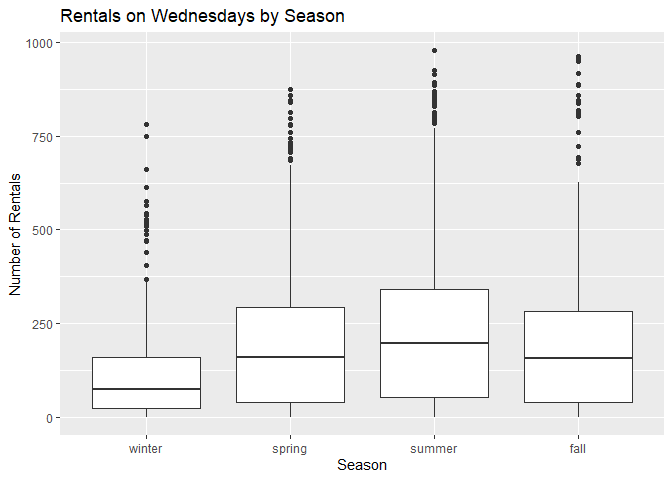
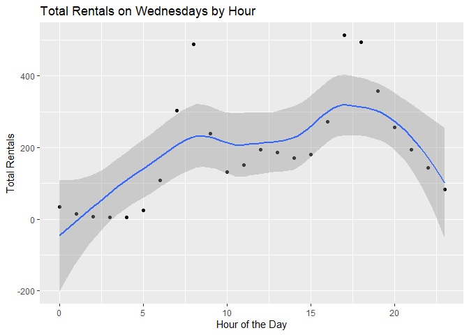
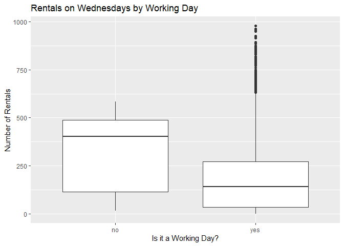
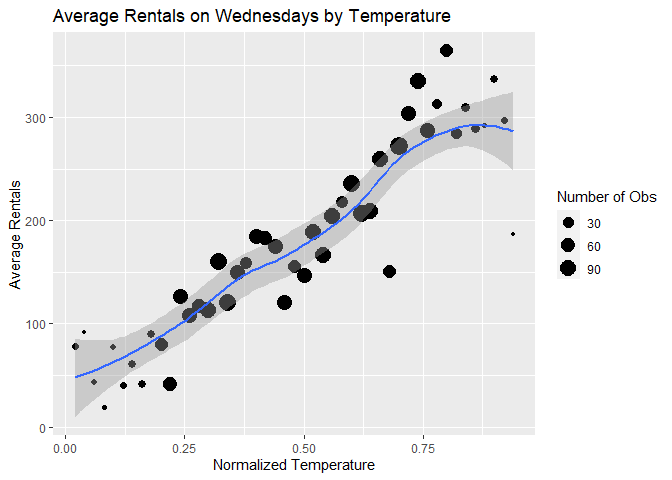
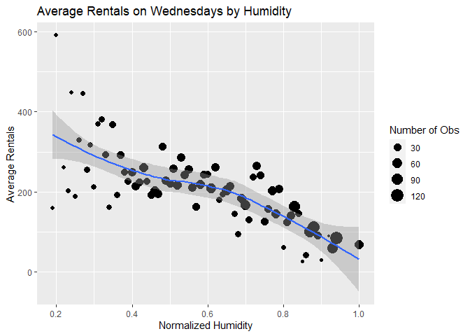

Joshua Burrows Project 2
================
16 October 2020

  - [Wednesday: Introduction](#wednesday-introduction)
  - [Read in Data](#read-in-data)
      - [Get Bikes Data](#get-bikes-data)
      - [Factors](#factors)
      - [Split by Day](#split-by-day)
  - [Exploratory Data Analysis](#exploratory-data-analysis)
      - [Correlations](#correlations)
      - [Summaries and Plots](#summaries-and-plots)
          - [Helper Function](#helper-function)
          - [Season](#season)
          - [Year](#year)
          - [Month](#month)
          - [Hour](#hour)
          - [Holiday](#holiday)
          - [Working Day](#working-day)
          - [Weather Condition](#weather-condition)
          - [Temperature](#temperature)
          - [Felt Temperature](#felt-temperature)
          - [Humidity](#humidity)
          - [Windspeed](#windspeed)
  - [Train Models](#train-models)
      - [Split Data](#split-data)
      - [Non-Ensemble Tree](#non-ensemble-tree)
          - [Training](#training)
          - [Model Information](#model-information)
      - [Boosted Tree](#boosted-tree)
          - [Train](#train)
          - [Model Information](#model-information-1)
  - [Test Models](#test-models)
  - [Best Model](#best-model)

# Wednesday: Introduction

This document walks though the process of creating a model to predict
the number of bikes that will be rented on wednesdays.

I compared two models - a *non-ensemble tree* and a *boosted tree* - and
picked the one that does better. These models use the following
predictor variables:

  - yr: year (2011 or 2012)  
  - mnth: month  
  - hr: hour of the day  
  - holiday: whether the day is a holiday  
  - weathersit: weather condition
      - pleasant: clear, few clouds, partly cloudy  
      - less pleasant: mist, mist + cloudy, mist + broken clouds, mist +
        few clouds  
      - even less pleasant: light snow, light Rain + scattered clouds,
        light rain + thunderstorm + scattered clouds  
      - downright unpleasant: snow + fog, heavy rain + ice pallets +
        thunderstorm + mist  
  - temp: normalized temperature in celsius  
  - hum: normalized humidity  
  - windspeed: normalized windspeed

You can return to the homepage for this project by clicking
[here](README.md).

# Read in Data

## Get Bikes Data

Read in data that has been downloaded from [the UCI Machine Learning
Library](https://archive.ics.uci.edu/ml/datasets/Bike+Sharing+Dataset).

``` r
bikes <- read_csv(file = "../Bike-Sharing-Dataset/hour.csv")

bikes %>% head() %>% kable()
```

| instant | dteday     | season | yr | mnth | hr | holiday | weekday | workingday | weathersit | temp |  atemp |  hum | windspeed | casual | registered | cnt |
| ------: | :--------- | -----: | -: | ---: | -: | ------: | ------: | ---------: | ---------: | ---: | -----: | ---: | --------: | -----: | ---------: | --: |
|       1 | 2011-01-01 |      1 |  0 |    1 |  0 |       0 |       6 |          0 |          1 | 0.24 | 0.2879 | 0.81 |    0.0000 |      3 |         13 |  16 |
|       2 | 2011-01-01 |      1 |  0 |    1 |  1 |       0 |       6 |          0 |          1 | 0.22 | 0.2727 | 0.80 |    0.0000 |      8 |         32 |  40 |
|       3 | 2011-01-01 |      1 |  0 |    1 |  2 |       0 |       6 |          0 |          1 | 0.22 | 0.2727 | 0.80 |    0.0000 |      5 |         27 |  32 |
|       4 | 2011-01-01 |      1 |  0 |    1 |  3 |       0 |       6 |          0 |          1 | 0.24 | 0.2879 | 0.75 |    0.0000 |      3 |         10 |  13 |
|       5 | 2011-01-01 |      1 |  0 |    1 |  4 |       0 |       6 |          0 |          1 | 0.24 | 0.2879 | 0.75 |    0.0000 |      0 |          1 |   1 |
|       6 | 2011-01-01 |      1 |  0 |    1 |  5 |       0 |       6 |          0 |          2 | 0.24 | 0.2576 | 0.75 |    0.0896 |      0 |          1 |   1 |

## Factors

Convert categorical variables to factors.

``` r
bikes$weekday <- as.factor(bikes$weekday)
levels(bikes$weekday) <- c("Sunday", "Monday", "Tuesday", "Wednesday", "Thursday", "Friday", "Saturday") 

bikes$season <- as.factor(bikes$season)
levels(bikes$season) <- c("winter", "spring", "summer", "fall")

bikes$yr <- as.factor(bikes$yr)
levels(bikes$yr) <- c("2011", "2012")

bikes$mnth <- as.factor(bikes$mnth)
levels(bikes$mnth) <- c("jan", "feb", "mar", "apr", "may", "jun", "jul", "aug", "sep", "oct", "nov", "dec")

bikes$weathersit <- as.factor(bikes$weathersit)
levels(bikes$weathersit) <- c("pleasant", "less pleasant", "even less pleasant", "downright unpleasant")

bikes$holiday <- as.factor(bikes$holiday)
levels(bikes$holiday) <- c("no", "yes")

bikes$workingday <- as.factor(bikes$workingday)
levels(bikes$workingday) <- c("no", "yes")

bikes %>% head() %>% kable()
```

| instant | dteday     | season | yr   | mnth | hr | holiday | weekday  | workingday | weathersit    | temp |  atemp |  hum | windspeed | casual | registered | cnt |
| ------: | :--------- | :----- | :--- | :--- | -: | :------ | :------- | :--------- | :------------ | ---: | -----: | ---: | --------: | -----: | ---------: | --: |
|       1 | 2011-01-01 | winter | 2011 | jan  |  0 | no      | Saturday | no         | pleasant      | 0.24 | 0.2879 | 0.81 |    0.0000 |      3 |         13 |  16 |
|       2 | 2011-01-01 | winter | 2011 | jan  |  1 | no      | Saturday | no         | pleasant      | 0.22 | 0.2727 | 0.80 |    0.0000 |      8 |         32 |  40 |
|       3 | 2011-01-01 | winter | 2011 | jan  |  2 | no      | Saturday | no         | pleasant      | 0.22 | 0.2727 | 0.80 |    0.0000 |      5 |         27 |  32 |
|       4 | 2011-01-01 | winter | 2011 | jan  |  3 | no      | Saturday | no         | pleasant      | 0.24 | 0.2879 | 0.75 |    0.0000 |      3 |         10 |  13 |
|       5 | 2011-01-01 | winter | 2011 | jan  |  4 | no      | Saturday | no         | pleasant      | 0.24 | 0.2879 | 0.75 |    0.0000 |      0 |          1 |   1 |
|       6 | 2011-01-01 | winter | 2011 | jan  |  5 | no      | Saturday | no         | less pleasant | 0.24 | 0.2576 | 0.75 |    0.0896 |      0 |          1 |   1 |

## Split by Day

Grab the data for wednesday.

``` r
dayData <- bikes %>% filter(weekday == params$day)

dayData %>% head() %>% kable()
```

| instant | dteday     | season | yr   | mnth | hr | holiday | weekday   | workingday | weathersit | temp |  atemp |  hum | windspeed | casual | registered | cnt |
| ------: | :--------- | :----- | :--- | :--- | -: | :------ | :-------- | :--------- | :--------- | ---: | -----: | ---: | --------: | -----: | ---------: | --: |
|      93 | 2011-01-05 | winter | 2011 | jan  |  0 | no      | Wednesday | yes        | pleasant   | 0.20 | 0.2576 | 0.64 |    0.0000 |      0 |          6 |   6 |
|      94 | 2011-01-05 | winter | 2011 | jan  |  1 | no      | Wednesday | yes        | pleasant   | 0.16 | 0.1970 | 0.74 |    0.0896 |      0 |          6 |   6 |
|      95 | 2011-01-05 | winter | 2011 | jan  |  2 | no      | Wednesday | yes        | pleasant   | 0.16 | 0.1970 | 0.74 |    0.0896 |      0 |          2 |   2 |
|      96 | 2011-01-05 | winter | 2011 | jan  |  4 | no      | Wednesday | yes        | pleasant   | 0.24 | 0.2273 | 0.48 |    0.2239 |      0 |          2 |   2 |
|      97 | 2011-01-05 | winter | 2011 | jan  |  5 | no      | Wednesday | yes        | pleasant   | 0.22 | 0.2273 | 0.47 |    0.1642 |      0 |          3 |   3 |
|      98 | 2011-01-05 | winter | 2011 | jan  |  6 | no      | Wednesday | yes        | pleasant   | 0.20 | 0.1970 | 0.47 |    0.2239 |      0 |         33 |  33 |

# Exploratory Data Analysis

I started with a little bit of exploratory data analysis. The goal is to
look at the relationships between the predictors and number of bike
rentals.

## Correlations

Create a correlation plot for the quantitative predictors.

*atemp* represents the heat index, which is typically calculated using
temperature and humidity. So it makes sense to either eliminate *atemp*
from the model or keep *atemp* but eliminate *temp* and *hum*. I decided
to eliminate *atemp*.

``` r
corr <- dayData %>% select(temp, atemp, windspeed, hum) %>% cor()

corrplot(corr)
```

<!-- -->

## Summaries and Plots

Explore the relationship between the predictors and number of bikes
rented by creating some basic summaries and plots.

### Helper Function

Create a helper function to display basic numeric summaries for a given
grouping variable.

``` r
getSum <- function(varName, colName){ 
  
  sum <- dayData %>% group_by(dayData[[varName]]) %>% summarize(min = min(cnt), Q1 = quantile(cnt, probs = c(.25), names = FALSE), median = median(cnt), mean = mean(cnt), Q3 = quantile(cnt, probs = c(.75), names = FALSE), max = max(cnt), obs = n())
  
  output <- sum %>% kable(col.names = c(colName, "Minimum", "1st Quartile", "Median", "Mean", "3rd Quartile", "Maximum", "Number of Observations"))
  
  return(output)
  
} 
```

### Season

Explore how bike rentals on wednesdays change with the seasons using a
basic numeric summary and a boxplot.

It does not make much sense to keep both *season* and *mnth* in the
model, so I decided to eliminate *season*.

``` r
getSum(varName = "season", colName = "Season")
```

| Season | Minimum | 1st Quartile | Median |     Mean | 3rd Quartile | Maximum | Number of Observations |
| :----- | ------: | -----------: | -----: | -------: | -----------: | ------: | ---------------------: |
| winter |       1 |        24.25 |   76.0 | 112.1598 |       160.75 |     782 |                    582 |
| spring |       1 |        40.00 |  159.5 | 202.0851 |       293.75 |     873 |                    646 |
| summer |       1 |        53.75 |  198.0 | 243.9105 |       342.00 |     977 |                    648 |
| fall   |       1 |        39.00 |  156.0 | 198.9482 |       282.50 |     963 |                    599 |

``` r
ggplot(dayData, aes(x = season, y = cnt)) + geom_boxplot() + labs(title = "Rentals by Season", x = "Season", y = "Number of Rentals") 
```

<!-- -->

### Year

Looking at total rentals each year gives us some idea of the long term
trend in bike rentals on wednesdays. It would be helpful to have data
from more years.

``` r
yearSum <- dayData %>% group_by(yr) %>% summarize(totalRentals = sum(cnt))

yearSum %>% kable(col.names = c("Year", "Total Rentals"))
```

| Year | Total Rentals |
| :--- | ------------: |
| 2011 |        169169 |
| 2012 |        303879 |

### Month

Explore how bike rentals on wednesdays change depending on the month.

As already noted, it is probably not worth including *mnth* and *season*
in the model, so *season* has been eliminated.

``` r
getSum(varName = "mnth", colName = "Month")
```

| Month | Minimum | 1st Quartile | Median |     Mean | 3rd Quartile | Maximum | Number of Observations |
| :---- | ------: | -----------: | -----: | -------: | -----------: | ------: | ---------------------: |
| jan   |       1 |        28.00 |   64.5 |  95.0500 |       130.00 |     513 |                    180 |
| feb   |       1 |        32.00 |   89.0 | 119.4340 |       170.00 |     576 |                    212 |
| mar   |       1 |        27.00 |   99.5 | 154.3458 |       223.50 |     782 |                    214 |
| apr   |       1 |        40.50 |  138.0 | 181.3979 |       256.50 |     759 |                    191 |
| may   |       1 |        38.75 |  178.0 | 213.3009 |       297.50 |     873 |                    216 |
| jun   |       1 |        65.25 |  190.0 | 237.5417 |       333.25 |     857 |                    216 |
| jul   |       4 |        70.50 |  186.0 | 242.2500 |       376.75 |     913 |                    192 |
| aug   |       1 |        59.50 |  213.5 | 253.2042 |       347.25 |     891 |                    240 |
| sep   |       2 |        36.75 |  185.0 | 236.1771 |       324.25 |     977 |                    192 |
| oct   |       2 |        50.50 |  181.0 | 230.4326 |       314.50 |     963 |                    215 |
| nov   |       1 |        44.50 |  146.5 | 172.3472 |       245.00 |     692 |                    216 |
| dec   |       1 |        20.00 |   79.0 | 136.9791 |       215.50 |     759 |                    191 |

``` r
ggplot(dayData, aes(x = mnth, y = cnt)) + geom_boxplot() + labs(title = "Retals by Month", x = "Month", y = "Number of Rentals")
```

<!-- -->

### Hour

Create a scatter plot to look at the relationship between time of day
and rentals on wednesdays.

``` r
avgRentals <- dayData %>% group_by(hr) %>% summarize(meanRentals = mean(cnt))

ggplot(avgRentals, aes(x = hr, y = meanRentals)) + geom_point() + labs(title = "Total Rentals by Hour", x = "Hour of the Day", y = "Total Rentals") + geom_smooth()
```

<!-- -->

### Holiday

Explore change in bike rentals depending on whether the wednesday in
question is a holiday.

``` r
getSum(varName = "holiday", colName = "Holiday")
```

| Holiday | Minimum | 1st Quartile | Median |     Mean | 3rd Quartile | Maximum | Number of Observations |
| :------ | ------: | -----------: | -----: | -------: | -----------: | ------: | ---------------------: |
| no      |       1 |         36.0 |  142.0 | 189.9816 |       273.00 |     977 |                   2451 |
| yes     |      16 |        115.5 |  401.5 | 308.4583 |       487.25 |     584 |                     24 |

``` r
ggplot(dayData, aes(x = holiday, y = cnt)) + geom_boxplot() + labs(title = "Rentals by Holiday", x = "Is it a Holiday?", y = "Number of Rentals")
```

<!-- -->

### Working Day

Average rentals by working day.

Working days are neither weekends nor holidays. I decided not to keep
this variable in the model because it wouldn’t make much sense in the
reports for Saturday and Sunday.

``` r
getSum(varName = "workingday", colName = "Working Day")
```

| Working Day | Minimum | 1st Quartile | Median |     Mean | 3rd Quartile | Maximum | Number of Observations |
| :---------- | ------: | -----------: | -----: | -------: | -----------: | ------: | ---------------------: |
| no          |      16 |        115.5 |  401.5 | 308.4583 |       487.25 |     584 |                     24 |
| yes         |       1 |         36.0 |  142.0 | 189.9816 |       273.00 |     977 |                   2451 |

``` r
ggplot(dayData, aes(x = workingday, y = cnt)) + geom_boxplot() + labs(title = "Rentals by Working Day", x = "Is it a Working Day?", y = "Number of Rentals")
```

<!-- -->

### Weather Condition

Explore how bike rentals on wednesdays change depending on the weather.

``` r
getSum(varName = "weathersit", colName = "Weather Condition")
```

| Weather Condition    | Minimum | 1st Quartile | Median |     Mean | 3rd Quartile | Maximum | Number of Observations |
| :------------------- | ------: | -----------: | -----: | -------: | -----------: | ------: | ---------------------: |
| pleasant             |       1 |           39 |    167 | 209.3495 |          301 |     977 |                   1568 |
| less pleasant        |       1 |           55 |    145 | 184.5546 |          261 |     862 |                    613 |
| even less pleasant   |       1 |           18 |     55 | 107.9181 |          134 |     891 |                    293 |
| downright unpleasant |      36 |           36 |     36 |  36.0000 |           36 |      36 |                      1 |

``` r
ggplot(dayData, aes(x = weathersit, y = cnt)) + geom_boxplot() + labs(title = "Rentals by Weather Condition", x = "What is the Weather Like?", y = "Number of Rentals")
```

<!-- -->

### Temperature

Create a scatter plot to look at the relationship between temperature
and number of rentals on wednesdays.

``` r
tempAvg <- dayData %>% group_by(temp) %>% summarize(avgRentals = mean(cnt))

ggplot(tempAvg, aes(x = temp, y = avgRentals)) + geom_point() + labs(title = "Average Rentals by Temperature", x = "Normalized Temperature", y = "Average Rentals") + geom_smooth()
```

<!-- -->

### Felt Temperature

Create a scatter plot to look at the relationship between felt
temperature and number of rentals on wednesdays.

As already noted, it does not make much sense to keep *atemp* if *temp*
and *hum* will be in the model, so I eliminated *atemp* from the model.

``` r
atempAvg <- dayData %>% group_by(atemp) %>% summarize(avgRentals = mean(cnt))

ggplot(atempAvg, aes(x = atemp, y = avgRentals)) + geom_point() + labs(title = "Average Rentals by Temperature", x = "Normalized Feeling Temperature", y = "Average Rentals") + geom_smooth()
```

<!-- -->

### Humidity

Create a scatter plot to look at the relationship between humidity and
number of rentals on wednesdays.

``` r
humAvg <- dayData %>% group_by(hum) %>% summarize(avgRentals = mean(cnt))

ggplot(humAvg, aes(x = hum, y = avgRentals)) + geom_point() + labs(title = "Average Rentals by Humidity", x = "Normalized Humidity", y = "Average Rentals") + geom_smooth()
```

<!-- -->

### Windspeed

Create a scatter plot to look at the relationship between windspeed and
number of rentals on wednesdays.

``` r
windAvg <- dayData %>% group_by(windspeed) %>% summarize(avgRentals = mean(cnt))

ggplot(windAvg, aes(x = windspeed, y = avgRentals)) + geom_point() + labs(title = "Average Rentals by Windspeed", x = "Normalized Windspeed", y = "Average Rentals") + geom_smooth()
```

<!-- -->

# Train Models

After exploring the data, I created two models, a non-ensemble tree and
a boosted tree.

## Split Data

Split the data into a training set and a test set. The training set is
used to build the models, and the test set is used to evaluate them.

``` r
set.seed(123)
trainIndex <- createDataPartition(dayData$cnt, p = .75, list = FALSE)

train <- dayData[trainIndex,]
test <- dayData[-trainIndex,]
```

## Non-Ensemble Tree

### Training

Fit a non-ensemble tree model.

#### Tree Models

Tree models split each predictor space into regions and make a different
prediction for each region. For example, suppose we are interested in
predicting life expectancy based on exercise habits. We might split the
predictor space into **exercises less than one hour a week** and
**exercises at least one hour a week** and then predict that people in
the second group live longer.

How do we decide whether to split at one hour, one and a half hours, two
hours, etc? This decision is made using a method called “Recursive
Binary Splitting”, which we don’t have to worry about too much because
the *caret* package does it for us.

Ensemble tree models fit lots of trees and then average their results.
Here I have created a basic non-ensemble tree to model bicycle rentals.

#### Tuning Parameter

This model has one “tuning parameter” called *cp*. *cp* stands for
“Complexity Parameter”, and it controls the number of “nodes” that the
tree has.

The life expectancy example above has two terminal nodes: **less than
one hour** and **at least one hour**. We could complicate the example by
adding additional nodes. For instance, we could divide the group **less
than one hour** into two subgroups: **less than a half hour** and
**greater than half an hour but less than one hour**. And we could
divide **at least one hour a week** into **less than two hours** and
**greater than two hours**.

Sometimes increasing the number of nodes makes your model better, but
sometimes it makes it worse. There are lots of different methods for
picking the best number of nodes. For the bicycle rental model, I used a
method called “Leave One Out Cross Validation”.

*LOOCV* works by removing an observation from the data set, using the
rest of the data to create a model, and then seeing how well that model
does at predicting the observation that was left out. This process is
repeated for every observation, and the results are combined.

If we want to compare two different values of *cp*, we will go through
the *LOOCV* process twice and compare the results. In this way, we can
test different values of *cp* to see which one performs best.

I used the *caret* package to test 10 different values of *cp*.

#### Create the Model

``` r
set.seed(123)
tree <- train(cnt ~ yr + mnth + hr + holiday + weathersit + temp + hum + windspeed, 
              data = train, 
              method = "rpart", 
              trControl = trainControl(method = "LOOCV"), 
              tuneLength = 10)
```

### Model Information

My final non-ensemble tree model uses a *cp* of 0.0108508. Its root mean
square error on the training set is 95.5506543.

More information about this model is below.

``` r
tree
```

    ## CART 
    ## 
    ## 1858 samples
    ##    8 predictor
    ## 
    ## No pre-processing
    ## Resampling: Leave-One-Out Cross-Validation 
    ## Summary of sample sizes: 1857, 1857, 1857, 1857, 1857, 1857, ... 
    ## Resampling results across tuning parameters:
    ## 
    ##   cp          RMSE       Rsquared    
    ##   0.01085085   95.55065  0.7610009153
    ##   0.01228270  103.49929  0.7198160065
    ##   0.02024237  111.06154  0.6771960512
    ##   0.02414958  115.48367  0.6512048157
    ##   0.02729113  122.33398  0.6093469070
    ##   0.03355339  124.91824  0.5918304902
    ##   0.04606788  130.29343  0.5556049503
    ##   0.05879050  160.04704  0.3377655989
    ##   0.11429605  181.05086  0.1760978769
    ##   0.28610296  200.65511  0.0009127749
    ##   MAE      
    ##    67.12952
    ##    72.49530
    ##    78.49302
    ##    81.12131
    ##    88.45858
    ##    86.73511
    ##    91.08754
    ##   110.73890
    ##   133.86120
    ##   171.10166
    ## 
    ## RMSE was used to select the
    ##  optimal model using the
    ##  smallest value.
    ## The final value used for the model
    ##  was cp = 0.01085085.

``` r
plot(tree$finalModel)
text(tree$finalModel)
```

<!-- -->

## Boosted Tree

### Train

#### Boosted Tree Models

Boosted trees are another type of tree model. “Boosting” works by
fitting a series of trees, each of which is a modified version of the
previous tree. The idea is to hone in on the best model.

#### Tuning Paremeters

Four tuning parameters are involved:  
\- *n.trees*: number of boosting iterations  
\- *interaction.depth*: maximum tree depth  
\- *shrinkage*: how strongly each subsequent tree is influenced by the
previous tree  
\- *n.minobsinnode*: minimum terminal node size

Values for the tuning parameters are found using Cross Validation. Cross
Validation works by splitting the data into groups called “folds”. One
fold is left out, the rest are used to create a model, and then that
model is tested on the fold that was left out. This process is repeated
for each fold, and the results are combined. It should be clear that
*LOOCV* is just *CV* with the number of folds equal to the number of
observations.

I used the *caret* package to test 81 different combinations of tuning
parameters.

#### Create the Model

``` r
tuneGr <- expand.grid(n.trees = seq(from = 50, to = 150, by = 50), 
                     interaction.depth = 1:3, 
                     shrinkage = seq(from = .05, to = .15, by = .05), 
                     n.minobsinnode = 9:11)

set.seed(123)
boostTree <- train(cnt ~ yr + mnth + hr + holiday + weathersit + temp + hum + windspeed, 
                   data = train, 
                   method = "gbm", 
                   trControl = trainControl(method = "cv", number = 10),
                   tuneGrid = tuneGr, 
                   verbose = FALSE)
```

### Model Information

My final boosted tree model uses the following tuning parameters:

  - *n.trees*: 150  
  - *interaction.depth*: 3  
  - *shrinkage*: 0.15  
  - *n.minobsinnode*: 11

Its root mean square error on the training set is 55.5994081.

More information about this model is below.

``` r
boostTree
```

    ## Stochastic Gradient Boosting 
    ## 
    ## 1858 samples
    ##    8 predictor
    ## 
    ## No pre-processing
    ## Resampling: Cross-Validated (10 fold) 
    ## Summary of sample sizes: 1671, 1673, 1673, 1674, 1673, 1672, ... 
    ## Resampling results across tuning parameters:
    ## 
    ##   shrinkage  interaction.depth
    ##   0.05       1                
    ##   0.05       1                
    ##   0.05       1                
    ##   0.05       1                
    ##   0.05       1                
    ##   0.05       1                
    ##   0.05       1                
    ##   0.05       1                
    ##   0.05       1                
    ##   0.05       2                
    ##   0.05       2                
    ##   0.05       2                
    ##   0.05       2                
    ##   0.05       2                
    ##   0.05       2                
    ##   0.05       2                
    ##   0.05       2                
    ##   0.05       2                
    ##   0.05       3                
    ##   0.05       3                
    ##   0.05       3                
    ##   0.05       3                
    ##   0.05       3                
    ##   0.05       3                
    ##   0.05       3                
    ##   0.05       3                
    ##   0.05       3                
    ##   0.10       1                
    ##   0.10       1                
    ##   0.10       1                
    ##   0.10       1                
    ##   0.10       1                
    ##   0.10       1                
    ##   0.10       1                
    ##   0.10       1                
    ##   0.10       1                
    ##   0.10       2                
    ##   0.10       2                
    ##   0.10       2                
    ##   0.10       2                
    ##   0.10       2                
    ##   0.10       2                
    ##   0.10       2                
    ##   0.10       2                
    ##   0.10       2                
    ##   0.10       3                
    ##   0.10       3                
    ##   0.10       3                
    ##   0.10       3                
    ##   0.10       3                
    ##   0.10       3                
    ##   0.10       3                
    ##   0.10       3                
    ##   0.10       3                
    ##   0.15       1                
    ##   0.15       1                
    ##   0.15       1                
    ##   0.15       1                
    ##   0.15       1                
    ##   0.15       1                
    ##   0.15       1                
    ##   0.15       1                
    ##   0.15       1                
    ##   0.15       2                
    ##   0.15       2                
    ##   0.15       2                
    ##   0.15       2                
    ##   0.15       2                
    ##   0.15       2                
    ##   0.15       2                
    ##   0.15       2                
    ##   0.15       2                
    ##   0.15       3                
    ##   0.15       3                
    ##   0.15       3                
    ##   0.15       3                
    ##   0.15       3                
    ##   0.15       3                
    ##   0.15       3                
    ##   0.15       3                
    ##   0.15       3                
    ##   n.minobsinnode  n.trees  RMSE     
    ##    9               50      150.97605
    ##    9              100      136.02440
    ##    9              150      126.75136
    ##   10               50      151.13714
    ##   10              100      135.97309
    ##   10              150      126.95007
    ##   11               50      151.21143
    ##   11              100      136.26140
    ##   11              150      126.93087
    ##    9               50      121.71610
    ##    9              100       96.57046
    ##    9              150       81.91319
    ##   10               50      121.74774
    ##   10              100       96.61807
    ##   10              150       81.69158
    ##   11               50      121.62415
    ##   11              100       96.27398
    ##   11              150       81.61540
    ##    9               50      102.09095
    ##    9              100       76.10157
    ##    9              150       65.14298
    ##   10               50      101.83318
    ##   10              100       76.15808
    ##   10              150       65.12713
    ##   11               50      102.29303
    ##   11              100       76.09764
    ##   11              150       65.48241
    ##    9               50      135.64647
    ##    9              100      120.15990
    ##    9              150      110.01968
    ##   10               50      135.83200
    ##   10              100      120.01535
    ##   10              150      109.97881
    ##   11               50      135.85104
    ##   11              100      119.96962
    ##   11              150      109.98184
    ##    9               50       95.35845
    ##    9              100       75.25298
    ##    9              150       70.63702
    ##   10               50       95.31057
    ##   10              100       75.25478
    ##   10              150       70.20311
    ##   11               50       95.26379
    ##   11              100       75.19293
    ##   11              150       70.29134
    ##    9               50       76.00164
    ##    9              100       61.18728
    ##    9              150       57.62999
    ##   10               50       75.66839
    ##   10              100       60.42451
    ##   10              150       57.25813
    ##   11               50       76.05245
    ##   11              100       60.06649
    ##   11              150       56.81230
    ##    9               50      125.77383
    ##    9              100      110.00106
    ##    9              150      100.18434
    ##   10               50      126.12773
    ##   10              100      109.59909
    ##   10              150      100.10565
    ##   11               50      126.15218
    ##   11              100      109.77611
    ##   11              150      100.09573
    ##    9               50       81.17168
    ##    9              100       70.65814
    ##    9              150       68.17014
    ##   10               50       81.63448
    ##   10              100       70.58839
    ##   10              150       68.11831
    ##   11               50       80.77401
    ##   11              100       70.28330
    ##   11              150       67.75965
    ##    9               50       65.60745
    ##    9              100       57.84169
    ##    9              150       56.21755
    ##   10               50       65.68524
    ##   10              100       58.51465
    ##   10              150       57.13102
    ##   11               50       64.58179
    ##   11              100       57.11658
    ##   11              150       55.59941
    ##   Rsquared   MAE      
    ##   0.4818637  105.65506
    ##   0.5769276   93.72144
    ##   0.6246294   87.87966
    ##   0.4825440  105.77775
    ##   0.5781336   93.62339
    ##   0.6252483   88.04435
    ##   0.4808301  105.92242
    ##   0.5753456   93.84647
    ##   0.6248386   87.97889
    ##   0.6900115   82.38295
    ##   0.7945624   62.92607
    ##   0.8449711   54.35446
    ##   0.6906395   82.63202
    ##   0.7943968   63.08706
    ##   0.8463160   54.28914
    ##   0.6918089   82.54566
    ##   0.7977511   62.90575
    ##   0.8466166   54.22014
    ##   0.8045867   70.46257
    ##   0.8739866   50.59149
    ##   0.8993284   43.21538
    ##   0.8050036   70.30542
    ##   0.8741420   50.58268
    ##   0.8997204   43.26395
    ##   0.8013331   70.37814
    ##   0.8742957   50.56926
    ##   0.8986329   43.19264
    ##   0.5780911   93.55083
    ##   0.6599806   83.28947
    ##   0.7181403   76.42059
    ##   0.5773870   93.62321
    ##   0.6641699   83.19616
    ##   0.7189207   76.37351
    ##   0.5756462   93.76024
    ##   0.6660272   82.92265
    ##   0.7185791   76.12880
    ##   0.7969834   62.27166
    ##   0.8619573   50.36214
    ##   0.8737188   47.40319
    ##   0.7995039   62.32639
    ##   0.8618157   50.34744
    ##   0.8748854   47.30401
    ##   0.7997025   62.41549
    ##   0.8620701   50.45523
    ##   0.8747671   47.30723
    ##   0.8726202   50.54283
    ##   0.9066461   40.19396
    ##   0.9144924   37.27209
    ##   0.8752831   50.17538
    ##   0.9097208   39.78668
    ##   0.9158700   37.29293
    ##   0.8721233   50.53029
    ##   0.9100617   39.60575
    ##   0.9170203   36.74965
    ##   0.6298580   87.38806
    ##   0.7177394   76.54869
    ##   0.7605770   69.68844
    ##   0.6290026   87.32919
    ##   0.7202796   76.03712
    ##   0.7607731   69.65416
    ##   0.6270697   87.51193
    ##   0.7187670   76.33489
    ##   0.7598618   69.73474
    ##   0.8442234   53.97736
    ##   0.8729053   47.68974
    ##   0.8798087   45.74660
    ##   0.8436384   54.72759
    ##   0.8730258   47.77866
    ##   0.8802292   46.04054
    ##   0.8469500   54.03132
    ##   0.8742735   47.58358
    ##   0.8816062   45.82394
    ##   0.8977616   43.41239
    ##   0.9140425   37.85114
    ##   0.9180563   36.23917
    ##   0.8960663   43.79632
    ##   0.9119409   38.10236
    ##   0.9154956   36.70446
    ##   0.9000789   43.03357
    ##   0.9162614   37.47014
    ##   0.9200678   36.18591
    ## 
    ## RMSE was used to select the
    ##  optimal model using the
    ##  smallest value.
    ## The final values used for the
    ##  shrinkage = 0.15 and n.minobsinnode
    ##  = 11.

# Test Models

Test the models on the test set. Select the model that performs better.

Performance is measured using Root Mean Square Error, which is a measure
of how close the model gets to correctly predicting the test data. The
RMSE for each model is displayed below.

``` r
treePreds <- predict(tree, test)
treeRMSE <- postResample(treePreds, test$cnt)[1]

boostPreds <- predict(boostTree, test)
boostRMSE <- postResample(boostPreds, test$cnt)[1]

modelPerformance <- data.frame(model = c("Non-Ensemble Tree", "Boosted Tree"), RMSE = c(treeRMSE, boostRMSE))

modelPerformance %>% kable(col.names = c("Model", "Test RMSE"))
```

| Model             | Test RMSE |
| :---------------- | --------: |
| Non-Ensemble Tree |  99.97647 |
| Boosted Tree      |  56.61894 |

# Best Model

``` r
best <- modelPerformance %>% filter(RMSE == min(RMSE))
worst <- modelPerformance %>% filter(RMSE == max(RMSE))
```

The boosted tree performs better than the non-ensemble tree.

The boosted tree model is saved to the `final` object below.

``` r
if(best$model == "Non-Ensemble Tree"){
  final <- tree
} else if(best$model == "Boosted Tree"){
  final <- boostTree
} else{
  stop("Error")
}

final$finalModel
```

    ## A gradient boosted model with gaussian loss function.
    ## 150 iterations were performed.
    ## There were 20 predictors of which 19 had non-zero influence.
